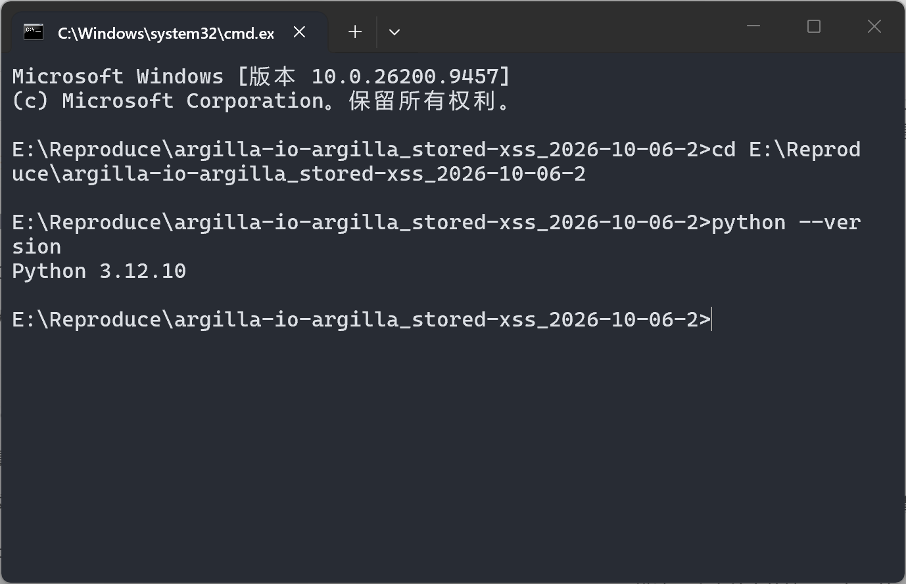
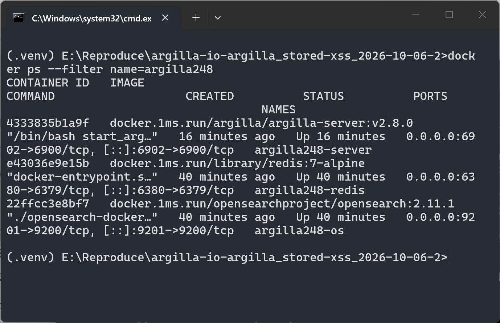
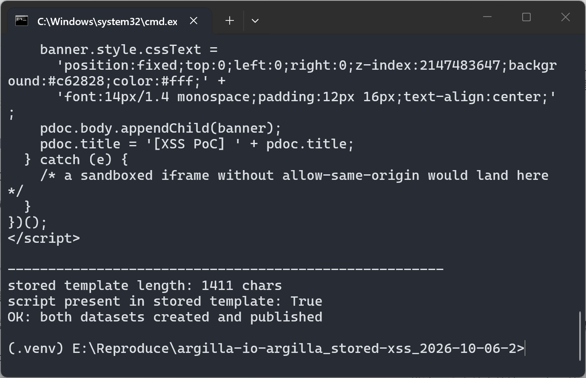
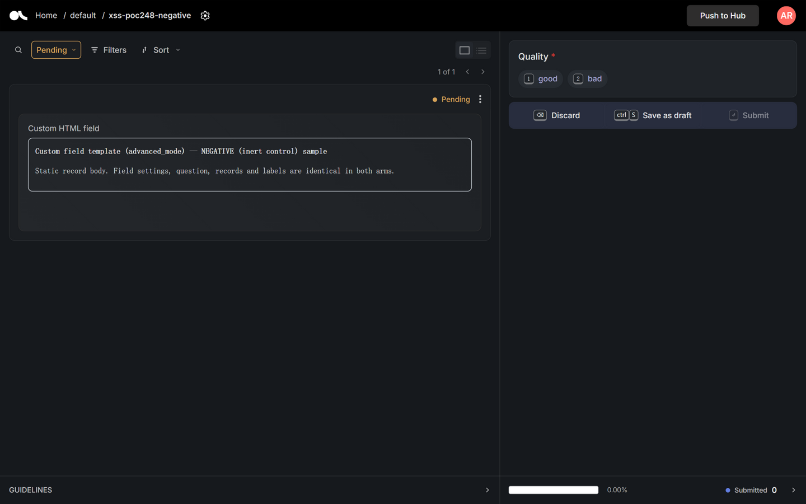

# Argilla 2.8.0 — Stored XSS (CWE-79) in annotation-UI custom-field iframe rendering

## Summary

Argilla (argilla-io/argilla) 2.8.0 — and the develop branch at commit 5338519 — is affected
by a stored cross-site scripting vulnerability in the annotation UI's custom-field rendering.
Dataset-level custom-field templates (`CustomFieldSettings.template`) are persisted as plain
strings and rendered verbatim into an `<iframe :srcdoc="template">` that has **no `sandbox`
attribute**. A `srcdoc` iframe without `sandbox` inherits the embedding page's origin, so any
script embedded in the template executes same-origin inside the victim's logged-in session and
can read and modify the application document, the victim's localStorage (which holds the
frontend auth token and the user API key) and can act as the victim against the REST API.
An attacker needs owner/admin privileges on one workspace to create the crafted dataset;
victims are every user (typically lower-privileged annotators) who opens the dataset in the
annotation UI.

## Affected Product

| Field | Value |
|---|---|
| Vendor | Argilla (argilla-io, part of Hugging Face) |
| Product | argilla (annotation server + frontend) |
| Affected versions | v2.3.0 (custom fields introduced) through v2.8.0 (latest release) and develop commit 5338519accb13ae422f8bf9c0642651c249c49af |
| Component | `argilla-frontend/components/features/annotation/container/fields/sandbox/Sandbox.vue` (rendering); `argilla-server/src/argilla_server/api/schemas/v1/fields.py` (unfiltered persistence) |
| Platform | Any (server ships as `argilla/argilla-server` Docker image; rendering happens in the browser) |
| Vulnerability type | CWE-79: Improper Neutralization of Input During Web Page Generation ('Cross-site Scripting') — stored XSS via unsandboxed `srcdoc` iframe |

Verified present at tags v2.3.0, v2.4.0, v2.5.0, v2.6.0, v2.7.0, v2.8.0 (`Sandbox.vue` identical
to the pinned commit; `CustomField.vue`, `Field.ts` and the server schema byte-identical between
v2.8.0 and 5338519).

## Root Cause

Three pieces form the chain; the defect is the missing `sandbox` attribute at the last step.

**1. The template is persisted and returned verbatim (server).**
`argilla-server/src/argilla_server/api/schemas/v1/fields.py:88-91`:

```python
class CustomFieldSettings(BaseModel):
    type: Literal[FieldType.custom]
    template: str          # attacker-controlled HTML/JS, stored verbatim, returned verbatim
    advanced_mode: bool
```

No sanitization, escaping or allow-listing anywhere on the path. Creating/updating datasets and
fields requires owner or admin (`argilla-server/src/argilla_server/api/policies/v1/dataset_policy.py:48-52`),
which is the only privilege the attacker needs.

**2. The frontend feeds the settings template straight into the iframe content.**
`argilla-frontend/v1/domain/entities/field/Field.ts:41-43`:

```ts
if (this.isCustomType) {
  this.sdkRecord = record;
  this.content = settings.template;   // dataset settings template becomes the render payload
}
```

`argilla-frontend/components/features/annotation/container/fields/custom-field/CustomField.vue:28-32`
wraps it (`ADVANCE_TEMPLATE`) into `<script>const record = {...};</script>` + the template, and
passes the result to `Sandbox`.

**3. The iframe is created without `sandbox`.**
`argilla-frontend/components/features/annotation/container/fields/sandbox/Sandbox.vue:1-8`:

```html
<template>
  <iframe
    :srcdoc="template"   <!-- no sandbox attribute: srcdoc inherits the parent origin -->
    ref="iframe"
    frameborder="0"
    scrolling="no"
    @load="load"
  />
</template>
```

Because `sandbox` is absent, the browser runs the `srcdoc` content with the application's full
origin: embedded `<script>` executes, and `parent.document` / `parent.localStorage` are fully
accessible. (The component itself relies on this same-origin access to clone parent styles and
to resize via `contentWindow.document` — which is presumably why no sandbox was set.)

## Proof of Concept

### Prerequisites

- A running Argilla server (verified with `argilla/argilla-server:v2.8.0` + OpenSearch 2.11.1 +
  Redis 7, SQLite database) at `http://localhost:6902`.
- An owner or admin account (default credentials in the official image: `argilla` / api key
  `argilla.apikey`) to create the dataset — this models a dataset author.
- Any victim user who opens the dataset in the annotation UI.
- Python 3.12 with `argilla==2.8.0` SDK (the official client).

### Steps to Reproduce

1. Prepare the environment: SDK 2.8.0 in a venv; server stack up (server on :6902, search
   engine on :9201, redis on :6380).






2. Run `poc/make_poc.py`. It uses the official SDK to create **two datasets that differ only in
   `settings.template`**:
   - `xss-poc248-positive`: inert HTML shell + one `<script>` block that (a) appends a red
     banner to `parent.document`, (b) prefixes `parent.document.title`, (c) counts parent
     `localStorage` keys and reports whether an auth-token entry exists (value redacted).
   - `xss-poc248-negative`: the same inert HTML shell without the script (control).
   Field definitions, question, records and labels are identical in both arms. The script also
   re-reads the stored settings through the API: the template round-trips verbatim
   (1411 chars, `<script>` intact) — no server-side sanitization.



3. Log into the annotation UI and open `xss-poc248-positive`. As soon as the record view renders
   the custom field, the payload executes **inside the unsandboxed `srcdoc` iframe with the
   application's origin**: the red banner injected into the parent document covers the app UI,
   and the parent page title becomes `[XSS PoC] Argilla`. The banner text confirms
   `parent.document` is reachable and that localStorage contains an auth-token entry
   (4 keys visible, value redacted). DOM verification at trigger time: the iframe element has
   `sandbox = null`, `document.querySelector('#xss-poc-banner')` exists in the parent document.

![Positive arm: red banner injected by the template script runs across the top of the parent application (annotation UI), parent title changed to [XSS PoC] Argilla, localStorage auth-token entry confirmed present (redacted)](images/argilla-dom-html-render-06-positive-xss-fired.png)

4. Negative control: open `xss-poc248-negative` (identical dataset, template without the script).
   No banner, unmodified title, inert HTML renders in the same iframe. This isolates the active
   script in `settings.template` as the only difference and confirms the template string is the
   injection vehicle.



### Expected vs Actual

- Expected: dataset-supplied templates render inert; script must not execute with the
  application's origin.
- Actual: script embedded in `CustomFieldSettings.template` executes same-origin in every
  visitor's session (stored XSS), with read/write access to the application page, the victim's
  localStorage (auth token + API key) and the API as the victim.

### Sanitized PoC input

```html
<!-- CustomFieldSettings.template (advanced_mode = true), supplied via SDK/API -->
<div id="poc-wrap" style="font:14px/1.5 monospace;padding:12px;border:1px solid #d0d7de">
  <strong>Custom field template (advanced_mode) — POSITIVE (malicious) sample</strong>
</div>
<script>
(function () {
  var pdoc = parent.document;                 /* same-origin parent access */
  var banner = pdoc.createElement('div');
  banner.id = 'xss-poc-banner';
  banner.textContent = 'XSS PoC FIRED - parent.document reachable; localStorage keys visible: '
    + pdoc.defaultView.localStorage.length    /* token entry detected, value NOT read/printed */
    + ' (auth token entry PRESENT, value redacted)';
  banner.style.cssText = 'position:fixed;top:0;left:0;right:0;z-index:2147483647;'
    + 'background:#c62828;color:#fff;padding:12px 16px;text-align:center;';
  pdoc.body.appendChild(banner);
  pdoc.title = '[XSS PoC] ' + pdoc.title;
})();
</script>
```

Server endpoint and credentials in this report refer to a local test instance
(`http://localhost:6902`, default image credentials); no external infrastructure is contacted.

## Impact

- Confidentiality: **High** — the payload runs in the victim's origin and can read everything the
  victim can see: datasets, records and responses, plus `localStorage`, where the frontend
  persistently stores the session token and the user's API key (demonstrated: token entry
  detected; value deliberately not exfiltrated).
- Integrity: **High** — the payload can issue same-origin API calls with the victim's
  credentials: submit/modify responses, create or alter datasets/records, act as the victim.
- Availability: **None** demonstrated (the payload could deface or block the UI, but nothing is
  destroyed server-side).
- Scope: **Changed** — the injected script executes in the browser session of a different user
  (the annotator), i.e. beyond the vulnerable rendering component; persisted in dataset
  settings, it fires for every viewer without further attacker interaction.

## Attack Vector and Severity (CVSS v3.1)

| Metric | Value | Rationale |
|---|---|---|
| Attack Vector | N | Template delivered through the normal SDK/API; fires when a victim views the dataset |
| Attack Complexity | L | No race/conditions; persistence is guaranteed by the settings store |
| Privileges Required | H | Creating datasets/fields requires owner or workspace admin (`dataset_policy.py:48-52`) |
| User Interaction | R | Victim must open the dataset in the annotation UI |
| Scope | C | Executes in other users' browser sessions (application origin), beyond the settings component |
| Confidentiality | H | Victim's data and localStorage auth token/API key readable |
| Integrity | H | Same-origin API calls can act as the victim |
| Availability | N | No availability impact demonstrated |

```
Score: 8.1 (High)
Vector: CVSS:3.1/AV:N/AC:L/PR:H/UI:R/S:C/C:H/I:H/A:N
```

Scoring note: if an deployment grants dataset-creation to broader roles than upstream's policy
assumes, the equivalent `PR:L` vector scores 8.7; the 8.1 above follows the verified upstream
role policy.

## Remediation

1. **Sandbox the iframe.** Render templates in an iframe with a restrictive `sandbox` attribute
   (at minimum `sandbox="allow-scripts"`, *without* `allow-same-origin`). Note this breaks two
   current same-origin conveniences that must be redesigned in the same change: the style
   cloning that reads `parent.document`, and the height measurement via
   `contentWindow.document` — replace with an in-iframe `ResizeObserver` + `postMessage`, and
   pass theme CSS variables explicitly.
2. **Neutralize templates server-side** (defense in depth): reject or escape `<script>`,
   event-handler attributes and `javascript:` URLs in `CustomFieldSettings.template`, or offer
   a sanitized templating subset by default and keep raw HTML behind an explicit,
   instance-level trust flag.
3. **Harden the record-JSON embedding**: `CustomField.vue` injects
   `JSON.stringify(record)` into an inline `<script>` via string replacement without escaping
   `</script>`; escape or pass the record via `postMessage` after load.
4. Short-term workaround for operators: restrict dataset-creation roles, and treat workspace
   admins/owners as trusted UI-content authors.

## Timeline

| Date | Event |
|---|---|
| 2026-10-06 | Vulnerability identified during static review of commit 5338519; chain verified against v2.8.0 release code (byte-identical files) |
| 2026-10-06 | Reproduced end-to-end on a local 2.8.0 instance (SDK-created datasets; XSS observed in annotation UI; negative control clean) |
| 2026-10-06 | Report prepared for upstream disclosure |
| [pending] | Vendor notified — report not yet sent |
| [pending] | Maintainer acknowledged |
| [pending] | Fix released |

## References

- Source repository: https://github.com/argilla-io/argilla
- Pinned commit: https://github.com/argilla-io/argilla/commit/5338519accb13ae422f8bf9c0642651c249c49af
- Vulnerable file: https://github.com/argilla-io/argilla/blob/5338519accb13ae422f8bf9c0642651c249c49af/argilla-frontend/components/features/annotation/container/fields/sandbox/Sandbox.vue
- Custom field settings schema: https://github.com/argilla-io/argilla/blob/5338519accb13ae422f8bf9c0642651c249c49af/argilla-server/src/argilla_server/api/schemas/v1/fields.py
- Upstream report: [pending publication]
- CWE: https://cwe.mitre.org/data/definitions/79.html
- Vendor advisory: [none]

## Disclaimer

This report is provided for defensive and coordination purposes. It contains no ready-to-run
exploit beyond the minimum reproduction information, and no sensitive infrastructure details.
Do not disclose it publicly before the maintainer has had a reasonable window to fix the issue.

## Screenshot Checklist

| File | Content | Capture environment & date |
|---|---|---|
| images/argilla-dom-html-render-01-env-python.png | Real terminal: `python --version` → 3.12.10 in the PoC working directory | Windows Terminal (cmd) on Windows 11 build 26200, 2026-10-06 |
| images/argilla-dom-html-render-03-sdk-version.png | Real terminal: `pip show argilla` → Version 2.8.0 (official SDK) | same terminal session, 2026-10-06 |
| images/argilla-dom-html-render-04-containers-up.png | Real terminal: `docker ps --filter name=argilla248` → argilla-server v2.8.0 (:6902), OpenSearch 2.11.1 (:9201), Redis 7 (:6380) | same terminal session, 2026-10-06 |
| images/argilla-dom-html-render-05-make-poc-both-arms.png | Real terminal: `python poc\make_poc.py` run — stored template echoed verbatim (1411 chars), `script present in stored template: True`, both datasets created and published | same terminal session, 2026-10-06 |
| images/argilla-dom-html-render-06-positive-xss-fired.png | Browser: annotation UI on xss-poc248-positive — red banner injected into the PARENT document, title `[XSS PoC] Argilla`, iframe `sandbox=null`, localStorage token entry present (redacted) | Chromium-based in-app browser, viewport 1440×900, 2026-10-06 |
| images/argilla-dom-html-render-07-negative-control-clean.png | Browser: xss-poc248-negative (identical dataset, inert template) — no banner, unmodified title | same browser, 2026-10-06 |

All six images are real captures of the reproduction run on the local instance described above
(Windows 11 host, Docker 29.1.3, argilla/argilla-server:v2.8.0 + OpenSearch 2.11.1 + Redis 7,
SQLite database, server at http://localhost:6902). No rendered or synthetic screenshots are used.
