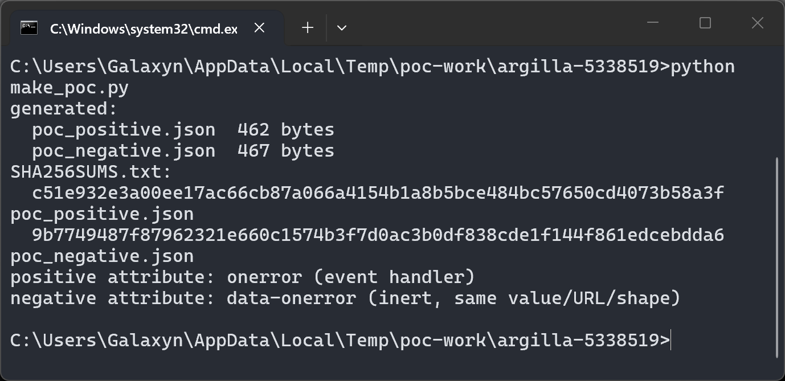
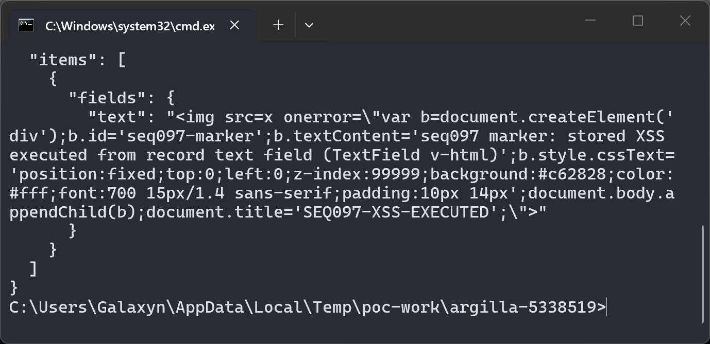
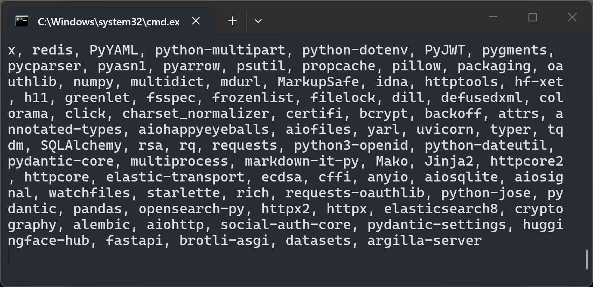
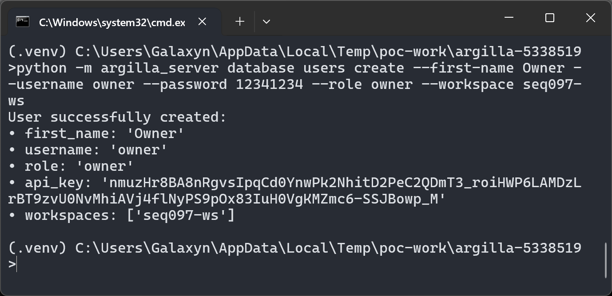
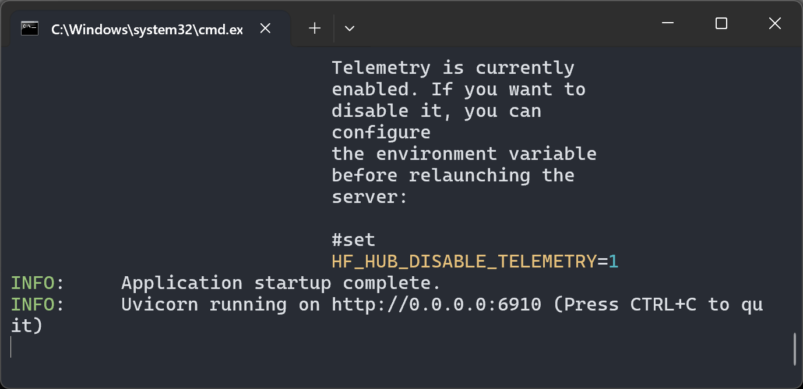
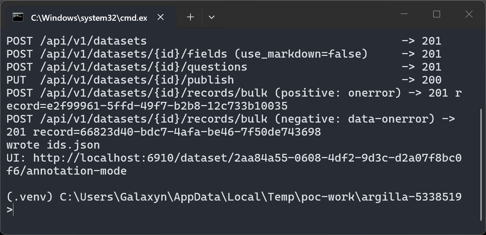
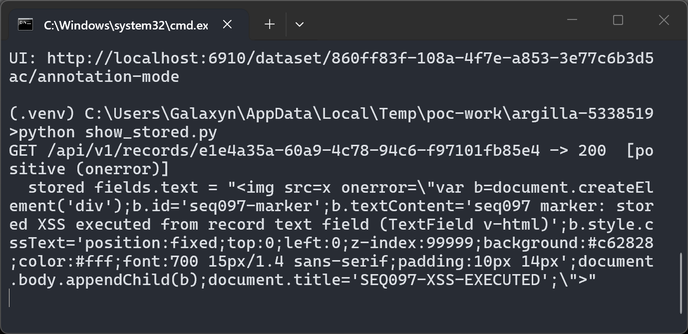
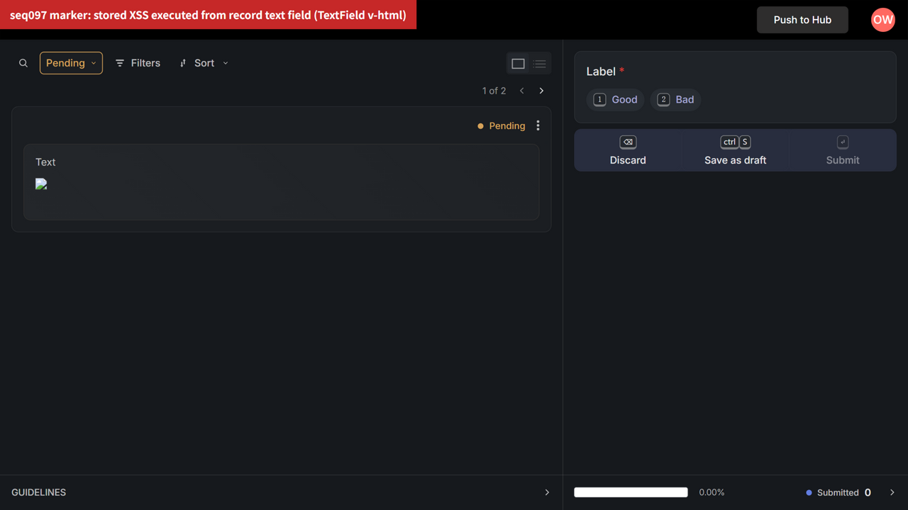
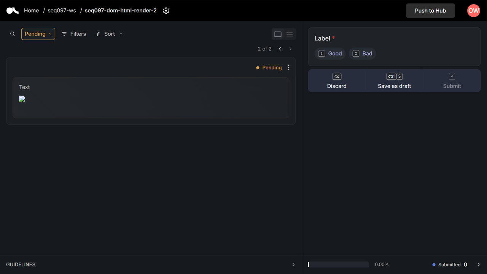

# Argilla 2.8.0 — Stored XSS via unsanitized `v-html` rendering of non-Markdown text fields in TextField.vue

## Summary

Argilla 2.8.0 is affected by a stored cross-site scripting (XSS) vulnerability in the annotation frontend's text-field renderer. A user with workspace admin/owner privileges (the role that normally curates datasets) can persist an HTML payload in a plain dataset record text field (`use_markdown: false`) through the records bulk API. When any user — typically a lower-privileged annotator — opens that record on the annotation page, the frontend injects the stored string into the page DOM with Vue's raw `v-html` directive, and script-borne attributes such as `onerror` execute in the victim's browser session. Only benign marker JavaScript was used to verify the defect.

## Affected Product

| Field | Value |
|---|---|
| Vendor | Argilla (argilla-io) |
| Product | Argilla (argilla-server / argilla-frontend) |
| Affected versions | Release 2.8.0 (latest release at time of writing); vulnerable branch unchanged on `develop` @ `5338519accb13ae422f8bf9c0642651c249c49af` and on `main` as of 2026-10-06; no fixed version known ([pending]) |
| Component | `argilla-frontend/components/features/annotation/container/fields/text-field/TextField.vue` (final `v-else` template branch, line 22) |
| Platform | Client-side defect in the web frontend; server-agnostic (verified on Windows host, Chromium browser, argilla-server 2.8.0 PyPI wheel with Elasticsearch 8.11.4 and Redis 7) |
| Vulnerability type | CWE-79: Cross Site Scripting (stored) |

## Root Cause

**Location:** `argilla-frontend/components/features/annotation/container/fields/text-field/TextField.vue:19-23` (template of the `TextField` component, which renders dataset record fields on the annotation page)

The component chooses a renderer for the record field value (`fieldText`, bound directly from `record.fields.<name>`) with a three-way branch:

```html
<div :id="`fields-content-${id}`" class="content-area --body1">
  <MarkdownRenderer v-if="useMarkdown" :markdown="fieldText" />
  <Sandbox v-else-if="isHTML" :content="fieldText" />
  <div v-else :class="classes" v-html="fieldText" />
```

The `isHTML` computed property only recognizes **paired** tags:

```js
isHTML() {
  return /<([A-Za-z][A-Za-z0-9]*)\b[^>]*>(.*?)<\/\1>/.test(this.fieldText);
}
```

Any tag-borne payload without a matching closing tag — ``, `<iframe ...>`, `<svg><animate ...>` and so on — fails this regex, skips the `Sandbox` renderer, and falls into the final `v-else` branch, where the string is injected into the page DOM verbatim through Vue's raw `v-html` directive. `v-html` performs no sanitization, so event-handler attributes in the stored value become live in the victim's session. The server stores the field text verbatim (JSON parsing and persistence end cleanly; no encoding or filtering is applied on either side of the boundary — the defect is entirely in the frontend rendering decision).

`useTextFieldViewModel.ts` in the same directory only handles search highlighting and passes `fieldText` through unchanged, so the record value reaches the sink unmodified.

## Proof of Concept

### Prerequisites

- A running Argilla 2.8.0 instance (here: `argilla-server==2.8.0` from PyPI, which bundles the frontend build whose `TextField.vue` is byte-identical to the pinned `develop` commit; Elasticsearch 8.11.4 and Redis 7 as backing services; note `click<8.2` must be pinned alongside it — Argilla 2.8.0's CLI is incompatible with click ≥ 8.2)
- An account with the workspace admin or owner role (this is the standard role for dataset curation; `DatasetPolicy.create_records` grants record creation to owner or workspace admin)
- A victim user who opens the dataset's annotation page (`/dataset/{dataset_id}/annotation-mode`)

### Steps to Reproduce

1. Generate the positive and negative samples (the negative control is byte-identical except that the event-handler attribute name is the inert `data-onerror`; URL, attribute value, and JSON shape are unchanged so both records take the same render path):



The `make_poc.py` script writes `poc_positive.json` / `poc_negative.json` (records-bulk request bodies) and their hashes. The positive payload's JavaScript only appends a visible banner element and sets `document.title` — a benign marker with no credential or data exfiltration:



2. Set up the environment and start the server (Elasticsearch container, `argilla-server==2.8.0`, database migration, owner account creation):





3. Via the REST API, create the dataset with one text field (`use_markdown: false`), publish it, and persist both records through `POST /api/v1/datasets/{dataset_id}/records/bulk` (returns `201 Created` for each):



4. Read both records back from the API — the server returns the stored HTML string verbatim, confirming persistence is clean and unsanitized:



5. Open the annotation page as the (victim) user and view the positive record. The `` fails to load, the stored `onerror` handler executes: a red marker banner is appended to `document.body` and the tab title changes to `SEQ097-XSS-EXECUTED`:



6. Negative control: switch to the second record (the `data-onerror` variant) and reload the page so any state from the first record is cleared. The record takes the same `v-html` render path (a broken image icon is rendered), but nothing executes — no banner appears and the tab title remains `Argilla`:



This control isolates the cause: both records traverse the identical code path (`v-html`), and execution is triggered solely by the live event-handler attribute name in the stored record string.

### Expected vs Actual

- Expected: record text with `use_markdown: false` is displayed as inert text (or rendered through the same sanitized/sandboxed path used for paired HTML).
- Actual: non-Markdown, non-paired-HTML values are injected as raw markup via `v-html`; the stored `onerror` JavaScript executes in the viewer's browser session.

### Sanitized PoC input

```text
POST /api/v1/datasets/{dataset_id}/records/bulk   (Authorization: Bearer <token>)
{
  "items": [
    {
      "fields": {
        "text": ""
      }
    }
  ]
}
```

Negative control: identical body with `data-onerror` in place of `onerror`.

## Impact

- Confidentiality: Low — injected script runs in the application origin and can read data accessible to that origin (e.g. the victim's session token storage and in-page application data).
- Integrity: Low — the script can act within the application on the victim's behalf (submit/modify annotations and records via the same-origin API).
- Availability: None.
- Scope: Changed — the injection crosses the trust boundary from the stored record (data) into the victim's browser session (code execution in the app origin).

## Attack Vector and Severity (CVSS v3.1)

| Metric | Value | Rationale |
|---|---|---|
| Attack Vector | N (Network) | The record is inserted and triggered through the web application over the network |
| Attack Complexity | L (Low) | Standard record-insertion flow; no special conditions |
| Privileges Required | L (Low) | Insertion needs a workspace admin/owner account (low-privileged relative to the instance); victims are annotators with no extra privileges |
| User Interaction | R (Required) | The victim must open the crafted record on the annotation page |
| Scope | C (Changed) | Stored data becomes code execution in the browser session |
| Confidentiality | L (Low) | Same-origin data exposure |
| Integrity | L (Low) | Same-origin actions on behalf of the victim |
| Availability | N (None) | No availability impact |

```
Score: 5.4 (Medium)
Vector: CVSS:3.1/AV:N/AC:L/PR:L/UI:R/S:C/C:L/I:L/A:N
```

> Assumption note: PR:L reflects the server-side policy (`DatasetPolicy.create_records` allows owner or workspace admin). If an Argilla deployment additionally exposes record insertion to weaker roles via custom tooling, the severity would be higher.

## Remediation

Render the final branch of `TextField.vue` as text (text interpolation) instead of raw `v-html`, or route all non-Markdown content through a sanitizing renderer (e.g. DOMPurify) before DOM injection. Defense in depth: the `Sandbox` component (`fields/sandbox/Sandbox.vue`) currently renders `content` into an iframe `srcdoc` without a `sandbox` attribute and should also be reviewed. Until patched, deployments should treat dataset record fields from other workspaces/users as untrusted input.

## Timeline

| Date | Event |
|---|---|
| 2026-10-06 | Vulnerability reproduced and verified against Argilla 2.8.0 and `develop` @ `5338519accb13ae422f8bf9c0642651c249c49af` (code identical to release) |
| 2026-10-06 | Report prepared; upstream notification `[pending]` |
| [pending] | Maintainer acknowledged |
| [pending] | Fix released |

## References

- Source repository: https://github.com/argilla-io/argilla
- Pinned commit analyzed: https://github.com/argilla-io/argilla/commit/5338519accb13ae422f8bf9c0642651c249c49af
- Vulnerable file: https://github.com/argilla-io/argilla/blob/5338519accb13ae422f8bf9c0642651c249c49af/argilla-frontend/components/features/annotation/container/fields/text-field/TextField.vue
- Upstream report: `[pending publication]`
- CWE: https://cwe.mitre.org/data/definitions/79.html
- Vendor advisory: `[none]`

## Disclaimer

This report is provided for defensive and coordination purposes. It contains no ready-to-run exploit beyond the minimum reproduction information, and no sensitive infrastructure details. The payload only inserts a visible marker element. Do not disclose it publicly before the maintainer has had a reasonable window to fix the issue.

## Screenshot Checklist

All screenshots are real captures: terminal shots come from real Windows terminal windows driven command-by-command (commands visible in each shot are the ones actually executed), browser shots come from a real Chromium session against the reproduced instance. Collection environment: Windows 11 host, Docker 29.1.3 (Elasticsearch 8.11.4 container), Python 3.12.10 venv with `argilla-server==2.8.0`, collected 2026-10-06.

| File | Content |
|---|---|
| screenshots/01-env-python.png | Reproduction host Python version (`python --version`) |
| screenshots/02-es-container-started.png | Elasticsearch 8.11.4 container started (`docker run … es-seq097`) |
| screenshots/03-es-healthy.png | Elasticsearch health endpoint responding on localhost |
| screenshots/04-pip-install-argilla-server.png | `pip install argilla-server==2.8.0` (dependency resolution output) |
| screenshots/05-db-migrate.png | `python -m argilla_server database migrate` |
| screenshots/06-create-owner-user.png | Owner account created with workspace (`database users create`) |
| screenshots/07-server-started.png | `python -m argilla_server start --port 6910` boot log, application startup complete |
| screenshots/08-make-poc-samples.png | `python make_poc.py` — positive/negative samples + SHA-256 hashes |
| screenshots/09-poc-payload.png | `type poc_positive.json` — the stored payload (benign marker JS only) |
| screenshots/10-api-create-and-persist.png | `python poc_api.py` — login/dataset/field/publish/bulk-create, all `201`/`200` |
| screenshots/11-stored-record-verbatim.png | `python show_stored.py` — API returns `fields.text` verbatim for both records |
| screenshots/12-sample-hashes.png | `type SHA256SUMS.txt` — sample hashes |
| screenshots/13-browser-xss-positive.png | Annotation page, positive record: red `seq097 marker` banner injected at page top; tab title `SEQ097-XSS-EXECUTED` |
| screenshots/14-browser-negative-control.png | Annotation page, negative record (`data-onerror`): broken image only, no banner, title `Argilla` |
