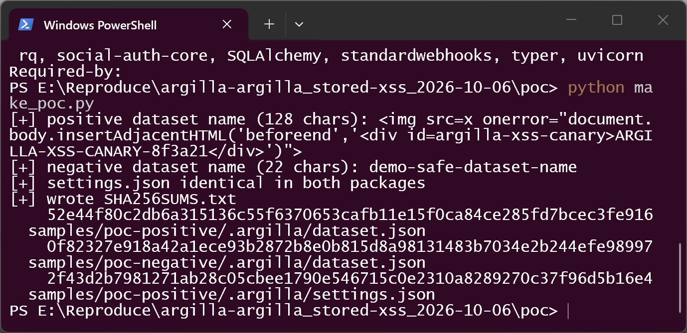
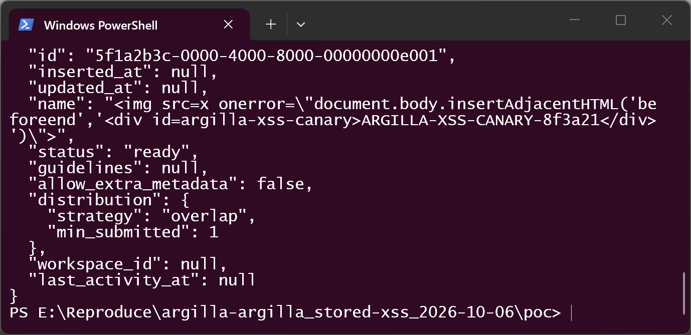
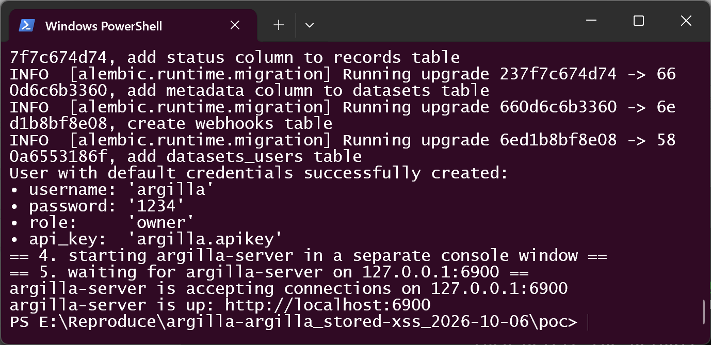
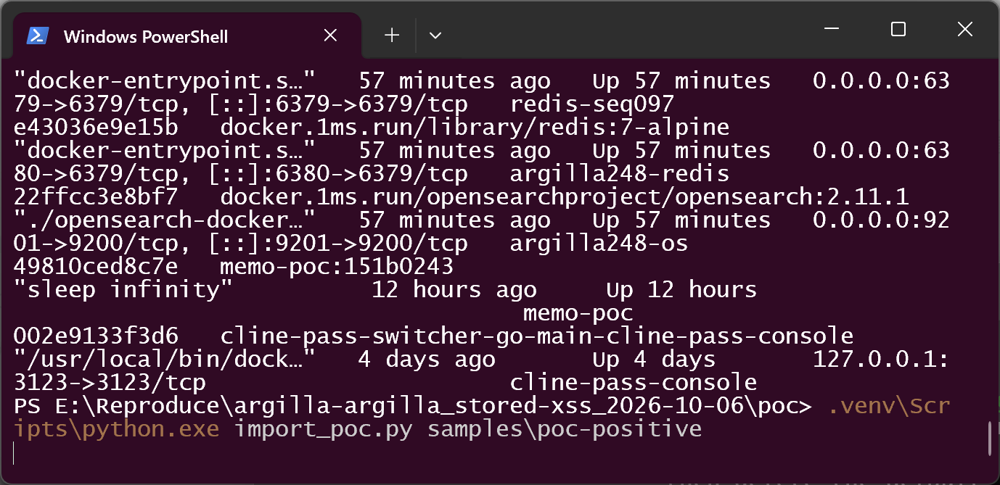
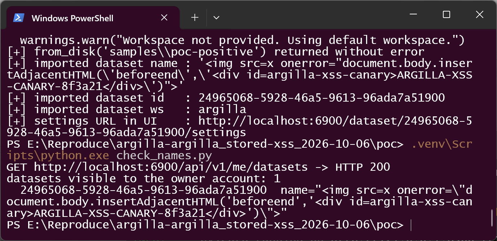
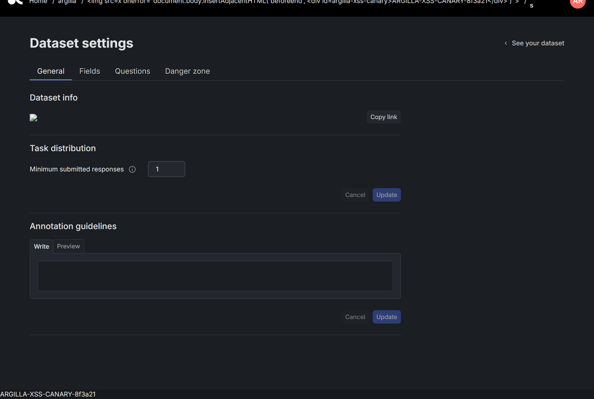
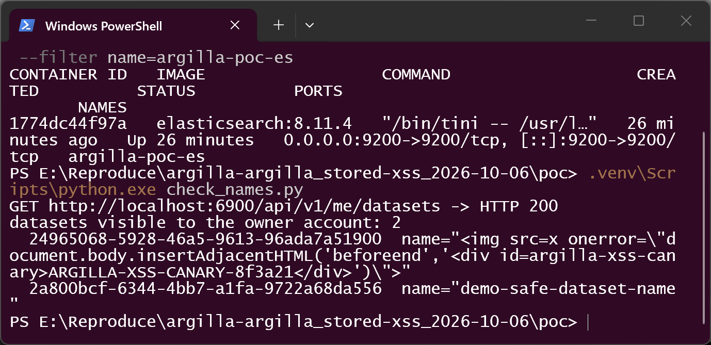
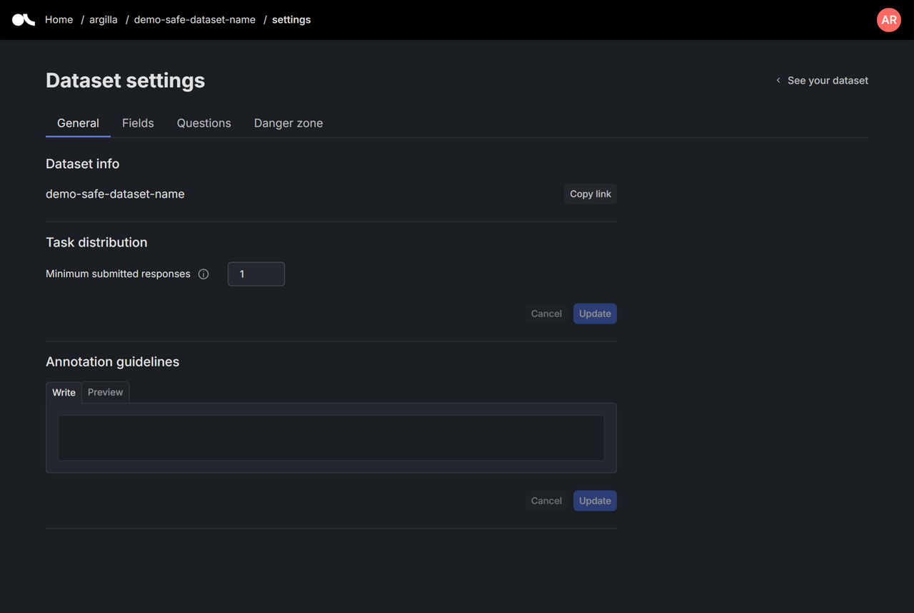

# Argilla 2.8.0 — Stored XSS in Dataset Settings Page (v-html rendered dataset name)

## Summary

Argilla 2.8.0 (argilla-io/argilla) is affected by a stored cross-site scripting (XSS) vulnerability in the dataset Settings page of the web frontend. The dataset `name` is attacker-controlled data for any user who can import a dataset: the official `Dataset.from_disk()` import path reads the name from `.argilla/dataset.json` inside a disk dataset package and stores it verbatim on the server (server-side validation only enforces a length of 1–200 characters, with no character restrictions). The Settings page renders this name with Vue's `v-html` directive, so any user who opens the Settings page of such a dataset executes injected script in the context of their own Argilla session. The payload used for validation is a benign sentinel that appends a marker element to the DOM.

## Affected Product

| Field | Value |
|---|---|
| Vendor | Argilla (argilla-io) |
| Product | Argilla (argilla-server + argilla-frontend; `argilla` Python client used for the import) |
| Affected versions | 2.8.0 — the latest release published on PyPI / GitHub releases (released 2025-03-11). Verified against the released `argilla_server-2.8.0` wheel (which bundles the built frontend) and source at commit `78cb5183f72e` (2025-03-10, the v2.8.0 release eve). The `v-html` sink is still present on `develop` HEAD `5338519accb1`, so no patched release exists as of 2026-10-06. Earlier 2.x releases were not individually verified. |
| Component | `argilla-frontend/components/features/annotation/settings/SettingsInfo.vue` lines 8–11 (owner/admin view); same sink in `SettingsInfoReadOnly.vue` lines 7–10 (annotator view). Entry vector: `argilla/src/argilla/datasets/_io/_disk.py` (`Dataset.from_disk`). |
| Platform | Any platform running the Argilla server and web UI (validated on Windows 11 host, Python 3.12, Elasticsearch 8.11.4 in Docker, Chrome) |
| Vulnerability type | CWE-79: Cross Site Scripting (stored) |

## Root Cause

**Location:** `argilla-frontend/components/features/annotation/settings/SettingsInfo.vue:8-11` (owner/admin Settings view, verified at commit `78cb5183f72e`)

The component renders the dataset name as raw HTML instead of text:

```vue
<p
  class="settings__dataset-name --body1"
  v-html="settings.dataset.name"
/>
```

`settings.dataset.name` originates from the server API (`GET /api/v1/me/datasets/...`) and is fully attacker-controlled: the client import path `Dataset.from_disk(path)` (`argilla/src/argilla/datasets/_io/_disk.py`) loads `.argilla/dataset.json` of a disk dataset package into `DatasetModel` (`name` is a plain `str`, no format validation) and calls `dataset.create()`, which POSTs the name to the server. The server-side schema (`argilla-server/src/argilla_server/api/schemas/v1/datasets.py:30-36`) constrains the name only by length:

```python
DATASET_NAME_MIN_LENGTH = 1
DATASET_NAME_MAX_LENGTH = 200

DatasetName = Annotated[
    constr(
        min_length=DATASET_NAME_MIN_LENGTH,
        max_length=DATASET_NAME_MAX_LENGTH,
    ),
    Field(..., description="Dataset name"),
]
```

So a name such as `` is persisted verbatim and returned verbatim. The same unescaped rendering exists in the read-only variant shown to annotators (`SettingsInfoReadOnly.vue:7-10`), so victims do not need owner/admin privileges. Other pages (dataset list, breadcrumbs) render the name with escaped interpolation and are not affected.

## Proof of Concept

### Prerequisites

- Argilla server 2.8.0 with its web UI reachable (validated stack: Elasticsearch 8.11.4 via Docker, `argilla-server` 2.8.0 pip wheel on 127.0.0.1:6900, default owner account)
- `argilla` Python client 2.8.0
- The victim is any signed-in user who opens the Settings page of the crafted dataset; the attacker needs any account allowed to import datasets (owner/admin role), or the ability to hand a dataset package to an operator who imports it

### Steps to Reproduce

1. Build a disk dataset package (the format written by `Dataset.to_disk()`). The package contains no records, no scripts and no plugins — the dataset name is the only payload carrier:

   ```
   poc-positive/
   └── .argilla/
       ├── dataset.json     # "name": ""
       └── settings.json    # normal, valid settings (1 text field + 1 label_selection question)
   ```

   

2. The payload in `dataset.json` is a benign sentinel (128 characters, within the 200-character limit) that appends a marker element to the page — no cookies, no network, no redirects:

   ```json
   "name": "ARGILLA-XSS-CANARY-8f3a21</div>')\">"
   ```

   

3. Start the stack and import the package through the official SDK entry point:

   ```python
   import argilla as rg
   client = rg.Argilla(api_url="http://localhost:6900", api_key="argilla.apikey")
   dataset = rg.Dataset.from_disk("samples/poc-positive", client=client)
   ```

   

   

4. Confirm the server persisted the payload verbatim — the raw JSON API returns the name unmodified:

   ```
   GET /api/v1/me/datasets -> HTTP 200
   24965068-5928-46a5-9613-96ada7a51900  name="ARGILLA-XSS-CANARY-8f3a21</div>')\">"
   ```

   

5. Sign in to the web UI as any user with access to the dataset and open its Settings page: `http://localhost:6900/dataset/24965068-5928-46a5-9613-96ada7a51900/settings`. On page load the browser executes the `onerror` handler and the canary element `<div id="argilla-xss-canary">ARGILLA-XSS-CANARY-8f3a21</div>` appears in the DOM (in-page check: `canaryPresent: true`; the `p.settings__dataset-name` element contains a live `` element). The screenshot below shows the Settings page with the injected broken image element in the "Dataset info" section, the payload echoed in the breadcrumb, and the canary injected at the bottom of the page.

   

6. Negative control: an identical package whose `name` is the plain string `demo-safe-dataset-name` (both packages share byte-identical `settings.json`; the `dataset.json` files differ only in the `name` value). The import succeeds, the raw API shows the plain name, and the Settings page renders the name as text — no injected element, no canary (`canaryPresent: false`).

   

   

### Expected vs Actual

- Expected: the dataset name is user-controlled text and must be rendered as text (Vue interpolation / `v-text`); no markup from it should ever execute.
- Actual: the name is rendered with `v-html`, so stored HTML/script executes in every visitor's session when the Settings page is opened.

### Sanitized PoC input

```text
name = ARGILLA-XSS-CANARY-8f3a21</div>')">
     (128 chars, single line inside .argilla/dataset.json of the disk dataset package)
```

## Impact

- Confidentiality: Low — the demonstrated payload is a benign sentinel, but arbitrary script execution in the victim's session allows reading page-visible data (dataset contents, responses, workspace members) and acting on the UI within the victim's privileges.
- Integrity: Low — script can act on behalf of the victim inside the application (e.g., UI state changes) within the victim's permissions.
- Availability: None observed.
- Scope: Changed — the payload executes in the browser (origin of the Argilla web UI) under the victim's session, crossing from the data-import trust boundary into the UI session.

## Attack Vector and Severity (CVSS v3.1)

| Metric | Value | Rationale |
|---|---|---|
| Attack Vector | Network | The package is imported via the network API; the victim is remote |
| Attack Complexity | Low | Standard import + page view, no special conditions |
| Privileges Required | Low | The importer needs an account that may import datasets (owner/admin workspace role) |
| User Interaction | Required | The victim must open the dataset Settings page |
| Scope | Changed | Execution happens in the browser session of the victim user |
| Confidentiality | Low | Page-visible data readable by script |
| Integrity | Low | Actions possible within the victim's UI privileges |
| Availability | None | No availability impact observed |

```
Score: 5.4 (Medium)
Vector: CVSS:3.1/AV:N/AC:L/PR:L/UI:R/S:C/C:L/I:L/A:N
```

## Remediation

- Render the dataset name as text in both components: replace `v-html="settings.dataset.name"` with `v-text` / `{{ }}` interpolation in `SettingsInfo.vue` and `SettingsInfoReadOnly.vue`. If markup is ever required, sanitize with DOMPurify before rendering.
- Defense in depth: restrict `DatasetName` server-side (reject `<`, `>`, quotes) so payloads cannot be persisted through any client.

## Timeline

| Date | Event |
|---|---|
| [unknown] | Vulnerability discovered |
| 2026-10-06 | Vulnerability validated end-to-end (source pinned at commit `78cb5183f72e`; live validation against the released 2.8.0 wheel); report prepared |
| [pending] | Report sent to the maintainer |
| [pending] | Fix released — none available as of 2026-10-06 |

## References

- Source repository: https://github.com/argilla-io/argilla
- Pinned commit: https://github.com/argilla-io/argilla/tree/78cb5183f72e
- Vulnerable file: https://github.com/argilla-io/argilla/blob/78cb5183f72e/argilla-frontend/components/features/annotation/settings/SettingsInfo.vue
- PyPI package: https://pypi.org/project/argilla-server/ (2.8.0, latest as of 2026-10-06)
- CWE: https://cwe.mitre.org/data/definitions/79.html
- Upstream report: [pending publication]
- Vendor advisory: [none]

## Disclaimer

This report is provided for defensive and coordination purposes. It contains no ready-to-run exploit beyond the minimum reproduction information, and no sensitive infrastructure details. The PoC payload is a benign DOM marker. Do not disclose it publicly before the maintainer has had a reasonable window to fix the issue.

## Screenshot Checklist

All screenshots captured on 2026-10-06 in the validation environment described above (Windows 11 host, Python 3.12.10, `argilla` client 2.8.0 + `argilla-server` 2.8.0 pip wheel in a local venv, Elasticsearch 8.11.4 container, real terminal session driven one command at a time, Chrome-based in-app browser for the UI views; dataset IDs match those shown in the terminal outputs).

| File | Content |
|---|---|
| `screenshots/01-env.png` | Environment: Python 3.12.10, Docker 29.1.3, working directory `poc` |
| `screenshots/02-client-version.png` | `pip show argilla` — client 2.8.0 |
| `screenshots/03-server-version.png` | `pip show argilla-server` — server 2.8.0 (bundles the built frontend) |
| `screenshots/04-make-poc.png` | `make_poc.py` builds both packages, prints names and SHA-256 hashes, asserts identical `settings.json` |
| `screenshots/05-artifacts.png` | Package layout: only `dataset.json` (443 B) + `settings.json` (1125 B), no sidecar files |
| `screenshots/06-payload-artifact.png` | Content of the positive package's `dataset.json` with the payload in `name` |
| `screenshots/07-stack-up.png` | `start_stack.ps1`: Elasticsearch up, migrations, default owner user created, argilla-server accepting connections on 127.0.0.1:6900 |
| `screenshots/08-docker-ps.png` | `docker ps` — Elasticsearch 8.11.4 container `argilla-poc-es` on port 9200 |
| `screenshots/09-import-positive.png` | `Dataset.from_disk` imports the positive package without error; payload name intact |
| `screenshots/10-stored-name-positive.png` | Raw JSON API (`check_names.py`): payload name stored server-side verbatim |
| `screenshots/11-import-negative.png` | Positive storage check + negative control import starting |
| `screenshots/12-stored-names-both.png` | Raw JSON API: both datasets listed — positive keeps payload, negative stores `demo-safe-dataset-name` |
| `images/argilla-stored-xss-browser-positive-canary.png` | Settings page of the positive dataset: v-html-injected `` in Dataset info, payload in breadcrumb, XSS canary div at page bottom (`canaryPresent: true`) |
| `images/argilla-stored-xss-browser-negative-control.png` | Settings page of the negative control: plain-text name, no canary (`canaryPresent: false`) |

Validation boundary, stated honestly: the live validation was performed as an owner-role user (both rendering variants verified in source; only the owner/admin variant exercised in the browser). The `argilla/argilla-quickstart` Docker image could not be pulled in this environment (registry blocked), but the released `argilla_server` 2.8.0 wheel bundles the same built frontend (`domProps: { innerHTML: ... }` on the dataset name verified in the bundled JS), and the official image is expected to behave identically. Earlier 2.x releases were not individually tested; the sink is confirmed present at the pinned v2.8.0-eve commit and on `develop` HEAD `5338519accb1` as of 2026-10-06.
