# ComfyUI-Custom-Scripts main@609f3afa — Stored XSS via `modelspec.description` chaining to code execution at the next ComfyUI start

## Summary

`pythongosssss/ComfyUI-Custom-Scripts`, up to and including `main` at commit
`609f3afaa74b2f88ef9ce8d939626065e3247469`, renders the `modelspec.description` entry of
a `.safetensors` file's `__metadata__` map through `innerHTML` when the user opens the
node pack's own "View Lora info..." dialog. `__metadata__` is by design an inert map of
JSON strings, so a model file that "cannot execute code" ends up running
attacker-controlled script in the ComfyUI page origin.

From that same-origin position the script uses the node pack's own unauthenticated write
route to overwrite an installed custom node package's `__init__.py` with a file of the
attacker's choosing. ComfyUI imports custom node packages at start-up, so the overwritten
initializer executes as Python the next time the user starts ComfyUI.

The whole chain was reproduced end to end on the real product stack, with only the
terminal effect replaced by an inert marker. The victim's only actions are the two
ordinary ones: put a downloaded model in `models/loras/`, and look at its information.

## Affected Product

| Field | Value |
|---|---|
| Vendor | pythongosssss (third-party ComfyUI node pack) |
| Product | ComfyUI-Custom-Scripts |
| Affected versions | all versions; no tagged releases exist (0 tags, 0 releases). Verified on `main @ 609f3afaa74b2f88ef9ce8d939626065e3247469`, which is also the current `origin/main` HEAD — the defect is unfixed as of 2026-09-27 |
| Component | `web/js/modelInfo.js` (`modelInfo.js:190`), `py/model_info.py` (`:62-115`), `py/better_combos.py` (`:27-53`) |
| Host application | ComfyUI `387f98aa2822f684b8597959a52a467d88cc4806` — the host process, **not** a reported defect |
| Platform | Linux x86_64 (Python 3.13.12, torch 2.14.0, aiohttp 3.14.3, safetensors 0.8.0, comfyui-frontend-package 1.52.7, headless Chromium 153 via Playwright); the product was started with `--cpu`, so no GPU is involved at any point |
| Vulnerability type | CWE-79: Improper Neutralization of Input During Web Page Generation ('Cross-site Scripting'), chaining to CWE-434 and CWE-94 |

## Root Cause

**Location:** `web/js/modelInfo.js:190` (`LoraInfoDialog.addInfo()`), `py/model_info.py:8-23`
and `:62-115` (metadata source), `py/better_combos.py:27-53` (`save_preview()`)

Two defects in the node pack form the chain. ComfyUI core appears only as the host
process and is not claimed as a defect.

**Defect 1 — unescaped metadata rendering.** The pack adds a "View Lora info..." entry to
the right-click menu of every `LoraLoader` node (`web/js/modelInfo.js:356-411`,
`getExtraMenuOptions`). Choosing it fetches the model file's `__metadata__` map from the
pack's own route and assigns one of its values directly to `innerHTML`:

```js
// web/js/modelInfo.js:188-195
$el("div", {
  parent: this.content,
  innerHTML: info?.description ?? this.metadata["modelspec.description"] ?? "[No description provided]",
  //        ^ the civitai lookup             ^ the MODEL FILE's own metadata -> DOM, unescaped
  style: { maxHeight: "250px", overflow: "auto" },
});
```

The metadata is handled correctly upstream: `py/model_info.py:8-23` reads the safetensors
header with a plain `json.loads` and returns `__metadata__` as-is, and
`py/model_info.py:62-115` (`GET /pysssss/metadata/{type}/{name}`) returns that map
verbatim. Returning the map is the feature. The defect is the transition at line 190,
where a string that was data becomes markup and nothing re-examines it.

`info` is the civitai lookup (`web/js/modelInfo.js:196-206`). Where civitai cannot be
reached — an offline install, a blocked egress, an outage — the `??` fallback is taken and
the **file's own** metadata renders. The page carries no `Content-Security-Policy`, no
Trusted Types default policy and no DOMPurify, so nothing downstream blunts the assignment.

**Defect 2 — extension-preserving overwrite of a file outside the route's role.** The same
pack exposes `POST /pysssss/save/{name}` with no authentication:

```python
# py/better_combos.py:27-53 (save_preview)
dir        = get_directory_by_type(body.get("type", "output"))      # source dir, e.g. temp
filepath   = os.path.join(dir, os.path.normpath(subfolder), body.get("filename", ""))
if os.path.commonpath((dir, os.path.abspath(filepath))) != dir:      # guards the SOURCE only
    return web.Response(status=400)
image_path = folder_paths.get_full_path(type, name)                  # type/name come from the URL
image_path = os.path.splitext(image_path)[0] + os.path.splitext(filepath)[1]
#                                                 ^ the DESTINATION's extension is taken
#                                                   from the UPLOADED file
shutil.copyfile(filepath, image_path)
```

Nothing constrains the destination. `folder_paths.py:45` registers `custom_nodes` as a
folder type and `:441-458` resolves `custom_nodes/<pack>/__init__.py` to the installed
package's real initializer; the route then replaces that file with the uploaded bytes
under the uploaded file's extension. ComfyUI imports custom node packages at start-up:

```python
# nodes.py:2246 load_custom_node(...) -> :2266
module_spec.loader.exec_module(module)
```

so the overwritten initializer is executed as Python on the next start.

The attacker needs no import, no function call and no code execution on the victim's
machine. `__metadata__` is plain JSON and never passes through pickle loading, so
safetensors/pickle trust settings have no effect on this path. A tiny file is enough: the
carrier that was validated is 3,988 bytes in total — an 8-byte header length, a 3,976-byte
JSON header carrying a 3,547-character description, and a 4-byte 1×1 float32 tensor. The
prose-description control built by the same script is 484 bytes.

## Proof of Concept

### Prerequisites

- ComfyUI with `ComfyUI-Custom-Scripts` installed in `custom_nodes/` — one of the most
  widely installed ComfyUI node packs; running a dozen third-party packs is ordinary.
- One `.safetensors` LoRA from an untrusted source placed in `models/loras/`.
- The user opens a workflow that uses that LoRA and picks "View Lora info..." from the
  node's right-click menu. No privileges, no configuration change, no other interaction.

### Steps to Reproduce

The reproduction is a self-contained kit in `poc/` (see `截图与复现指引.md` for the
one-line commands). It builds ComfyUI and the node pack at the pinned commits, plants the
two `.safetensors` files, starts the **real** product, and drives a **real** Chromium
through the **real** frontend — real workflow-PNG drop onto the canvas, real right-click,
real menu click. Nothing on the taint path is stubbed, patched or called directly; the
driver never calls the vulnerable routes, the page's injected script does.

0. Both repositories are cloned at the pinned commits and verified before anything runs.
   The two pins below are the ones the whole reproduction was executed against:

   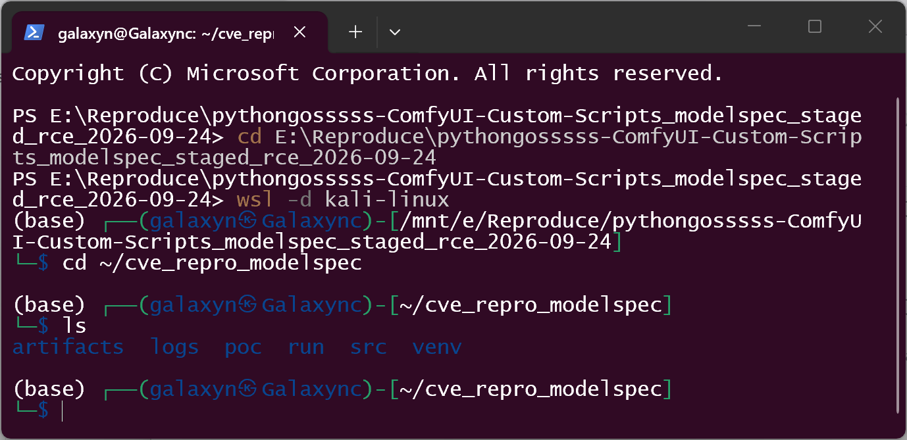

   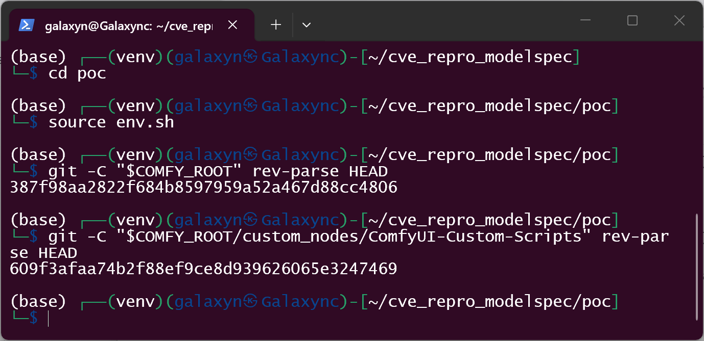

1. Build the carrier: a valid safetensors header whose `__metadata__["modelspec.description"]`
   is the injected markup, plus a byte-comparable negative control whose description is
   plain prose. Both are written with the official `safetensors.torch.save_file`, so the
   payload lives in the inert metadata map.

   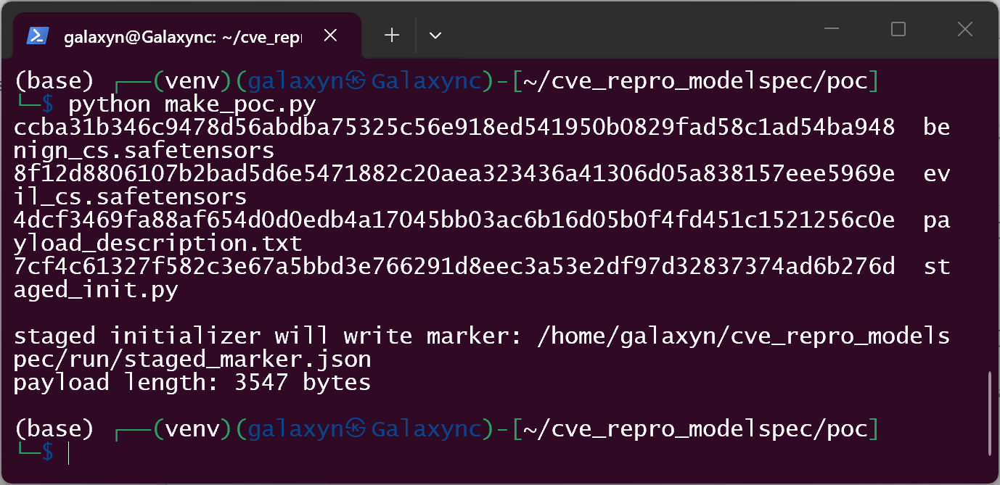

   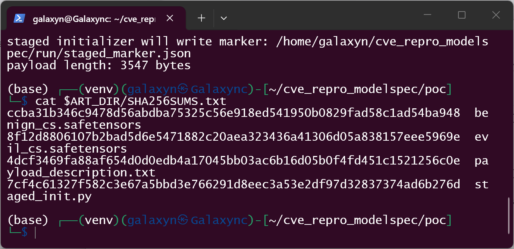

2. Plant the carriers in `models/loras/` and an ordinary third-party node pack
   (`Victim-Demo-Pack`, standing in for whatever the victim has installed) in
   `custom_nodes/`. The driver's own workflow PNG is built here, not by the attacker, and
   carries no payload. Before the run the victim pack's initializer is the original file:

   ```text
   363601e3819c05a05a1f0d0a8f635018d50d8641ef80cae12fddc0534755058a
   ```

   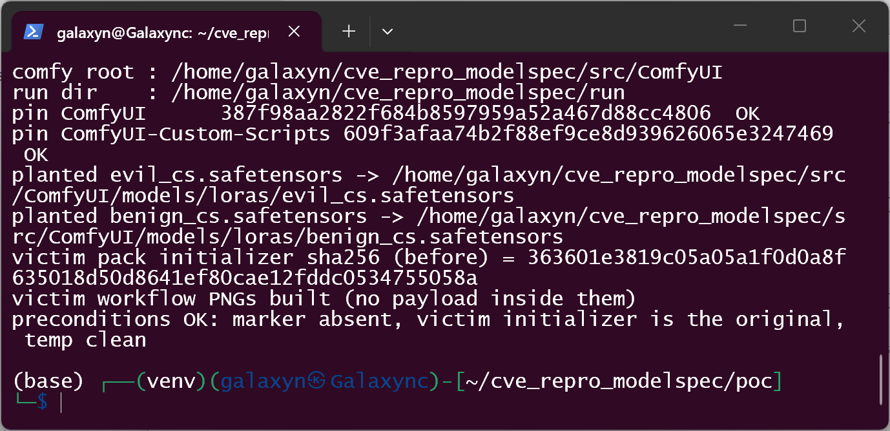

   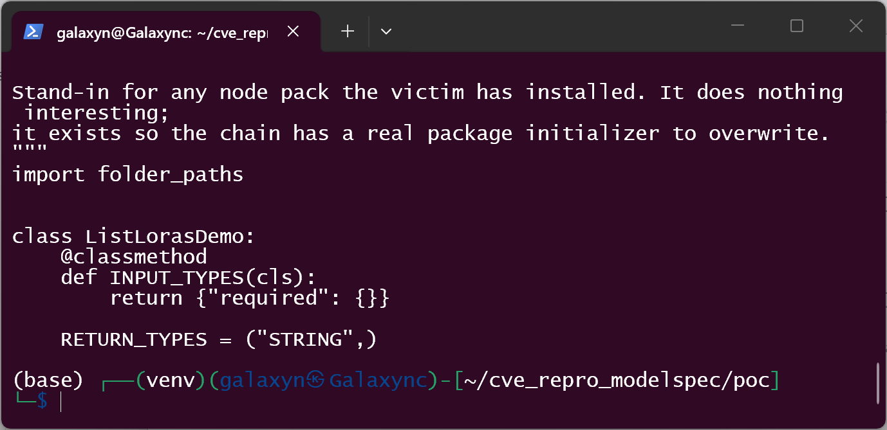

3. Start the real product exactly as its own documentation does:

   ```text
   python main.py --listen 127.0.0.1 --port 8188 --cpu --disable-auto-launch
   ```

   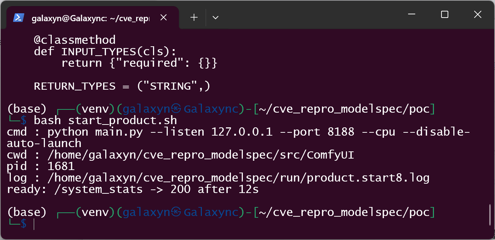

4. Open the page, drop the victim's workflow PNG onto the canvas, right-click the
   `LoraLoader` node and click "View Lora info...". The dialog renders the model's own
   metadata; the injected `` is created in the page and its inline handler
   compiles and runs (the driver reports `typeof img.onerror === "function"`, `compile: ok`,
   and a same-page control handler to prove inline handlers are alive at all). The injected
   script then performs the escalation **itself**, from the page's own origin:

   ```text
   POST /upload/image                                          -> 200
   POST /pysssss/save/custom_nodes/<pack>/__init__.py          -> 200
        {"type":"temp","subfolder":"","filename":"staged_init.py"}
   ```

   The driver records these as page-originated requests and responses; it issues none of
   them itself. The run's verdict block:

   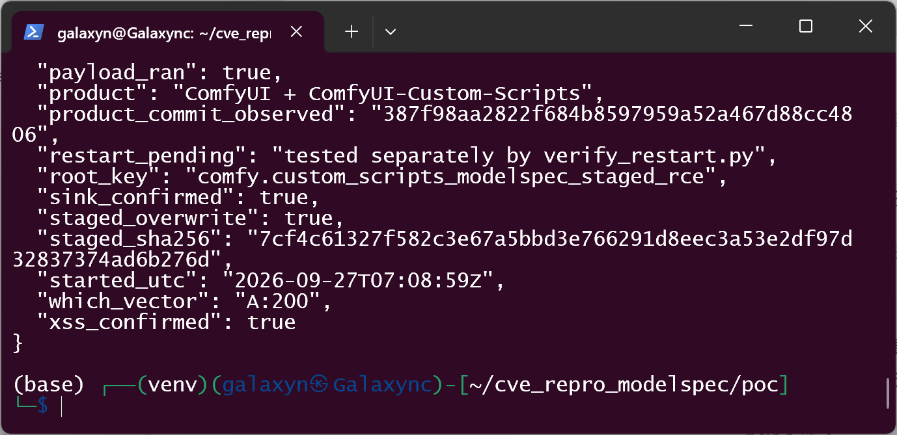

   The dialog itself, captured from the real browser in the same run (the broken-image
   icon is the injected `` that the model file's metadata put there):

   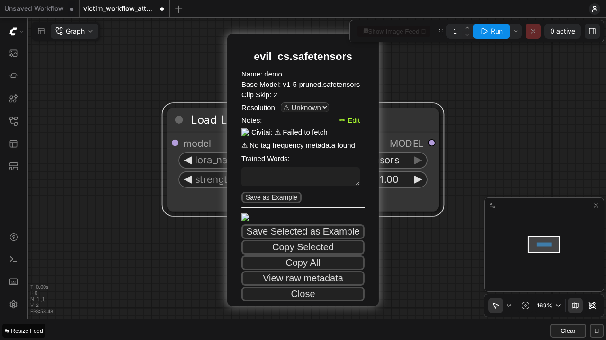

   and the negative control, which took the identical user action on a file whose only
   difference is the description string:

   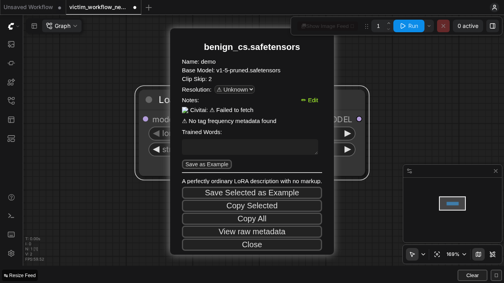

5. After the run the victim pack's initializer has changed to the attacker's staged file —
   the hash printed by step 2 no longer matches, and the file on disk is the staged one:

   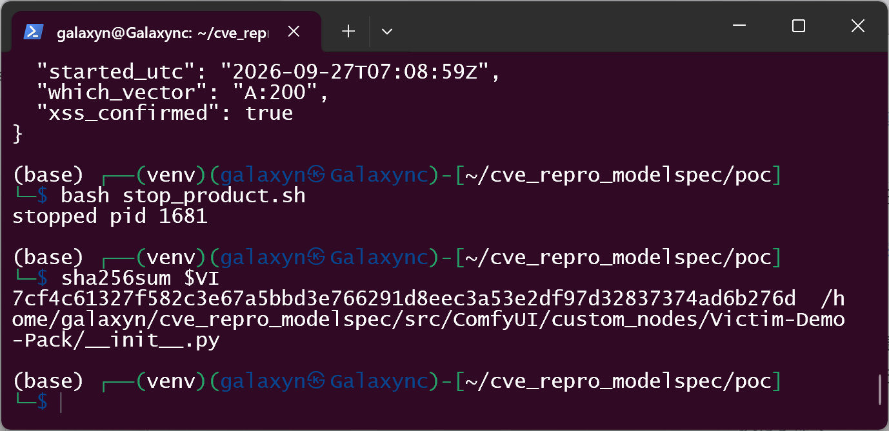

   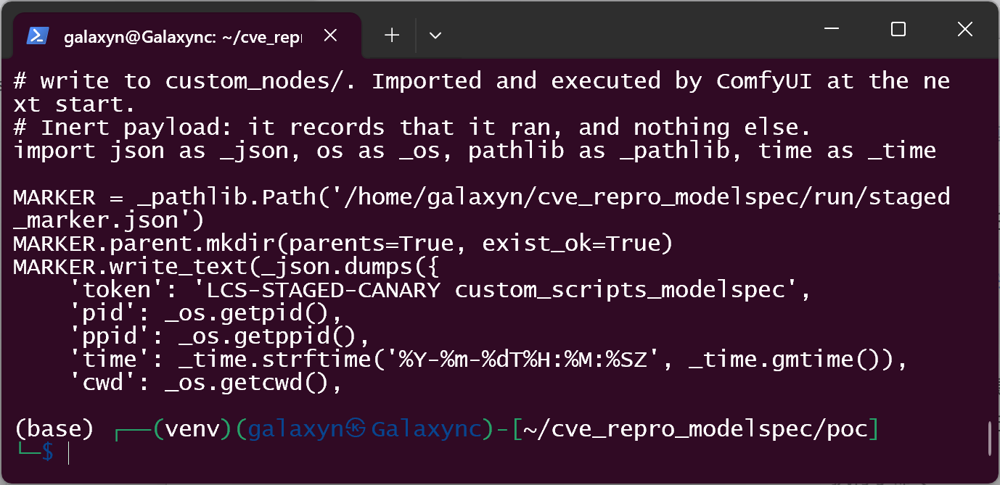

6. Restart ComfyUI for real (stop the process, start it again; the pid changes from
   **1681** to **1954**), then verify. The overwritten initializer is imported at startup
   and its module body runs — it writes a marker containing its own pid, and that pid is
   the restarted process:

   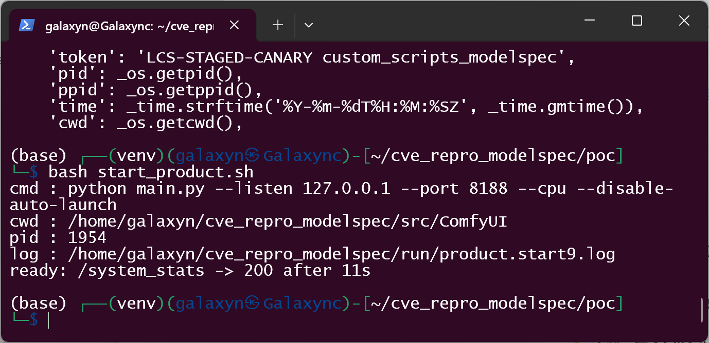

   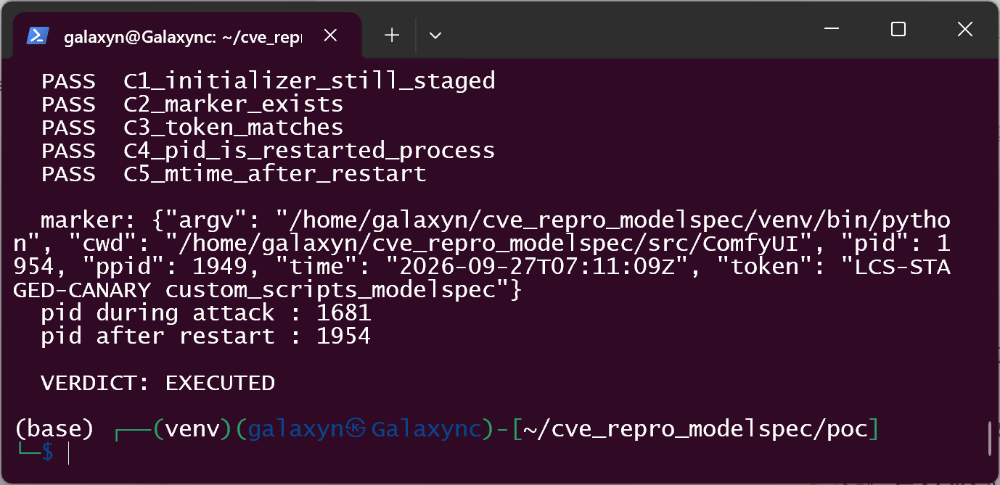

   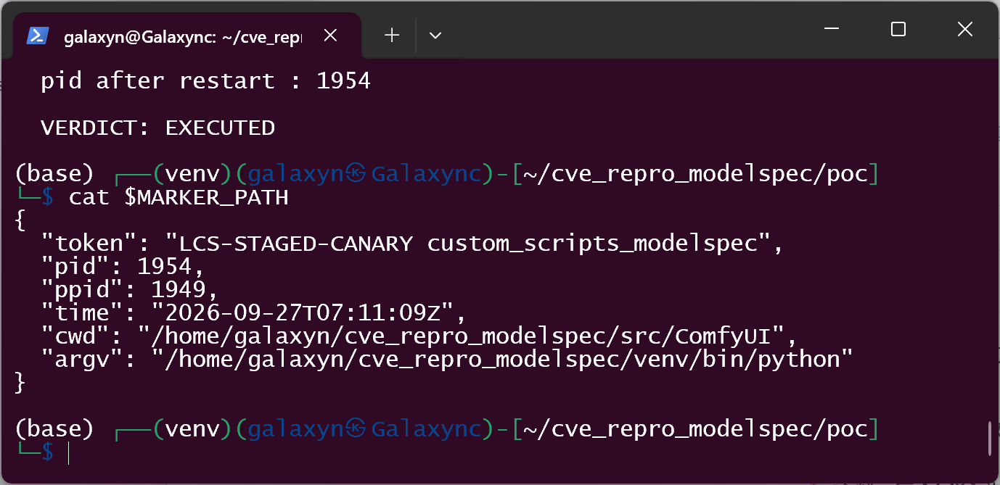

   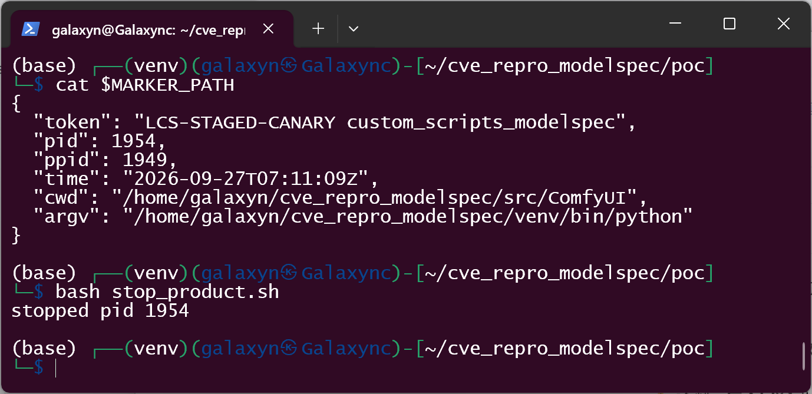

### Reproduction notes and boundaries

Stated plainly, because a reader who retests this will hit all of them:

- **A payload that fails to compile looks exactly like a product that blocks the attack.**
  The first build of this payload put template literals in object-literal key position
  (`` {`method`:'POST'} ``). V8 rejects that with `SyntaxError: Unexpected template string`,
  so the inline handler never compiled and the browser reported `img.onerror === null` —
  observationally identical to "the product neutralised the XSS". It was separated from a
  real mitigation by two independent controls, both kept in the kit: compiling the received
  attribute with `new Function()` inside the page (and again offline with `node --check`),
  and a hand-inserted control handler on the same page that must compile and fire before any
  negative browser result is trusted. The earlier run of this root in the same corpus lost a
  finding to the analogous payload-authored syntax error (an apostrophe closing a JS string).
- **Environment control, declared:** external host names were made unresolvable in the
  browser (`--host-resolver-rules`), which reproduces the offline condition the earlier
  corpus run achieved with `docker run --network none`. Loopback was unaffected: the real
  frontend, the real routes and the real write all ran normally. This does not touch the
  audited path.
- **The civitai branch was not exercised.** On a networked host the civitai lookup can
  resolve and its `description` is rendered instead of the file's own; that is a structurally
  similar second entry point into the same sink, and it is not measured here.
- **The sibling `innerHTML` sinks were not executed** (`modelInfoDialog.js:116`,
  `modelInfo.js:292`, `autocompleter.js:159`). Only `modelspec.description` was run.
- **The victim node pack is a stand-in.** `Victim-Demo-Pack` is a real, ordinary node pack
  installed in `custom_nodes/` and imported by the real product at startup; it stands in for
  whichever packs the actual victim has installed. The claim is about any installed pack, and
  the primitive is not pack-specific.
- **The terminal effect is a canary.** The staged initializer records that it ran and
  registers no node; no weaponised payload is included anywhere in this report or the kit.
- **No privilege crossing and no path traversal.** The overwrite lands inside
  `custom_nodes/`; the file is written with the ComfyUI process's own permissions. The
  route's `commonpath` guard (`py/better_combos.py:42-43`) rejects a `../` source path with
  HTTP 400 — source-verified here, and observed in the earlier corpus harness of this root;
  it guards the source path only, which is exactly why the destination is the problem.

### Expected vs Actual

- Expected: model metadata is prose; rendering it cannot introduce markup, and a
  preview-save route can only write preview images next to a model.
- Actual: the description string is parsed as HTML in the ComfyUI origin, and the same
  origin can overwrite any installed node package's initializer, which is executed as
  Python at the next start.

### Sanitized PoC input

```text
models/loras/evil_cs.safetensors       sha256 8f12d8806107b2bad5d6e5471882c20aea323436a41306d05a838157eee5969e
                                       3,988 bytes
  __metadata__["modelspec.description"] = ">
                                          <iframe style="display:none" srcdoc="<same>">

staged initializer (replaces custom_nodes/<any installed pack>/__init__.py)
                                       sha256 7cf4c61327f582c3e67a5bbd3e766291d8eec3a53e2df97d32837374ad6b276d
                                       810 bytes
  body: writes one marker file (token + pid + cwd) and registers no node

negative control models/loras/benign_cs.safetensors
                                       sha256 ccba31b346c9478d56abdba75325c56e918ed541950b0829fad58c1ad54ba948
                                       484 bytes

the injected description string itself
                                       sha256 4dcf3469fa88af654d0d0edb4a17045bb03ac6b16d05b0f4fd451c1521256c0e
                                       3,547 bytes
```

Note on hashes, stated because it is easy to get wrong: the **payload string** and the
**staged initializer** are byte-identical on every build (`4dcf3469…`, `7cf4c613…`), but the
`.safetensors` **files** are not, because the writer serialises `__metadata__` from a
hash map whose key order is not stable between processes. Every build therefore carries its
own file hash; the ones above belong to the run shown in the screenshots, and the earlier
reproduction of this root produced different ones (`…7f4a8b12`, `…cdf34aea`) for the same
payload. Compare payloads, not file hashes, across runs.

All hosts are loopback; no external address, credential or third-party identifier appears
in this reproduction.

## Impact

- **Confidentiality: High** — the injected script is same-origin with the ComfyUI page and
  uses the whole local ComfyUI HTTP API with the user's authority; the staged initializer
  gives code execution with the ComfyUI process's privileges.
- **Integrity: High** — arbitrary overwrite of any installed custom node package's
  initializer through the node pack's own unauthenticated route. Confirmed by file hash.
- **Availability: High** — the dialog, the session, and the loading process can be
  disrupted at will.
- **Scope**: stored XSS in the web origin → same-origin privileged file write → code
  execution on the host at the next start. The only user interaction is opening a model's
  information dialog.

## Attack Vector and Severity (CVSS v3.1)

| Metric | Value | Rationale |
|---|---|---|
| Attack Vector | Local (L) | the carrier is a model file the victim downloads and places in `models/loras/`; no network path into the product is needed |
| Attack Complexity | Low (L) | the model file is valid safetensors; the dialog is a two-click, documented feature; the write route needs no token or CSRF value |
| Privileges Required | None (N) | no account, no token, no elevation anywhere in the chain |
| User Interaction | Required (R) | the victim must look at the model's information (the feature's whole purpose) |
| Scope | Unchanged (U) | the vulnerable component's authority is the ComfyUI process — the same-origin script and the pack's own HTTP routes are both inside it — and the execution lands in that same authority |
| Confidentiality | High (H) | same-origin access to the user's session and the full local API; code execution as the product process |
| Integrity | High (H) | arbitrary overwrite of an installed package's initializer (verified by hash) |
| Availability | High (H) | UI session and start-up path can be disrupted at will |

```
Score: 7.8 (High)
Vector: CVSS:3.1/AV:L/AC:L/PR:N/UI:R/S:U/C:H/I:H/A:H
```

Assumption stated explicitly: the score is computed for the demonstrated end-to-end chain.
If the grader treats the browser origin and the ComfyUI process as separate authorities and
scores `S:C`, the vector becomes `CVSS:3.1/AV:L/AC:L/PR:N/UI:R/S:C/C:L/I:H/A:N` = 7.1 — a
lower score for a chain that reaches code execution, which is why `S:U` is used here.

## Remediation

1. **Do not assign model metadata to `innerHTML`** at `web/js/modelInfo.js:190`; use
   `textContent`. Model descriptions are prose and need no markup. If markup is genuinely
   wanted, sanitise at the point of assignment with an allow-list sanitiser, never with a
   denylist or a regex, and never by trusting the source of the string.
2. **Apply the same change to the sibling sinks** in the same dialog family:
   `web/js/common/modelInfoDialog.js:116`, `web/js/modelInfo.js:292`,
   `web/js/autocompleter.js:159`. Only `modelspec.description` was executed here; the
   others are structurally the same assignment.
3. **Restrict `POST /pysssss/save/{name}` to its preview-image role**
   (`py/better_combos.py:27-53`): allow-list image extensions for the destination instead
   of inheriting the uploaded file's extension, and refuse to write outside the model
   directories it exists to serve.
4. Until a fix ships: only open model-info dialogs for model files from trusted sources.

## Timeline

| Date | Event |
|---|---|
| 2026-09-18 | Vulnerability discovered |
| 2026-09-27 | Full end-to-end reproduction on the real product stack (real process, real browser, real restart), with the evidence and screenshots in this report |
| [pending] | Report to be sent to the maintainer via GitHub private vulnerability reporting (PVR is enabled upstream; **no report has been filed yet** as of 2026-09-27) |
| [pending] | Maintainer acknowledged |
| [pending] | Fix released |
| [pending] | Public disclosure |

## References

- Source repository: https://github.com/pythongosssss/ComfyUI-Custom-Scripts
- Vulnerable line: https://github.com/pythongosssss/ComfyUI-Custom-Scripts/blob/609f3afaa74b2f88ef9ce8d939626065e3247469/web/js/modelInfo.js#L190
- Host application (not reported): https://github.com/comfyanonymous/ComfyUI
- Upstream report: `[not yet filed]` — GitHub private vulnerability reporting is enabled on the repository (`{"enabled":true}`), but `GET /repos/.../security-advisories` returned `[]` for both accounts available here, i.e. no advisory exists as of 2026-09-27
- CWE: https://cwe.mitre.org/data/definitions/79.html
- Vendor advisory: [none]

## Disclaimer

This report is provided for defensive and coordination purposes. It contains no
ready-to-run exploit beyond the minimum reproduction information, uses inert sentinels
only, and carries no sensitive infrastructure details. Do not disclose it publicly before
the maintainer has had a reasonable window to fix the issue.

## Screenshot Checklist

All images below are real captures taken in this environment on **2026-09-27**: real
terminal windows driven command-by-command over WSL (kali-linux) against the real product,
and real Chromium pages from the product's own frontend. Nothing is rendered, staged or
retouched; every command in a shot produced the output shown in it.

| File | What it shows |
|---|---|
| `screenshots/modelspec-staged-rce-01-repro-tree.png` | the reproduction tree in WSL: pinned source clones, the virtualenv, the artifacts |
| `screenshots/modelspec-staged-rce-02-pins.png` | both pinned commits echoed by `git rev-parse` — ComfyUI `387f98aa…`, node pack `609f3afa…` |
| `screenshots/modelspec-staged-rce-03-make-poc.png` | building the carrier and the negative control; payload length and hashes |
| `screenshots/modelspec-staged-rce-04-artifact-hashes.png` | `SHA256SUMS.txt` for every artifact, including the staged initializer |
| `screenshots/modelspec-staged-rce-05-plant-victim.png` | planting the carriers; the victim package's initializer hash *before* the attack; clean preconditions |
| `screenshots/modelspec-staged-rce-06-victim-initializer-before.png` | the original, innocent initializer source of the victim node pack |
| `screenshots/modelspec-staged-rce-07-product-up.png` | the real ComfyUI process started from the pinned tree, answering on `/system_stats` |
| `screenshots/modelspec-staged-rce-08-drive-xss-and-overwrite.png` | the drive verdict: XSS confirmed, payload ran, overwrite happened, negative control clean, control handler alive |
| `screenshots/modelspec-staged-rce-09-initializer-hash-changed.png` | the victim initializer's hash after the attack — the staged hash |
| `screenshots/modelspec-staged-rce-10-initializer-overwritten.png` | the victim package's initializer is now the attacker's staged file |
| `screenshots/modelspec-staged-rce-11-restart.png` | the real restart: stop the process, start it again, new pid |
| `screenshots/modelspec-staged-rce-12-restart-verification.png` | five checks on the marker, incl. "the writing pid is the restarted process" — VERDICT: EXECUTED |
| `screenshots/modelspec-staged-rce-13-marker.png` | the marker the overwritten initializer wrote at startup: token, pid, ppid, cwd |
| `screenshots/modelspec-staged-rce-14-cleanup.png` | the product stopped again; no stray process left running |
| `screenshots/modelspec-staged-rce-ui-attack-dialog.png` | real browser: the dialog rendering the model file's own metadata, injected `` present |
| `screenshots/modelspec-staged-rce-ui-negctl-dialog.png` | real browser: the negative control dialog — same action, prose description, no markup |

Collected in: WSL2 (kali-linux, x86_64) with a Windows-hosted terminal for the command
transcript; ComfyUI `387f98aa` + Custom-Scripts `609f3afa`, Python 3.13.12 / torch 2.14.0 /
aiohttp 3.14.3 / safetensors 0.8.0 / comfyui-frontend-package 1.52.7, product started with
`--cpu`, browser egress restricted to loopback (see Reproduction notes), headless Chromium
153 via Playwright. All sixteen images are from one single run: the same process ids
(1681 → 1954) and the same artifact hashes appear throughout, so the terminal shots and the
browser shots are evidence of the same execution.

Stated plainly: the earlier corpus run of this root was a different, independent run on a
different host (`docker run --network none`, extraction-level verification only). It is not
the source of any image here, and its sample hashes are deliberately kept apart from this
run's — see the note under Sanitized PoC input.
