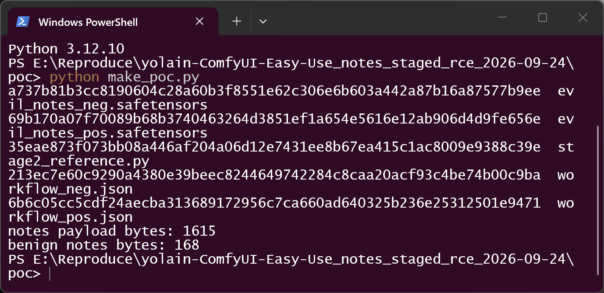
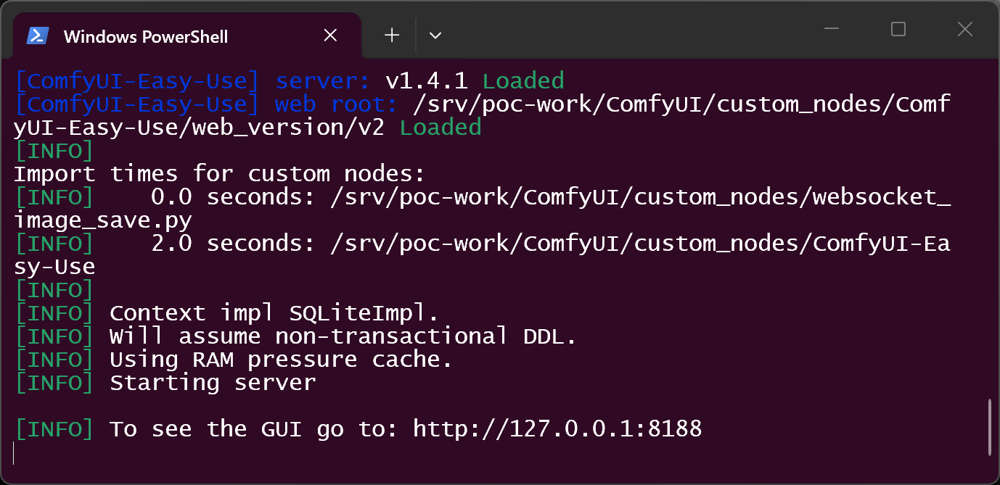
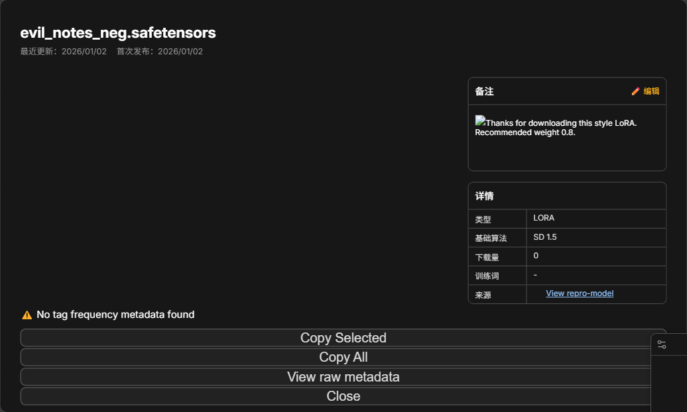
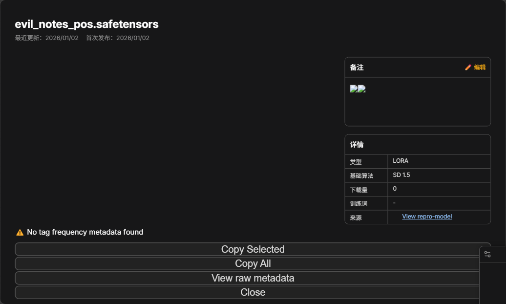
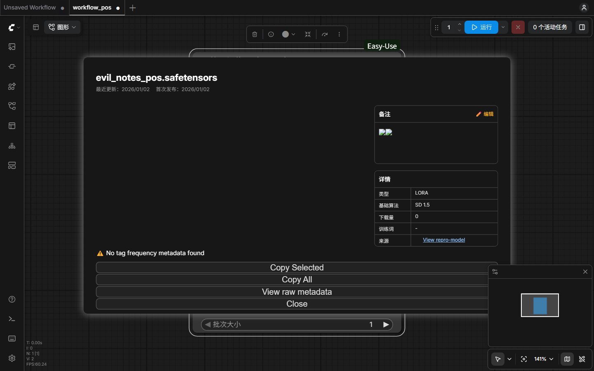
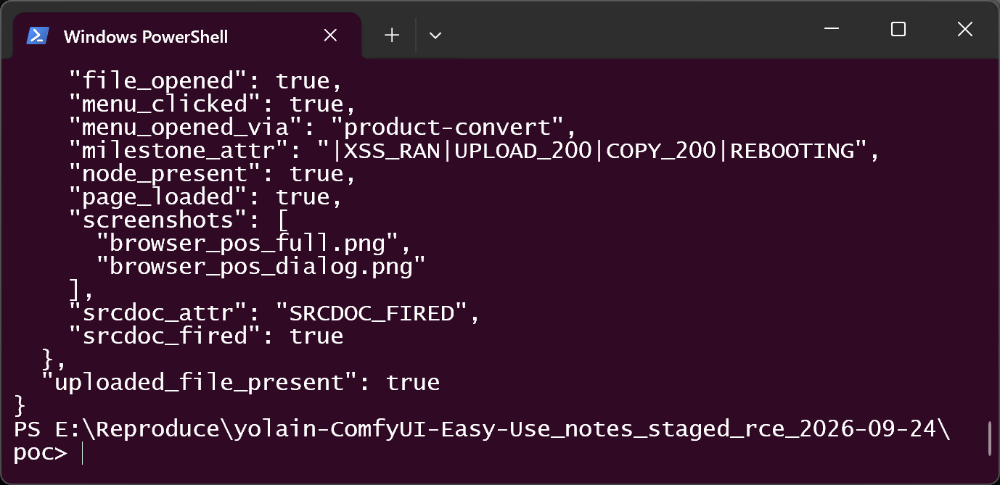
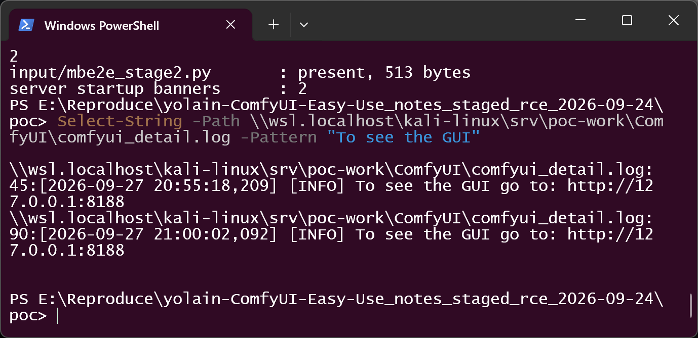
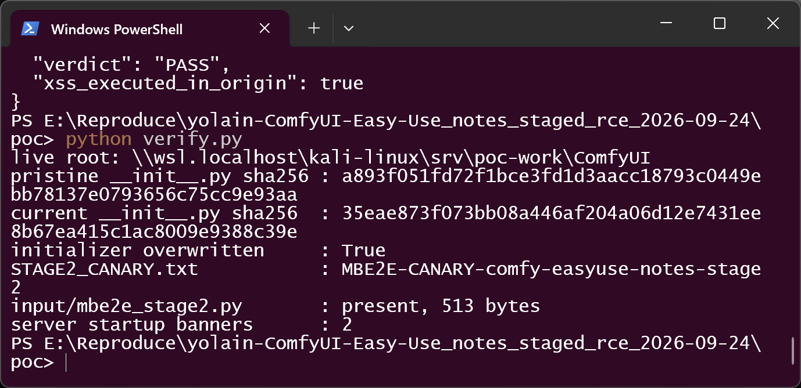
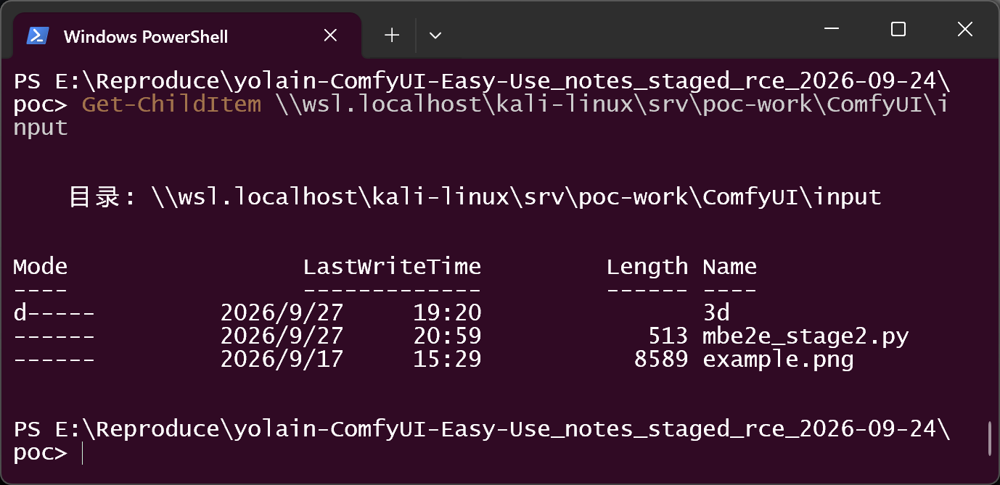
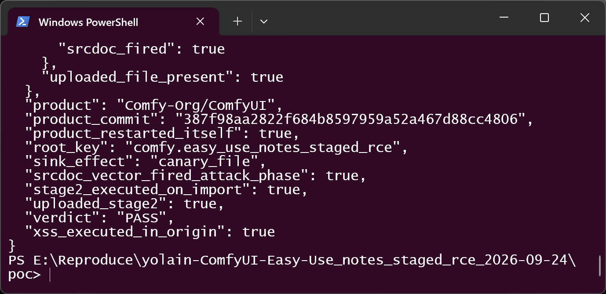

# ComfyUI-Easy-Use ≤ v1.4.1 — Stored XSS in the v2 model info dialog (`easyuse.notes`) chaining to custom-node initializer overwrite and same-session code execution via `/easyuse/reboot`

## Summary

`yolain/ComfyUI-Easy-Use` (ComfyUI-Easy-Use) up to release v1.4.1 (2026-09-04) and current main
`8730ffd14044ee9392db3b192646266576bc67df` is affected by a stored cross-site scripting flaw in the
v2 model info dialog. A model file whose `safetensors` `__metadata__` carries a crafted
`easyuse.notes` value executes attacker-controlled script in the ComfyUI web page when the victim
opens the model's info dialog — one normal user interaction, default configuration. From that
same-origin position the script uses the extension's own routes to stage a Python file, overwrite an
installed custom node's `__init__.py`, and force the ComfyUI process to re-exec itself
(`GET /easyuse/reboot` → `os.execv`), so the attacker's initializer body is imported and executed in
the same session. The full chain was reproduced end to end against the real product stack with
benign sentinels only (2026-09-27; see Proof of Concept).

## Affected Product

| Field | Value |
|---|---|
| Vendor | yolain (https://github.com/yolain) |
| Product | ComfyUI-Easy-Use |
| Affected versions | ≤ release v1.4.1 (2026-09-04); audited snapshot `450b1ce4ce43b2280521c87f5fa388a898fb2ad2` (2026-09-07); constructs re-verified at main `8730ffd14044ee9392db3b192646266576bc67df` (2026-09-21) |
| Component | v2 model info dialog notes rendering (`parseNote` → `span.innerHTML`, shipped bundle `web_version/v2/assets/extensions-DcWKQGos.js`) plus extension routes in `py/routes.py` (`load_metadata`, `save_preview`, `reboot`) |
| Platform | any OS running ComfyUI; validated on ComfyUI `387f98aa2822f684b8597959a52a467d88cc4806` (reports version 0.36.0) with the extension installed in `custom_nodes/` |
| Vulnerability type | CWE-79: Improper Neutralization of Input During Web Page Generation ('Cross-site Scripting'); chaining outcome CWE-94 (Improper Control of Generation of Code) |

Default configuration is affected: the v2 web UI is the default (`__init__.py:76`,
`web_default_version = 'v2'`). Release v1.4.1 was verified affected directly (same backend lines;
the shipped v2 bundle is the audited snapshot's bundle).

## Root Cause

Three independent defects in the extension compose into the chain. Attacker input enters through a
model file — the ordinary unit of exchange in this ecosystem.

**(1) Unescaped notes rendering — the XSS sink.** The v2 model info dialog reads
`this.metadata["easyuse.notes"]`, and its `parseNote()` method renders the notes after only
`o.replaceAll("\n", "<br>")`, passing the result as the `innerHTML` of a `span`:

```javascript
// shipped v2 production bundle, parseNote()
o = o.replaceAll("\n", "<br>");
e.push(ve("span", { innerHTML: o }));        // no HTML escaping
```

In the audited snapshot's bundle `extensions-DcWKQGos.js` the constructs sit at byte offsets
130,182 / 130,489; at current main the rebuilt bundle `extensions-ClLljgcb.js` carries them verbatim
at offsets 133,663 (`easyuse.notes` getter), 135,116 (`replaceAll`), 135,158 (`innerHTML`), with
`parseNote` invoked from the success handler of a Civitai `model-versions/by-hash` request
(fetch at 135,471, `parseNote.call(this)` at 136,041). The sink is therefore reached only when the
by-hash lookup returns 200.

**(2) Metadata returned verbatim, sidecars trusted blindly — the delivery path.**
`py/routes.py:204-258` (`load_metadata`, route `GET /easyuse/metadata/{name}`) parses the model
file's safetensors header and returns `__metadata__` as JSON without sanitization
(`web.json_response(meta)`, line 258). Two sidecar behaviors widen the trigger:

```python
# py/routes.py (load_metadata), abridged
info_file = file_no_ext + ".txt"                 # 243
if os.path.isfile(info_file):
    meta["easyuse.notes"] = f.read()             # 246: .txt sidecar replaces notes
hash_file = file_no_ext + ".sha256"              # 248
if os.path.isfile(hash_file):
    meta["easyuse.sha256"] = f.read()            # 251: sidecar trusted as the model hash,
                                                  #     never compared to the real file
else:
    meta["easyuse.sha256"] = hashlib.sha256(f.read()).hexdigest()   # 253-256: real hash branch
```

**(3) Unrestricted save route + on-demand re-exec — the escalation.**

```python
# py/routes.py:260-285 (save_preview, route POST /easyuse/save/{name}), abridged
name = request.match_info["name"]                # "custom_nodes/<pkg>/__init__.py"
type, name = name[0:pos], name[pos+1:]
filepath = os.path.join(full_output_folder, body.get("filename", ""))
image_path = folder_paths.get_full_path(type, name)          # 277: any registered category
image_path = os.path.splitext(image_path)[0] + os.path.splitext(filepath)[1]   # 278-279: source ext
shutil.copyfile(filepath, image_path)                        # 281: overwrites existing file
```

There is no folder-category allowlist and no restriction to preview images; `custom_nodes` is a
registered model category in ComfyUI core, so an installed package's `__init__.py` is a reachable
copy target without any path traversal. The uploaded file's extension is preserved, so a staged
`.py` lands as a `.py`.

```python
# py/routes.py:53-60 (reboot, route GET /easyuse/reboot)
@PromptServer.instance.routes.get("/easyuse/reboot")
def reboot(request):
    ...
    return os.execv(sys.executable, [sys.executable] + sys.argv)   # 60: no confirmation, no CSRF
```

ComfyUI core imports custom-node initializers at startup (`nodes.load_custom_node` →
`exec_module`), so the overwritten initializer body executes on the next bootstrap — which the
attacker triggers immediately via `/easyuse/reboot`.

## Proof of Concept

### Prerequisites

- ComfyUI with ComfyUI-Easy-Use installed, default settings (v2 web root).
- Victim places an attacker-supplied `.safetensors` in a models directory and opens the model's info
  dialog via the node context menu ("View Lora Info...") — one normal user interaction.
- The dialog's Civitai by-hash lookup must return 200 for the model's recorded SHA-256: satisfied
  for real published models, or for an attacker-writable `.sha256` sidecar borrowing a published
  hash (see Root Cause 2). All validation used only benign sentinels (DOM-attribute canary, inert
  initializer body, marker file) — no weaponized payload exists in this report.

### Steps to Reproduce (as executed in the live validation, 2026-09-27)

1. Build the artifacts: a metadata-only `.safetensors` (positive) carrying the notes payload — a
   control handler, the staged-chain vector (``), and a second `<iframe srcdoc>`
   vector — and a negative control with identical construction but prose notes. Generate a workflow
   containing one Easy-Use loader node whose `lora_name` selects the crafted file.



2. Place the model files into `models/loras/` of the live stack, then start the pinned product as a
   real server process: `python main.py --cpu --listen 127.0.0.1 --port 8188 --disable-auto-launch`
   (ComfyUI `387f98aa…` + Easy-Use `450b1ce4…`).



3. Negative control first: drive a real (headed) Chromium to the ComfyUI UI, open the workflow, and
   invoke the product's own "View Lora Info..." context-menu entry on the loader node. The dialog
   fetches `/easyuse/metadata/loras/<name>`, the by-hash lookup is answered by a local test responder
   (the stand-in prescribed for offline validation of this gate; nothing in the page or the product
   was modified), `parseNote` renders the prose, and only the control handler fires. Nothing else
   happens.



4. Positive run: same flow with the crafted file. The notes fragment is parsed as HTML — the dialog's
   notes area now contains two parsed `` elements (control + payload carrier) instead of text —
   and the payload's handler executes in the page origin.





5. The payload's DOM milestones record the chain executing in the origin:
   `XSS_RAN → UPLOAD_200 → COPY_200 → REBOOTING` — i.e. the staged `.py` was uploaded through
   `POST /upload/image` (`type=input`), copied over
   `custom_nodes/ComfyUI-Easy-Use/__init__.py` through `POST /easyuse/save/...` (HTTP 200), and the
   reboot route was called. The `<iframe srcdoc>` second vector fired as well.



6. The product replaces itself (`os.execv`): the server log carries a second startup banner from the
   process the product started itself.



7. On-disk effects, read back from the live stack: the initializer's SHA-256 changed from the
   pristine `a893f051…` to `35eae873…` (the staged sentinel); the sentinel body executed during the
   product's own custom-node import and wrote the canary marker
   `MBE2E-CANARY-comfy-easyuse-notes-stage2`; the staged `input/mbe2e_stage2.py` (513 bytes) is
   present; two startup banners recorded.





8. Merged verdict of the recorded run (all positive milestones + overwrite + self-restart + import
   execution + clean negative control):



### Expected vs Actual

- Expected: `easyuse.notes` is rendered as text; the save route writes only the preview images it is
  meant to write; the reboot route is not callable without explicit confirmation.
- Actual: the notes value is parsed as HTML in the page origin; the save route overwrites any
  existing file in any registered model-folder category while preserving the uploaded file's
  extension; the reboot route replaces the process on demand — and the overwritten initializer
  executes on the resulting re-import, in the same session.

### Sanitized PoC input

```json
{
  "__metadata__": {
    "easyuse.notes": "/__init__.py'), {method:'POST', ...body:{filename:'mbe2e_stage2.py', type:'input'}}); S('COPY_'+r2.status); S('REBOOTING'); fetch('/easyuse/reboot'); ...})()...\">",
    "modelspec.title": "easyuse notes repro"
  },
  "t": { "dtype": "F32", "shape": [1], "data_offsets": [0, 4] }
}
```

The full construction is the inert-sentinel generator `poc/make_poc.py` in the local evidence kit;
the staged initializer body (`stage2_reference.py`) writes an inert marker file next to itself and
exports empty node mappings.

### Validation environments (stated separately, nothing mixed)

- **2026-09-24 (extraction-based, offline):** verbatim production handlers and the shipped v2
  bundle's `parseNote` driven in a headless browser harness; real upload/save handlers, real custom
  node loader; `os.execv` intercepted by a recorder; 14/14 checks in two byte-identical runs.
- **2026-09-27 (real product stack, live):** real ComfyUI server process (WSL2/Linux guest for POSIX
  process semantics), real headed browser session through the product's own UI, real `os.execv`
  self-restart; Civitai by-hash answered by a local responder (offline stand-in). Two runs recorded;
  `verdict = PASS`, no failed checks, negative control clean. Both rounds used the same pins
  (`387f98aa…` / `450b1ce4…`) and benign sentinels only.

## Impact

- Confidentiality: High — script runs with the user's session in the ComfyUI origin and reaches the
  local API; the staged initializer replacement leads to arbitrary code execution with the ComfyUI
  process's privileges.
- Integrity: High — arbitrary overwrite of an installed custom node's initializer through the
  extension's own save route.
- Availability: High — `/easyuse/reboot` lets the script kill and restart the ComfyUI process at
  will, independent of any code execution.
- Scope: stored XSS → arbitrary file overwrite (no path traversal required) → same-session code
  execution after one normal user interaction. Authenticated deployments do not help: the
  same-origin script inherits the current user's session. `__metadata__` never passes through pickle
  loading, so safetensors/pickle trust settings do not apply, and a 187-byte metadata-only file
  suffices.

## Attack Vector and Severity (CVSS v3.1)

| Metric | Value | Rationale |
|---|---|---|
| Attack Vector | L | the malicious model file resides in a local models directory; the attack proceeds from the local web UI origin |
| Attack Complexity | L | no race or special conditions; the gate (by-hash 200) is satisfiable via a published model or an attacker-writable sidecar |
| Privileges Required | N | the victim needs no privileges; placing a model file is normal usage |
| User Interaction | R | one normal interaction: opening the model's info dialog |
| Scope | U | the code execution stays within the ComfyUI process's own authority |
| Confidentiality | H | session/API access from the origin; process-privileged execution |
| Integrity | H | arbitrary overwrite of installed package files |
| Availability | H | on-demand process restart via the extension route |

```
Score: 7.8 (High)
Vector: CVSS:3.1/AV:L/AC:L/PR:N/UI:R/S:U/C:H/I:H/A:H
```

## Remediation

1. Render `easyuse.notes` and any metadata-derived strings as text (`textContent`) or through a
   strict HTML-sanitizing allowlist rejecting event handlers and active content, in the v2 bundle
   source, then rebuild — the fix must cover the `parseNote` path, not just the direct dialog fields.
2. Restrict `POST /easyuse/save/{name}` to its preview-image role: allowlist the folder categories
   it may write, reject non-image extensions, re-verify canonical containment of the resolved target
   before `shutil.copyfile`, and refuse to overwrite files that are not the selected model's preview
   image.
3. Put `/easyuse/reboot` behind a POST with a same-origin token/confirmation instead of an
   unauthenticated GET.
4. Treat the `.sha256` sidecar as a cache only — validate its format and compare it against the real
   file hash before use; give the `.txt` notes sidecar the same provenance scrutiny.
5. Until a fix is released, only open model-info dialogs on model files from trusted sources, and
   prefer a reverse proxy CSP restricting `connect-src`.

Platform observation for Comfy-Org (out of scope here): ComfyUI core's `/upload/image` performs no
media/extension checks and currently acts as an arbitrary byte stager for this class of chain.

## Timeline

| Date | Event |
|---|---|
| 2026-09-17 | Vulnerability chain identified during a media-metadata security scan; extraction-based validation prepared |
| 2026-09-21 | Independent end-to-end campaign exercised the shared staged-RCE legs (upload → save → reboot) against the same extension pin; the v2 notes branch was recorded as requiring a Civitai by-hash responder to reach offline |
| 2026-09-24 | Extraction-based validation completed (14/14 checks, two byte-identical runs); upstream reporting requirements probed (PVR disabled, no SECURITY.md, no issue templates); HEAD re-verified (`8730ffd1`) |
| 2026-09-27 | Real product-stack end-to-end reproduction completed (real server, real browser, real self-restart; benign sentinels only); disclosure materials finalized |
| Vendor notified | `[pending — public issue is the only available channel; PVR disabled, no SECURITY.md]` |
| Patch released | `[pending]` |

## References

- Source repository: https://github.com/yolain/ComfyUI-Easy-Use
- Audited snapshot: https://github.com/yolain/ComfyUI-Easy-Use/tree/450b1ce4ce43b2280521c87f5fa388a898fb2ad2
- Affected routes: https://github.com/yolain/ComfyUI-Easy-Use/blob/8730ffd14044ee9392db3b192646266576bc67df/py/routes.py#L53-L60 , #L204-L258 , #L260-L285
- Host product: https://github.com/comfyanonymous/ComfyUI (`387f98aa2822f684b8597959a52a467d88cc4806`)
- CWE-79: https://cwe.mitre.org/data/definitions/79.html
- CWE-94: https://cwe.mitre.org/data/definitions/94.html
- Upstream report: `[pending publication — public issue to yolain/ComfyUI-Easy-Use]`
- Vendor advisory: `[none]`

## Disclaimer

This report is provided for defensive and coordination purposes. It contains no ready-to-run exploit
beyond the minimum reproduction information; every validation payload was a benign sentinel (DOM
attribute, marker file, inert initializer body), and no weaponized payload will be published. Do not
disclose it publicly before the maintainer has had a reasonable window to fix the issue.

## Screenshot Checklist

All screenshots are real terminal-window captures (`real_terminal_shot.ps1`) or real browser-page
captures (Playwright) from the live validation run of **2026-09-27**, environment: Windows host +
WSL2 kali-linux guest (ComfyUI `387f98aa…`, Easy-Use `450b1ce4…` = release v1.4.1 line, Python
3.13.12 venv), headed Chromium, Civitai by-hash answered by a local responder. Filenames under
`images/` (copies of the raw capture set in `screenshots/`).

| File | Content | Environment / date |
|---|---|---|
| images/easyuse-notes-staged-rce-02-make-poc.png | artifact construction + SHA-256 manifest (positive/negative safetensors, workflows, stage-2 reference) | Windows PowerShell terminal, 2026-09-27 |
| images/easyuse-notes-staged-rce-04-server-boot.png | real ComfyUI process booting in a terminal: "server: v1.4.1 Loaded", "web root: …/web_version/v2", startup banner | WSL2 kali guest, 2026-09-27 |
| images/easyuse-notes-staged-rce-15-browser-neg-dialog.png | negative control: prose notes rendered, single control image, no milestones | headed Chromium, 2026-09-27 |
| images/easyuse-notes-staged-rce-13-browser-pos-dialog.png | positive: notes area parsed as HTML (two parsed `` elements instead of prose) | headed Chromium, 2026-09-27 |
| images/easyuse-notes-staged-rce-14-browser-pos-full.png | positive run inside the real product UI (loader node + info dialog) | headed Chromium, 2026-09-27 |
| images/easyuse-notes-staged-rce-07-drive-pos.png | driver record: milestone chain `XSS_RAN/UPLOAD_200/COPY_200/REBOOTING`, srcdoc vector fired, staged file present | Windows PowerShell terminal, 2026-09-27 |
| images/easyuse-notes-staged-rce-10-restart-banners.png | two startup banners (20:55:18 → 21:00:02) = product self-restart via `/easyuse/reboot` | Windows PowerShell terminal over the live log, 2026-09-27 |
| images/easyuse-notes-staged-rce-09-verify-effects.png | initializer sha256 pristine `a893f051…` → `35eae873…`; `STAGE2_CANARY.txt` content; staged 513-byte file; banner count 2 | Windows PowerShell terminal, 2026-09-27 |
| images/easyuse-notes-staged-rce-11-staged-stage2-file.png | `input/mbe2e_stage2.py` (513 bytes) staged through `/upload/image` | Windows PowerShell terminal, 2026-09-27 |
| images/easyuse-notes-staged-rce-08-merge-verdict.png | merged verdict JSON: `verdict = PASS`, `product_restarted_itself = true`, `stage2_executed_on_import = true` | Windows PowerShell terminal, 2026-09-27 |
