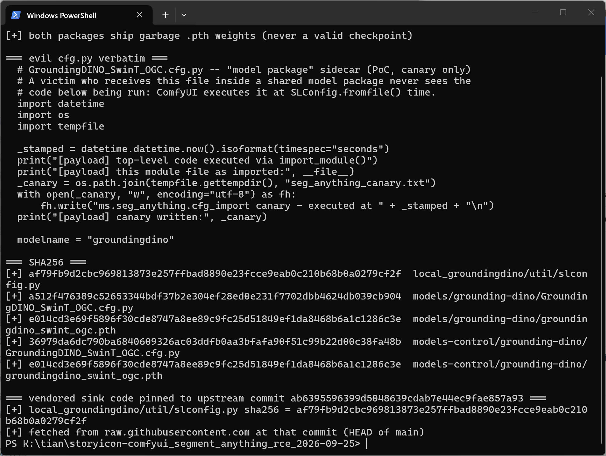
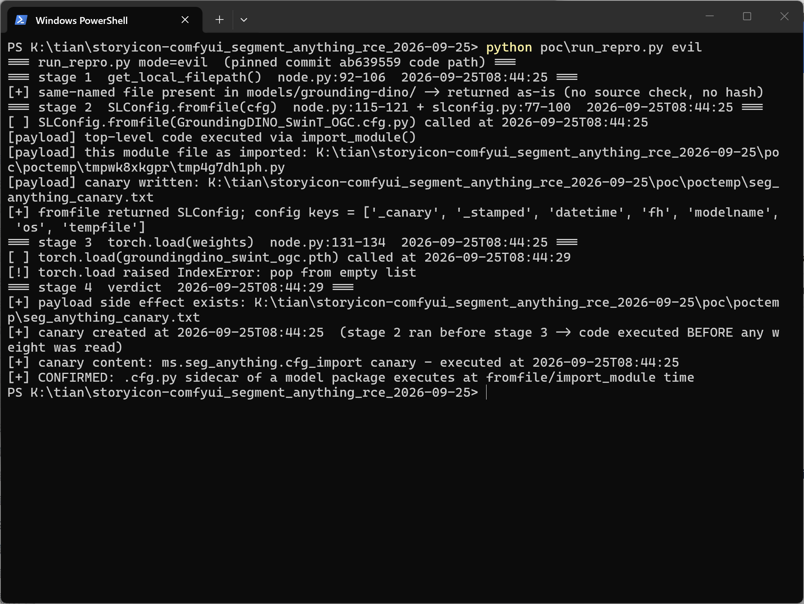
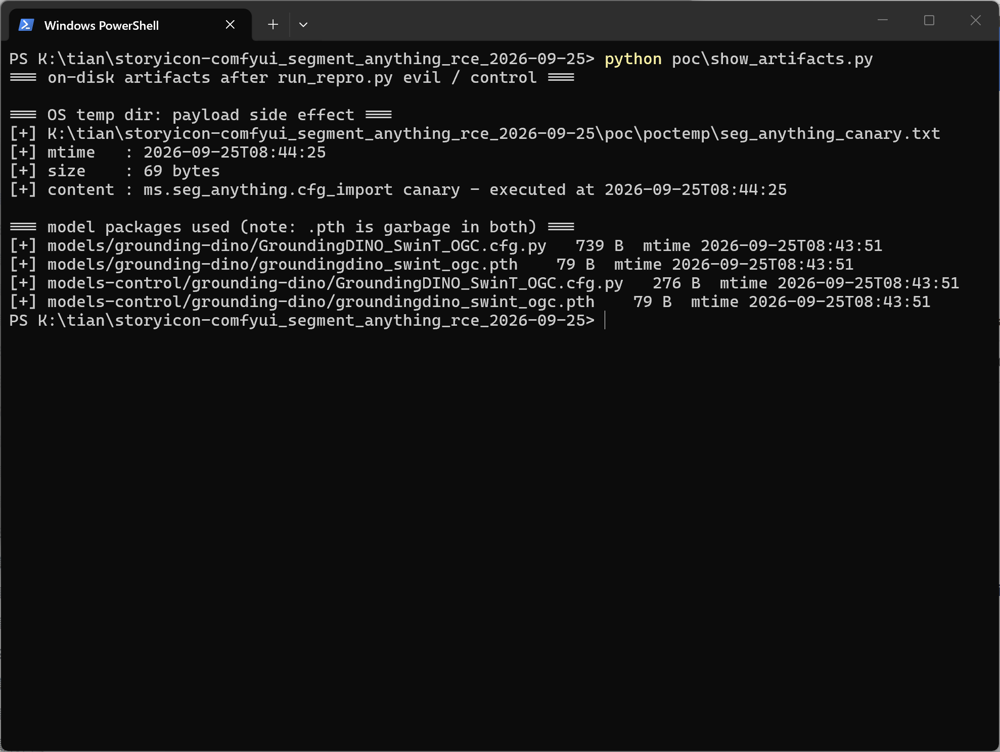
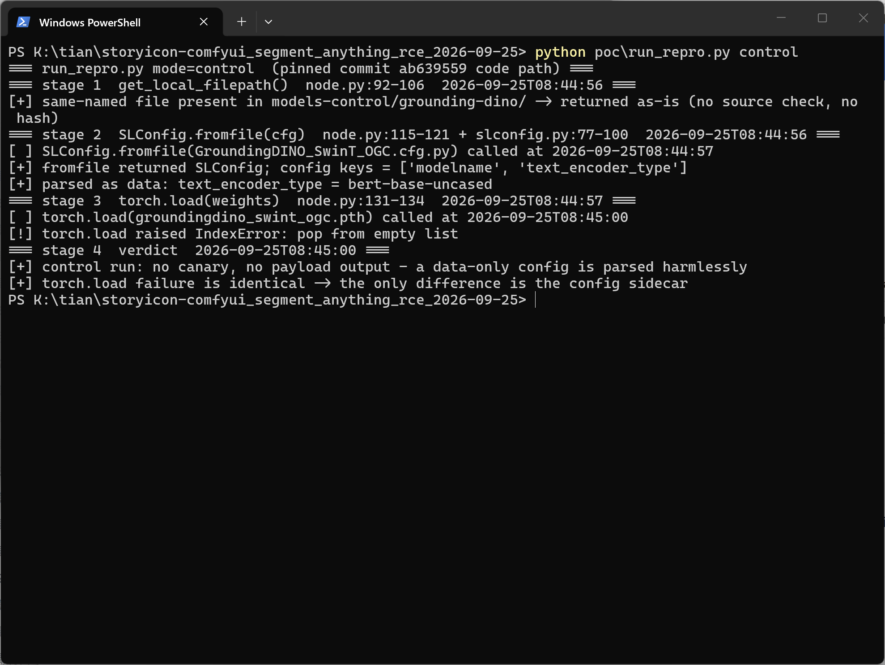

# comfyui_segment_anything commit ab63955 — Arbitrary Code Execution via GroundingDINO Model Config Sidecar (`SLConfig.fromfile` → `import_module`)

## Summary

storyicon comfyui_segment_anything (custom ComfyUI node, commit `ab6395596399d5048639cdab7e44ec9fae857a93`, the current HEAD of `main`) is affected by an arbitrary code execution flaw in the GroundingDINO model loading component. The plugin resolves the config sidecar (`*.cfg.py`) of a GroundingDINO model package inside the user-writable `models/grounding-dino/` directory and executes it as a Python module — with no origin or hash validation — before the model weights are ever read. An attacker who distributes a crafted "model package" (cfg sidecar + weights) through any model-sharing channel achieves code execution in the victim's ComfyUI process as soon as a workflow selecting the model is queued.

## Affected Product

| Field | Value |
|---|---|
| Vendor | storyicon |
| Product | comfyui_segment_anything |
| Affected versions | commit `ab6395596399d5048639cdab7e44ec9fae857a93` (HEAD of `main`, last commit 2024-03-21; no tagged releases, so all users of the repository are affected) |
| Component | `node.py` `get_local_filepath()` / `load_groundingdino_model()`; `local_groundingdino/util/slconfig.py` `SLConfig._file2dict()` |
| Platform | any OS running ComfyUI (Windows / Linux / macOS), Python 3.x |
| Vulnerability type | CWE-94: Code Injection (improper execution of attacker-controlled file as Python code; root cause includes CWE-345-style absence of authenticity verification of model-package files) |

## Root Cause

**Location:** `local_groundingdino/util/slconfig.py:77-100` (`SLConfig._file2dict`), reached from `node.py:92-121` (`get_local_filepath` / `load_groundingdino_model`)

The node resolves the config sidecar through `get_local_filepath()`, which returns any same-named file found in `models/grounding-dino/` as-is — the pinned upstream URL is only fetched when the file is absent, and no hash or origin check is performed on the local copy:

```python
# node.py:92-106 (abridged)
def get_local_filepath(url, dirname, local_file_name=None):
    ...
    destination = folder_paths.get_full_path(dirname, local_file_name)
    if destination:
        logger.warn(f'using extra model: {destination}')
        return destination          # user-supplied file wins, unchecked
```

`load_groundingdino_model()` then passes that path to `SLConfig.fromfile()`, whose `.py` branch copies the file into a temporary directory, puts that directory on `sys.path`, and imports it — executing every top-level statement of the config:

```python
# local_groundingdino/util/slconfig.py:80-91 (verbatim, .py branch of _file2dict)
with tempfile.TemporaryDirectory() as temp_config_dir:
    temp_config_file = tempfile.NamedTemporaryFile(dir=temp_config_dir, suffix=".py")
    temp_config_name = osp.basename(temp_config_file.name)
    if os.name == 'nt':
        temp_config_file.close()
    shutil.copyfile(filename, osp.join(temp_config_dir, temp_config_name))
    temp_module_name = osp.splitext(temp_config_name)[0]
    sys.path.insert(0, temp_config_dir)
    SLConfig._validate_py_syntax(filename)
    mod = import_module(temp_module_name)   # <-- attacker's top-level code runs here
```

Only afterwards does the node proceed to build the model and load the checkpoint (`torch.load`), so the config import is the first thing an attacker-controlled package can influence. `_validate_py_syntax()` performs a syntax check only and does not restrict what the module may do. Model packages are routinely shared as file bundles (model sites, mirrors, cloud drives), so both files in `models/grounding-dino/` must be treated as untrusted input; the weight file path is at least inert until `torch.load`, but the config file is executable on arrival.

## Proof of Concept

The reproduction drives the **vendored sink code verbatim** (`poc/local_groundingdino/util/slconfig.py`, SHA-256 `af79fb9d…79cf2f`, byte-identical to upstream at the pinned commit) through the same three stages the node performs at queue time. Full ComfyUI is not required to exercise the defect; the harness mirrors `node.py`'s stage order (local-file pickup → `fromfile` → `torch.load`).

### Prerequisites
- Python 3.x with `torch`, `addict`, `yapf` (the plugin's own dependency set for this path)
- A "model package" placed in a `models/grounding-dino/` directory — exactly what a victim receives from a model-sharing channel

### Steps to Reproduce

1. Build the two packages (evil / benign control). Each ships the same garbage `.pth` weights, so the weights can never be the executing component:

   

2. Run the evil package through the node's queue-time path. The payload's own `print`s — colored in the transcript — show its top-level code executing inside `SLConfig.fromfile()`, and `__file__` proves it runs from the temporary-directory copy created by `_file2dict` (`…\poctemp\tmpc6tgfh_m\tmpbl7m9v_m.py`):

   

3. The payload's canary file exists on disk with an mtime from stage 2, while the `torch.load()` call in stage 3 failed — the code executed **before and independently of any weight loading**:

   

4. Negative control: a data-only config with the same file name parses harmlessly into config values and produces no side effects, isolating the config sidecar as the sole trigger:

   

### Expected vs Actual
- Expected: files in the user-writable `models/grounding-dino/` directory, which users routinely receive from third parties, are treated as untrusted data (or verified against upstream hashes before use).
- Actual: any Python code shipped as the package's `.cfg.py` sidecar executes with the full privileges of the ComfyUI process, before the weights are read.

### Sanitized PoC input

The complete malicious sidecar used in the reproduction (canary only — no network, no persistence):

```python
# GroundingDINO_SwinT_OGC.cfg.py -- "model package" sidecar (PoC, canary only)
import datetime
import os
import tempfile

_stamped = datetime.datetime.now().isoformat(timespec="seconds")
print("[payload] top-level code executed via import_module()")
print("[payload] this module file as imported:", __file__)
_canary = os.path.join(tempfile.gettempdir(), "seg_anything_canary.txt")
with open(_canary, "w", encoding="utf-8") as fh:
    fh.write("ms.seg_anything.cfg_import canary - executed at " + _stamped + "\n")
print("[payload] canary written:", _canary)

modelname = "groundingdino"
```

## Impact
- Confidentiality: High — the payload runs arbitrary Python in-process with the user's privileges; file reads and credential material are reachable.
- Integrity: High — arbitrary code execution; files and configuration can be modified at will.
- Availability: High — arbitrary code execution includes process termination or resource exhaustion.
- Scope: code execution on the ComfyUI host. Attack vector is the model-package supply chain: the victim installs a shared package and queues any workflow selecting the model. User interaction (install + queue) is required; no other preconditions, authentication, or special configuration are needed.

## Attack Vector and Severity (CVSS v3.1)

| Metric | Value | Rationale |
|---|---|---|
| Attack Vector | N | the malicious package is delivered over a network (model-sharing channels) |
| Attack Complexity | L | no special conditions beyond the normal install-and-queue workflow |
| Privileges Required | N | no authentication on the target; the victim runs their own ComfyUI instance |
| User Interaction | R | victim must install the package and queue a workflow selecting the model |
| Scope | U | execution stays within the ComfyUI process/host security context |
| Confidentiality | H | arbitrary code execution in-process |
| Integrity | H | arbitrary code execution in-process |
| Availability | H | arbitrary code execution in-process |

```
Score: 8.8 (High)
Vector: CVSS:3.1/AV:N/AC:L/PR:N/UI:R/S:U/C:H/I:H/A:H
```

## Remediation

- Stop importing Python files from the models directory. Treat model configs as data: hardcode the two known GroundingDINO config dicts in the plugin, or ship the `.py` configs with the plugin itself, or switch to a non-executable format (YAML/JSON parsed with a safe loader).
- If Python configs must be retained, verify the file's SHA-256 against the upstream config before import and fail closed on mismatch; warn loudly on any locally supplied config file.
- Related hardening (separate issue): `node.py` loads the checkpoint with `torch.load()` without `weights_only=True`; switching would also reduce exposure to malicious weight files.

## References
- Source repository: https://github.com/storyicon/comfyui_segment_anything
- Sink at pinned commit: https://github.com/storyicon/comfyui_segment_anything/blob/ab6395596399d5048639cdab7e44ec9fae857a93/local_groundingdino/util/slconfig.py#L80-L91
- Callers at pinned commit: `node.py` `get_local_filepath()` / `load_groundingdino_model()`
- CWE-94: https://cwe.mitre.org/data/definitions/94.html
- Upstream report: [pending publication]
- Vendor advisory: [none]
