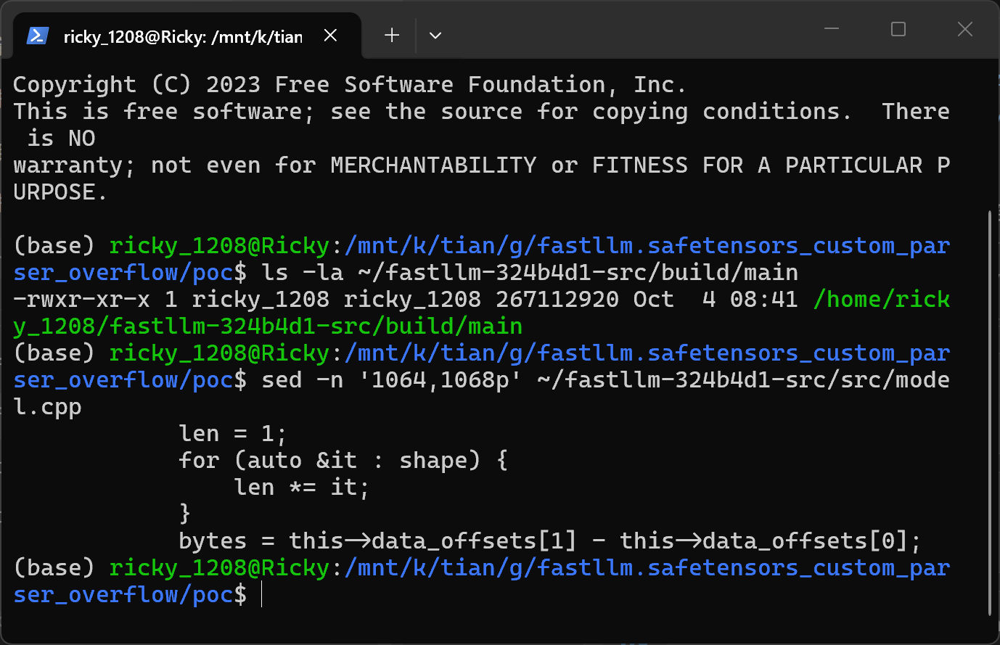
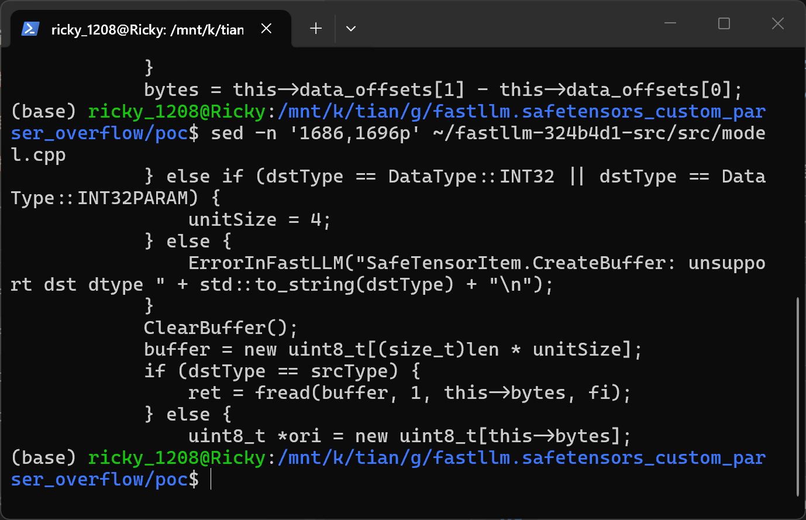
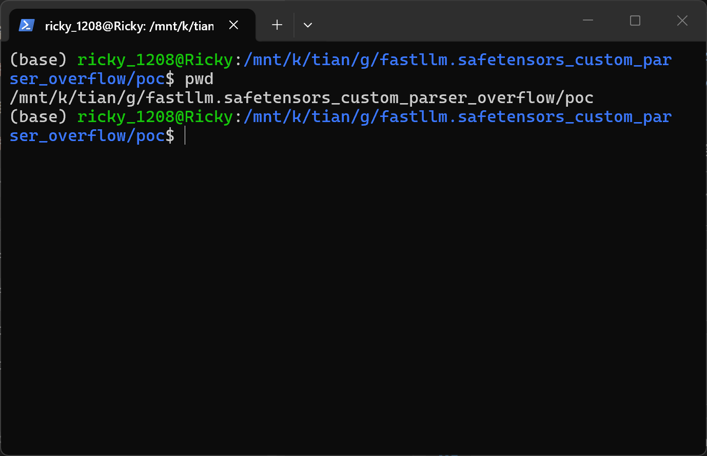
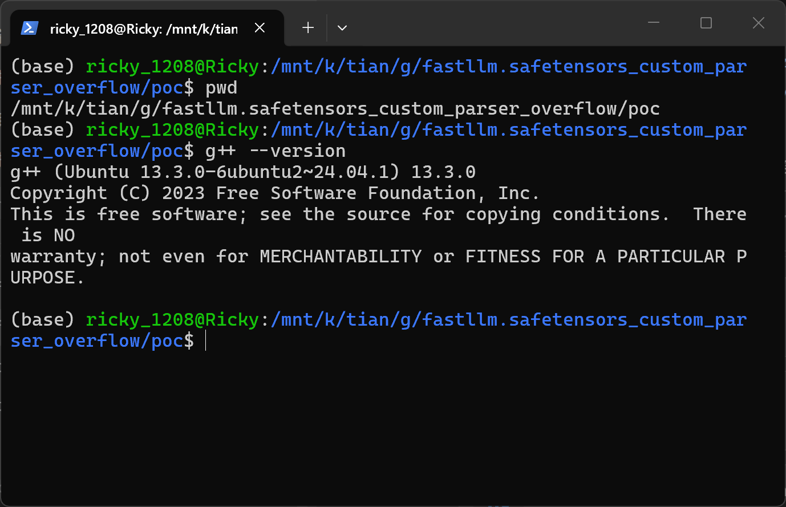
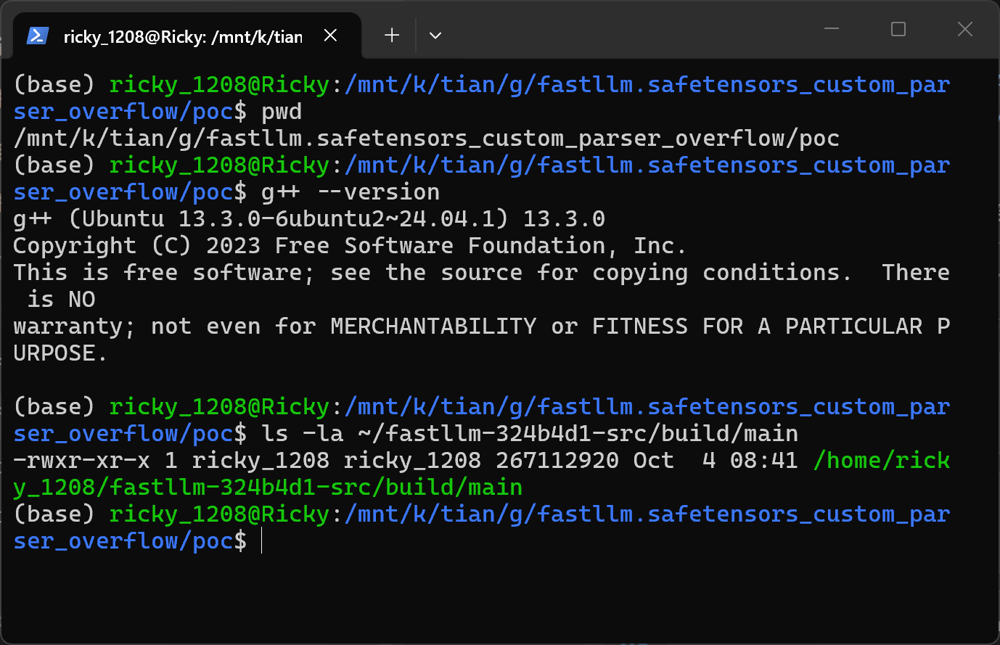
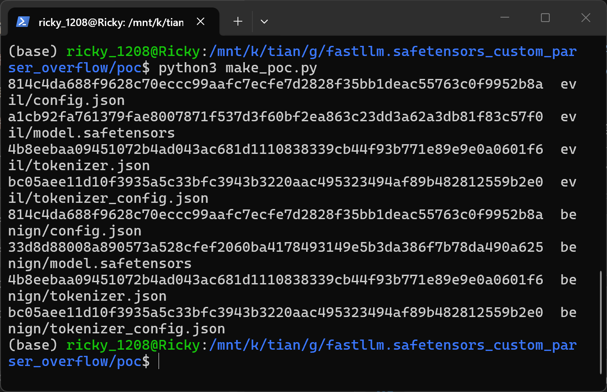
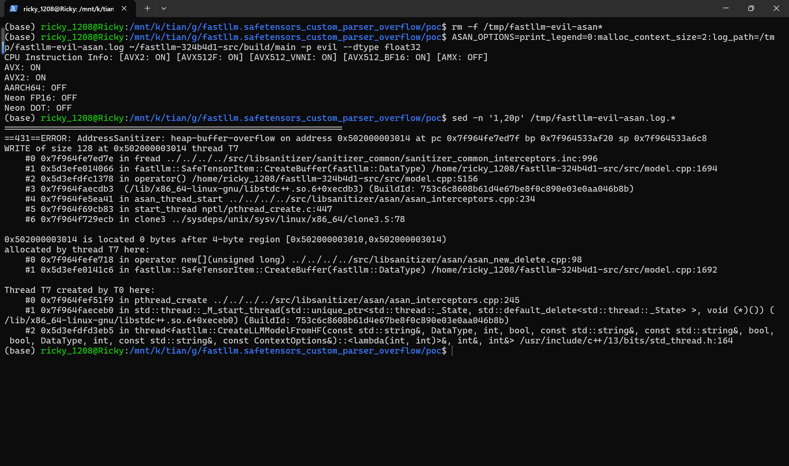
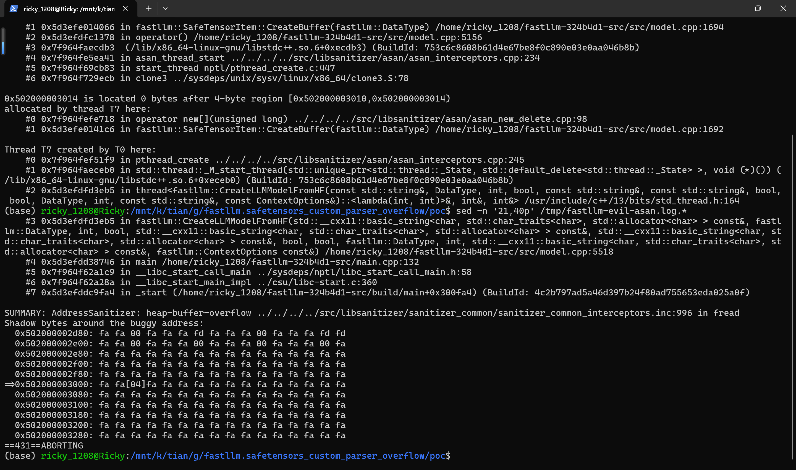
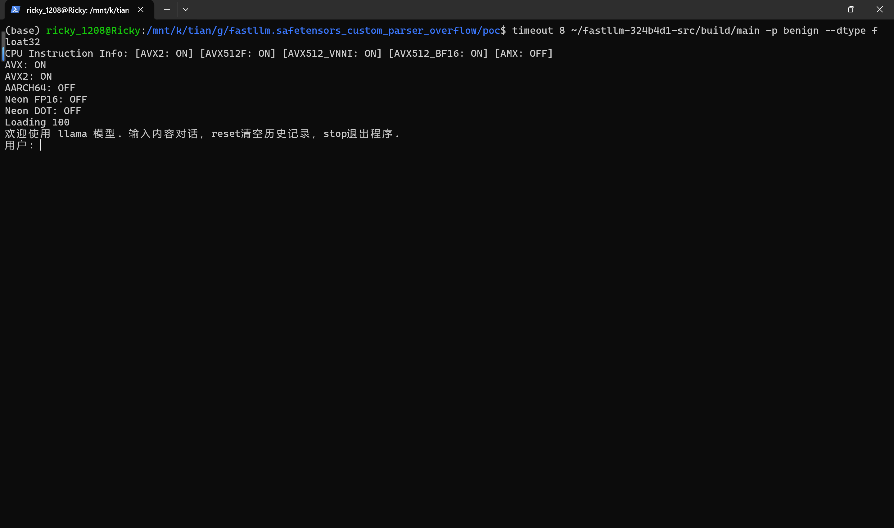

# fastllm commit 324b4d1 — Heap-based Buffer Overflow in safetensors Weight Loading via Shape/Offset Mismatch

## Summary

ztxz16/fastllm commit 324b4d1 (master branch) is affected by a heap-based buffer overflow in the safetensors weight-loading component. FastLLM implements its own safetensors parser: `SafeTensorItem` stores the tensor's logical `shape` and its `data_offsets` as two independent, unvalidated values, and `SafeTensorItem::CreateBuffer()` first allocates the destination buffer using the shape-derived element count and then fills it with a single `fread()` using the offsets-derived byte count. A model directory whose safetensors JSON header declares a small logical shape (for example `F32`, `shape [1]`, 4 bytes) together with a much larger byte range (`data_offsets [0, 128]`) makes the loader write 128 attacker-controlled bytes into a 4-byte heap allocation, 124 bytes beyond the end of the chunk. An attacker who can supply a model directory to any fastllm-based loader (CLI, HTTP server, Python binding) can corrupt the native heap; in an AddressSanitizer build this is reported as a `heap-buffer-overflow WRITE of size 128`, and in a production build it silently corrupts adjacent heap memory, leading to malformed weights at best and exploitable memory corruption at worst.

## Affected Product

| Field | Value |
|---|---|
| Vendor | ztxz16 (fastllm project) |
| Product | fastllm |
| Affected versions | git commit 324b4d1 (master branch as of 2026-10-04); no fixed release known at the time of writing |
| Component | `src/model.cpp`, `struct SafeTensorItem` (constructor and `CreateBuffer()`), reached through `CreateLLMModelFromHF()` |
| Platform | All platforms that load Hugging Face-style safetensors model directories; verified on Linux x86_64 (Ubuntu 24.04, g++ 13.3, CMake CPU-only build with AddressSanitizer) |
| Vulnerability type | CWE-122: Heap-based Buffer Overflow (out-of-bounds write) |

## Root Cause

**Location:** `src/model.cpp:1064-1068` (`SafeTensorItem::SafeTensorItem`), `src/model.cpp:1692-1694` (`SafeTensorItem::CreateBuffer`), reached from `CreateLLMModelFromHF()` at `src/model.cpp:5156` / `src/model.cpp:5518`.

The `SafeTensorItem` constructor parses the attacker-controlled JSON header of `model.safetensors` and stores two independent sizes: `len`, the product of the declared logical shape, and `bytes`, the span between the two declared `data_offsets`. Nothing cross-checks them:



```cpp
len = 1;
for (auto &it : shape) { len *= it; }
bytes = this->data_offsets[1] - this->data_offsets[0];   // src/model.cpp:1064-1068, no consistency check
```

`SafeTensorItem::CreateBuffer()` then allocates the destination buffer from the shape-derived size but reads the offsets-derived byte count into it:

```cpp
buffer = new uint8_t[(size_t)len * unitSize];            // src/model.cpp:1692 — allocation follows shape
if (dstType == srcType) {
    ret = fread(buffer, 1, this->bytes, fi);             // src/model.cpp:1694 — copy follows data_offsets
}
```

When `bytes` is larger than `len * unitSize`, `fread()` writes `this->bytes` bytes into a `len * unitSize`-byte heap chunk. Both quantities come straight from the JSON header, so a single tensor entry whose shape and offsets disagree crosses the parse boundary and becomes a native out-of-bounds write during model loading. The file is opened at `data_offsets[0]` first (`_fseeki64`/`fseek` at `src/model.cpp:1619-1624`), so the overflowing bytes are the file's own data bytes at that offset — fully attacker-chosen content.



The load path does contain a size-consistency comparison, but only after the read has already happened: `TryAdoptSafeTensorBuffer()` (`src/model.cpp:2148` region) rejects the buffer when `tensor.bytes != weight.GetBytes()`, which prevents the wrong-size buffer from being *adopted into the model*, but cannot undo the heap overflow that `fread()` has already performed.

Any tensor that takes the same-dtype `CreateBuffer()` path is affected — `lm_head.weight` and other linear weights when the requested dtype matches the source dtype (for example `--dtype float32` for an `F32` tensor), and ordinary non-linear `F32` tensors such as norms resolve to `FLOAT32` by default. The loader processes every tensor listed in the safetensors header, so the poisoned tensor needs nothing else in the file to be valid; the crash occurs during the parallel weight-reading phase of `CreateLLMModelFromHF()`.

## Proof of Concept

### Prerequisites

- fastllm built from commit `324b4d1` (CPU-only is sufficient), e.g. `cmake -S . -B build -DCMAKE_BUILD_TYPE=RelWithDebInfo && cmake --build build -j --target main`.
- The victim runs the fastllm CLI (or any API that ends in `CreateLLMModelFromHF`) on a model directory obtained from an untrusted source. User interaction is exactly "point fastllm at a downloaded model directory".
- Note for sanitizer builds: on Ubuntu, gcc defaults to `-D_FORTIFY_SOURCE` under `-O2`; with fortify enabled glibc aborts with `*** buffer overflow detected ***` instead of producing an AddressSanitizer report. Build with `-D_FORTIFY_SOURCE=0` in `CMAKE_CXX_FLAGS` to obtain the full ASan report below.

The screenshots below were collected in one real terminal session: the working directory is the PoC directory, the toolchain is g++ 13.3.0 on WSL2 Ubuntu 24.04, and the binary under test is the ASan-instrumented build of commit 324b4d1.







### Steps to Reproduce

1. Create a Hugging Face-style model directory `evil/` containing `config.json` (`"model_type": "llama"`), tokenizer files, and a hand-written `model.safetensors` whose entire header declares a single tensor `lm_head.weight` with `"dtype": "F32"`, `"shape": [1]`, `"data_offsets": [0, 128]`, followed by 128 data bytes. The declared shape needs 4 bytes; the declared byte range is 128 bytes.



2. The only difference from the benign control is the shape: `evil/` declares `"shape": [1]` (4 bytes needed) while `benign/` declares `"shape": [4, 8]` (32 x 4 = 128 bytes, exactly matching the same `data_offsets [0, 128]` and the same 128 data bytes).

![xxd of the evil header: shape [1] with data_offsets [0,128]](images/fastllm-safetensors-custom-parser-overflow-07-evil-header.png)

![xxd of the benign header: shape [4,8] with the same data_offsets [0,128]](images/fastllm-safetensors-custom-parser-overflow-08-benign-header.png)

3. Run the fastllm CLI on the malicious directory with a matching destination dtype: `~/fastllm-324b4d1-src/build/main -p evil --dtype float32`.

4. AddressSanitizer aborts the process during weight loading: a 128-byte `fread` write into a 4-byte `new uint8_t[4]` allocation, with the write site at `src/model.cpp:1694` and the allocation site at `src/model.cpp:1692`, reached through `SafeTensorItem::CreateBuffer()` from `CreateLLMModelFromHF()`.





5. Negative control: run the same binary on `benign/` (`timeout 8 ~/fastllm-324b4d1-src/build/main -p benign --dtype float32`). The identical directory loads cleanly past `lm_head.weight` and reaches the interactive prompt with no sanitizer report, proving that the declared shape/offset mismatch — not the file data, config, or tokenizer — is what corrupts the heap.



### Expected vs Actual

- Expected: fastllm rejects a tensor whose declared `data_offsets` span does not equal `shape_product * dtype_size` (the safetensors specification guarantees this equality), or at minimum never reads more bytes than the destination buffer holds.
- Actual: fastllm accepts the header, allocates 4 bytes from the shape, and freads 128 attacker-chosen bytes into it — a 124-byte heap out-of-bounds write.

### Sanitized PoC input

The complete generator is `poc/make_poc.py` (pure Python standard library, no safetensors/torch dependency); it writes both model directories and `poc/SHA256SUMS.txt`. The malicious safetensors file is 205 bytes:

```text
header_len (u64 LE) = 0x45 = 69
header JSON         = {"lm_head.weight":{"dtype":"F32","shape":[1],"data_offsets":[0,128]}}
data section        = 128 bytes of arbitrary content
sha256(model.safetensors) = a1cb92fa761379fae8007871f537d3f60bf2ea863c23dd3a62a3db81f83c57f0  (evil,   shape [1])
sha256(model.safetensors) = 33d8d88008a890573a528cfef2060ba4178493149e5b3da386f7b78da490a625  (benign, shape [4,8])
```

Reproduction environment for the screenshots: WSL2 Ubuntu 24.04, g++ 13.3.0, CMake 3.28.3, CPU-only fastllm build of commit 324b4d1 with `-fsanitize=address -fno-omit-frame-pointer -g -D_FORTIFY_SOURCE=0`, collected 2026-10-04.

## Impact

- Confidentiality: High — the out-of-bounds write corrupts adjacent heap memory with attacker-chosen bytes; a deterministic heap layout can be groomed to overwrite adjacent objects, and the corrupted weight bytes themselves can leak into later inference output.
- Integrity: High — 124 (or more) bytes of attacker-selected data are written outside the intended buffer during model load; in a non-sanitizer build the corruption is silent, so model weights and heap metadata can be tampered with.
- Availability: High — the process crashes under sanitizers and crashes or misbehaves in production builds; any fastllm-based service that loads untrusted model directories can be killed by a 205-byte file.
- Scope: native memory corruption in the loading process (heap out-of-bounds write); with heap grooming this class of bug is a potential code-execution primitive, though this report only demonstrates the corruption itself.

## Remediation

Validate the header at parse time: in `SafeTensorItem::SafeTensorItem` (or at the top of `CreateBuffer`), reject any tensor for which `data_offsets[1] - data_offsets[0] != shape_product * dtype_element_size`, and reject `data_offsets` that fall outside the file. This single check fixes the same-dtype path demonstrated here and the dtype-conversion path (`fread` into the `bytes`-sized scratch at `src/model.cpp:1697`) in one place. A conservative workaround until a patched release exists: only load safetensors model directories from trusted sources, or pre-validate every header with an independent parser before handing the directory to fastllm.

## References

- Source repository: https://github.com/ztxz16/fastllm (commit 324b4d1, master branch)
- Upstream report: [pending publication]
- CWE: https://cwe.mitre.org/data/definitions/122.html
- Vendor advisory: [none]
