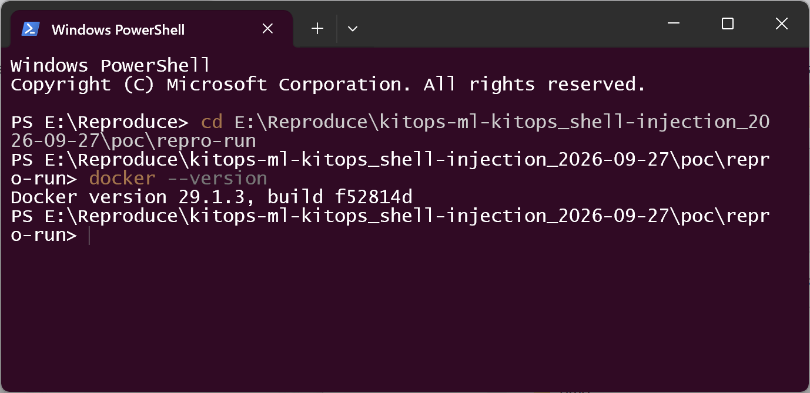
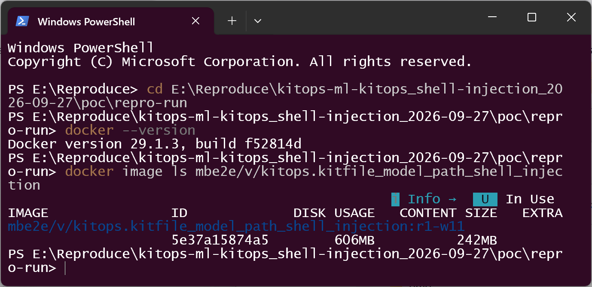
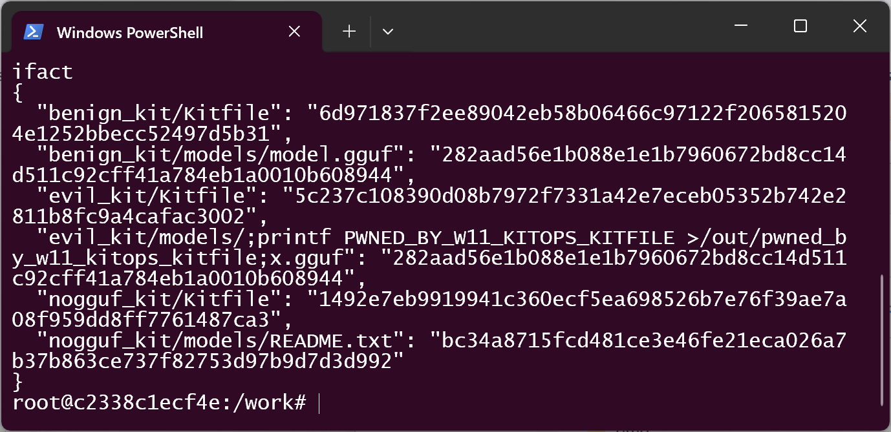
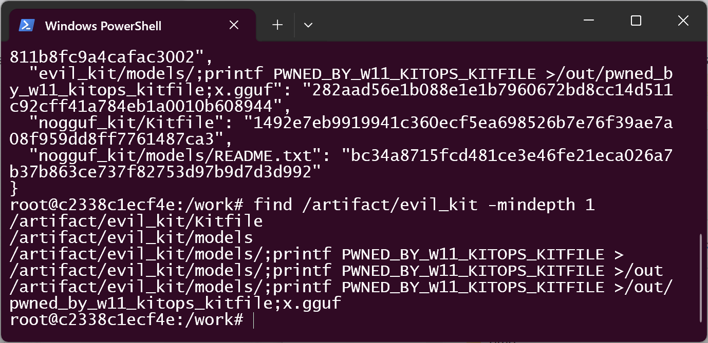
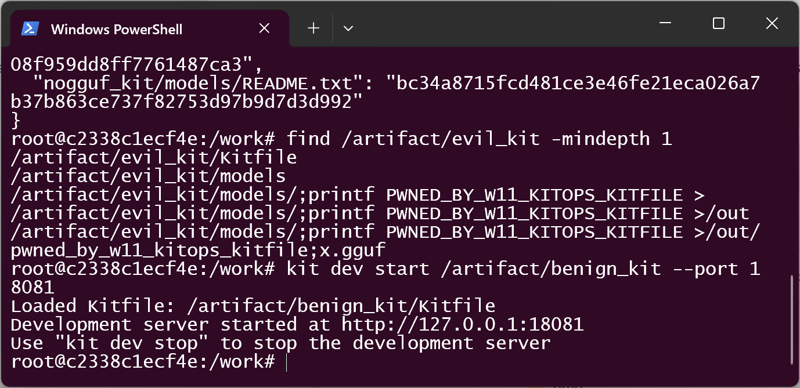
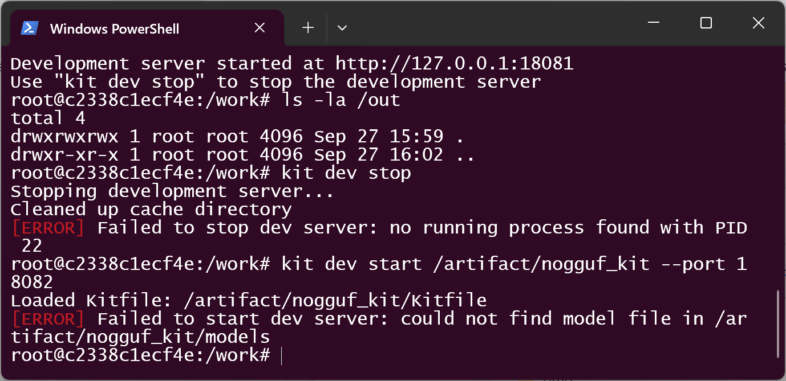
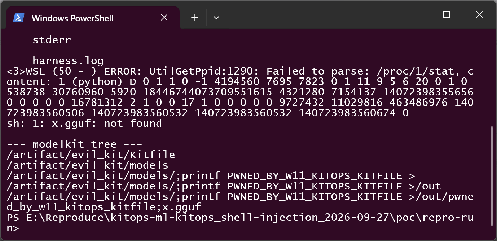

# KitOps v1.15.0 — OS Command Injection in the llamafile dev harness (`kit dev start`, POSIX)

## Summary

KitOps (`kitops-ml/kitops`) v1.15.0 (and source commit `b6762849`, tested) is affected by an OS
command injection in the llamafile development harness of `kit dev start`. On non-Windows platforms
the resolved model file path inside a ModelKit is interpolated **unquoted** into a command string
that is executed through a real shell — `exec.Command("sh", "-c", fmt.Sprintf("./llamafile --server
--model %s ...", modelPath, ...))` — so a ModelKit whose directory or file names contain shell
metacharacters passes kitops' containment check and is then re-tokenised by `/bin/sh` into attacker
chosen commands. A victim who runs the documented `kit dev start` on a shared ModelKit executes
attacker-controlled commands with their own privileges; in our run the product simultaneously
reported `Development server started` and exited 0.

## Affected Product

| Field | Value |
|---|---|
| Vendor | kitops-ml (KitOps — an open source CNCF DevOps tool for packaging AI/ML models as OCI artifacts) |
| Product | KitOps (`kitops-ml/kitops`) |
| Affected versions | commit `b6762849b23a599c834e5f14eda5cebcef40b640` (tested, built with Go 1.25.14); the vulnerable `sh -c` sink is still present in release `v1.15.0` (2026-06-25) and on `main` as of 2026-09-27 (code inspection). Full affected range not enumerated. |
| Component | `pkg/lib/harness/llm-harness.go:102`, harness `Start` (POSIX branch) |
| Platform | Linux and macOS (POSIX `sh`). The Windows branch (`llm-harness.go:90`) builds an argv directly and is **not** affected. |
| Vulnerability type | CWE-78: OS Command Injection |

## Root Cause

**Location:** `pkg/lib/harness/llm-harness.go:102` (POSIX branch of the harness `Start` function)

kitops resolves the model file of a ModelKit and hands it to the llamafile harness. The resolved
path is attacker-controlled *data that ships with the artifact*: it is the Kitfile's `model.path`
plus the names of the directories and the `*.gguf` file beneath it. kitops does validate this
value — but it validates **containment**, not shell safety:

- `pkg/cmd/dev/dev.go:77` — `filesystem.VerifySubpath(contextDir, kitfile.Model.Path)` keeps the
  model path inside the context directory. That is a question about the file system; it says
  nothing about shell metacharacters. A path whose every component is a legal POSIX filename
  containing no `/` passes on its own terms.
- `findModelFile` (dev-command package) then walks the model directory for the single `*.gguf`
  file and returns its path. The `.gguf` suffix filter constrains the last five characters only.
- `pkg/lib/harness/llm-harness.go:102` — **the sink.** The path is interpolated with `%s` into a
  command string and executed by a real shell:

```go
var cmd *exec.Cmd
if runtime.GOOS == "windows" {
    // argv array — NOT affected (this is the correct pattern)
    cmd = exec.Command(
        "./llamafile.exe",
        "--server",
        "--model", modelPath,
        "--host", harness.Host,
        "--port", fmt.Sprintf("%d", harness.Port),
        "--path", uiHome,
        "--gpu", "AUTO",
        "--nobrowser",
        "--unsecure",
    )
} else {
    // shell string — AFFECTED
    cmd = exec.Command("sh", "-c",
        fmt.Sprintf("./llamafile --server --model %s --host %s --port %d --path %s --gpu AUTO --nobrowser --unsecure",
            modelPath, harness.Host, harness.Port, uiHome),
    )
}
```

There is no quoting, no escaping and no argv boundary, so `/bin/sh` re-tokenises the attacker's
file names. Nothing re-examines the value at the moment its role changes from "file to open" to
"text in a command line".

## Proof of Concept

### Prerequisites

- Linux or macOS host with the `kit` CLI built from the affected source (tested at commit
  `b6762849b23a599c834e5f14eda5cebcef40b640`, Go 1.25.14).
- A ModelKit directory on disk — exactly the shape `kit pull` / `kit unpack` materialise. The
  entire payload is carried by **names**; no byte of it is executable content, and the model file
  is byte-identical to the benign control's model file (22-byte placeholder `GGUF\0not-a-real-model\n`).

### Steps to Reproduce

1. Build the three ModelKit directories with the attached deterministic script
   (`python example/build_artifact.py /artifact`): `evil_kit` (attack), `benign_kit` (control A:
   identical Kitfile shape, ordinary `models/model.gguf`), `nogguf_kit` (control B: no `.gguf`
   anywhere). Each Kitfile is ordinary (`model.path: models`).

The reproduction below was re-verified end-to-end on 2026-09-27/28 in a container built from the
pinned source (Debian 12 base, Go 1.25.14, vendored modules; the source-tree digest is
self-verified inside the container at run time and matches the original validation's
`eee5ffd35485392f2a5510071455a1975fac2751f4089d8b45ad77afc55c3197`). Screenshots are real
terminal captures of that run.








2. Show the attack kit's tree — the resolved model path will be
   `/artifact/evil_kit/models/;printf PWNED_BY_W11_KITOPS_KITFILE >/out/pwned_by_w11_kitops_kitfile;x.gguf`
   (one directory named `;printf PWNED_BY_W11_KITOPS_KITFILE >`, one named `out`, one file ending
   in `.gguf`). Every component is a legal POSIX filename containing no `/`.

3. Negative control A — run the product on the benign kit:
   `kit dev start /artifact/benign_kit --port 18081`. Expected: development server starts on the
   ordinary model, and **no** marker file appears.




4. Negative control B — `kit dev start /artifact/nogguf_kit --port 18082`. Expected: `findModelFile`
   fails before the harness is built: `[ERROR] Failed to start dev server: could not find model
   file in /artifact/nogguf_kit/models`, exit code 1, no marker.



5. Trigger — run the documented try-out command on the attack kit:
   `kit dev start /artifact/evil_kit --port 18083`


6. Observe: the product prints `Development server started at http://127.0.0.1:18083` and exits 0,
   while the injected command has already run and created `/out/pwned_by_w11_kitops_kitfile`
   containing `PWNED_BY_W11_KITOPS_KITFILE`. The single shell string `/bin/sh` parsed is visible
   from its effects on both ends: in our runs the harness log records `sh: 1: x.gguf: not found`
   (the tail of the attacker's file name executed as a third command), and the harness log of the
   original end-to-end validation run on the same machine (2026-09-20) additionally recorded
   llamafile starting with the truncated argument (`failed to open /artifact/evil_kit/models/:
   Is a directory`). In today's runs the llamafile binary downloaded by the product exited without
   producing log output; this does not affect the injection — the marker is written by the
   shell's **second** command, strictly downstream of the string kitops itself built.





### Expected vs Actual

- Expected: `kit dev start` starts llamafile on the resolved model file; nothing else executes.
- Actual: `/bin/sh` splits the model path into three commands; the second one is attacker-chosen
  and runs with the victim's privileges, while the product reports success (exit 0).

### Sanitized PoC input

```text
Kitfile (identical shape in all three kits):
  manifestVersion: "1.0.0"
  package:
    name: evil_kit
    version: 1.0.0
    description: community model kit
  model:
    name: demo-llm
    path: models
    framework: gguf

Attack kit tree (payload = directory and file names only):
  models/
    ';printf PWNED_BY_W11_KITOPS_KITFILE >'/   <- directory name, legal POSIX component
      out/                                      <- directory name
        'pwned_by_w11_kitops_kitfile;x.gguf'    <- file name ending in .gguf

Artifact digests (deterministic build; SHA256SUMS sha256
358e982801da47a3d02cce2fea1b2bcd4fe4854f7af7274317e6fe89db77813d):
  benign_kit/Kitfile                              6d971837f2ee89042eb58b06466c97122f2065815204e1252bbecc52497d5b31
  benign_kit/models/model.gguf                    282aad56e1b088e1e1b7960672bd8cc14d511c92cff41a784eb1a0010b608944
  evil_kit/Kitfile                                5c237c108390d08b7972f7331a42e7eceb05352b742e2811b8fc9a4cafac3002
  evil_kit/models/;printf PWNED_BY_W11_KITOPS_KITFILE >/out/...;x.gguf   282aad56e1b088e1e1b7960672bd8cc14d511c92cff41a784eb1a0010b608944
  nogguf_kit/Kitfile                              1492e7eb9919941c360ecf5ea698526b7e76f39ae7a08f959dd8ff7761487ca3

Note: the attack kit's model file is byte-identical (282aad56...) to the benign
one; the only variable that decides whether attacker code runs is the NAME of
the directory the file sits in.
```

## Impact

- Confidentiality: High — arbitrary command execution with the victim user's privileges; on a
  developer workstation or CI runner that user's credentials, registry tokens and source trees
  are in reach.
- Integrity: High — arbitrary command execution (demonstrated with an inert marker file write).
- Availability: High — arbitrary command execution can disrupt the host at will.
- Scope: code execution as the user running `kit dev start`; no privilege escalation demonstrated
  (canary written as container root into the mounted `/out` only; no host persistence, no
  outbound traffic).

## Attack Vector and Severity (CVSS v3.1)

| Metric | Value | Rationale |
|---|---|---|
| Attack Vector | L | The crafted ModelKit must be on local disk and the victim must run `kit dev start` against it. A maintainer who scores registry delivery (`kit pull`) as network-borne would use AV:N — that hinges on whether `kit pull`/`kit unpack` materialise such file names, which we did not test. |
| Attack Complexity | L | No special conditions; the payload is plain file names. |
| Privileges Required | N | No authentication; the victim needs no privileges. |
| User Interaction | R | The victim must run `kit dev start` on the attacker's kit. |
| Scope | U | Execution stays in the victim's own security context. |
| Confidentiality | H | Arbitrary command execution exposes the victim user's data. |
| Integrity | H | Arbitrary command execution modifies anything the user can modify. |
| Availability | H | Arbitrary command execution can render the host unusable. |

```
Score: 7.8 (High)
Vector: CVSS:3.1/AV:L/AC:L/PR:N/UI:R/S:U/C:H/I:H/A:H
```

## Remediation

1. **Remove the shell from `pkg/lib/harness/llm-harness.go:102`.** Build an argv instead of a
   string — the Windows branch of the same function (`llm-harness.go:90`) already does exactly
   this: `exec.Command(harnessPath, "--server", "--model", modelPath, "--host", host, "--port",
   strconv.Itoa(port), ...)`. Go's `exec.Command` passes arguments to `execve` directly, so no
   file name can become a command. This is the whole fix.
2. If the `sh -c` form is kept for a reason (redirection, backgrounding), move that reason into
   `exec.Cmd` itself (`cmd.Stdout`, `cmd.Start()`). Quoting every interpolated value (single-quote
   with `'` escaped) is a distant second best.
3. Defence in depth: reject a resolved model path whose components contain shell metacharacters
   or control characters (natural home: beside `VerifySubpath` in `pkg/cmd/dev/dev.go`), and
   consider refusing such names when ModelKits are materialised (`kit unpack` / `kit pull`).
4. Make the dev server's success message reflect the harness's actual state (readiness check) —
   in our run the product reported success while llamafile had failed on the truncated `--model`.

## Timeline

| Date | Event |
|---|---|
| 2026-09-20 | Vulnerability discovered; end-to-end validation run (`PASS`, grade E2_product_e2e, source-tree digest self-verified in container) |
| 2026-09-27 | Report prepared; real-terminal reproduction re-verified on this date |
| 2026-09-27 | [pending] Report sent to the maintainer via GitHub private security advisory |
| [pending] | Maintainer acknowledged |
| [pending] | Fix released |

## References

- Source repository: https://github.com/kitops-ml/kitops
- Upstream report: [pending publication] — submitted via https://github.com/kitops-ml/kitops/security/advisories (private)
- CWE: https://cwe.mitre.org/data/definitions/78.html
- Vendor advisory: [none]
- Vendor security policy: https://github.com/kitops-ml/kitops/blob/main/SECURITY.md

## Disclaimer

This report is provided for defensive and coordination purposes. It contains no
ready-to-run exploit beyond the minimum reproduction information, and no sensitive
infrastructure details. Do not disclose it publicly before the maintainer has had a
reasonable window to fix the issue.

## Screenshot Checklist

All screenshots are real terminal windows captured during the actual reproduction runs on the
reporting machine (Windows 11 host, Docker Desktop 29.1.3, Linux containers) on 2026-09-27/28.
No output was staged or edited; every line shown is the real output of the command typed above it.

| File | Content | Evidence point |
|---|---|---|
| `screenshots/01-env-docker.png` | `docker --version` → Docker version 29.1.3, build f52814d | reproduction environment |
| `screenshots/02-image-built.png` | `docker image ls` showing the built image `mbe2e/v/kitops.kitfile_model_path_shell_injection:r1-w11` | the product built from the pinned source |
| `screenshots/03-container-session.png` | interactive container session entered (`root@<id>:/work#`), `--network none`, `/out` bind-mounted | POSIX execution context of the victim action |
| `screenshots/04-kit-version.png` | `kit version` inside the container: Go version go1.25.14 (plain `go build` at the pin, so Version/Commit show unknown — identity is established by the source-tree digest self-check) | toolchain matches the original validation |
| `screenshots/05-build-artifacts.png` | `python /work/example/build_artifact.py /artifact` printing the deterministic SHA256 manifest (evil kit's model file = benign kit's model file = 282aad56...) | sample construction, digests match the report tables |
| `screenshots/06-evil-kit-names.png` | `find /artifact/evil_kit -mindepth 1` — the payload exists only in directory/file names | attacker-controlled input |
| `screenshots/07-benign-control.png` | `kit dev start /artifact/benign_kit --port 18081` → "Development server started" | negative control A, product behaves normally |
| `screenshots/08-benign-no-canary.png` | `ls -la /out` → empty (only . and ..) | negative control A: no marker |
| `screenshots/09-nogguf-control.png` | `kit dev start /artifact/nogguf_kit --port 18082` → `[ERROR] ... could not find model file` | negative control B: fails before the harness is built |
| `screenshots/11-canary-fired.png` | `kit dev start /artifact/evil_kit --port 18083` → "Development server started", then `cat /out/pwned_by_w11_kitops_kitfile` → `PWNED_BY_W11_KITOPS_KITFILE` | trigger + effect: injected command executed, product reports success |
| `screenshots/12-harness-log.png` | live `cat` of the harness log of the interactive attack run: `sh: 1: x.gguf: not found` | the shell parsed the attacker's file name as a third command |
| `screenshots/13-batch-harness-log.png` | `type` of the harness.log excerpt recorded by the batch-protocol run (`exp/drive.py`) on the same image | same signature in the scripted protocol |
| `screenshots/14-original-harness-log.png` | `type` of the harness.log recorded by the original end-to-end validation run on the same machine (2026-09-20): llamafile started with the truncated `--model` (`failed to open /artifact/evil_kit/models/: Is a directory`) + `sh: 1: x.gguf: not found` | all three shell commands visible end-to-end |

(`10-attack-start.png` from the first interactive capture session is also retained in
`screenshots/`; it shows the attack-kit `kit dev start` reporting success and is superseded by
the cleaner re-capture in `11-canary-fired.png`.)
