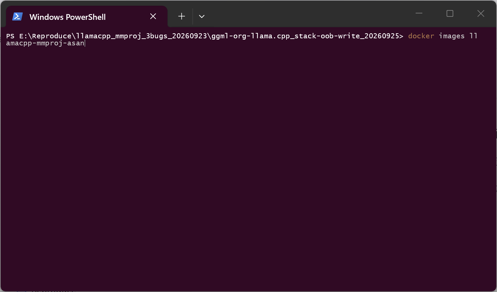
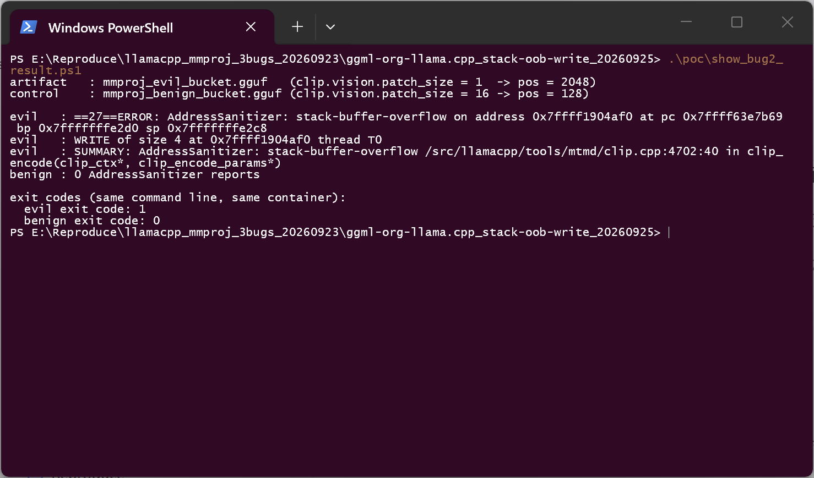
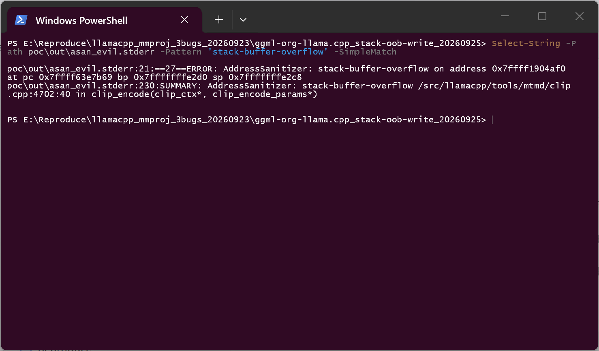
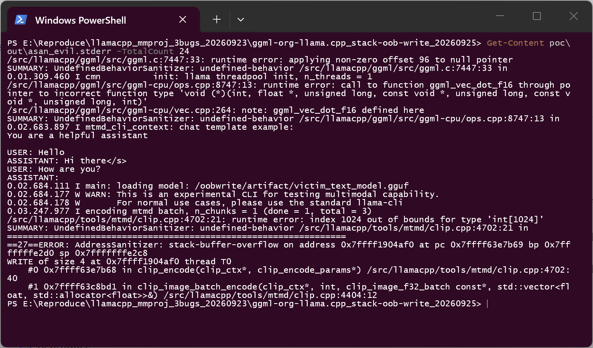
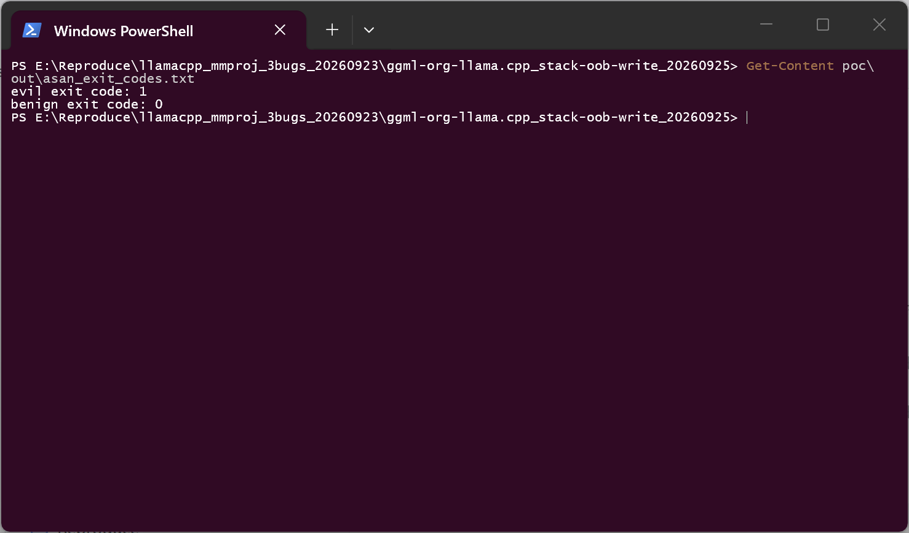

# llama.cpp (llama-mtmd-cli) — Stack-based Buffer Overflow in `clip_encode()` via an unvalidated `image_size`/`patch_size` combination

## Summary

ggml-org llama.cpp at commit `3d82ef62d47fd74e18f36c5eccbdcf965b617b17` is affected by a
stack-based buffer overflow in the multimodal projector loader. The SigLIP position-bucket code
in `clip_encode()` fills two fixed-size stack arrays (`int bucket_coords_h[1024]`,
`int bucket_coords_w[1024]`) with a loop bounded by `pos_h`/`pos_w = image_size / patch_size`.
Both fields come from the mmproj GGUF and are validated only against loose individual limits
(`patch_size` positive and below 65536, `image_size` at most 8192) — never against the 1024
entries the arrays actually hold. A projector that declares `image_size = 2048` with
`patch_size = 1` therefore writes 4096 bytes past each array on every image encode.

The attacker's entire capability is one downloaded mmproj file; the victim only runs the
project's own CLI with it. The overflow is a genuine stack memory corruption, not a crash in a
debug-only path: the release build compiles the same loop with the same fixed arrays.

## Affected Product

| Field | Value |
|---|---|
| Vendor | ggml-org (llama.cpp project) |
| Product | llama.cpp — `llama-mtmd-cli` (mtmd / clip vision encoder) |
| Affected versions | verified at commit `3d82ef62d47fd74e18f36c5eccbdcf965b617b17`; the two affected switch arms are `PROJECTOR_TYPE_MINICPMV` and `PROJECTOR_TYPE_MINICPMV4_6` in `tools/mtmd/clip.cpp`. Fixed version: [unknown] |
| Component | `tools/mtmd/clip.cpp` — `clip_encode()`, SigLIP position-bucket construction |
| Platform | Linux x86-64; clang 16.0.6; RelWithDebInfo (`-O2 -g -DNDEBUG`); AddressSanitizer + UBSan, built with the project's own CMake switches (`LLAMA_SANITIZE_ADDRESS` / `LLAMA_SANITIZE_UNDEFINED`) |
| Vulnerability type | CWE-121: Stack-based Buffer Overflow |

## Root Cause

**Location:** `tools/mtmd/clip.cpp:4655-4662` (`PROJECTOR_TYPE_MINICPMV`) and
`tools/mtmd/clip.cpp:4699-4706` (`PROJECTOR_TYPE_MINICPMV4_6`), both inside `clip_encode()`

```cpp
// tools/mtmd/clip.cpp — clip_encode(), minicpmv4_6 arm
std::vector<int32_t> positions(pos_h * pos_w);
int bucket_coords_h[1024];                 // fixed-size stack array
int bucket_coords_w[1024];
for (int i = 0; i < pos_h; i++){
    bucket_coords_h[i] = std::floor(70.0*i/pos_h);   // loop bound is attacker-controlled
}
for (int i = 0; i < pos_w; i++){
    bucket_coords_w[i] = std::floor(70.0*i/pos_w);
}
```

`pos_h` and `pos_w` are computed earlier from the image actually being encoded and the
projector's declared patch size:

```cpp
// tools/mtmd/clip.cpp — clip_encode()
const int patch_size    = hparams.patch_size;
const int pos_w = image_size_width  / patch_size;
const int pos_h = image_size_height / patch_size;
```

The load-time validation never relates those values to 1024:

```cpp
// tools/mtmd/clip.cpp — hparams validation
if (hparams.image_size > 8192) {
    throw std::runtime_error(... "image_size (%d) is too large (max 8192)");
}
if (hparams.patch_size <= 0 || hparams.patch_size >= 65536) {
    throw std::runtime_error(... "patch_size (%d) must be positive and less than 65536");
}
```

The minicpmv preprocessor upscales the input image to the declared `image_size`, so a projector
declaring `image_size = 2048` and `patch_size = 1` drives `pos_h = pos_w = 2048`: indices
`1024..2047` are written into 1024-entry stack arrays, i.e. 4096 out-of-bounds `int32` writes per
array with values `floor(70*i/pos_h)` in `[0, 69]`. Because the two arrays are adjacent, the
overflow can also reach whatever the compiler placed next to them in the frame.

## Proof of Concept

### Prerequisites

- The product itself: `llama-mtmd-cli` built from commit `3d82ef62…` with the project's own
  sanitizer switches (no source modification).
- A projector GGUF that declares the minicpmv4_6 projector with `image_size = 2048`.
- The victim's own text model (llama-architecture GGUF with a real llava-1.5 tokenizer so that
  `<image>` exists in the vocabulary) and any small PNG.
- Everything runs inside a disposable container.

### Steps to Reproduce

1. Build the affected binary at the pinned commit with `-DLLAMA_SANITIZE_ADDRESS=ON`
   `-DLLAMA_SANITIZE_UNDEFINED=ON`; the image used here is `llamacpp-mmproj-asan:3d82ef62`.

   

2. Build two projectors with the official `gguf` writer, differing in exactly one key:

   ```text
   mmproj_evil_bucket.gguf     clip.projector_type = "minicpmv4_6"
                               clip.vision.image_size = 2048
                               clip.vision.patch_size = 1     -> pos_h = pos_w = 2048
   mmproj_benign_bucket.gguf   identical, patch_size = 16     -> pos_h = pos_w = 128
   ```

3. Run the real CLI against the positive artifact:

   ```text
   llama-mtmd-cli -m victim_text_model.gguf --mmproj mmproj_evil_bucket.gguf \
                  --image photo.png -p "describe this image" -n 8 -t 1 --chat-template vicuna
   ```

4. AddressSanitizer reports a stack-buffer-overflow write inside `clip_encode()`, and the benign
   projector runs to completion with no reporting at all:

   

   

5. The report also carries a UBSan line that names the array and its bound
   (`index 1024 out of bounds for type 'int[1024]'`) and the first frames of the call chain —
   `clip_encode()` called from `clip_image_batch_encode()`, i.e. the sink is reached through the
   product's own batch encoder rather than a test harness:

   

6. Exit codes of both runs, produced by the same container command:

   

### Expected vs Actual

- Expected: `image_size` and `patch_size` are checked against the fixed 1024-entry bucket arrays
  (or the arrays are sized from `pos_h * pos_w`), so an out-of-range combination is rejected at
  load time or handled safely.
- Actual: the combination is accepted and `clip_encode()` writes 4096 bytes past each array.

### Sanitized PoC input

```text
clip.projector_type           = "minicpmv4_6"
clip.vision.image_size        = 2048
clip.vision.patch_size        = 1        (benign control: 16)
clip.vision.block_count       = 0
clip.vision.embedding_length  = 8
clip.vision.projector.scale_factor = 2
clip.vision.image_mean/std    = [0.5, 0.5, 0.5]
victim image                  = photo.png (32x32, upscaled to image_size by the preprocessor)
```

Artifact fingerprints of the run recorded here (artifacts are rebuilt deterministically inside
the lab by the repository's own builder, `exp/oobwrite/build_artifacts.py`, which is RNG-free):

```text
mmproj_evil_bucket.gguf    sha256 bacf5c88264b6ec78353d98bf463894c49effb8ebb0846f755f1a20bc97f1596
mmproj_benign_bucket.gguf  sha256 d3713d7abe14c726051cd213ca991691a1c66b9728924eec3d6ae330b74b0519
victim_text_model.gguf     sha256 d62b9ab3c1ca9b38922a032e1cde4ab670ea528fcea2ed3398362049daf94708
```

## Impact

- Confidentiality: **None** — the primitive is a write of attacker-chosen (bounded) values; no
  read of the overwritten data is exposed by this path in the run recorded here.
- Integrity: **High** — the write lands on the frames of `clip_encode()` and its callers. Values
  are constrained to `floor(70*i/pos)` ∈ `[0, 69]`, which makes a full overwrite of a saved
  return address impractical without further work, but saved registers, locals and adjacent
  frame data inside that range are attacker-influenced.
- Availability: **High** — the sanitizer aborts the process, and the same write is compiled into
  the release build; a crash of the product on any image encode is the expected outcome.
- Scope: memory corruption (stack out-of-bounds write) in the product process, reachable from a
  model file alone.

## Attack Vector and Severity (CVSS v3.1)

| Metric | Value | Rationale |
|---|---|---|
| Attack Vector | Network (N) | The projector is delivered like any other model artifact and loaded locally by the victim |
| Attack Complexity | High (H) | The write values are bounded to `[0, 69]` and the frame layout depends on the build, so turning the corruption into control-flow hijack requires per-build work; the corruption itself is deterministic |
| Privileges Required | None (N) | No account or privilege on the victim machine is needed |
| User Interaction | Required (R) | The victim must load the downloaded projector, which is the product's normal use |
| Scope | Unchanged (U) | Same process |
| Confidentiality | None (N) | No disclosure demonstrated |
| Integrity | High (H) | Stack data inside the frame is overwritten with attacker-influenced values |
| Availability | High (H) | Process abort on a normal image encode |

```
Score: 6.8 (Medium)
Vector: CVSS:3.1/AV:N/AC:H/PR:N/UI:R/S:U/C:N/I:H/A:H
```

> Scoring assumption, stated explicitly: the metrics reflect what was demonstrated in this run
> (stack corruption with bounded values and a deterministic abort). A project that accepts the
> control-flow argument would score the same vector with `AC:L` at 8.1 (High); that step was not
> demonstrated here and is therefore not claimed.

## Remediation

- Bound the loop against the arrays that back it, e.g. size them from
  `std::vector<int32_t> bucket_coords_h(pos_h), bucket_coords_w(pos_w)`, or reject
  `image_size / patch_size > 1024` during hparams validation next to the existing
  `image_size`/`patch_size` checks in `tools/mtmd/clip.cpp`.
- Both affected switch arms need the fix: `PROJECTOR_TYPE_MINICPMV` (clip.cpp:4655) and
  `PROJECTOR_TYPE_MINICPMV4_6` (clip.cpp:4699).
- Workaround for users until a fix is available: treat projector files as untrusted input and run
  them in a sandbox, as the project's security policy already recommends for models.

## Timeline

| Date | Event |
|---|---|
| 2026-09-23 | Finding and first reproduction in an isolated lab (original repro package, commit `3d82ef62…`) |
| 2026-09-25 | Independently re-reproduced on a separate host: fresh image from the pinned commit, positive and negative runs, sanitizer evidence captured (this report) |
| [pending] | Report sent to the maintainers |
| [pending] | Maintainer acknowledgement |
| [pending] | Fix released |

## References

- Source repository: https://github.com/ggml-org/llama.cpp
- Upstream report: [pending publication] — upstream asks for private advisories, and its private
  disclosure programme is currently disabled, so the coordinated channel is not yet fixed
- CWE: https://cwe.mitre.org/data/definitions/121.html
- Vendor advisory: [none]

## Disclaimer

This report is provided for defensive and coordination purposes. It contains no ready-to-run
exploit beyond the minimum reproduction information, and no sensitive infrastructure details.
Do not disclose it publicly before the maintainer has had a reasonable window to fix the issue.

## Screenshot Checklist

All screenshots were captured on a real terminal window on the reproduction host (Windows 11
desktop session, Docker Desktop with the WSL2 backend) on 2026-09-25; the commands were executed
one at a time and the outputs are the unedited console output of those commands.

| File | What it shows |
|---|---|
| `screenshots/01-lab-image.png` | The lab image built from the pinned commit (`docker images`) |
| `screenshots/02-stack-oob-write-verdict.png` | Driver output: positive artifact aborts inside `clip_encode()`, benign artifact runs clean |
| `screenshots/03-asan-summary.png` | `AddressSanitizer: stack-buffer-overflow`, `WRITE of size 4`, `clip.cpp:4702:40 in clip_encode()` |
| `screenshots/04-asan-call-chain.png` | UBSan naming the array bound (`index 1024 out of bounds for type 'int[1024]'`), then the ASan frames `clip_encode()` ← `clip_image_batch_encode()` |
| `screenshots/05-evil-vs-benign-exit-codes.png` | Exit codes: evil artifact aborts, benign control exits 0 |
