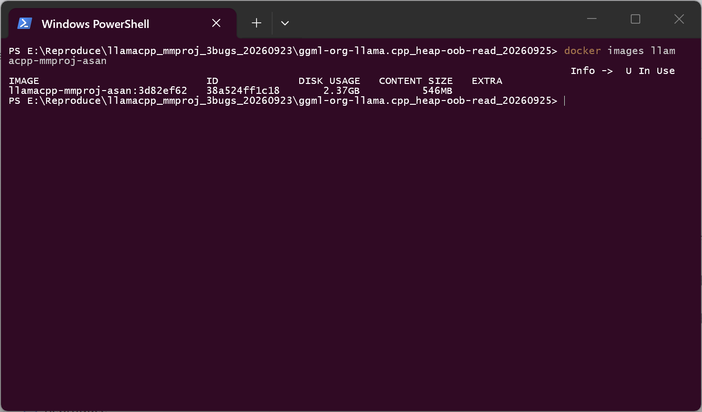
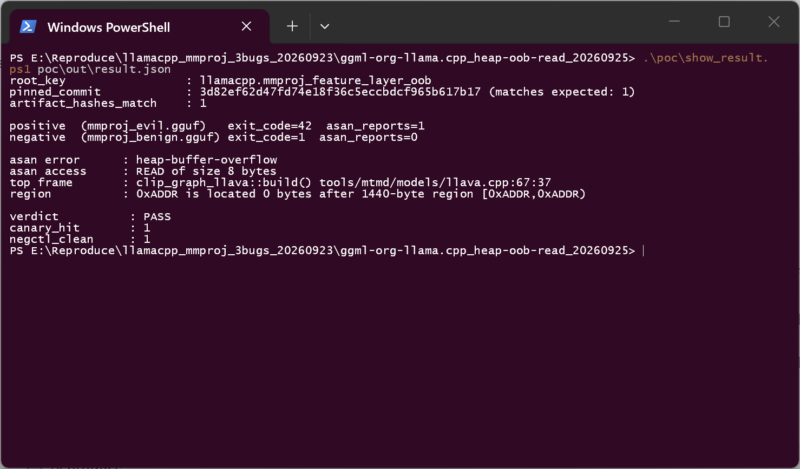
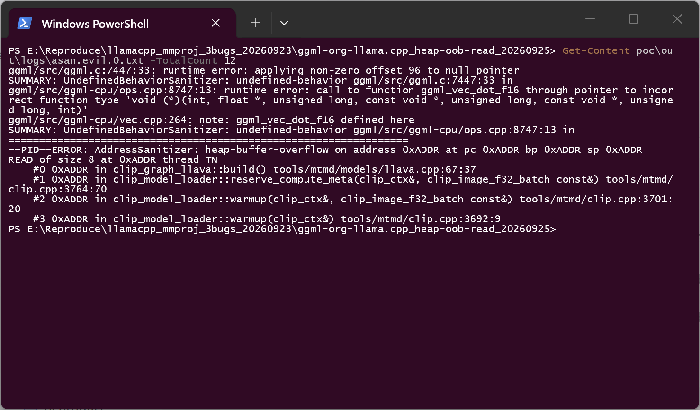
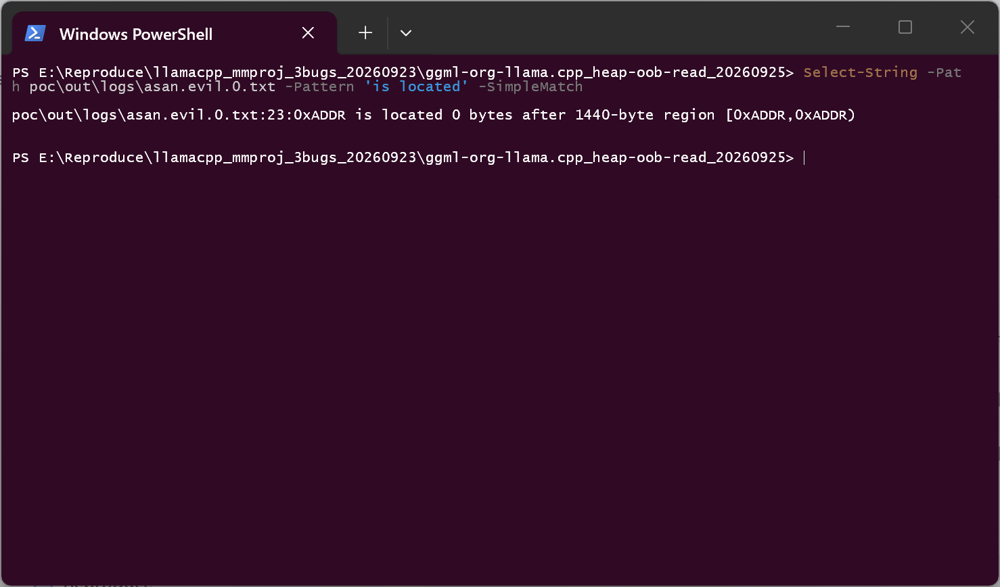
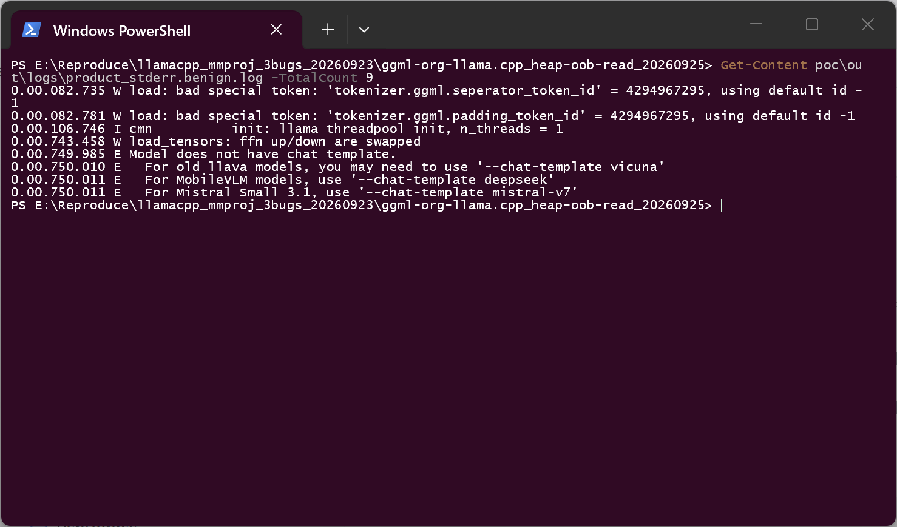

# llama.cpp (llama-mtmd-cli) — Out-of-bounds Read in the CLIP vision graph builder via an unvalidated `clip.vision.feature_layer`

## Summary

ggml-org llama.cpp at commit `3d82ef62d47fd74e18f36c5eccbdcf965b617b17` is affected by a heap
out-of-bounds read in the multimodal projector (mmproj) loader. A crafted mmproj GGUF that
declares `clip.vision.feature_layer` outside `[0, clip.vision.block_count)` makes
`clip_graph_llava::build()` index past the end of the `model.layers` vector; the out-of-bounds
words are then dereferenced as layer tensor pointers while the vision graph is built.

The attacker's entire capability is **one file**: a multimodal projector GGUF of the kind users
routinely download next to a vision model and pass to `llama-mtmd-cli --mmproj`. No code
execution, no special options and no modified source are involved: the product's own load-time
validation (`get_arr_int()` type/arity checks, projector whitelist, patch-size and image-size
range checks) is compiled in and running.

## Affected Product

| Field | Value |
|---|---|
| Vendor | ggml-org (llama.cpp project) |
| Product | llama.cpp — `llama-mtmd-cli` (mtmd / clip vision loader) |
| Affected versions | verified at commit `3d82ef62d47fd74e18f36c5eccbdcf965b617b17`; the vulnerable code path is present in `tools/mtmd/clip.cpp` (`get_arr_int`) and `tools/mtmd/models/llava.cpp` (`clip_graph_llava::build`). Fixed version: [unknown] |
| Component | `tools/mtmd/clip.cpp` (`clip_model_loader::get_arr_int`, `load_tensors`), `tools/mtmd/models/llava.cpp` (`clip_graph_llava::build`) |
| Platform | Linux x86-64; clang 16.0.6; RelWithDebInfo (`-O2 -g -DNDEBUG`); AddressSanitizer + UBSan, built with the project's own CMake switches (`LLAMA_SANITIZE_ADDRESS` / `LLAMA_SANITIZE_UNDEFINED`) |
| Vulnerability type | CWE-125: Out-of-bounds Read |

## Root Cause

**Location:** `tools/mtmd/clip.cpp` — `clip_model_loader::get_arr_int()` (called at
`clip.cpp:1413` for `KEY_FEATURE_LAYERS`), and `tools/mtmd/models/llava.cpp:56` —
`clip_graph_llava::build()`

The loader validates the **type** and **arity** of the `clip.vision.feature_layer` array, but
never the **range** of the values it contains:

```cpp
// tools/mtmd/clip.cpp — get_arr_int()
if (gguf_get_kv_type(ctx_gguf.get(), i) != GGUF_TYPE_ARRAY) {
    throw std::runtime_error(...);                     // array-ness: checked
}
const auto type = gguf_get_arr_type(ctx_gguf.get(), i);
if (type != GGUF_TYPE_INT32) {
    throw std::runtime_error(...);                     // element type: checked
}
const size_t n = gguf_get_arr_n(ctx_gguf.get(), i);
...
output.resize(n);
for (size_t j = 0; j < n; ++j) {
    output[j] = values[j];                             // values copied verbatim: never bounded
}
```

The largest declared value then becomes the layer-loop bound, while `model.layers` is sized by
`clip.vision.block_count`:

```cpp
// tools/mtmd/models/llava.cpp — clip_graph_llava::build()
for (const auto & feature_layer : hparams.feature_layers) {
    if (feature_layer > deepest_feature_layer) {
        deepest_feature_layer = feature_layer;         // attacker-controlled maximum
    }
}
max_feature_layer = deepest_feature_layer < 0 ? il_last : deepest_feature_layer;
...
for (int il = 0; il < max_feature_layer; il++) {
    auto & layer = model.layers[il];                   // model.layers.size() == block_count
```

With `clip.vision.block_count = 2` and `clip.vision.feature_layer = [4096]`, the loop indexes
`model.layers[2..4095]`. The first field read from the out-of-bounds element
(`layer.ln_1_w`, `llava.cpp:67`) produces the sanitizer report below; the neighbouring heap
bytes are consequently used as tensor pointers for the graph.

## Proof of Concept

### Prerequisites

- The product itself: `llama-mtmd-cli` built from commit `3d82ef62d47fd74e18f36c5eccbdcf965b617b17`
  (no source modification; sanitizer switches are the project's own CMake options).
- The victim's own, legitimate text model (byte-identical in the positive and the negative run).
- The attacker file: `mmproj_evil.gguf`, 435,712 bytes,
  SHA-256 `5a721391e76dd089e4b6de682560a4fac80b28b9cfcd120511a699b4ee986617`, written with the
  official `gguf.GGUFWriter` from the project's own `gguf-py` package.
- Everything runs inside a disposable container; the sample never touches the host.

### Steps to Reproduce

1. Build the affected binary with the project's own sanitizer switches (`LLAMA_SANITIZE_ADDRESS=ON`,
   `LLAMA_SANITIZE_UNDEFINED=ON`) at the pinned commit; the image tag used here is
   `llamacpp-mmproj-asan:3d82ef62`.

   

2. Run the product's real CLI exactly as a user would, with the victim's own model plus the
   downloaded projector; the driver runs the well-formed projector first (negative control) and
   the crafted one second:

   ```text
   llama-mtmd-cli -m victim_text_model.gguf --mmproj mmproj_evil.gguf \
                  --image photo.png -p "describe this image" -n 8 -t 1
   ```

3. The negative control (`clip.vision.feature_layer = [1]`, in range) finishes with **zero**
   sanitizer reports, while the crafted projector (`[4096]`) hits the sanitizer inside
   `clip_init()` — i.e. while the mmproj is being loaded, before any inference runs:

   

4. The sanitizer report names the sink and the first frames of the real call chain (`llava.cpp:67`
   called from `clip.cpp:3764` → `3701` → `3692`; the chain continues through `clip_init()` →
   `mtmd_init_from_file()` → the CLI `main()` and is listed in full in `poc/out/result.json`,
   `positive.signature.frames`):

   

5. The report also identifies the object that was read past its end: `0 bytes after 1440-byte
   region` — the `std::vector<clip_layer>` sized by `clip.vision.block_count` (2 layers × 720
   bytes). The allocation stack that names `clip_model_loader::load_tensors()` sits a few lines
   below the highlighted line in the same report file (`poc/out/logs/asan.evil.0.txt`):

   

6. The negative-control run of the same binary with an in-range `feature_layer` produces no
   report at all and reaches normal image encoding:

   

### Expected vs Actual

- Expected: a projector file that declares a feature layer index outside the model's own layer
  count is rejected at load time, or the value is clamped to `[0, block_count)`.
- Actual: the value is accepted; `clip_graph_llava::build()` iterates to the declared index and
  reads `model.layers[4094]` — 8 bytes past the end of a 1440-byte heap object — and the reader
  is the graph builder itself, i.e. adjacency data is turned into tensor pointers.

### Sanitized PoC input

```text
clip.vision.block_count            = 2
clip.vision.feature_layer          = [4096]      (attacker-controlled; benign value is [1])
clip.vision.image_size             = 32
clip.vision.patch_size             = 16
clip.projector_type                = "mlp"
```

Artifact fingerprints used in this report:

```text
mmproj_evil.gguf        sha256 5a721391e76dd089e4b6de682560a4fac80b28b9cfcd120511a699b4ee986617
mmproj_benign.gguf      sha256 b6aafde4ac013240840f36dfd93abaf7f6af32539aeb30feff1f89b4b13e3cf7
victim_text_model.gguf  sha256 270cba1bd5109f42d03350f60406024560464db173c0e387d91f0426d3bd256d
```

## Impact

- Confidentiality: **Low** — the over-read words are used as layer tensor pointers and the
  resulting values take part in the vision graph, so adjacent heap contents can influence what
  the model computes. A stable arbitrary-memory disclosure was not demonstrated in this run, so
  the metric is scored Low rather than High.
- Integrity: **None** — the defect is a read; no attacker-controlled write was observed.
- Availability: **High** — the process aborts under the sanitizer, and the same declaration has
  been observed to crash the release build (the loader accepts the value regardless of build
  type).
- Scope: memory corruption (out-of-bounds read) in the vision-model loading path of the product
  process.

## Attack Vector and Severity (CVSS v3.1)

| Metric | Value | Rationale |
|---|---|---|
| Attack Vector | Network (N) | The projector is delivered like any other model artifact (model hub / mirror / link); the victim loads it locally |
| Attack Complexity | Low (L) | No special condition: one GGUF key with an out-of-range value; the trigger is deterministic |
| Privileges Required | None (N) | No account or privilege on the victim machine is needed |
| User Interaction | Required (R) | The victim must run the CLI with the downloaded projector, which is the product's normal use |
| Scope | Unchanged (U) | Same process / same security domain |
| Confidentiality | Low (L) | Adjacent heap data can enter the graph computation; a reliable arbitrary read was not demonstrated |
| Integrity | None (N) | Read-only defect |
| Availability | High (H) | Process abort; crash of the release build observed with the same declaration |

```
Score: 7.1 (High)
Vector: CVSS:3.1/AV:N/AC:L/PR:N/UI:R/S:U/C:L/I:N/A:H
```

## Remediation

- Validate the value range where the array is read
  (`tools/mtmd/clip.cpp`, `clip_model_loader::get_arr_int()` call site at `clip.cpp:1413`):
  reject any `feature_layer` outside `[0, clip.vision.block_count)` and fail closed, the way the
  neighbouring projector/patch-size checks already do.
- Alternatively clamp at the use site (`tools/mtmd/models/llava.cpp:24-29`):
  `max_feature_layer = std::min(max_feature_layer, n_layer)` before the layer loop.
- Workaround for users until a fix is available: treat projector files as untrusted input and run
  them only in a sandbox, as the project's own security policy recommends for models.

## Timeline

| Date | Event |
|---|---|
| 2026-09-23 | Finding and first end-to-end reproduction in an isolated lab (original repro package, commit `3d82ef62…`) |
| 2026-09-25 | Independently re-reproduced on a separate host: fresh container image built from the pinned commit, positive and negative runs, sanitizer evidence captured (this report) |
| [pending] | Report sent to the maintainers |
| [pending] | Maintainer acknowledgement |
| [pending] | Fix released |

## References

- Source repository: https://github.com/ggml-org/llama.cpp
- Upstream report: [pending publication] — upstream policy asks for private advisories, and its
  private disclosure programme is currently disabled, so the coordinated channel is not yet fixed
- CWE: https://cwe.mitre.org/data/definitions/125.html
- Vendor advisory: [none]

## Disclaimer

This report is provided for defensive and coordination purposes. It contains no ready-to-run
exploit beyond the minimum reproduction information, and no sensitive infrastructure details.
Do not disclose it publicly before the maintainer has had a reasonable window to fix the issue.

## Screenshot Checklist

All screenshots were captured on a real terminal window on the reproduction host (Windows 11
desktop session, Docker Desktop with the WSL2 backend) on 2026-09-25; the commands shown were
executed one at a time and the outputs are the unedited console output of those commands.

| File | What it shows |
|---|---|
| `screenshots/01-lab-image.png` | The lab image built from the pinned commit (`docker images`), i.e. the affected product under test |
| `screenshots/02-verdict-and-negative-control.png` | Driver verdict: positive run `asan_reports=1` / `exit_code=42`, negative control `asan_reports=0`, `verdict: PASS`, `canary_hit: 1`, `negctl_clean: 1` |
| `screenshots/03-asan-report-stack.png` | AddressSanitizer `heap-buffer-overflow`, `READ of size 8`, and the first frames of the call chain (`llava.cpp:67` ← `clip.cpp:3764` ← `3701` ← `3692`) |
| `screenshots/04-asan-region.png` | The over-read object: `0 bytes after 1440-byte region` — the two-layer `std::vector<clip_layer>` sized by `clip.vision.block_count` |
| `screenshots/05-negative-control-benign.png` | The same binary with `clip.vision.feature_layer = [1]`: normal product output, no sanitizer report |
