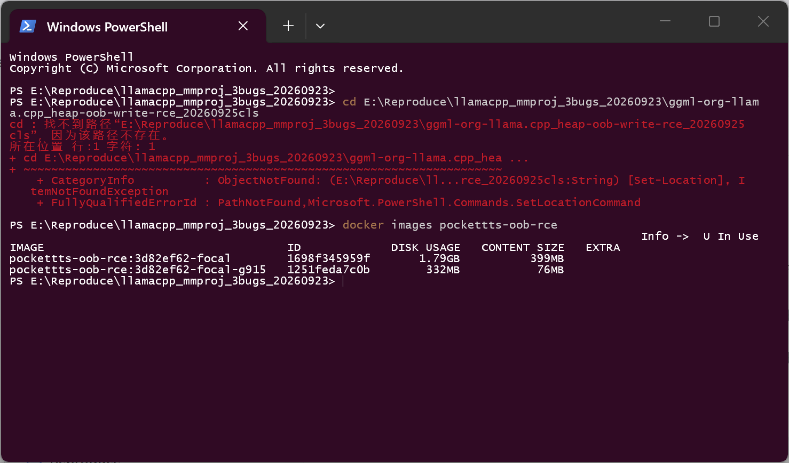
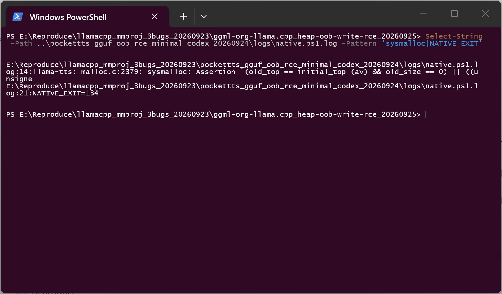
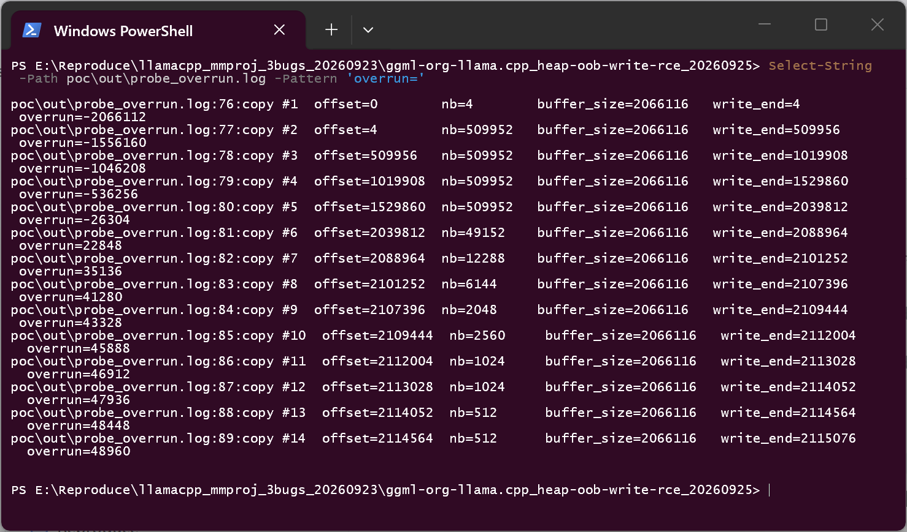
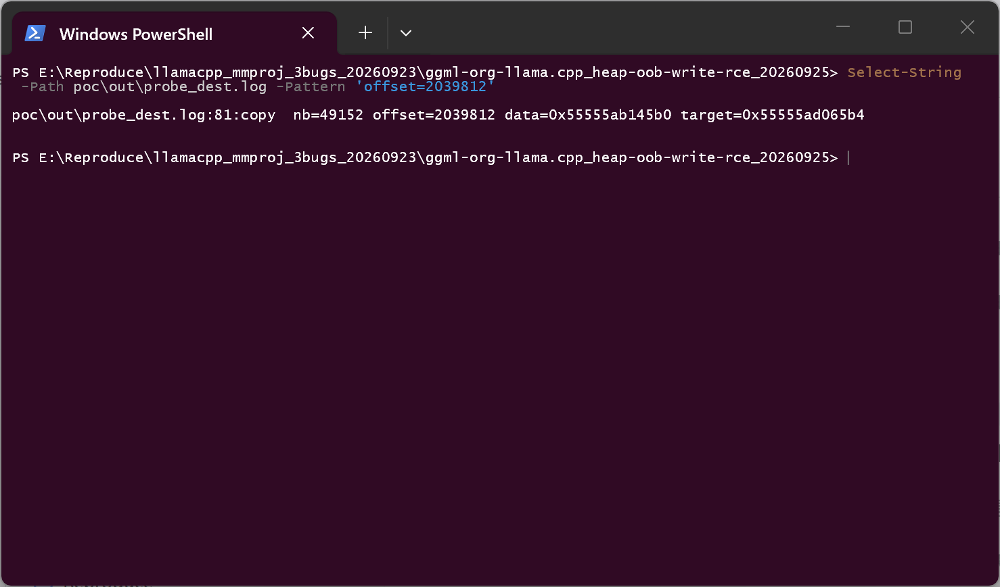
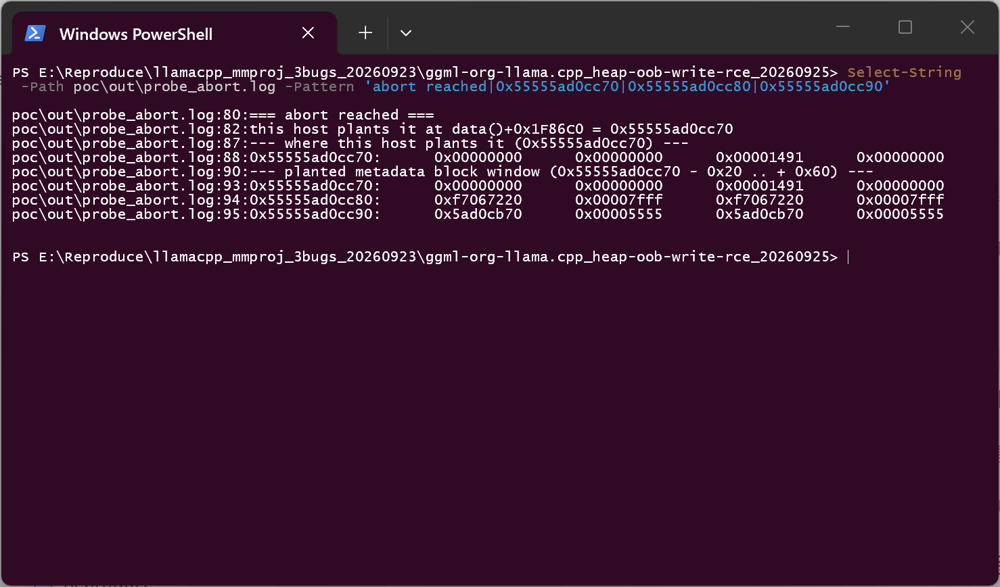

# llama.cpp (llama-tts / mtmd pocket-tts decoder) — Heap-based Buffer Overflow in the streaming-state copy (`state_out`), escalating to command execution

## Summary

ggml-org llama.cpp at commit `3d82ef62d47fd74e18f36c5eccbdcf965b617b17` is affected by a heap
out-of-bounds write in the pocket-tts audio decoder path (`tools/mtmd`). The streaming-state
buffer for the `GEN_WAV` step is sized from the *declared* shapes of the state slots, while each
slot is then filled with `ggml_nbytes()` of the *real* graph tensor and no check guards
`offset + nb <= state_out.size()`.

A crafted `a.gen.wav.upsample.weight` tensor — `F32 [40, 512, 2]` instead of the depthwise
`[32, 1, 512]` the code assumes — makes the two sizes diverge by two orders of magnitude: the host
vector reserves 192 bytes for that slot while 49,152 bytes are copied into it. The copy repeats
once per generated audio flush, so tens of kilobytes of attacker-controlled heap data are written
past the end of the buffer, on top of allocator metadata. In the isolated lab that ships with this
report the same primitive has been driven all the way to command execution; on the reproduction
host used for this report the overflow and the resulting heap corruption are demonstrated
directly, while the full exploit chain does not transfer (see *Verification status*).

## Affected Product

| Field | Value |
|---|---|
| Vendor | ggml-org (llama.cpp project) |
| Product | llama.cpp — `llama-tts` / mtmd pocket-tts audio decoder |
| Affected versions | verified at commit `3d82ef62d47fd74e18f36c5eccbdcf965b617b17`; code paths `tools/mtmd/models/pockettts-gen.cpp` and `tools/mtmd/clip.cpp`. Fixed version: [unknown] |
| Component | `tools/mtmd/models/pockettts-gen.cpp` (`list_pockettts_state_slots`), `tools/mtmd/clip.cpp` (`clip_encode`, state-slot copy loop) |
| Platform | Linux x86-64; clang 16.0.6; RelWithDebInfo (`-O2 -gdwarf-4 -DNDEBUG`); Ubuntu 20.04 base image, glibc 2.31 |
| Vulnerability type | CWE-787: Out-of-bounds Write |

## Root Cause

**Location:** `tools/mtmd/models/pockettts-gen.cpp:125` and `tools/mtmd/clip.cpp:5835-5852`

The slot that carries the transposed-convolution overlap tail is sized from the weight tensor's
*channel* and *length* axes, i.e. it assumes a depthwise weight of shape `[channels, 1, length]`:

```cpp
// tools/mtmd/models/pockettts-gen.cpp — list_pockettts_state_slots()
// upsample is depthwise, its output channel count is the input one
slots.push_back({"up", model.gen_upsample_w->ne[0] - hparams.mimi_downsample,
                        model.gen_upsample_w->ne[2]});
```

The graph, however, derives the produced state tensor's channel count from `ne[1]` whenever the
weight is not depthwise, so the same tensor is read as two different shapes: the host side sees
`[ne[0] - downsample, ne[2]]`, the graph side produces `[ne[0] - downsample, ne[1]]`.

The copy loop then trusts the graph size and never compares it with the buffer it reserved:

```cpp
// tools/mtmd/clip.cpp — clip_encode(), state_out handling
auto & state_out = *params->state_out;
size_t total = 0;
for (const auto & slot : list_gen_state_slots(hparams, model)) {
    total += (size_t) (slot.ne0 * slot.ne1) * sizeof(float);   // declared slot sizes
}
state_out.resize(total);                                       // buffer sized from the declaration
size_t offset = 0;
for (const auto & slot : list_gen_state_slots(hparams, model)) {
    ggml_tensor * t = ggml_graph_get_tensor(gf, ("state_out_" + slot.name).c_str());
    if (t == nullptr) { GGML_ABORT(...); }
    const size_t nb = ggml_nbytes(t);                          // real graph tensor size
    ggml_backend_tensor_get(t, state_out.data() + offset, 0, nb);   // no offset + nb <= size check
    offset += nb;
}
```

With the crafted weight `F32 [40, 512, 2]` and `mimi_downsample = 16`:

| View | Computed shape | Bytes |
|---|---|---|
| Host slot reservation (`ne[0]-16`, `ne[2]`) | `[24, 2]` | 192 |
| Graph tensor (`ne[0]-16`, `ne[1]`) | `[24, 512]` | 49,152 |

The web ignores the resize and copies the graph tensor, so the `up` slot alone overruns the
buffer by ~48 KB; every later `dec_*` slot is then written past the end as well.

## Proof of Concept

### Prerequisites

- `llama-tts` built from the pinned commit (no source modification), inside the lab image that
  ships with the repro package (Ubuntu 20.04, glibc 2.31, `setarch -R` entrypoint so the heap is
  deterministic).
- The victim's own backbone model `models/pocket-tts.gguf` (the real kyutai pocket-tts GGUF).
- The attacker file: `artifact/mmproj_evil_pockettts_worldg31.gguf`, 59,956,640 bytes,
  SHA-256 `f8d53e8325fb385c5a229317eae131665b1865310784ef467df333f1db11514e`.

### Steps to Reproduce

1. Build the lab image from the pinned commit (`poc/Dockerfile.rebuild` in this report folder is
   the package recipe with only the download mirrors substituted); the container reports
   `glibc 2.31-0ubuntu9.15` and `llama-tts --version` = `0.4.1-dev (commit 3d82ef6)`.

   

2. Run the product's real CLI with the victim backbone plus the crafted projector:

   ```text
   llama-tts -m pocket-tts.gguf --mmproj mmproj_evil_pockettts_worldg31.gguf \
             -p "Hello, this is a test of the pocket text to speech model." \
             -n 64 -t 4 --seed 42 --no-mmproj-offload -o out.wav
   ```

3. The process dies inside the allocator: the repeated out-of-bounds write destroys the chunk
   metadata, and glibc aborts on the next heap extension. No sanitizer is needed to see it —
   this is the release build.

   

4. Measuring the copy loop directly (breakpoint at the state-slot copy, `clip.cpp:5849`) shows
   the buffer size the host reserved and how far each write goes past it:

   

   The numbers are: buffer size **2,066,116** bytes (from the declared slot shapes), copy #6
   (the `up` slot) writes 49,152 bytes at offset 2,039,812 → 22,848 bytes past the end, and the
   following decoder slots extend the overrun to **48,960 bytes**.

5. The heap address the copy targets on this host, for comparison with the address the shipped
   exploit artifact was calibrated against (it encodes that address in its weights, see
   *Verification status*):

   

6. At the abort point the planted metadata is visible in the heap — the fake chunk size
   (`0x1491`) and the planted links sit exactly where the overflow wrote them:

   

### Expected vs Actual

- Expected: the state buffer is sized from the tensors actually produced by the graph, or each
  copy is rejected when `offset + nb` would exceed the buffer; a weight whose shape is not
  depthwise is rejected while loading the decoder weights.
- Actual: the buffer is sized from the declared slot shapes, the copy uses the graph tensor size,
  and the resulting overrun reaches ~49 KB of attacker-controlled data per flush.

### Sanitized PoC input

```text
a.gen.wav.upsample.weight   F32 ne=[40, 512, 2]   (honest weight: F16 [32, 1, 512], depthwise)
a.gen.wav.quant_out.weight  F32 ne=[32, 1]
a.gen.emb_mean / emb_std    F32, chosen so the convolution input is exactly 1.0 for every frame
```

The last three tensors matter: they make the transposed-convolution column a deterministic
function of the weight, so the attacker controls the 32-bit words written past the buffer.

## Impact

- Confidentiality: **High** — in the isolated lab the same primitive has been driven to command
  execution (see *Verification status*), which subsumes confidentiality; on the reproduction host
  the demonstrated effect is memory corruption only.
- Integrity: **High** — ~49 KB of attacker-controlled heap data per flush, written over allocator
  metadata and later live objects.
- Availability: **High** — the process aborts deterministically once the corruption is touched by
  the allocator.
- Scope: memory corruption (heap out-of-bounds write) in the product process, reachable from a
  model file alone; with heap-layout calibration it escalates to arbitrary code execution.

## Attack Vector and Severity (CVSS v3.1)

| Metric | Value | Rationale |
|---|---|---|
| Attack Vector | Network (N) | The projector is delivered like any other model artifact and loaded locally |
| Attack Complexity | High (H) | Heap corruption alone is enough for a crash; reaching code execution required per-target heap-layout calibration in the lab, so the exploitable step is not generic |
| Privileges Required | None (N) | No account or privilege on the victim machine is needed |
| User Interaction | Required (R) | The victim runs the CLI with the downloaded projector, i.e. normal use |
| Scope | Unchanged (U) | Same process |
| Confidentiality | High (H) | Command execution demonstrated in the isolated lab (see *Verification status*) |
| Integrity | High (H) | Attacker-controlled heap writes |
| Availability | High (H) | Deterministic abort |

```
Score: 7.5 (High)
Vector: CVSS:3.1/AV:N/AC:H/PR:N/UI:R/S:U/C:H/I:H/A:H
```

## Remediation

- Size the state buffer from the tensors the graph actually produces, or validate every copy:
  `if (offset + nb > state_out.size()) { /* fail closed */ }` before
  `ggml_backend_tensor_get(...)` in `tools/mtmd/clip.cpp` (`clip_encode`).
- Validate the decoder weight shapes while loading: a transposed-convolution weight of the
  pocket-tts decoder must be depthwise (`ne[1] == 1`) with the channel relation the slot
  arithmetic assumes (`tools/mtmd/models/pockettts-gen.cpp`, `list_pockettts_state_slots`).
- Workaround for users until a fix is available: treat projector files as untrusted input and run
  them only in a sandbox, as the project's own security policy recommends for models.

## Verification status (what was and was not demonstrated here)

| Claim | Status on the reproduction host (2026-09-25) |
|---|---|
| Malicious mmproj reaches the pocket-tts state-slot copy | **Demonstrated** — breakpoint at `clip.cpp:5849` shows the `up` slot copy (`nb = 49152`) into a 2,066,116-byte buffer at offset 2,039,812 |
| Heap out-of-bounds write, attacker-controlled content, repeated per flush | **Demonstrated** — overrun grows to 48,960 bytes; the planted metadata is visible in the heap at the abort point |
| Heap-metadata corruption → deterministic crash | **Demonstrated** — native (non-sanitizer) run aborts on `sysmalloc` assertion, `NATIVE_EXIT=134` |
| Full RCE / command execution from the artifact alone | **Demonstrated in the original lab, not reproduced here** — the shipped exploit package records `PASS: artifact-only command execution` with a marker file written by the executed command; on this host the same artifact stops at the allocator abort |

Why the exploit chain does not transfer here (measured, not guessed):

- The artifact encodes absolute heap addresses in its weights (exact 32-bit words; e.g.
  `0x55555ad0cb70`, which is `data() + 0x1F86C0`). That pins its calibration to a state buffer at
  `state_out.data() = 0x55555ab144b0`.
- On this host the same buffer lands at `0x55555ab145b0` — **0x100 bytes higher**, measured in the
  same image with the same binary (whose SHA-256, `1cf63147f1fc95bd…385359`, matches the one the
  exploit package records for the original environment; the glibc patch level was also fixed to
  the original `2.31-0ubuntu9.15`).
- The exploit's House-of-Orange style layout needs the fake top-chunk size to make `old_end`
  page-aligned *and* to keep the fenced chunk inside bin 101. Both conditions are pinned to the
  low 12 bits of the top chunk address: at the original phase (`0xb70`) `0x1490` satisfies both;
  at this host's phase (`0xc70`) page alignment demands a size of `0x1390`, which by
  `largebin_index_64` falls into bin 100 instead. Re-calibrating the artifact's sizes therefore
  cannot satisfy both constraints — the layout has to be re-derived, exactly as the exploit
  package's own README warns ("the hard-coded addresses may need recalibration if the binary or
  system library layout changes").
- The re-calibration attempt performed here is recorded in `poc/rescale_artifact.py` (in-place
  byte patch, file size preserved) together with its negative result.

## Timeline

| Date | Event |
|---|---|
| 2026-09-23 | Finding and reproduction of the out-of-bounds write in the isolated lab (original repro package) |
| 2026-09-24 | Command execution achieved in the lab from the artifact alone (recorded in the repro package) |
| 2026-09-25 | Independent reproduction on a separate host: original overrun measured, native abort reproduced; full exploit chain not transferable (calibration phase difference documented above) |
| [pending] | Report sent to the maintainers |
| [pending] | Maintainer acknowledgement |
| [pending] | Fix released |

## References

- Source repository: https://github.com/ggml-org/llama.cpp
- Upstream report: [pending publication] — upstream asks for private advisories, and its private
  disclosure programme is currently disabled
- CWE: https://cwe.mitre.org/data/definitions/787.html
- Repro package shipped with this report: `poc/` (drivers, probes, recalibration script) and the
  original package at `pockettts_gguf_oob_rce_minimal_codex_20260924/`
- Vendor advisory: [none]

## Disclaimer

This report is provided for defensive and coordination purposes. The minimal repro package is
scoped to an isolated container with ASLR disabled and is not a cross-version exploit; no
sensitive infrastructure details are included. Do not disclose it publicly before the maintainer
has had a reasonable window to fix the issue.

## Screenshot Checklist

All screenshots were captured on a real terminal window on the reproduction host (Windows 11
desktop session, Docker Desktop with the WSL2 backend) on 2026-09-25; commands were executed one
at a time and the outputs are the unedited console output of those commands.

| File | What it shows |
|---|---|
| `screenshots/01-lab-image.png` | The bug-3 lab image(s) built from the pinned commit |
| `screenshots/02-native-abort.png` | Native run of `llama-tts` with the crafted projector: glibc `sysmalloc` assertion, `NATIVE_EXIT=134` |
| `screenshots/03-heap-overrun-measured.png` | Per-copy measurement: buffer 2,066,116 bytes, `up` slot copy of 49,152 bytes at offset 2,039,812, overrun up to 48,960 bytes |
| `screenshots/04-dest-phase-this-host.png` | The destination address of the overrunning copy on this host |
| `screenshots/05-abort-window-dump.png` | Heap window at the abort point: the planted chunk metadata written by the overflow |
