# MEMO (memoavatar/memo) 151b02438f0b — Insecure Deserialization in Sharded Checkpoint Loading (`use_safetensors=True` defeated by the shard index)

## Summary

memoavatar MEMO at commit `151b02438f0b` (latest `main` commit at report time) is affected by
an insecure deserialization issue in the model-loading component. `inference.py:143-145` loads
the reference UNet with an explicit safe-format request:

```python
reference_net = UNet2DConditionModel.from_pretrained(
    config.model_name_or_path, subfolder="reference_net", use_safetensors=True
)
```

`use_safetensors=True` only fixes *which index file name* is resolved
(`diffusion_pytorch_model.safetensors.index.json`, diffusers 0.31.0
`models/model_loading_utils.py:276-281`). The shard file names come from that index's
`weight_map` values, are used verbatim, and are validated only for existence
(`diffusers/utils/hub_utils.py:439-450`). Because the checkpoint is sharded, diffusers hands
the index to `accelerate.load_checkpoint_and_dispatch()`
(`diffusers/models/modeling_utils.py:881-896`), and accelerate 1.1.1 loads every file named by
the index through `load_state_dict()` — which special-cases only the `.safetensors` suffix and
otherwise calls `torch.load(checkpoint_file, map_location=torch.device("cpu"))` with no
`weights_only` (`src/accelerate/utils/modeling.py:1512-1513`). With the pinned `torch==2.5.1`
that call defaults to `weights_only=False`, so a pickle-backed `.bin` shard selected by the
safe-looking index executes arbitrary code in the victim's process while the model still loads
normally. The safe-format preference is defeated by an ordinary filename field in the index.

## Affected Product

| Field | Value |
|---|---|
| Vendor | memoavatar (MEMO project, TMLR paper code) |
| Product | MEMO — Memory-Guided Diffusion for Expressive Talking Video Generation |
| Affected versions | commit `151b02438f0b` (latest `main` commit as of 2025-08-06, the newest commit at report time); no tagged releases, `pyproject.toml` version `0.1.0`. Earlier revisions carrying the same loader calls are assumed affected `[unknown]` |
| Component | `inference.py:143-145` (`UNet2DConditionModel.from_pretrained(..., subfolder="reference_net", use_safetensors=True)`); same pattern at `finetune.py:186-188` and `finetune.py:283-285` |
| Platform | OS-independent (pure Python); verified on Ubuntu 22.04 (container), Python 3.10.12, CPU-only |
| Dependency versions | exactly the repository's own pins from `pyproject.toml`: `torch==2.5.1` (CPU wheel), `diffusers==0.31.0`, `accelerate==1.1.1`, `transformers==4.46.3`, `huggingface-hub==0.26.2` |
| Vulnerability type | CWE-502: Deserialization of Untrusted Data (Insecure Deserialization) |

## Root Cause

**Location:** `inference.py:143-145` (product call), reached through `diffusers==0.31.0` and
`accelerate==1.1.1` — all three versions are the pins in the repository's `pyproject.toml`.

A model package is attacker-authored data, and `use_safetensors=True` is the product's whole
defence against pickle-backed checkpoints. It does not hold on the sharded route. Stage by
stage, with the versions memo pins:

**1. The safe format flag only selects the index *name*** —
`diffusers/models/model_loading_utils.py:276-281` (`_fetch_index_file`):

```python
    if is_local:
        index_file = Path(
            pretrained_model_name_or_path,
            subfolder or "",
            _add_variant(SAFE_WEIGHTS_INDEX_NAME if use_safetensors else WEIGHTS_INDEX_NAME, variant),
        )
```

`SAFE_WEIGHTS_INDEX_NAME` is `diffusion_pytorch_model.safetensors.index.json`
(`diffusers/utils/constants.py:35`), and `is_sharded` is simply "that file exists"
(`diffusers/models/modeling_utils.py:733-734`). Nothing here inspects the *contents* of the
file names listed inside the index.

**2. The index's `weight_map` values are taken as file names, checked for existence only** —
`diffusers/utils/hub_utils.py:436-450` (`_get_checkpoint_shard_files`):

```python
    with open(index_filename, "r") as f:
        index = json.loads(f.read())

    original_shard_filenames = sorted(set(index["weight_map"].values()))
    ...
    if os.path.isdir(pretrained_model_name_or_path):
        _check_if_shards_exist_locally(
            pretrained_model_name_or_path, subfolder=subfolder, original_shard_filenames=original_shard_filenames
        )
        return shards_path, sharded_metadata
```

and the helper it calls (`:405-409`) raises only when a named file is missing — there is no
extension, format or content check.

**3. The sharded case is delegated to accelerate** —
`diffusers/models/modeling_utils.py:874-896`:

```python
                else:  # else let accelerate handle loading and dispatching.
                    force_hook = True
                    device_map = _determine_device_map(...)
                    if device_map is None and is_sharded:
                        # we load the parameters on the cpu
                        device_map = {"": "cpu"}
                        force_hook = False
                    try:
                        accelerate.load_checkpoint_and_dispatch(
                            model,
                            model_file if not is_sharded else index_file,
                            device_map,
                            ...
                            strict=True,
                        )
```

The guarded diffusers path (`weights_only=True` for non-safetensors files,
`diffusers/models/model_loading_utils.py:139-149`) is only taken when
`device_map is None and not is_sharded` (`modeling_utils.py:829`), i.e. never for a sharded
package.

**4. Accelerate loads every file the index names — with the unguarded `torch.load`** —
`accelerate/utils/modeling.py:1696-1717` (`load_checkpoint_in_model`):

```python
    if index_filename is not None:
        checkpoint_folder = os.path.split(index_filename)[0]
        with open(index_filename) as f:
            index = json.loads(f.read())

        if "weight_map" in index:
            index = index["weight_map"]
        checkpoint_files = sorted(list(set(index.values())))
        checkpoint_files = [os.path.join(checkpoint_folder, f) for f in checkpoint_files]
    ...
    for checkpoint_file in checkpoint_files:
        loaded_checkpoint = load_state_dict(checkpoint_file, device_map=device_map)
```

and the sink in the same file (`:1436`, `:1512-1513`):

```python
    if checkpoint_file.endswith(".safetensors"):
        ...
    else:
        return torch.load(checkpoint_file, map_location=torch.device("cpu"))
```

The suffix of an attacker-supplied file name is the only thing that decides which deserializer
runs. With memo's pin `torch==2.5.1`, `weights_only` is not passed and resolves to `False`
(torch prints its own `FutureWarning` on this very line during the reproduction), so the pickle
stream inside the `.bin` shard is executed before a single weight is assigned.

**Why the flag really is defeated:** without an index file, `use_safetensors=True` does protect
the load — the loader resolves `diffusion_pytorch_model.safetensors` and nothing else
(`diffusers/models/modeling_utils.py:779-793`), which the control package in the PoC confirms.
The bypass is therefore not "safetensors is weak" but "the index's ordinary filename field
decides the format of each shard, after the safe-format choice has already been made".

## Proof of Concept

### Prerequisites

- Docker (CPU-only works; the reproduction image is built from the pinned commit and the
  repository's own dependency pins).
- The victim's action is the product's normal operation: loading a MEMO model package the way
  `inference.py` does.
- The attacker ships **no code**: the model root contains only `config.json`, a benign
  `safe.safetensors`, the pickle-backed `second_stage.bin` and the fixed-name
  `diffusion_pytorch_model.safetensors.index.json`. No `.py` sidecar, plugin, native library or
  shell program takes part (an inert `evil_sidecar_probe.py` is present only to prove it is
  never imported).

### Steps to Reproduce

1. Build the image from the pinned source and the repository's own pins (`poc/Dockerfile`):

   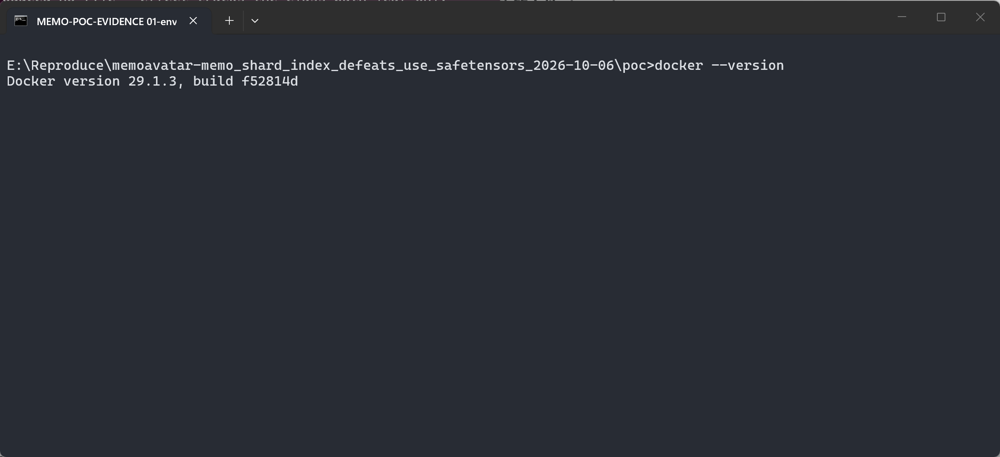

   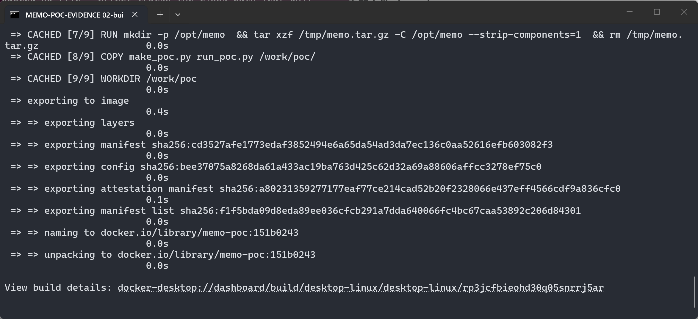

2. Confirm the environment inside the container equals the pins from memo's `pyproject.toml`:

   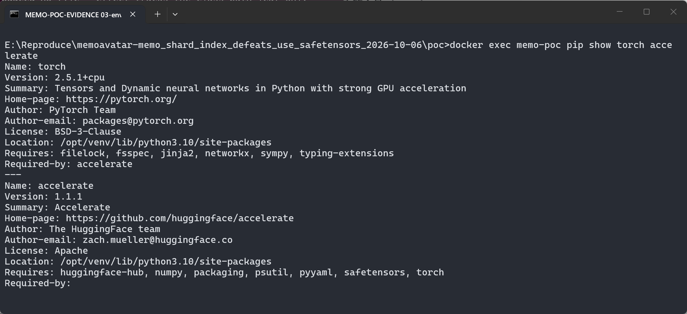

   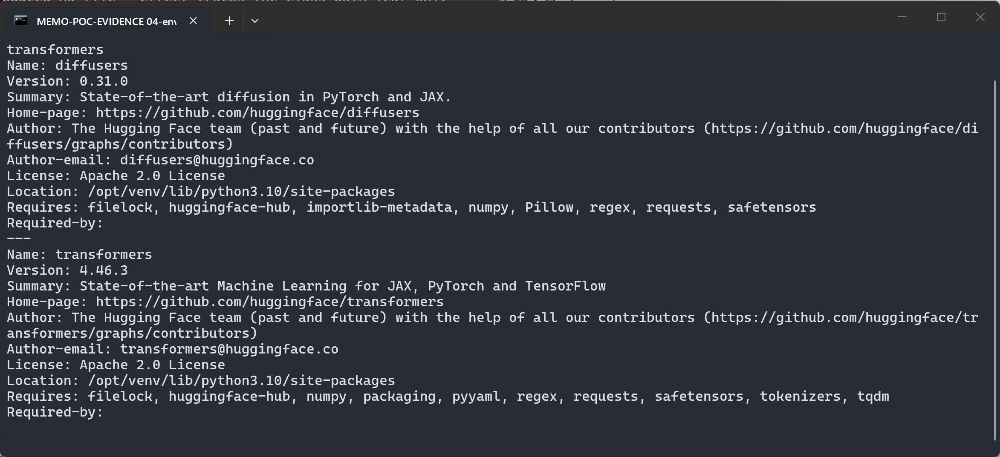

3. The product call site, read from the pinned source inside the image:

   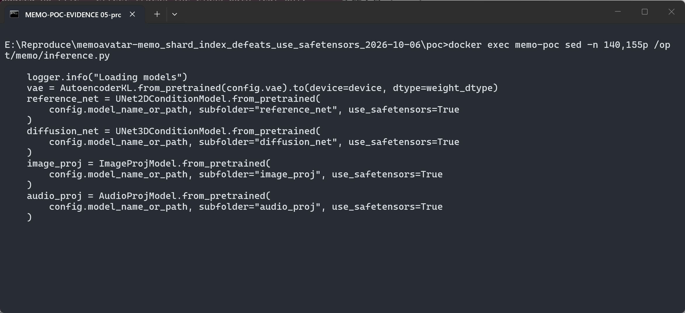

4. Generate the model packages (`poc/make_poc.py`). Both indexed arms contain byte-identical
   `config.json`, `safe.safetensors`, `second_stage.bin` and the inert sidecar; the only
   difference is one value in the index. The builder asserts that delta and records the
   SHA-256 of every file. The poisoned shard is a fully functional checkpoint: unpickling runs
   the payload and then yields the genuine `conv_in.weight` tensor.

   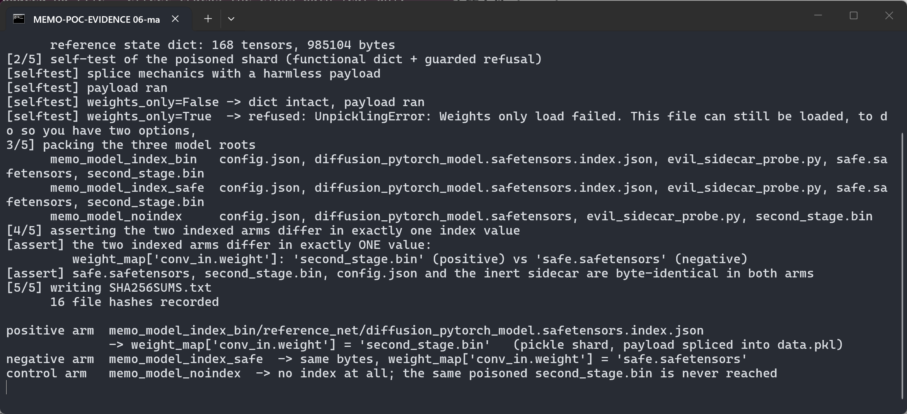

   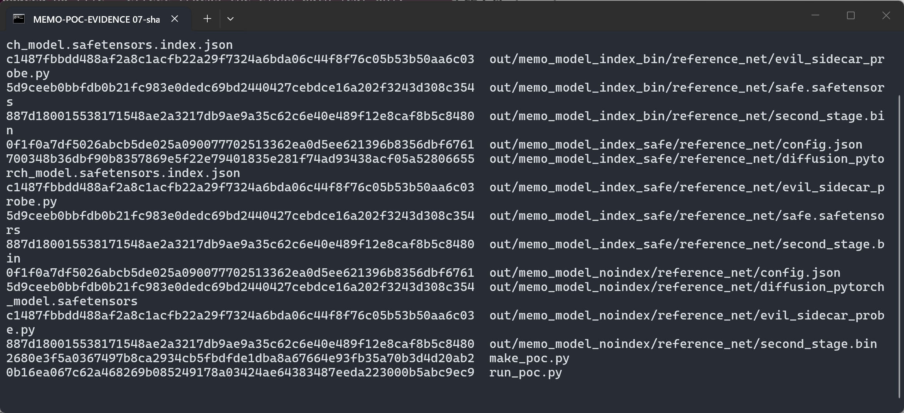

5. Inspect the positive arm's index and directory. The index carries the *safetensors* file
   name that `use_safetensors=True` resolves, yet its `weight_map` sends one weight to a `.bin`
   file — and exactly one entry does so:

   ![Positive index (head): weight_map["conv_in.weight"] = "second_stage.bin"](screenshots/08-index-positive.png)

   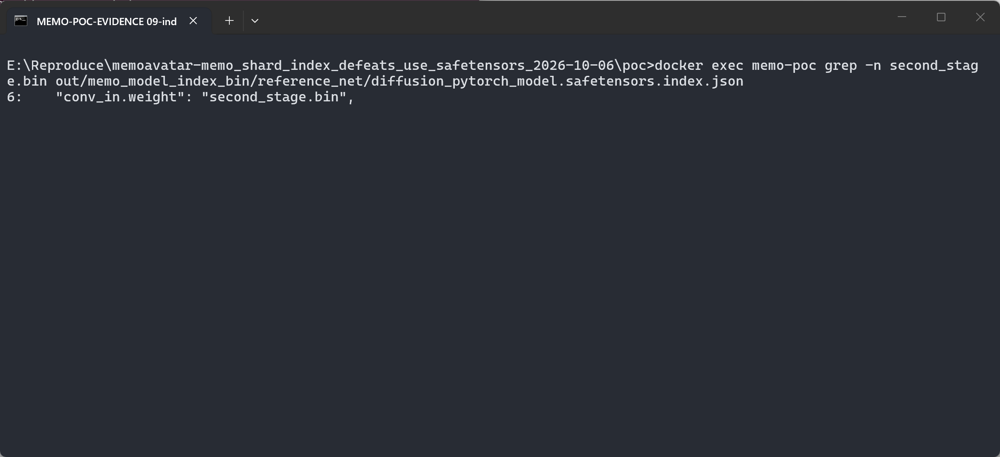

   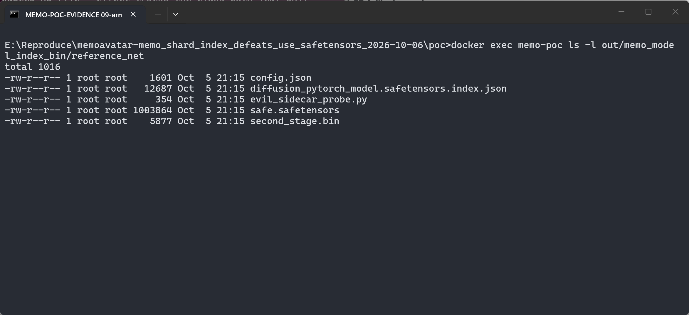

6. Load the positive package exactly as the product does.

   ```python
   reference_net = UNet2DConditionModel.from_pretrained(
       "<model root>", subfolder="reference_net", use_safetensors=True
   )
   ```

   The payload prints its line during the load; the PID in that line is the PID of the process
   that called `from_pretrained()` (63 in the lab run), i.e. code execution inside the product
   process, before `MODEL CONSTRUCTED OK`. The model still loads, and its `conv_in.weight`
   equals the benign tensor from `safe.safetensors`, so the poisoned package behaves like a
   normal release:

   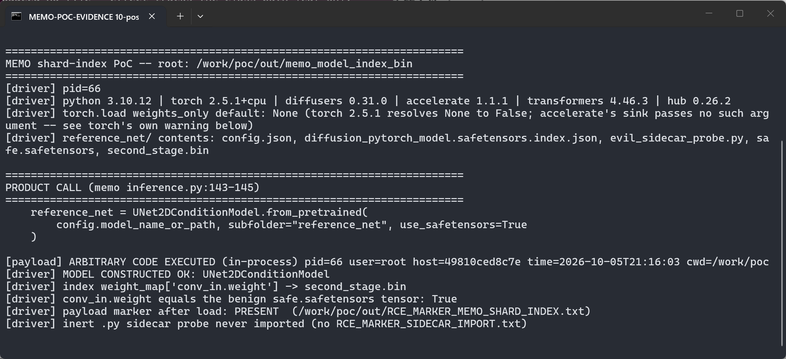

   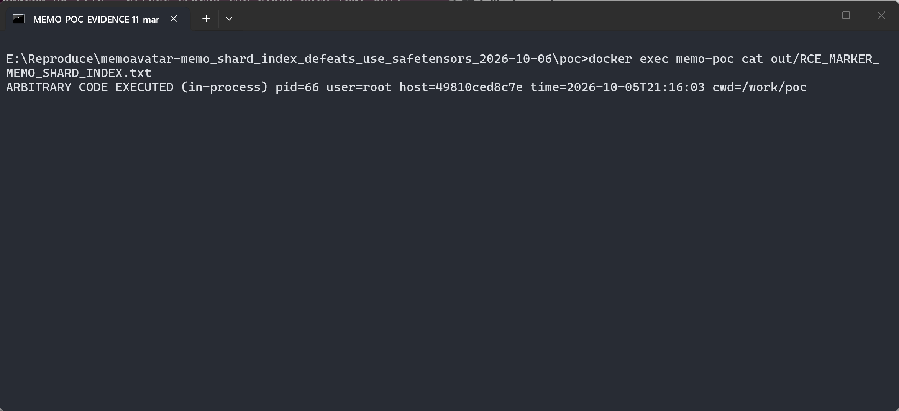

7. Load the **negative** package: byte-identical except that
   `weight_map["conv_in.weight"]` is `"safe.safetensors"`. The model is constructed and no
   payload runs:

   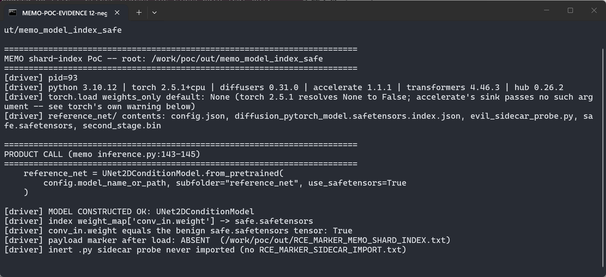

8. Load the **control** package: no index file at all, the same `second_stage.bin` bytes lying
   next to a benign single-file `diffusion_pytorch_model.safetensors`. `use_safetensors=True`
   resolves the safetensors file only, so the `.bin` is never reached:

   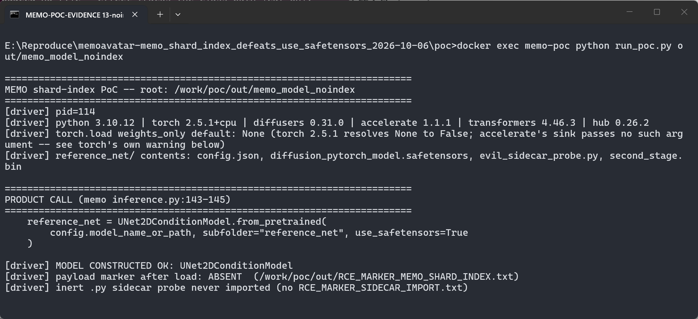

9. Guard contrast — the same poisoned bytes through the three loaders present in this stack.
   Accelerate's `load_state_dict` (the loader the shard route uses) executes the payload;
   diffusers' guarded `load_state_dict` and `torch.load(..., weights_only=True)` both refuse it
   with `UnpicklingError: Unsupported global: GLOBAL builtins.exec was not an allowed global`:

   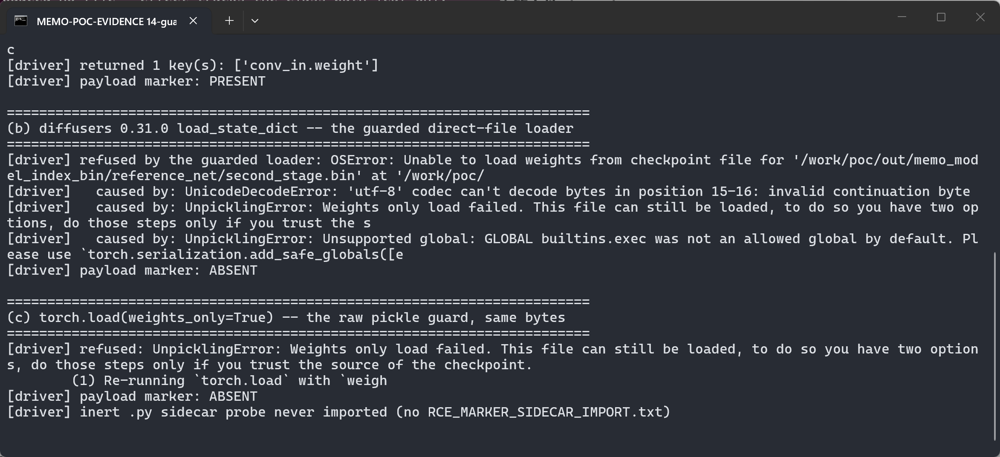

### Expected vs Actual

- Expected: `use_safetensors=True` — and, more generally, loading a model package — must not
  deserialize pickle data. An index resolved under the safetensors name must not be able to
  select a non-safetensors shard.
- Actual: with nothing but a filename in the index's `weight_map`, a pickle shard is loaded by
  `torch.load()` without `weights_only` inside the process that loads the model, and the model
  still loads correctly, so the malicious package is indistinguishable from a normal one.

### Sanitized PoC input

Positive arm, `reference_net/diffusion_pytorch_model.safetensors.index.json` (the negative arm
is identical except for the one value in bold):

```json
{
  "metadata": {
    "total_size": 4608
  },
  "weight_map": {
    "conv_in.weight": "second_stage.bin",
    "time_embedding.linear_1.weight": "safe.safetensors",
    "...": "safe.safetensors"
  }
}
```

The remaining `weight_map` entries (167 of 168 keys in the lab model, all tensors of the tiny
reference UNet) point at `safe.safetensors`; the negative arm points `conv_in.weight` at
`safe.safetensors` too and is byte-identical otherwise. `second_stage.bin` is a `torch.save`
zip whose `data.pkl` was rewritten so that unpickling first runs the payload and then yields
the genuine state dict:

```text
[payload] ARBITRARY CODE EXECUTED (in-process) pid=<victim pid> user=<user> host=<container> time=<utc> cwd=/work/poc
```

Validation boundary, stated honestly: the demonstrated primitive is arbitrary code execution in
the loading process by a `.bin` shard named in a safetensors-named index — the payload only
prints a line and writes a marker file (PID, user, host, time); it contains no weaponization.
The reference UNet is a miniature one (1×`CrossAttnDownBlock2D`/`CrossAttnUpBlock2D`,
`block_out_channels=[32]`, 168 tensors, 985,104 bytes) so the PoC runs on a CPU box; the
loading path under test depends on the index and file names, not on tensor sizes. The real
MEMO checkpoints are sharded the same way (`diffusion_pytorch_model*.index.json` plus shards),
so a real-size package follows the identical code path. The container clock is UTC (the
marker's timestamp is UTC; the collection date below is in UTC+8).

## Impact

- Confidentiality: High — arbitrary code with the victim's privileges can read anything the
  process can (user data, other models, tokens, the rendered video).
- Integrity: High — the same code can modify files and inputs; the checkpoint contents
  themselves can be silently replaced while the model still loads.
- Availability: High — arbitrary code execution in the inference/finetune process.
- Scope: model supply chain; entry point is a model *package* (directory or Hub repository) the
  user points `config.model_name_or_path` at, sink is `torch.load()` inside the product
  process.

## Attack Vector and Severity (CVSS v3.1)

| Metric | Value | Rationale |
|---|---|---|
| Attack Vector | N | The crafted model package reaches the victim over the network through the normal model-distribution channel (Hub repository or shared checkpoint) |
| Attack Complexity | L | No special conditions: a valid index, one data file name, and the product's own documented call |
| Privileges Required | N | Publishing a model package requires no privileges |
| User Interaction | R | The victim must load the attacker's model package |
| Scope | U | Impact stays inside the victim's process/security scope |
| Confidentiality | H | Arbitrary code execution in the loading process |
| Integrity | H | Same; attacker code can change any data the process can, and the loaded weights |
| Availability | H | Same |

```
Score: 8.8 (High)
Vector: CVSS:3.1/AV:N/AC:L/PR:N/UI:R/S:U/C:H/I:H/A:H
```

Scoping note (honest, not a mitigation): the sink is reached because accelerate passes no
`weights_only` and the pinned `torch==2.5.1` resolves the unset argument to `False` — torch's
own `FutureWarning` printed during the lab run says the default will be flipped to `True` in a
future release. Installations that upgrade torch beyond that flip would gain that default as an
unintended protection, but memo pins `torch==2.5.1`, and the missing check belongs to the
shard-loading route (an explicit `weights_only=True`, or rejecting non-safetensors shards,
would be deterministic rather than dependent on a library default).

## Remediation

- Short term, in `inference.py` / `finetune.py`: do not treat `use_safetensors=True` as a
  guarantee. Before `from_pretrained()`, refuse a model directory whose
  `diffusion_pytorch_model.safetensors.index.json` names any file that is not a
  `.safetensors` file; equivalently, resolve the shard set yourself and load with
  `weights_only=True`.
- Release-side: ship each MEMO component as a single `diffusion_pytorch_model.safetensors`
  (no index and no `.bin` shard), which removes the redirectable field entirely.
- Upstream (diffusers): when the index was resolved through `SAFE_WEIGHTS_INDEX_NAME`, reject
  `weight_map` values that are not `.safetensors` files, and never delegate a sharded
  checkpoint to a loader that ignores `use_safetensors`.
- Upstream (accelerate): pass `weights_only=True` in `load_state_dict`'s non-safetensors branch
  (`utils/modeling.py:1512-1513`) or leave the decision to the caller that already resolved the
  safe format.
- Fixed version: `[none]` at report time.

## Timeline

| Date | Event |
|---|---|
| 2026-10-06 | Reproduction validated against commit `151b02438f0b` with the repository's own dependency pins; report prepared |
| 2026-10-06 | Upstream report drafted; repository has no security channel (no `SECURITY.md`, no issue templates, Private Vulnerability Reporting disabled) |
| [pending] | Maintainer acknowledged |
| [pending] | Fix released |

## References

- Source repository: https://github.com/memoavatar/memo
- Project page (paper/code, TMLR): https://memoavatar.github.io/
- Vulnerable call at the pinned commit:
  https://github.com/memoavatar/memo/blob/151b02438f0b/inference.py#L143-L145
  (same pattern: `finetune.py#L186-L188`, `finetune.py#L283-L285`)
- Dependency pins: https://github.com/memoavatar/memo/blob/151b02438f0b/pyproject.toml
  (`torch==2.5.1`, `diffusers==0.31.0`, `accelerate==1.1.1`, `transformers==4.46.3`)
- diffusers 0.31.0 `_fetch_index_file` (safe index name):
  https://github.com/huggingface/diffusers/blob/v0.31.0/src/diffusers/models/model_loading_utils.py#L276-L281
- diffusers 0.31.0 `_get_checkpoint_shard_files` (existence-only validation):
  https://github.com/huggingface/diffusers/blob/v0.31.0/src/diffusers/utils/hub_utils.py#L412-L450
- diffusers 0.31.0 accelerate delegation:
  https://github.com/huggingface/diffusers/blob/v0.31.0/src/diffusers/models/modeling_utils.py#L874-L896
- accelerate 1.1.1 index parsing and unguarded sink:
  https://github.com/huggingface/accelerate/blob/v1.1.1/src/accelerate/utils/modeling.py#L1696-L1717
  and `:L1512-L1513`
- diffusers guarded loader (`weights_only=True`):
  https://github.com/huggingface/diffusers/blob/v0.31.0/src/diffusers/models/model_loading_utils.py#L139-L149
- CWE-502: https://cwe.mitre.org/data/definitions/502.html
- PyTorch security note on `torch.load`:
  https://github.com/pytorch/pytorch/blob/main/SECURITY.md#untrusted-models
- Vendor advisory: `[none]`

## Disclaimer

This report is provided for defensive and coordination purposes. It contains no ready-to-run
exploit beyond the minimum reproduction information, and no sensitive infrastructure details.
The PoC payload only prints a line and writes a marker file. Do not disclose this report
publicly before the maintainer has had a reasonable window to fix the issue.

## Screenshot Checklist

Collection environment: Docker 29.1.3 on Windows 11 x64 (125 % display scaling), container
`ubuntu:22.04` with Python 3.10.12 and the repository's own pins — torch 2.5.1+cpu,
diffusers 0.31.0, accelerate 1.1.1, transformers 4.46.3, huggingface-hub 0.26.2 — CPU only.
Every image is a screen capture of a real terminal window (`cmd`/PowerShell) that executed the
commands one at a time; the container clock is UTC. Collection date: 2026-10-06 (UTC+8).

| File | Content | Step |
|---|---|---|
| screenshots/01-env-docker.png | `docker --version` (Docker 29.1.3) | 1 |
| screenshots/02-build.png | Image build from the pinned commit tarball plus memo's own pins | 1 |
| screenshots/03-env-torch-accelerate.png | `pip show torch accelerate` — 2.5.1+cpu, 1.1.1 | 2 |
| screenshots/04-env-diffusers-transformers.png | `pip show diffusers transformers` — 0.31.0, 4.46.3 | 2 |
| screenshots/05-product-call.png | `sed -n 140,155p /opt/memo/inference.py` — the vulnerable call | 3 |
| screenshots/06-make-poc.png | `make_poc.py`: three arms, "exactly ONE value" assertion, 16 hashes | 4 |
| screenshots/07-sha256sums.png | `cat SHA256SUMS.txt` — identical digests across arms | 4 |
| screenshots/08-index-positive.png | The positive index (`head -n 12`): `weight_map["conv_in.weight"] = "second_stage.bin"` | 5 |
| screenshots/09-index-grep.png | `grep -n second_stage.bin <index>` — exactly one entry names the pickle shard | 5 |
| screenshots/10-arm-files.png | `ls -l reference_net/` — data files only, plus the inert `.py` probe | 5 |
| screenshots/11-positive-payload.png | **Key evidence**: payload line with the victim PID, then `MODEL CONSTRUCTED OK` | 6 |
| screenshots/12-marker.png | The marker file the payload wrote (PID, user, host, time) | 6 |
| screenshots/13-negative-clean.png | **Key control**: negative arm loads, marker `ABSENT` | 7 |
| screenshots/14-noindex-clean.png | **Key control**: no index ⇒ the very same `.bin` is never reached | 8 |
| screenshots/15-guard-contrast.png | accelerate executes / diffusers and `weights_only=True` refuse the same bytes | 9 |
