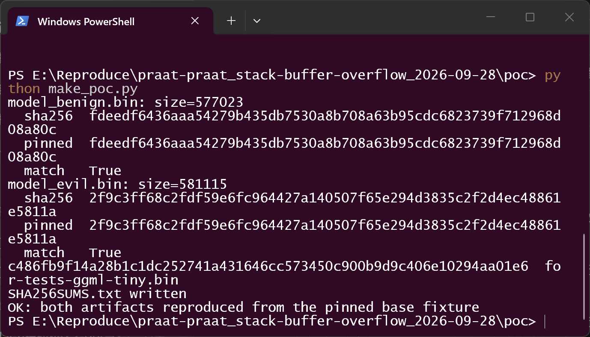
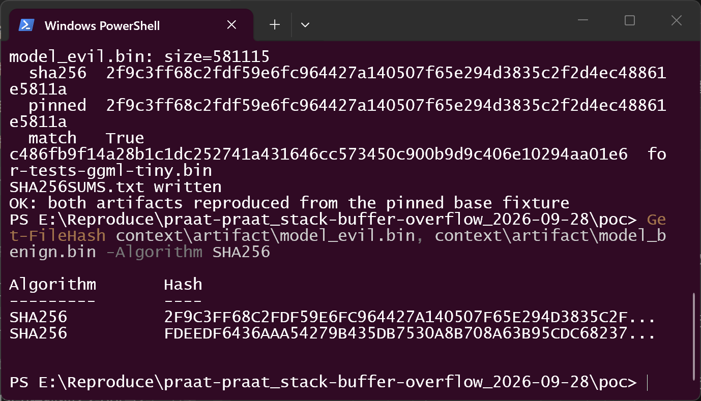
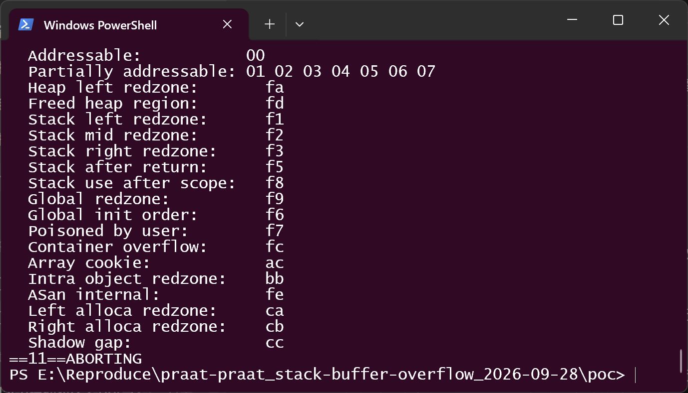
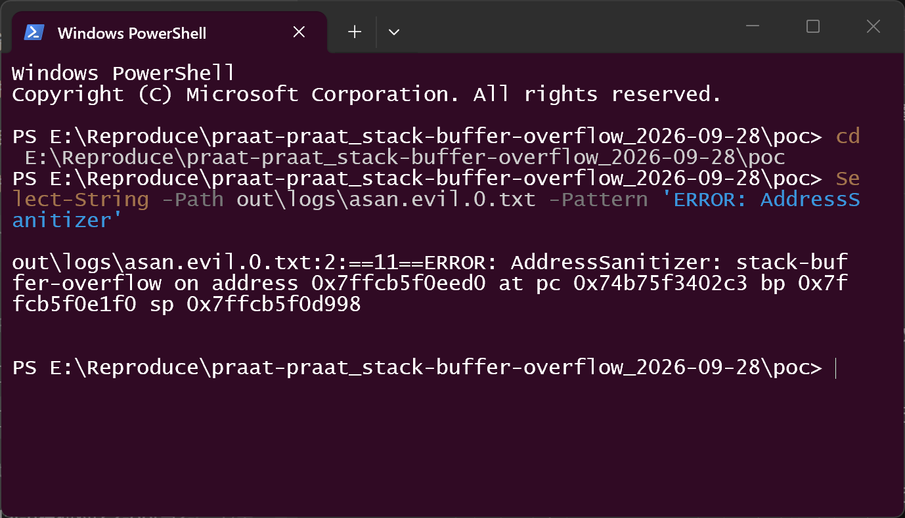
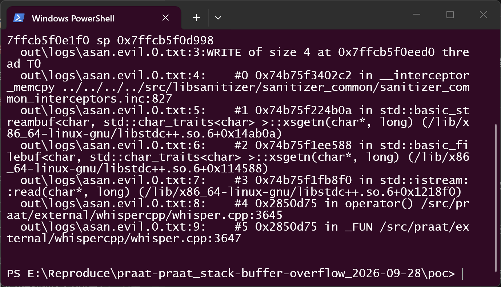
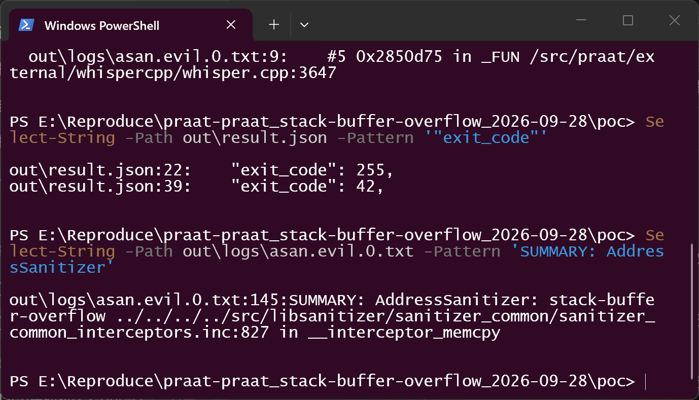
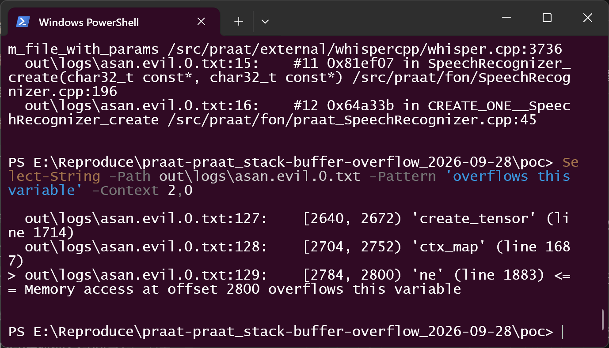
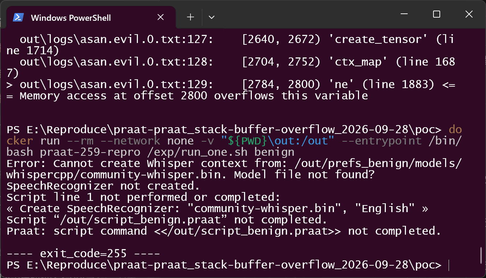

# Praat (vendored whisper.cpp) — Stack Buffer Overflow in the Whisper Speech-to-Text Model Loader

## Summary

Praat (`praat/praat`, now `praat/praat.github.io`) is affected by a stack
buffer overflow in the vendored whisper.cpp model loader
(`external/whispercpp/whisper.cpp`, `whisper_model_load()`). Each tensor
record of a legacy-GGML Whisper `.bin` model begins with a raw `int32
n_dims` taken straight from the file, and the loader then writes `n_dims`
file-supplied 32-bit values into `int32_t ne[4]` — a fixed four-element
array on the stack — with no bound on `n_dims` anywhere in the translation
unit. An attacker who supplies one crafted `.bin` "community Whisper model"
into the folder Praat's own dialog tells users to use, and gets the user to
run Praat's own "Create SpeechRecognizer..." command on it, corrupts the
stack of the loader with attacker-chosen bytes. In an AddressSanitizer
instrumentation build the defect is detected as `stack-buffer-overflow`,
`WRITE of size 4`, at the first byte past `ne`.

## Affected Product

| Field | Value |
|---|---|
| Vendor | Praat (Paul Boersma & David Weenink, University of Amsterdam) — GitHub org `praat` |
| Product | Praat (Doing Phonetics By Computer) |
| Affected versions | Commit `b753a09ba0f4c2385735f08dacd2086088094d69` (master, 2025) tested; full release range not enumerated `[unknown]` |
| Component | `external/whispercpp/whisper.cpp` — `whisper_model_load()`, lines 1874 and 1883–1887 (vendored whisper.cpp, tracking ≈ v1.8.3); reached via `fon/SpeechRecognizer.cpp:189–196` |
| Platform | Linux build used for verification (`praat_barren`, the project's own headless configuration); the loader is platform-independent C++ also compiled into the Windows/macOS builds `[not separately tested]` |
| Vulnerability type | CWE-787: Out-of-bounds Write (stack); secondary pattern CWE-1104 (use of a vendored third-party component left behind upstream) |

## Root Cause

**Location:** `external/whispercpp/whisper.cpp:1874` (read) and `:1883–1887`
(unbounded write loop), inside `whisper_model_load()` — the vendored copy of
whisper.cpp compiled exactly as shipped.

The loader walks the tensor section of a legacy-GGML model in a `while
(true)` loop. Per record it reads three raw `int32`s from the file, the first
being the dimension count, and then immediately uses it as the loop bound
over a fixed four-element stack array:

```c
/* external/whispercpp/whisper.cpp:1870-1887 (tested commit) */
int32_t n_dims;
int32_t length;
int32_t ttype;

read_safe(loader, n_dims);          /* :1874 — raw int32 from the file */
read_safe(loader, length);
read_safe(loader, ttype);

if (loader->eof(loader->context)) { break; }

int32_t nelements = 1;
int32_t ne[4] = { 1, 1, 1, 1 };     /* :1883 — four elements, on the stack */
for (int i = 0; i < n_dims; ++i) {  /* :1884 — n_dims is the loop bound */
    read_safe(loader, ne[i]);       /* :1885 — writes 4 attacker bytes at &ne[i] */
    nelements *= ne[i];
}
```

`read_safe<int>` (`:962–966`, faulting at `:964`) is a thin wrapper over an
unbounded `loader->read` with no failure handling and no knowledge of the
destination's element count; the read callback is the lambda at `:3645`, a
plain `std::istream::read` into whatever address it was handed.

**Nothing bounds `n_dims`.** Grepping `n_dims` in this translation unit
returns only the two read loops that consume it (`:1870–1887` here, and the
same unbounded pattern in the Silero VAD loader at `:5036–5050`). There is no
comparison against the size of `ne`, and no rejection of absurd values.
Because the loop counter is signed, a negative `n_dims` is merely a no-op;
any value ≥ 5 walks off the end of the array, and nothing stops it at any
value. **Upstream whisper.cpp carries exactly this guard** — `if (n_dims < 0
|| n_dims > 4)`, at its line 1894 — so this is a vendored copy that fell
behind upstream, not an unreviewed design.

**Why the input is attacker-controlled and how it reaches the defect.**
Praat's own dialog text (`fon/praat_SpeechRecognizer.cpp:34–38`) instructs
users: *"You can install them into the subfolder 'whispercpp' of the folder
'models' in the Praat preferences folder."* Installing a third-party
"community Whisper model" there and running *Objects ▸ New ▸ Speech-to-text
recognition ▸ "Create SpeechRecognizer..."* builds
`modelPath = theWhisperModelsFolder()/modelName` (`fon/SpeechRecognizer.cpp:189–196`)
and calls `whisper_init_from_file_with_params` (`whisper.cpp:3736`) at
`SpeechRecognizer.cpp:196`. Praat's model/language compatibility check
(`SpeechRecognizer.cpp:142–148`) only compares *names* and runs before the
file is parsed. The crafted file passes every real guard in the loader — the
magic check (`:1495–1503`), the `assert(n_text_state == n_audio_state)`
(`:1521`) and the ftype validity check — because its base is upstream
whisper.cpp's own valid test fixture with one record appended and a single
`int32` edited.

## Proof of Concept

### Prerequisites

- A victim user of Praat's speech-to-text feature who downloads a
  community "Whisper model" file and installs it where Praat's own dialog
  says to put it (`<preferences folder>/models/whispercpp/`), then creates a
  SpeechRecognizer from it. No settings must be changed, no guard disabled.
- Verification environment (disclosed, non-default): Praat built from the
  pinned commit with the project's own makefile in its own headless
  configuration (`make PRAAT_GRAPHICS=barren PRAAT_AUDIO=none`), with
  `-fsanitize=address -fno-omit-frame-pointer -g` supplied **through the
  environment** (`CFLAGS`/`CXXFLAGS`/`LDFLAGS`) because the Linux section of
  the Makefile uses `CFLAGS += ...`/`CXXFLAGS += ...` and a command-line
  assignment would replace the project's flags rather than add to them. No
  source file modified. In batch mode Praat is driven natively without a GUI
  (`sys/praat.cpp:1648–1653`, GUI init skipped at `:1942–1944`), reaching the
  same `CREATE_ONE__SpeechRecognizer_create` callback as the dialog.
- Two validation rounds, stated plainly: the defect was first confirmed
  2026-09-20 in a Docker container on an x86-64 Linux host; for this report
  the reproduction was rebuilt end-to-end on 2026-09-28 from the same pinned
  sources in a Docker Desktop (WSL2) container on a Windows 11 host, with the
  container recipe in the accompanying `poc/` package. All screenshots below
  come from the 2026-09-28 round; artifact hashes are identical across both
  rounds, and the observed signature (faulting frame, overflowed object and
  extent, exit codes) matches the original round.

### Steps to Reproduce

1. Build the two model files from upstream whisper.cpp's test fixture
   `models/for-tests-ggml-tiny.bin` (legacy header + mel filters + vocab,
   zero tensor records): append one tensor record in the documented layout
   (`n_dims i32, name_len i32, ttype i32, ne[n_dims] i32, name bytes, data`)
   for tensor `encoder.ln_post.bias` — benign control with `n_dims = 1`,
   positive with `n_dims = 1024` (one legal dimension followed by filler the
   loop keeps consuming).

   

   The screenshot shows `python make_poc.py` regenerating both artifacts from
   the pinned base fixture and verifying their SHA-256 against the pinned
   values (`match True` for both, "OK: both artifacts reproduced from the
   pinned base fixture").

2. Independently confirm the artifact hashes:

   

3. Place the model where Praat's own dialog instructs — in the verification
   the preferences folder is redirected with `--pref-dir=<prefs>` and the
   file lands at `<prefs>/models/whispercpp/community-whisper.bin` — then run
   Praat's own command in batch mode:

   ```
   praat_barren --pref-dir=<prefs_evil> --run script_evil.praat
   ```

   where `script_evil.praat` is the single line

   ```
   Create SpeechRecognizer: "community-whisper.bin", "English"
   ```

   This is the same callback the GUI menu item invokes.

   

   The screenshot is the live terminal at the end of the positive run: ASan's
   report (written to the collected log and printed by the runner) ends in
   the shadow-byte legend and `==…==ABORTING`; the process exit code is 42.

   

   

   The two screenshots above locate the report header and the top of the
   faulting stack inside the collected report file.

   

   

4. Run the negative control — the same fixture with a well-formed
   `n_dims = 1` record, same install path, same command:

   ```
   praat_barren --pref-dir=<prefs_benign> --run script_benign.praat
   ```

   

### Expected vs Actual

- Expected: a model record declaring an impossible dimension count is
  rejected cleanly by the loader (as current upstream whisper.cpp does), and
  Praat reports "Cannot create Whisper context ...".
- Actual (positive): the process dies inside the loader —
  AddressSanitizer `stack-buffer-overflow`, `WRITE of size 4`, exit code 42:

  ```
  ERROR: AddressSanitizer: stack-buffer-overflow on address ... 
  WRITE of size 4 at ... thread T0
      #0 __interceptor_memcpy
      #3 std::istream::read(char*, long)
      #4 operator()        external/whispercpp/whisper.cpp:3645
      #6 read_safe<int>    external/whispercpp/whisper.cpp:964
      #7 whisper_model_load external/whispercpp/whisper.cpp:1885
      #8 whisper_init_with_params_no_state         :3723
      #9 whisper_init_from_file_with_params_no_state :3659
     #11 SpeechRecognizer_create fon/SpeechRecognizer.cpp:196
     #12 CREATE_ONE__SpeechRecognizer_create fon/praat_SpeechRecognizer.cpp:45

  Address ... located in stack of thread T0 at offset 2800 in frame
      #0 whisper_model_load external/whispercpp/whisper.cpp:1485
    [2784, 2800) 'ne' (line 1883) <== Memory access at offset 2800 overflows this variable
  ```

- Actual (negative control, differs in exactly one `int32`): **0** sanitizer
  reports; Praat reports *"Cannot create Whisper context from:
  ...community-whisper.bin. Model file not found?"*, script stops, exit 255.

  ASan aborts at the **first** out-of-bounds write, so the observed fault is
  one 4-byte write at the first byte past `ne`; the ~1019 further
  attacker-chosen writes the loop would have performed were never executed.
  The observed build is instrumented and is not how Praat ships; what we
  report is a detected memory-safety violation, not an observed crash in a
  shipped binary.

### Sanitized PoC input

Both artifacts are the same 575,451-byte base fixture plus one appended
tensor record; they differ in exactly one `int32`:

```text
base fixture : whisper.cpp models/for-tests-ggml-tiny.bin (magic 'lmgg'),
               sha256 c486fb9f14a28b1c1dc252741a431646cc573450c900b9d9c406e10294aa01e6
appended record (layout: n_dims i32 | name_len i32 | ttype i32 | ne[n_dims] i32
                 | name bytes | data f32[384]):
  benign : n_dims=1, ne=[384], name="encoder.ln_post.bias"
  evil   : n_dims=1024, ne[0]=384, ne[1..1023]=0x41414141 filler,
           name="encoder.ln_post.bias"
  ttype  : 0 (F32);  data: 384 benign float32 values

model_evil.bin   : 581115 bytes  sha256 2f9c3ff68c2fdf59e6fc964427a140507f65e294d3835c2f2d4ec48861e5811a
model_benign.bin : 577023 bytes  sha256 fdeedf6436aaa54279b435db7530a8b708a63b95cdc6823739f712968d08a80c
installed as     : <preferences folder>/models/whispercpp/community-whisper.bin
```

## Impact

- Confidentiality: High (by convention for the primitive) — a linear
  out-of-bounds stack write with attacker-controlled length and contents can
  reach saved registers and the return address; we did not demonstrate
  information disclosure.
- Integrity: High (by convention) — attacker-chosen bytes are written past
  the array into the loader's stack frame; we did not demonstrate control of
  execution, and the build keeps the toolchain default
  `-fstack-protector-strong`.
- Availability: High — the parse of a hostile model crashes the process
  (detected abort under ASan; uninstrumented behavior `[not measured]`).
- Scope: memory corruption inside `whisper_model_load`'s stack frame during
  community-model load. The victim action is the documented install-and-use
  flow for community Whisper models in Praat's own UI.

Honest scoring note: a maintainer who scores only the *measured* effect
(aborted process under instrumentation) would read the evidence as
`C:N/I:N/A:H` (5.5); scoring the delivery channel (model obtained from a
model-sharing site) as `AV:N` gives 8.8. The vector below is the conventional
score for an attacker-controlled stack write, not a measurement.

## Attack Vector and Severity (CVSS v3.1)

| Metric | Value | Rationale |
|---|---|---|
| Attack Vector | Local | The vulnerable operation is a local user opening a local model file with a local application; the file typically arrives over the network from a model-sharing site, but the operation itself is local |
| Attack Complexity | Low | No special conditions; the crafted file passes all existing guards by construction |
| Privileges Required | None | Ordinary unprivileged user installing a community model |
| User Interaction | Required | The victim installs the model file and runs the speech-to-text command |
| Scope | Unchanged | The corruption stays within the Praat process's own stack frame |
| Confidentiality | High | Stack memory corruption primitive with attacker-controlled data |
| Integrity | High | Attacker-chosen bytes written past the array |
| Availability | High | Process aborts inside the loader |

```
Score: 7.8 (High)
Vector: CVSS:3.1/AV:L/AC:L/PR:N/UI:R/S:U/C:H/I:H/A:H
```

## Remediation

1. **Bound `n_dims` before it is used as a loop count.** After
   `read_safe(loader, n_dims)` at `external/whispercpp/whisper.cpp:1874`,
   add the guard upstream whisper.cpp already carries (its line 1894):
   `if (n_dims < 0 || n_dims > 4) { ...; return false; }`. The function
   already returns `false` cleanly on malformed headers (`:1495–1503`), and
   `SpeechRecognizer.cpp:189–196` turns a failed load into Praat's ordinary
   "Cannot create Whisper context" message.
2. **Re-sync the vendored copy.** The defect exists because
   `external/whispercpp/` tracks whisper.cpp ≈ v1.8.3 while upstream has
   since added the guard; refreshing the vendored tree fixes this and
   whatever else upstream has hardened since.
3. **Fix the second copy of the pattern at `:5036–5050`** (Silero VAD
   loader). Praat ships that model in memory, so it is not attacker-reachable
   by this route today, but it is the same unbounded read loop.
4. **Make `read_safe` (`:962–966`) unable to express this bug** — a variant
   that takes the destination's capacity and returns success/failure would
   turn this class of defect into a clean load failure.

Workaround until patched: do not install third-party `.bin` Whisper models
into `<preferences folder>/models/whispercpp/`.

## Timeline

| Date | Event |
|---|---|
| 2026-09-20 | Vulnerability confirmed in an instrumented verification build of the pinned commit (original reproduction campaign) |
| 2026-09-28 | Reproduction independently re-validated end-to-end (Docker, `--network none`); disclosure report prepared |
| 2026-09-28 | Report sent to the maintainer — `[pending: user sends email]` |
| `[pending]` | Maintainer acknowledged |
| `[pending]` | Fix released |
| `[pending]` | Public disclosure |

## References

- Source repository: https://github.com/praat/praat (redirects to the renamed
  `praat/praat.github.io`; tested commit `b753a09ba0f4c2385735f08dacd2086088094d69`)
- Defective file: `external/whispercpp/whisper.cpp` (vendored from
  https://github.com/ggml-org/whisper.cpp, ≈ v1.8.3; upstream guard present at
  upstream's line 1894)
- CWE: https://cwe.mitre.org/data/definitions/787.html (secondary: CWE-1104,
  https://cwe.mitre.org/data/definitions/1104.html)
- Vendor advisory: `[none]` — no SECURITY.md and GitHub private vulnerability
  reporting is disabled for the repository (checked 2026-09-28); vendor site
  directs problem reports to the maintainers by email
- Upstream report: `[pending publication]`

## Disclaimer

This report is provided for defensive and coordination purposes. It contains
no ready-to-run exploit beyond the minimum reproduction information, and no
sensitive infrastructure details. Do not disclose it publicly before the
maintainer has had a reasonable window to fix the issue.

## Screenshot Checklist

All screenshots are real terminal windows (Windows PowerShell on Windows 11
driving Docker Desktop/WSL2 containers), collected 2026-09-28 during the
re-validation round, one command per step. Files live in `screenshots/`
next to this report; supplementary shots are indexed in
`截图与复现指引.md`.

| File | Content |
|---|---|
| `praat-whisper-ggml-ndims-stack-oob-04-make-poc.png` | `python make_poc.py` regenerating both samples from the pinned base fixture; SHA-256 `match True` for both |
| `praat-whisper-ggml-ndims-stack-oob-05-hashes.png` | Independent `Get-FileHash` of both artifacts matching the pinned SHA-256 values |
| `praat-whisper-ggml-ndims-stack-oob-09-asan-live.png` | Live positive run — ASan report tail: shadow-byte legend, `==…==ABORTING` |
| `praat-whisper-ggml-ndims-stack-oob-16-asan-error-line.png` | Report header: `==11==ERROR: AddressSanitizer: stack-buffer-overflow on address …` |
| `praat-whisper-ggml-ndims-stack-oob-13-asan-header-top.png` | `WRITE of size 4 at … thread T0` and top frames (`__interceptor_memcpy`, `std::istream::read`, `whisper.cpp:3645`) |
| `praat-whisper-ggml-ndims-stack-oob-15-asan-summary.png` | `"exit_code": 255` (negative) vs `"exit_code": 42` (positive); `SUMMARY: AddressSanitizer: stack-buffer-overflow … in __interceptor_memcpy` |
| `praat-whisper-ggml-ndims-stack-oob-11-asan-ne.png` | Overflowed variable: `[2784, 2800) 'ne' (line 1883) <== Memory access at offset 2800 overflows this variable` |
| `praat-whisper-ggml-ndims-stack-oob-12-benign-control.png` | Negative control — Praat's own `Cannot create Whisper context … Model file not found?`, `---- exit_code=255 ----`, no sanitizer report |

Collection environment: Windows 11 host, Docker Desktop 29.1.3 (WSL2
backend), container `ubuntu:22.04` + build-essential/llvm-14, product built
from pinned commit `b753a09ba0f4c2385735f08dacd2086088094d69` with the
project's own makefile (`PRAAT_GRAPHICS=barren PRAAT_AUDIO=none`) plus ASan
via environment flags. The earlier confirmation round (2026-09-20) ran the
same pinned source in a Docker container on an x86-64 Linux host; artifact
hashes and the observed signature are identical across rounds.
