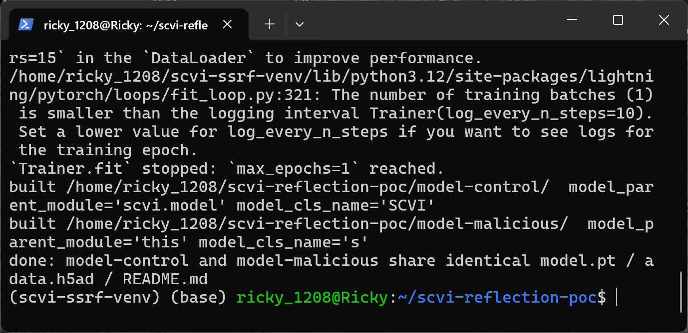
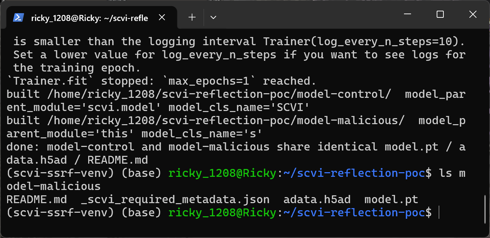
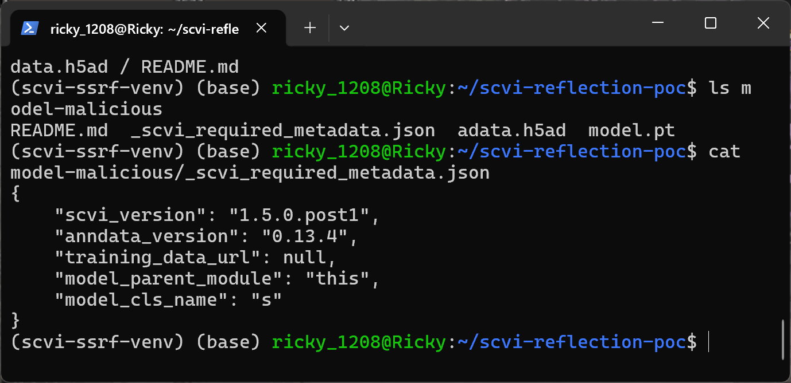
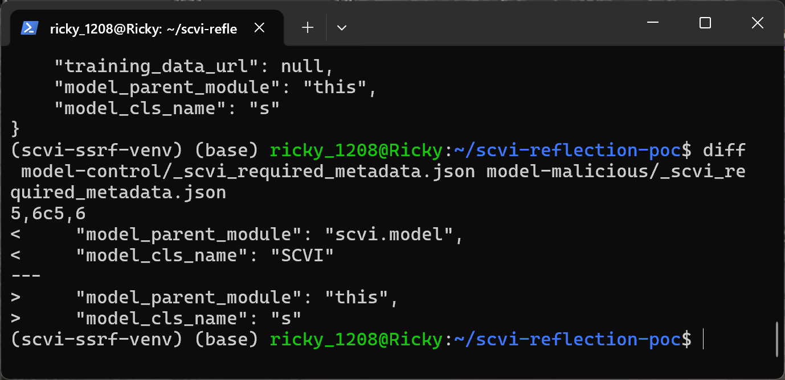
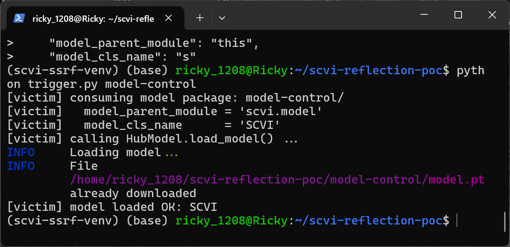
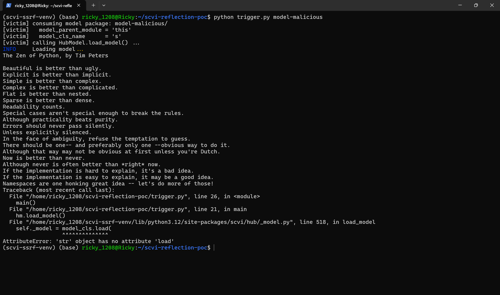
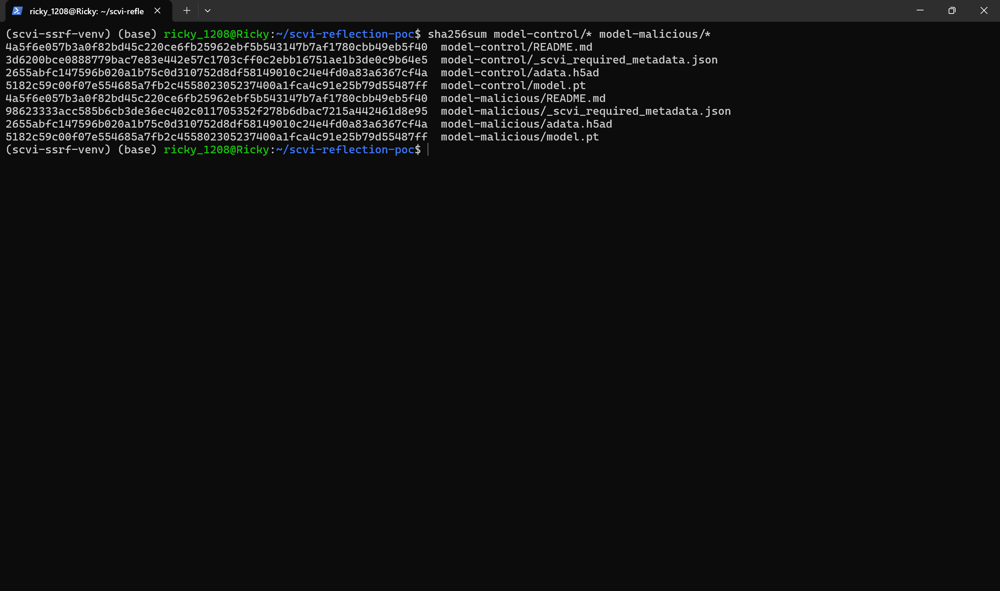

# scvi-tools 1.5.0.post1 — Unsafe Reflection (CWE-470) in HubModel.load_model Metadata Handling

## Summary

scverse scvi-tools 1.5.0.post1 is affected by an unsafe reflection vulnerability in the `HubModel.load_model` component. The `_scvi_required_metadata.json` sidecar shipped inside a scvi-tools Hub model package contains the two strings `model_parent_module` and `model_cls_name`, and `load_model` passes them straight into `importlib.import_module()` and `getattr()` without any allowlist, then invokes `.load()` on whatever object the attacker selected. A model package downloaded from a model hub or received from a third party can therefore trigger the import of any module present in the victim environment and select an arbitrary attribute of it as the model loader; import-time code of the attacker-chosen module executes in the victim's process. The demonstrated witness payload imports the standard-library module `this`, which visibly executes its import-time code — a harmless stand-in for any installed module an attacker might target in a real environment.

## Affected Product

| Field | Value |
|---|---|
| Vendor | scverse |
| Product | scvi-tools |
| Affected versions | 1.5.0.post1 (verified at git commit 8755907d5122f81bba6f54e5c3aa4b06cd3f711f, dated 2026-09-09); all versions whose `HubModel.load_model` resolves `metadata.model_parent_module` / `metadata.model_cls_name` reflectively are presumed affected |
| Component | `src/scvi/hub/_model.py`, `HubModel.load_model` (lines 508-523) |
| Platform | OS-independent; Python >= 3.12 (verified on CPython 3.12.3, Linux x86-64) |
| Vulnerability type | CWE-470: Use of Externally-Controlled Input to Select Classes or Code ('Unsafe Reflection') |

## Root Cause

**Location:** `src/scvi/hub/_model.py:508-523` (`HubModel.load_model`)

`HubModel.__init__` reads the model package's metadata sidecar `_scvi_required_metadata.json`, parses it with `json.loads`, and constructs `HubMetadata(**content_dict)`. The dataclass declares `model_cls_name: str` as required and `model_parent_module: str` with default `"scvi.model"`, but neither field is validated against an allowlist at parse time or at use time. When the consumer calls `load_model()`, the two attacker-controlled strings are used directly as a module path and an attribute name, and the resulting object is immediately used as a model loader:

```python
logger.info("Loading model...")
# get the class name for this model (e.g., TOTALVI)
model_cls_name = self.metadata.model_cls_name
python_module = importlib.import_module(self.metadata.model_parent_module)
model_cls = getattr(python_module, model_cls_name)
if (
    adata is not None
    or os.path.isfile(self._adata_path)
    or os.path.isfile(self._mudata_path)
):
    self._model = model_cls.load(          # line 518: attacker-selected object invoked as loader
        os.path.dirname(self._model_path),
        adata=adata,
        accelerator=accelerator,
        device=device,
    )
```

Both strings originate from the model package, which for the intended Hub workflow is an artifact uploaded by a third party (any Hugging Face model repo carrying scvi-tools metadata, or any model directory received out of band). The attacker thus selects (a) which module the victim's Python process imports — `importlib.import_module` executes the module's top-level code, so any import-time side effect of any module installed in the victim environment is reachable — and (b) which attribute of that module is fetched and invoked as `model_cls.load(<model package dir>, adata=..., accelerator=..., device=...)`, where the first argument is the attacker-supplied package directory. There is no allowlist restricting the choice to the shipped `scvi.model.*` classes, even though the same file's own comment ("get the class name for this model (e.g., TOTALVI)") shows the value was only ever meant to name a scvi-tools model class.

## Proof of Concept

### Prerequisites

- A Python environment with scvi-tools installed (verified with scvi-tools 1.5.0.post1 at commit 8755907d5122f81bba6f54e5c3aa4b06cd3f711f, torch 2.14.1+cpu, anndata 0.13.4, CPython 3.12.3, Ubuntu 24.04 under WSL2).
- A model package directory (the same layout `HubModel.pull_from_hub` produces on disk): `model.pt`, `adata.h5ad`, `README.md`, and `_scvi_required_metadata.json`. The attacker controls the two metadata strings; no Python file is shipped inside the package and the package directory is never added to `sys.path`, so the imported module comes from the victim's own environment.
- The victim action is loading the model, i.e. constructing `HubModel(local_dir=...)` / `HubModel.pull_from_hub(...)` and calling `load_model()`.

### Steps to Reproduce

1. Build twin model packages from one genuine trained SCVI model (`model.train()` then `model.save(..., save_anndata=True)`), so `model.pt`, `adata.h5ad` and `README.md` are byte-identical between the two packages. The only difference is the two metadata strings: the negative control uses `{"model_parent_module": "scvi.model", "model_cls_name": "SCVI"}` and the trigger package uses `{"model_parent_module": "this", "model_cls_name": "s"}`.



Screenshot: `python make_poc.py` trains a minimal genuine SCVI model (1 epoch, synthetic data) and builds `model-control/` and `model-malicious/` side by side, printing the two metadata string pairs written into each package.

2. Inspect the package layout and the attacker-controlled sidecar; verify with `diff` that the two packages differ only in the two metadata strings.



Screenshot: `ls model-malicious` shows the package contains only `README.md`, `_scvi_required_metadata.json`, `adata.h5ad` and `model.pt` — no `.py` file ships with the package.



Screenshot: `cat model-malicious/_scvi_required_metadata.json` shows `model_parent_module` = `this` and `model_cls_name` = `s` — the only attacker input in the whole scenario.



Screenshot: `diff model-control/_scvi_required_metadata.json model-malicious/_scvi_required_metadata.json` shows exactly the two strings `model_parent_module` and `model_cls_name` differ between the twin packages.

3. Load the negative-control package: `HubModel(local_dir="model-control").load_model()` resolves `scvi.model` / `SCVI` and the genuine model loads cleanly, establishing that a normal package does not trigger any anomalous behavior.



Screenshot: `python trigger.py model-control` ends with `model loaded OK: SCVI`, no import side effect, no error.

4. Load the trigger package with the attacker strings.



Screenshot: `python trigger.py model-malicious` — after scvi-tools logs `Loading model...`, the Zen of Python is printed to the victim's terminal (the import-time side effect of the metadata-chosen module `this`), and the traceback terminates at `scvi/hub/_model.py`, line 518, in `load_model` at the `model_cls.load(` call with `AttributeError: 'str' object has no attribute 'load'`, proving `importlib.import_module("this")` and `getattr(<module this>, "s")` both succeeded on the attacker's strings and the selected object was then invoked as the model loader.

5. Verify the shared files are byte-identical across the twin packages, so the behavioral difference is attributable to the metadata strings alone.



Screenshot: `sha256sum model-control/* model-malicious/*` — `adata.h5ad`, `model.pt` and `README.md` hash identically in both packages; only `_scvi_required_metadata.json` differs.

### Expected vs Actual

- Expected: `model_parent_module` / `model_cls_name` are data, not code. `load_model` should resolve the class name against scvi-tools' own model registry (or an allowlist of `scvi.model.*` classes) and refuse any other value.
- Actual: the strings are passed to `importlib.import_module` and `getattr` unvalidated. Importing the chosen module executes its import-time code in the victim's process (demonstrated: module `this` prints the Zen of Python), and the attacker-chosen attribute is invoked as `model_cls.load(<attacker package dir>, adata=..., accelerator=..., device=...)` (demonstrated: the `this.s` string reaches line 518 and fails there because a string has no `load` — with an attacker-selected loader object instead of a string, the call proceeds).

### Sanitized PoC input

```json
{"scvi_version": "1.5.0.post1", "anndata_version": "0.13.4", "training_data_url": null, "model_parent_module": "this", "model_cls_name": "s"}
```

Negative control differs only in the last two values: `"model_parent_module": "scvi.model", "model_cls_name": "SCVI"`.

## Impact

- Confidentiality: High — with a loader gadget available in the victim environment, the attacker-selected code runs inside the victim process and can exfiltrate data; even the import primitive alone can activate attacker-planted or environment-dependent module state.
- Integrity: High — the attacker-selected loader is invoked with the attacker-supplied package directory as its first argument, and import-time code of the chosen module executes unconditionally in the victim process.
- Availability: High — arbitrary import-time code can crash the process or exhaust resources.
- Scope: code-execution primitive via unsafe reflection (arbitrary import + arbitrary attribute selection + attacker-directed loader invocation). The public witness payload (`this`) executes only a print; full weaponization depends on which importable modules/gadgets exist in the victim environment, but no scvi-tools-side boundary remains that would stop the selection.

## Remediation

Treat the two metadata strings as untrusted data: resolve `model_cls_name` against scvi-tools' model registry (the `MODEL_REGISTRY` the package already maintains) or an explicit allowlist of the `scvi.model` / `scvi.external` classes the library ships, and reject any `model_parent_module` outside that allowlist before calling `importlib.import_module` at `src/scvi/hub/_model.py:511`. As a workaround until a fix is released, do not load model packages whose `_scvi_required_metadata.json` names a module other than `scvi.model` (or another first-party scvi-tools namespace), and prefer loading only packages from trusted uploaders.

## References

- Source repository: https://github.com/scverse/scvi-tools
- Verified commit: https://github.com/scverse/scvi-tools/commit/8755907d5122f81bba6f54e5c3aa4b06cd3f711f
- Vulnerable file: https://github.com/scverse/scvi-tools/blob/8755907d5122f81bba6f54e5c3aa4b06cd3f711f/src/scvi/hub/_model.py#L508-L523
- CWE: https://cwe.mitre.org/data/definitions/470.html
- Vendor advisory: [none]
