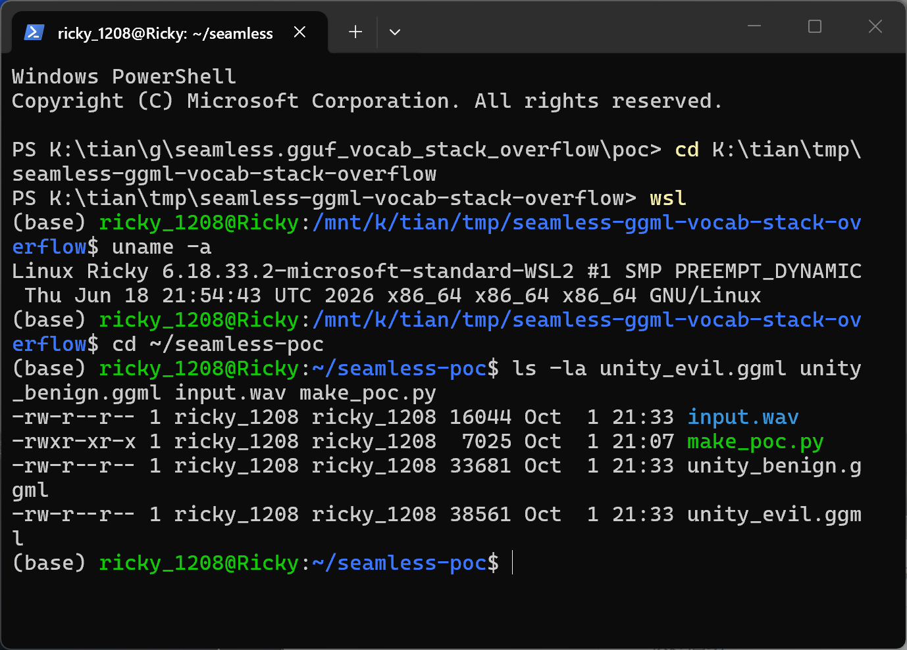
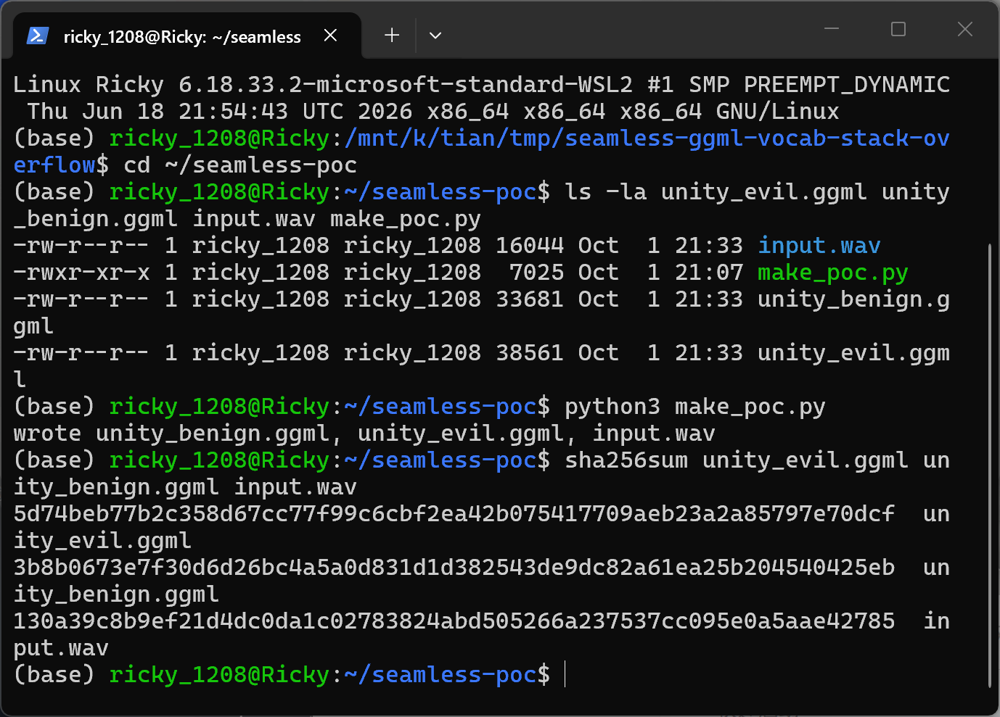
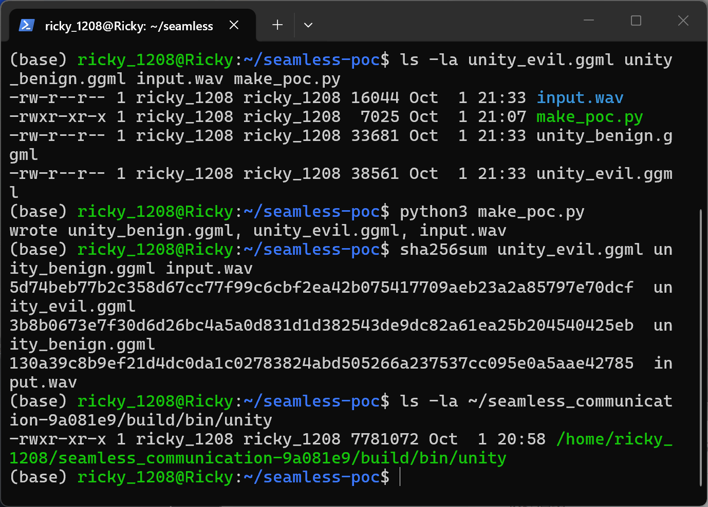
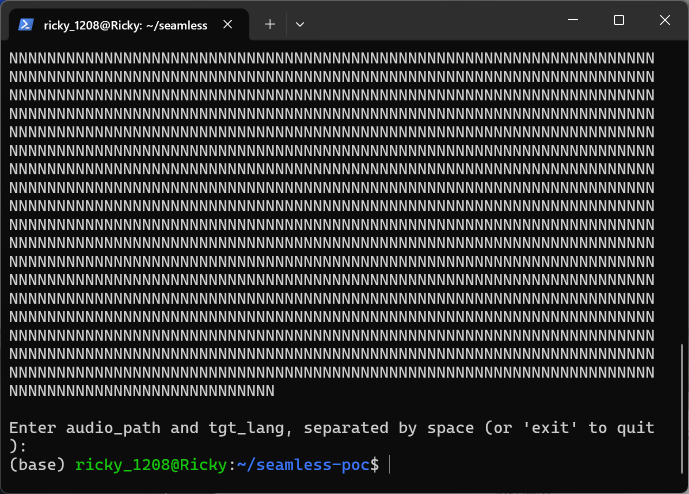
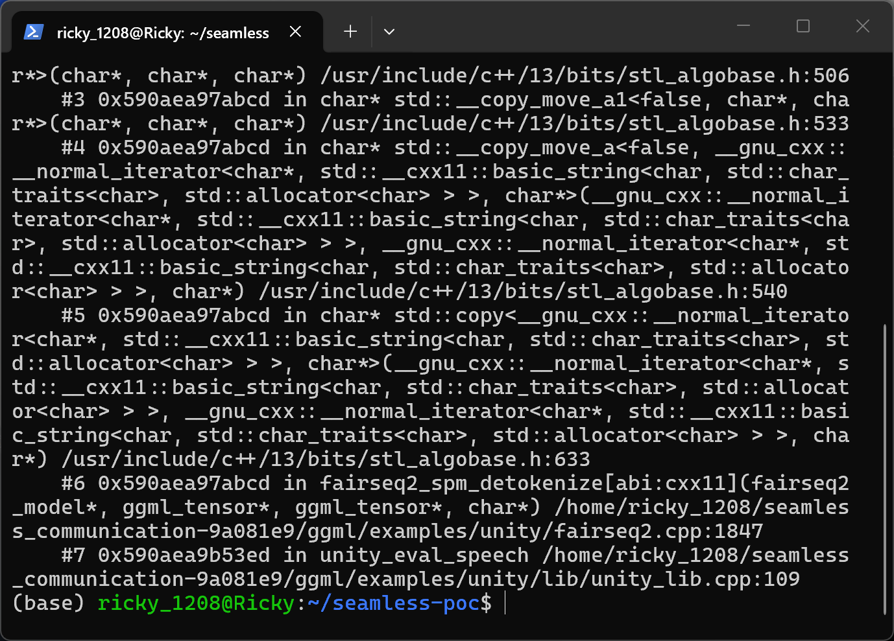
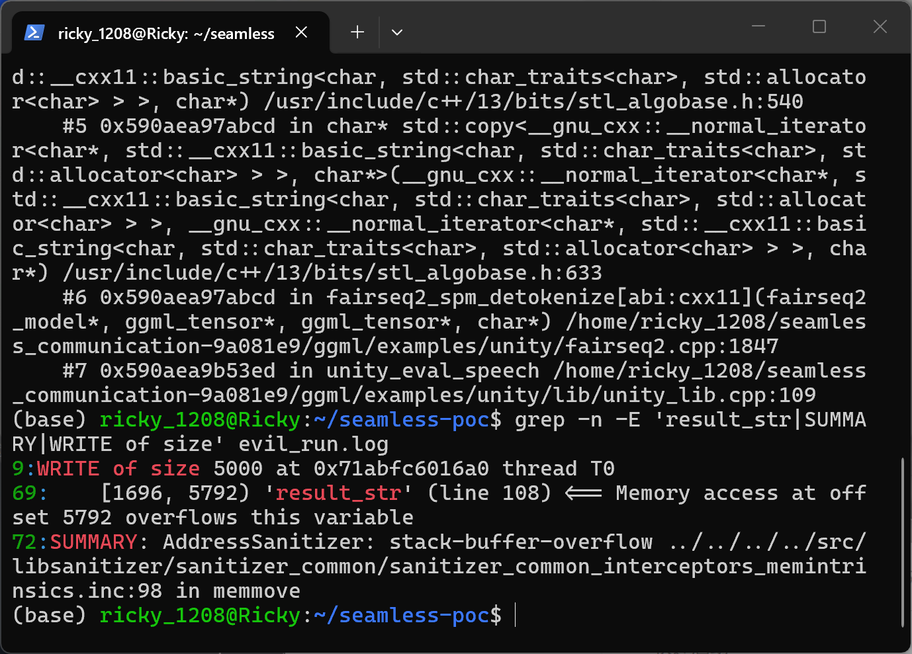

# Meta seamless_communication (UnitY GGML example) — Stack-based Buffer Overflow in the SPM Detokenizer

## Summary

Meta's `seamless_communication` repository (commit `9a081e9`, the tip of `main` at the time of writing) ships a C++ UnitY inference entry for GGML-format SeamlessM4T models under `ggml/examples/unity/`. The detokenizer `fairseq2_spm_detokenize()` copies each detokenized vocabulary-token string, byte by byte and without any length check, into a caller-provided fixed-size buffer, and both result-collecting call sites in `unity_lib.cpp` hand it a 4096-byte buffer (`char result_str[4096]`) living on the stack of the inference frame. The GGML model loader reads token strings straight from the model file, so an attacker-supplied model whose final vocabulary entry is a single 5000-byte token makes the beam-search decoder emit that token and the detokenizer write 5000 bytes into the 4096-byte stack buffer — a contiguous 904-byte stack out-of-bounds write on the inference output path, demonstrated under AddressSanitizer with a clean negative control. A victim who runs the Unity GGML binary (or any application embedding `unity_lib`) on a model file obtained from a model hub or another third party has the stack of the process corrupted with attacker-controlled bytes.

## Affected Product

| Field | Value |
|---|---|
| Vendor | Meta (Facebook Research) |
| Product | seamless_communication (UnitY GGML example / `unity_lib`, consumed via the `unity` CLI and the `fairseq2_cpp`/`unity_lib` libraries) |
| Affected versions | git commit `9a081e935c29c6b1e0e05bcbf3fcb623ad306524` (tip of `main` at time of writing); no fixed release is known (`[unknown]`) |
| Component | `ggml/examples/unity/lib/unity_lib.cpp` (`unity_eval_speech`, `unity_eval_text`) and `ggml/examples/unity/fairseq2.cpp` (`fairseq2_spm_detokenize`) |
| Platform | Linux x86_64 (verified on WSL2 Ubuntu 24.04, gcc 13.3); any platform supported by the vendored ggml build |
| Vulnerability type | CWE-121: Stack-based Buffer Overflow |

## Root Cause

**Location:** `ggml/examples/unity/fairseq2.cpp:1847` (`fairseq2_spm_detokenize`, the score-collecting overload), with the vulnerable call sites at `ggml/examples/unity/lib/unity_lib.cpp:108-109` (`unity_eval_speech`) and `unity_lib.cpp:173-175` (`unity_eval_text`).

The caller allocates a fixed 4096-byte stack buffer and passes it to the detokenizer without any way for the callee to know the capacity:

```cpp
// ggml/examples/unity/lib/unity_lib.cpp:107-109 (unity_eval_speech)
// Collect result string
char result_str[4096];
std::pair<std::vector<std::string>, std::vector<float>> p = fairseq2_spm_detokenize(&model, tokens, hypo[0].step_scores, (char*)&result_str);
```

The detokenizer appends every token's text to that buffer with an unbounded `std::copy`, advancing `out` by the token length each iteration; the only conditional removal is one leading space on the first token:

```cpp
// ggml/examples/unity/fairseq2.cpp:1841-1853 (loop body of fairseq2_spm_detokenize)
std::string token = no_tgt_vocab ? model->vocab.id_to_token.at(id).text : model->tgt_vocab.id_to_token.at(id).text;
float score = ggml_get_f32_1d(scores, i+2); // 2 is prefix size
...
// Skip the first space outputted.
auto begin = token.begin();
if (i == 0 && token.size() > 0 && token[0] == ' ') begin += 1;
std::copy(begin, token.end(), out);
std::size_t n = token.end() - begin;
written += n;
out += n;
```

`token` comes from `model.vocab.id_to_token.at(id).text`, i.e. verbatim from the vocabulary section of the model file. In the loader (`ggml/examples/unity/model_loader.cpp:126-166`) the vocabulary is stored as one packed string plus a per-token length array serialized as **`int8` values**: `std::int8_t* lengths = (std::int8_t*)lengths_tensor->data;` and `std::string word = packed_vocab.substr(offset, lengths[i]);`. Two properties of this format make the attack possible with a single vocabulary entry: (1) every token string is attacker-controlled bytes with no length limit enforced by the loader, and (2) a final token whose byte length is 5000 has its length truncated to `5000 & 0xFF = -120` as `int8`, the negative value is sign-extended to a huge `size_t` count, and `std::string::substr` clamps that count to the end of the packed string — so as long as the over-long token is the last entry of the packed vocabulary, it loads intact as one 5000-byte token string.

At inference time the beam-search decoder in `generate_sequence()` chooses which vocabulary id to emit; the PoC model's `final_proj.bias` (also read raw from the file) ranks the malicious token id highest by a fixed margin, so every decoding step deterministically emits it. `unity_eval_speech()` then drops the two prefix tokens with `ggml_slice(model.ctx, hypo[0].seq, 0, 2, 0)` and passes the generated tokens to `fairseq2_spm_detokenize()`, which starts copying the 5000-byte token into `result_str[4096]` — 904 bytes past the end of the stack buffer, into the redzone and beyond. The dangerous action happens entirely after model parsing, on the inference output path; no parser-internal bug is involved.

The identical unbounded call pattern exists in the text-to-text entry `unity_eval_text()` (`unity_lib.cpp:173-175`); in the current code that site slices out only the prefix tokens (`ggml_slice(hypo[0].seq, 0, 0, token_offset)`), so the reachable trigger demonstrated here is the speech entry `unity_eval_speech()` — the default mode of the `unity` CLI — while the text site documents the same broken buffer contract one refactor away from being reachable.

## Proof of Concept

### Prerequisites

- Linux x86_64 with `build-essential` (gcc/g++ 13), `cmake` >= 3.28, `pkg-config`, `libsndfile1-dev` (verified on WSL2 Ubuntu 24.04).
- `seamless_communication` source pinned to commit `9a081e935c29c6b1e0e05bcbf3fcb623ad306524` (codeload tarball, no patching).
- `poc/make_poc.py` (Python 3, standard library only) — generates the malicious model `unity_evil.ggml`, the negative control `unity_benign.ggml`, and the 16 kHz mono test clip `input.wav`. Both models are loadable, runnable UnitY GGML models whose only difference is the final vocabulary token: `b"P" * 5000` (evil) vs `b"N" * 120` (benign). SHA-256 sums are in `poc/SHA256SUMS.txt`.

### Steps to Reproduce

1. Build the Unity GGML entry from the pinned source with AddressSanitizer:

```bash
cd ~/seamless_communication-9a081e9 && cmake -S ggml -B build -DGGML_BUILD_EXAMPLES=ON -DGGML_SANITIZE_ADDRESS=ON -DCMAKE_BUILD_TYPE=RelWithDebInfo && cmake --build build -j8 --target unity
```


Screenshot: the real WSL2 Ubuntu 24.04 terminal (`uname -a`) used for every command below.

2. Generate the two model files and the test audio:

```bash
cd ~/seamless-poc && python3 make_poc.py
```


Screenshot: `python3 make_poc.py` writes `unity_benign.ggml`, `unity_evil.ggml`, `input.wav`. The evil file is exactly 4880 bytes larger (5000 − 120), the size of the single over-long vocabulary token.



Screenshot: the four PoC files in the working directory.

3. Verify the sample hashes (must match `poc/SHA256SUMS.txt`):

```bash
sha256sum unity_evil.ggml unity_benign.ggml input.wav
```



Screenshot: `5d74beb7…dcf` (evil), `3b8b0673…5eb` (benign), `130a39c8…785` (wav).

4. Confirm the freshly built Unity GGML entry exists:

```bash
ls -la ~/seamless_communication-9a081e9/build/bin/unity
```



Screenshot: `build/bin/unity` (7,781,072 bytes, ASan-instrumented) built from the pinned commit.

5. Negative control — run the same inference entry on the benign model (final token `N` × 120, everything else identical). The run completes: the model loads, the encoder and beam search run, the detokenized transcription (a chain of the 120-byte `N` token) is printed, and the process returns to the shell with no sanitizer report:

```bash
ASAN_OPTIONS=detect_leaks=0 ~/seamless_communication-9a081e9/build/bin/unity -m unity_benign.ggml -M 64 < in.txt
```



Screenshot: the benign run prints the detokenized transcription and exits cleanly (`detect_leaks=0` only silences unrelated leak reports of the example's `main()`, which never frees the model).

6. Trigger — run the same command against the malicious model:

```bash
ASAN_OPTIONS=detect_leaks=0 ~/seamless_communication-9a081e9/build/bin/unity -m unity_evil.ggml -M 64 < in.txt
```



Screenshot: AddressSanitizer's stack trace — frame #6 is `fairseq2_spm_detokenize` at `fairseq2.cpp:1847` (the unbounded `std::copy`) and frame #7 is `unity_eval_speech` at `unity_lib.cpp:109` (the `result_str[4096]` caller), reached through `main` after the model was fully parsed and the encoder/beam search had run.



Screenshot: `grep -n -E 'result_str|SUMMARY|WRITE of size' evil_run.log` — `9:WRITE of size 5000`, `69: [1696, 5792) 'result_str' (line 108) <== Memory access at offset 5792 overflows this variable`, `72:SUMMARY: AddressSanitizer: stack-buffer-overflow`. Offset 5792 is exactly `1696 + 4096`, i.e. the first byte past the end of `result_str`.

### Expected vs Actual

- Expected: the detokenizer must never write more than the caller's buffer; a model vocabulary entry, however long, cannot corrupt the stack of the inference path.
- Actual: the first detokenized token alone is 5000 bytes; `std::copy` writes 5000 attacker-controlled bytes into the 4096-byte stack buffer `result_str`, 904 bytes out of bounds, and AddressSanitizer aborts with `stack-buffer-overflow`. The crash reproduced 3/3 runs; the benign control ran clean 2/2 runs.

### Sanitized PoC input

```text
unity_evil.ggml   sha256 5d74beb77b2c358d67cc77f99c6cbf2ea42b075417709aeb23a2a85797e70dcf  (38561 bytes)
unity_benign.ggml sha256 3b8b0673e7f30d6d26bc4a5a0d831d1d382543de9dc82a61ea25b204540425eb  (33681 bytes)
input.wav         sha256 130a39c8b9ef21d4dc0da1c02783824abd505266a237537cc095e0a5aae42785  (16044 bytes, 16 kHz mono sine)
stdin line        "input.wav unk"
```

Both model files follow the custom GGML serialization consumed by `load_fairseq2_ggml_file()` (file magic `0x67676d6c`; despite the legacy name this is not GGUF). They are minimal, self-contained UnitY models: an 8-token vocabulary, a zero-weight single-projection speech encoder (`d_model = 32`), a layer-free decoder, and a `final_proj.bias` that ranks token id 7 (the over-long final vocabulary token) highest so the beam search deterministically emits it.

## Impact

- Confidentiality: High — the overflow contiguously overwrites 904 bytes of stack adjacent to `result_str` with attacker-chosen bytes; depending on layout this reaches pointers, scores and control data on the inference frame, and the same primitive can leak into the returned transcription buffer contents.
- Integrity: High — attacker-controlled bytes land out of bounds on the stack; ASan confirms a deterministic write primitive, and without ASan the corruption is silent unless it hits a canary/return address.
- Availability: High — the process aborts deterministically (ASan) or crashes on corrupted stack state in non-instrumented builds.
- Scope: memory corruption confined to the victim process (stack buffer overflow, CWE-121).

## Remediation

Pass the buffer capacity into `fairseq2_spm_detokenize()` (e.g. a `std::size_t out_size` parameter) and clamp each `std::copy` to the remaining space, or replace the raw `char result_str[4096]` + `char*` interface with `std::string`/`std::vector<char>` accumulation inside the detokenizer; additionally, bound token string lengths at load time in `model_loader::load_vocab()` (reject `lengths[i]` that do not fit in `int8` semantics or that exceed a sane maximum), and validate in `load_vocab` that `offset + lengths[i]` stays within `packed_vocab` instead of relying on `substr` clamping. Until a fixed revision exists, only run the Unity GGML example on model files whose provenance is trusted.


## References

- Source repository: https://github.com/facebookresearch/seamless_communication (commit `9a081e935c29c6b1e0e05bcbf3fcb623ad306524`)
- Vulnerable files: `ggml/examples/unity/lib/unity_lib.cpp`, `ggml/examples/unity/fairseq2.cpp`, `ggml/examples/unity/model_loader.cpp`
- Upstream report: `[pending publication]`
- CWE: https://cwe.mitre.org/data/definitions/121.html
- Vendor advisory: `[none]`
