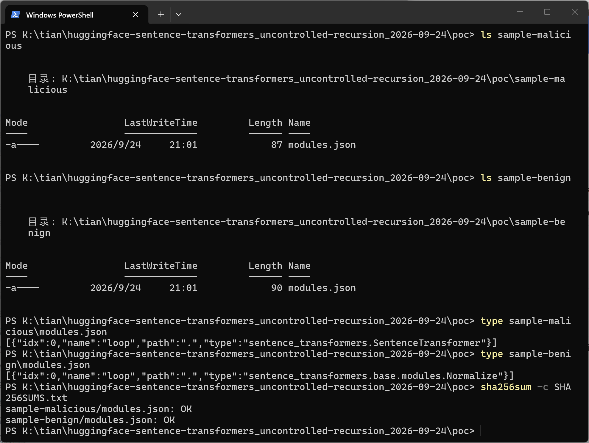
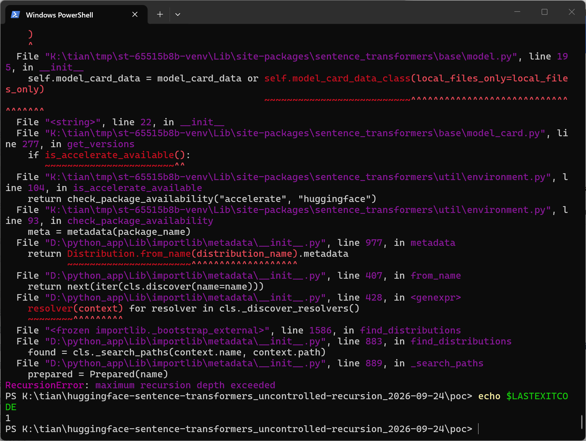
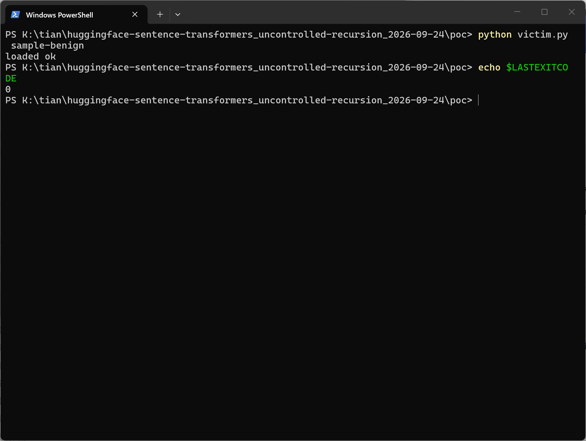

# sentence-transformers v6.1.0 — Uncontrolled Recursion (Load-time DoS) in modules.json Module Resolution

## Summary

Hugging Face sentence-transformers (verified on commit 65515b8b32f0e4ca2e3ab85a7722cd97a12a65e8; the same defective code is present in release v6.1.0) is affected by an uncontrolled recursion in the `modules.json` module-resolution path of `SentenceTransformer`. A model directory whose `modules.json` declares a module of type `sentence_transformers.SentenceTransformer` with `path="."` causes `SentenceTransformer(model_dir)` to instantiate the model class on the very directory being loaded, re-entering the loader without any depth or cycle check until the Python recursion limit is exhausted (`RecursionError`, process terminates). No attacker-supplied code executes; the impact is availability only.

## Affected Product

| Field | Value |
|---|---|
| Vendor | Hugging Face |
| Product | sentence-transformers |
| Affected versions | commit 65515b8b32f0e4ca2e3ab85a7722cd97a12a65e8 (2026-09-17); defective lines confirmed present in release v6.1.0 (published 2026-09-18). No fixed release known at the time of writing. |
| Component | `SentenceTransformer` model loading — `sentence_transformers/util/misc.py:214-215` and `sentence_transformers/base/model.py:1222-1231, 1287-1295` |
| Platform | Any (original verification: ubuntu:22.04 container; screenshot capture 2026-09-24: Windows 11 x64, Python 3.13.5) |
| Vulnerability type | CWE-674: Uncontrolled Recursion |

## Root Cause

**Location 1 — namespace trust shortcut:** `sentence_transformers/util/misc.py:214-215` (`_load_module_class_from_ref`)

```python
if class_ref.startswith("sentence_transformers."):
    return import_from_string(class_ref)
```

Any `type` value beginning with `sentence_transformers.` is imported as a library-internal class and returns *before* the `trust_remote_code` gate that guards third-party refs. There is no check that the referenced class is a legitimate leaf `Module` — in particular, the top-level model class `sentence_transformers.SentenceTransformer` itself is accepted as a module type.

**Location 2 — per-module load:** `sentence_transformers/base/model.py:1222-1231, 1287-1295` (`_load_modules` of the model class). The class ref is resolved and instantiated per `modules.json` entry:

```python
class_ref = module_config["type"]
module_class: type[Module] = self._load_module_class_from_ref(
    class_ref, model_name_or_path, trust_remote_code, revision, model_kwargs,
    token=token, cache_folder=cache_folder, local_files_only=local_files_only,
)
```

and the model-internal `path` is then resolved and handed to `module_class.load()`:

```python
local_path = load_dir_path(
    model_name_or_path=model_name_or_path,
    subfolder=module_config["path"],
    token=token, cache_folder=cache_folder,
    revision=revision, local_files_only=local_files_only,
)
module = module_class.load(local_path)
```

The `path` value is taken from the model's own `modules.json` without validating that it is not the model root itself (or an ancestor of it). With `path="."`, `local_path` is the directory currently being loaded; instantiating `SentenceTransformer` on it re-reads the same `modules.json` and re-enters this same code path. The recursion is mutual (`__init__` → `_load_module` → `SentenceTransformer(...)` → `__init__` → …), unbounded, and driven entirely by library code — no custom or third-party module code is involved.

## Proof of Concept

> Two verification rounds are recorded in this report: the **original verification** (clean ubuntu:22.04 container, sentence-transformers installed from commit 65515b8b) and the **screenshot capture round** (Windows 11 x64, Python 3.13.5 venv, sentence-transformers 6.1.0.dev0 built from the same pinned commit, torch 2.14.0, transformers 5.17.0, 2026-09-24). `path="."` has identical semantics on both platforms. Sample hashes are tracked per round in `poc/SHA256SUMS.txt` (capture round); the original round's sample hash values were not retained — its `modules.json` payload is byte-identical to the one generated here.

### Prerequisites
- A clean install of sentence-transformers at commit 65515b8b32f0e4ca2e3ab85a7722cd97a12a65e8 (defective code also present in v6.1.0).
- The victim executes `SentenceTransformer(model_path)` on the crafted directory — the exact loading call used by upstream's own tests.

### Steps to Reproduce
1. Generate the malicious and benign-control model directories with `poc/make_poc.py` (stdlib only; equivalent minimal generator below). The two samples are identical except for the single attack field `type`; neither contains any code file:

```python
import json, os, sys

model_dir = sys.argv[1] if len(sys.argv) > 1 else "sample-malicious"
os.makedirs(model_dir, exist_ok=True)
with open(os.path.join(model_dir, "modules.json"), "w") as f:
    json.dump(
        [{"idx": 0, "name": "loop",
          "path": ".",
          "type": "sentence_transformers.SentenceTransformer"}],
        f,
        separators=(",", ":"),
    )
print("written:", model_dir)
```


Both sample directories contain only `modules.json`; the malicious payload line is highlighted; `sha256sum -c` verifies both files against `poc/SHA256SUMS.txt`.

2. The victim load call (`poc/victim.py`) — the exact upstream test usage:

```python
from sentence_transformers import SentenceTransformer

loaded_model = SentenceTransformer(sys.argv[1])
print("loaded ok")
```

3. Load the malicious sample:

```bash
python victim.py sample-malicious ; echo "exit=$?"
```


Environment identification (Python 3.13.5, sentence-transformers 6.1.0.dev0 built from the pinned commit), then the unhandled traceback: `SentenceTransformer.__init__` re-enters the loader via `path="."` until `RecursionError: maximum recursion depth exceeded`, process exits non-zero. The screenshot elides 5,312 lines of repeating recursion frames (marked inline); the complete 5,376-line traceback is preserved verbatim in `poc/transcripts/02-crash.txt`.

4. Control test — the identical directory with only the `type` field changed to a leaf module (`sentence_transformers.base.modules.Normalize`, the canonical import path at this commit):


The control prints `loaded ok` and exits 0, proving the crash is caused by the self-referential module type rather than the environment.

### Expected vs Actual
- Expected: the model loads like any other valid model directory.
- Actual: `SentenceTransformer` re-reads the same `modules.json` via `path="."` and re-instantiates itself until the recursion limit is hit — a real, unhandled `RecursionError`. Original verification (Docker ubuntu:22.04 harness): process exit code 86. Screenshot capture round (Windows 11, Python 3.13.5): unhandled `RecursionError`, exit code 1. The benign control exits 0 in both rounds.

### Sanitized PoC input

```text
modules.json (sole crafted file; no code files shipped):
[{"idx":0,"name":"loop","path":".","type":"sentence_transformers.SentenceTransformer"}]
```

## Impact
- Confidentiality: None — no data is read or exfiltrated.
- Integrity: None — no attacker code executes; the loop is driven by the library instantiating its own class.
- Availability: High — the loading process dies with an unhandled `RecursionError`/stack exhaustion. Any service that resolves a model directory or Hub repository nominated by another party (model-hosting platforms, inference endpoints, batch embedding pipelines, CI loading community models) loses the worker/load call.
- Scope: deterministic process abort on load; no memory corruption, no code execution.

## Attack Vector and Severity (CVSS v3.1)

| Metric | Value | Rationale |
|---|---|---|
| Attack Vector | N (Network) | The common case is `SentenceTransformer("<owner>/<repo>")`, where the library itself fetches the crafted `modules.json` from the Hub. A locally delivered directory variant scores AV:L (5.5). |
| Attack Complexity | L (Low) | One crafted JSON entry; deterministic reproduction. |
| Privileges Required | N (None) | Attacker only needs to publish/possess the model directory. |
| User Interaction | R (Required) | Victim must issue the load call on the malicious model. |
| Scope | U (Unchanged) | Impact confined to the loading process. |
| Confidentiality | N (None) | No information disclosure. |
| Integrity | N (None) | No modification of data or state. |
| Availability | H (High) | Unhandled `RecursionError`, process abort. |

```
Score: 6.8 (Medium)
Vector: CVSS:3.1/AV:N/AC:L/PR:N/UI:R/S:U/C:N/I:N/A:H
```

Assumption note: AV:N is chosen because the library fetches remote model repos by id over the network; if the delivery is strictly a local directory the same weakness scores 5.5 (AV:L) — both Medium.

## Remediation

Any one of the following at the module-resolution point closes the loop:

1. Reject module `type` refs that resolve to the top-level model class itself (`sentence_transformers.SentenceTransformer`, or any imported class that is the loading class / an alias-subclass of it).
2. Cycle detection: track `(resolved_path, class_ref)` pairs within a single model load and raise a descriptive error on a repeat visit; optionally add a hard depth cap.
3. Path validation: refuse a module `path` that resolves to the model root itself (`"."`) or to any ancestor of the currently-loading directory.

Option 2 or 3 is the most general and converts the raw `RecursionError` into a clear, actionable error message. Workaround until patched: validate third-party `modules.json` files (reject module types starting with `sentence_transformers.SentenceTransformer`) before loading untrusted models.


## References
- Source repository: https://github.com/huggingface/sentence-transformers
- Vulnerable code (commit): https://github.com/huggingface/sentence-transformers/blob/65515b8b32f0e4ca2e3ab85a7722cd97a12a65e8/sentence_transformers/util/misc.py#L214-L215
- Upstream report: [pending publication — to be filled with the GHSA/issue URL once available]
- CWE: https://cwe.mitre.org/data/definitions/674.html
- Vendor advisory: [none]
