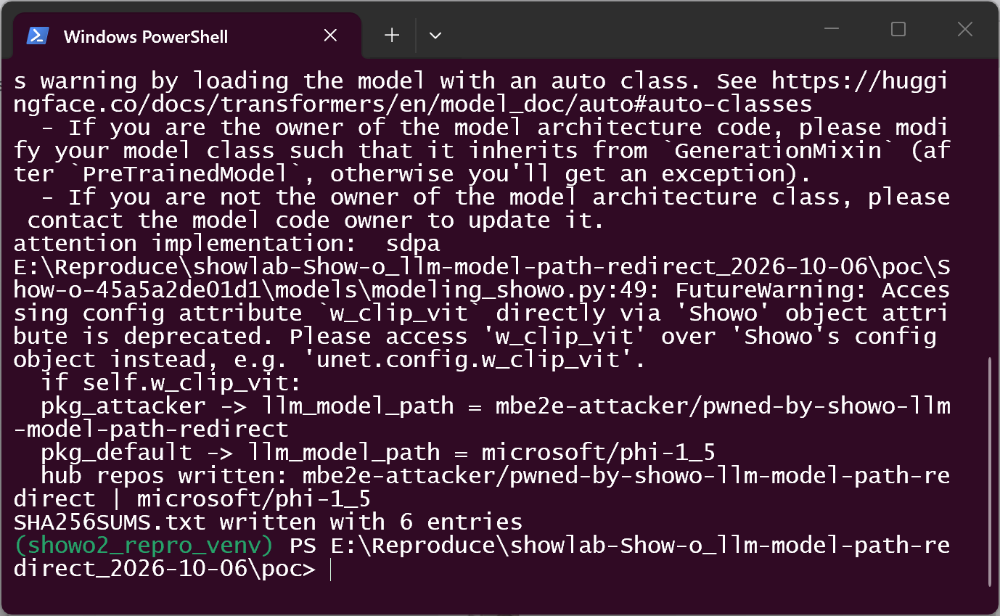
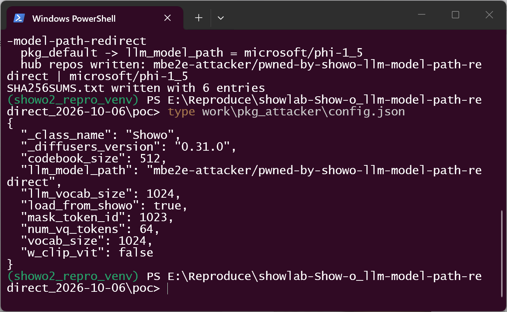
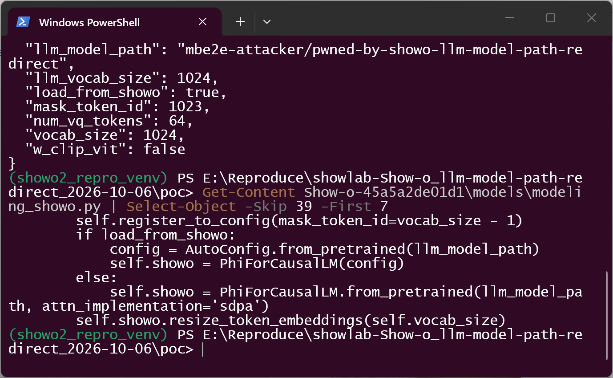
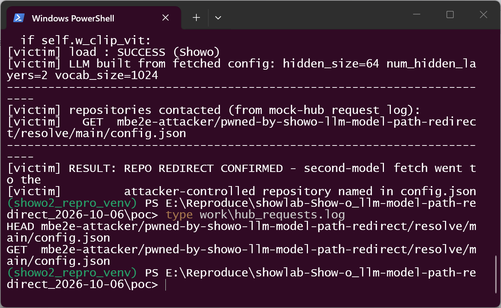
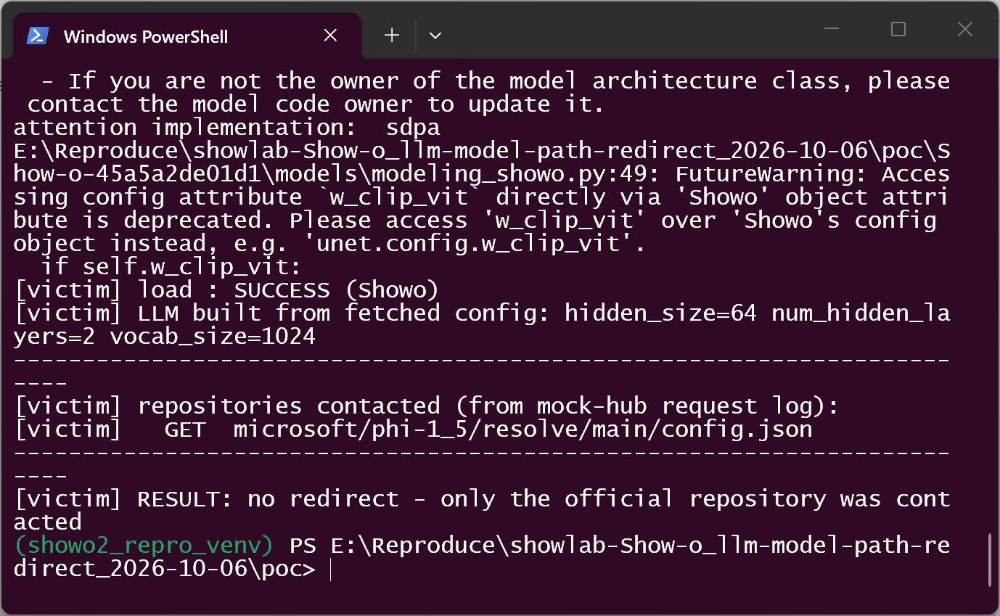
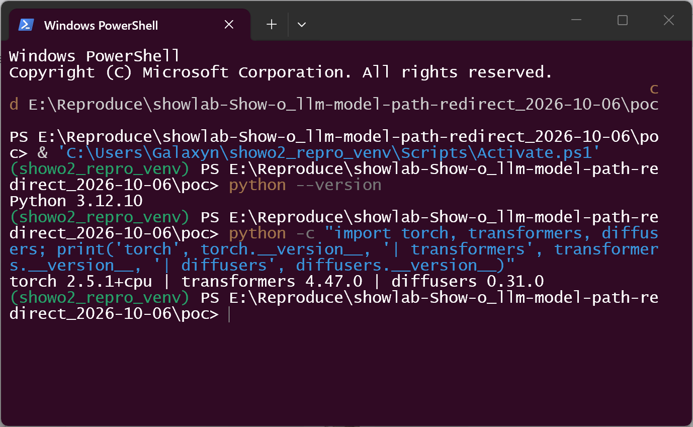

# showlab Show-o (commit 45a5a2de, main HEAD) — Model-Package-Controlled Second-Model Repository Redirection via `config.json llm_model_path`

## Summary

showlab Show-o at commit 45a5a2de01d1ebd10cd5864d29310a76476cdf23 (main HEAD at
report time, dated 2026-01-09; no tagged releases) is affected by a
model-package-controlled remote repository redirection in its model loader. A
Show-o model package's `config.json` carries `llm_model_path` — the repository
id of the LLM used as the text backbone. When the package is loaded through the
documented entry point (`Showo.from_pretrained(<model dir>`,
`inference_t2i.py:67`), the frozen-weight branch at
`models/modeling_showo.py:41-42` forwards that string verbatim to transformers'
`AutoConfig.from_pretrained()` and builds the LLM from the configuration fetched
from the repository it names.

An attacker who publishes a crafted Show-o model package (a derivative
"finetune" of an official checkpoint is the realistic vehicle) therefore makes
the victim's machine contact and download configuration data from an
attacker-chosen repository as a silent side effect of loading the package, and
silently substitutes the attacker-shaped LLM configuration for the intended one
(the official value is `microsoft/phi-1_5`, `configs/showo_demo_w_clip_vit.yaml:21`).
The second repository in this chain needs only a data `config.json` — no
`.py`, no plugins, no native libraries — because the LLM is constructed with
statically known code (`PhiForCausalLM`).

Honest validation boundary: on the demonstrated frozen branch
(`load_from_showo=true`) the fetched artifact is configuration data only and no
code executes — the claim is remote repository identity redirection plus
attacker-controlled configuration substitution, i.e. an origin-validation
failure driven entirely by model data (no parser-internal issue: `config.json`
is parsed safely). The non-frozen branch (`load_from_showo=false`,
`modeling_showo.py:45`) additionally downloads full weights from the redirected
repository via `PhiForCausalLM.from_pretrained`. Within a scope where the
attacker hosts no repository at all, the chain does not trigger.

## Affected Product

| Field | Value |
|---|---|
| Vendor | showlab |
| Product | Show-o (unified multimodal generation; `models/` Show-o1 loader) |
| Affected versions | commit 45a5a2de01d1ebd10cd5864d29310a76476cdf23 (main HEAD at report time, dated 2026-01-09; no tagged releases). The defective branch is present at main HEAD; no remediation release exists |
| Component | `models/modeling_showo.py:41-45` (`Showo.__init__`, `llm_model_path` handling), reached via `models/modeling_utils.py:416` (`ModelMixin.from_pretrained` feeds the package's `config.json` fields into the constructor); victim entry point `inference_t2i.py:67` / `inference_mmu.py` |
| Platform | OS-independent (Python). Reproduced on Windows 11 x64, Python 3.12.10, torch 2.5.1+cpu, transformers 4.47.0, diffusers 0.31.0, accelerate 0.23.0 (the pins of the repository's own `show-o2/build_env.sh` at this commit); cross-checked in Docker ubuntu 22.04 / Python 3.10.12 with the same transformers pin |
| Vulnerability type | CWE-494: Download of Code Without Integrity Check (origin-validation failure per CWE-346; the fetched artifact on the demonstrated branch is attacker-controlled configuration data, no code sidecar required) |

## Root Cause

**Location:** `models/modeling_showo.py:41-45` (`Showo.__init__`), commit
45a5a2de01d1ebd10cd5864d29310a76476cdf23.

`Showo.__init__` is decorated with `@register_to_config`, so every constructor
argument — including `llm_model_path` and `load_from_showo` — is persisted into
the model package's `config.json` and fed back verbatim by
`ModelMixin.from_pretrained` when a package is loaded. The LLM is then resolved
from that package-controlled string with the remote origin chosen by the package:

```python
# models/modeling_showo.py:41-45 (commit 45a5a2de01d1)
if load_from_showo:
    config = AutoConfig.from_pretrained(llm_model_path)
    self.showo = PhiForCausalLM(config)
else:
    self.showo = PhiForCausalLM.from_pretrained(llm_model_path, attn_implementation='sdpa')
```

`AutoConfig.from_pretrained(llm_model_path)` treats anything that is not a local
directory as a Hugging Face Hub repository id and downloads `config.json` from
the endpoint under the name the package supplied; the fetched configuration is
the sole input for constructing the backbone (`PhiForCausalLM(config)`,
randomly initialized on this branch). There is no allowlist, no pinning, and no
user-visible confirmation tying the second repository to the trust decision the
user made when choosing to load the (first-hop) package. The official package
value is `microsoft/phi-1_5` (`configs/showo_demo_w_clip_vit.yaml:21`), so a
one-string substitution redirects the fetch while the rest of the package stays
byte-identical. The same field is used again by the demo for the tokenizer
(`inference_t2i.py:56`), which widens the redirected surface but is not needed
for the demonstrated chain.

## Proof of Concept

### Prerequisites

- The victim loads an attacker-published Show-o model package through the
  documented entry points (`Showo.from_pretrained`, `inference_t2i.py
  --config .../pretrained_model_path`, `inference_mmu.py`). Loading the package
  is the only user action; no privileges or special configuration required.
- The attacker controls a second Hugging Face repository containing only a data
  `config.json` (here served by a local mock hub on `127.0.0.1:8765` so the
  reproduction is offline and network-bounded; the loader treats hub ids and
  local dirs identically and the hub-fetch leg is exercised over HTTP).
- The reproduction runs the pinned source copy `Show-o-45a5a2de01d1/` (commit
  45a5a2de01d1, unmodified, equal to `origin/main` HEAD at report time).
  Both packages were produced by `save_pretrained()` from the same in-memory
  model, so they differ only in the `llm_model_path` string; a tiny Phi config
  (hidden_size 64, 2 layers) keeps the run CPU/memory friendly. The two
  second-hop repositories carry the same baseline data config, so any behavioral
  difference comes from the redirected repository identity alone.

### Steps to Reproduce

1. Generate the packages with `poc/make_poc.py`: `pkg_attacker` (`llm_model_path
   = mbe2e-attacker/pwned-by-showo-llm-model-path-redirect`), `pkg_default`
   (`llm_model_path = microsoft/phi-1_5`, the official value), plus the two
   data-only second-hop hub repositories; SHA-256 for every file lands in
   `poc/work/SHA256SUMS.txt`.



2. The malicious package's `config.json` — the only attacker-controlled value is
   `llm_model_path`; `load_from_showo` is the official default `true`:



3. The selection/fetch code in the pinned copy:



4. Load the malicious package the documented way (`python run_repro.py
   pkg_attacker` drives the real `Showo.from_pretrained()` against the pinned
   copy with the local mock hub). The load succeeds and the mock-hub log shows
   the second-model fetch went to the attacker repository:




5. Negative control — a package byte-identical except
   `llm_model_path = microsoft/phi-1_5` contacts only the official repository
   and the attacker repository is never requested:





### Expected vs Actual

- Expected: a model package must not silently choose the remote origin that
  components are fetched from; a non-default second-model repository should
  require an explicit, user-visible trust decision.
- Actual: `llm_model_path` is forwarded verbatim to `AutoConfig.from_pretrained()`;
  loading the crafted package contacts the attacker repository and builds the
  LLM from the configuration found there, with no additional consent.

### Sanitized PoC input

```json
{
  "_class_name": "Showo",
  "llm_model_path": "mbe2e-attacker/pwned-by-showo-llm-model-path-redirect",
  "load_from_showo": true
}
```

(elided fields identical to an ordinary `save_pretrained` package; full files and
hashes in `poc/work/`). The attacker repository contains only a `config.json`;
nothing executes and no real third-party repository is contacted (the hub is a
localhost mock).

## Impact

- Confidentiality: None — no victim data is disclosed; the attacker observes a
  fetch (traffic/trust correlation), which is not victim-data exposure.
- Integrity: High — the LLM component of the loaded pipeline is whatever the
  attacker's configuration defines; the victim silently runs an attacker-shaped
  substitute instead of the intended backbone.
- Availability: Low — attacker-controlled configuration values (e.g. layer
  counts) are resource inputs and extreme values can exhaust memory, but no
  crash is demonstrated on this branch.
- Scope: network fetch to an attacker-chosen origin plus attacker-controlled
  model configuration on the machine that loads the package.

## Attack Vector and Severity (CVSS v3.1)

| Metric | Value | Rationale |
|---|---|---|
| Attack Vector | **Network (N)** | the malicious package and the redirected second-model fetch travel over the network (Hugging Face Hub) |
| Attack Complexity | **Low (L)** | the only precondition — owning the second repository — is fully under attacker control |
| Privileges Required | **None (N)** | publishing a model package needs no privileges over the victim |
| User Interaction | **Required (R)** | the victim must choose to load the crafted model package |
| Scope | **Unchanged (U)** | effects stay in the victim's own process/user domain |
| Confidentiality | **None (N)** | no victim data is read or exfiltrated by the demonstrated chain |
| Integrity | **High (H)** | the victim's LLM component is silently replaced by one built from attacker-chosen configuration |
| Availability | **Low (L)** | configuration-driven resource exhaustion is possible but not the demonstrated path |

```
Score: 7.1 (High)
Vector: CVSS:3.1/AV:N/AC:L/PR:N/UI:R/S:U/C:N/I:H/A:L
```

Assumption noted per conservatism: I:H reflects that the attacker fully
determines the configuration of the backbone the victim runs; if one counts
only the redirected-fetch primitive, the same vector with I:L scores 5.3
(Medium). If a deployment loads third-party packages automatically (batch
conversion/pipelines), UI:R drops to N and the score rises accordingly.

## Remediation

1. Do not take the second-model repository id from the package: hard-code the
   documented default (`microsoft/phi-1_5`) or validate `llm_model_path` against
   an allowlist of trusted repositories.
2. If arbitrary second models must keep working, require an explicit,
   user-visible confirmation (per repository id, pinned to a specific revision)
   before contacting a non-default repository.
3. Consider decoupling the LLM identity from the image-model package entirely
   (a separate CLI/config surface the user consciously sets), so that a model
   package cannot choose network origins as a side effect of being loaded.

## Timeline

| Date | Event |
|---|---|
| 2026-10-06 | Vulnerability identified and verified against commit 45a5a2de01d1ebd10cd5864d29310a76476cdf23 (main HEAD) |
| 2026-10-06 | Report prepared; upstream notification [pending] |
| 2026-10-06 | Fix released: [pending — none exists at report time] |

## References

- Source repository: https://github.com/showlab/Show-o
- Pinned commit: https://github.com/showlab/Show-o/tree/45a5a2de01d1ebd10cd5864d29310a76476cdf23
- Upstream report: [pending publication]
- CWE: https://cwe.mitre.org/data/definitions/494.html (see also https://cwe.mitre.org/data/definitions/346.html)
- Vendor advisory: [none]

## Disclaimer

This report is provided for defensive and coordination purposes. It contains no
ready-to-run exploit beyond the minimum reproduction information, and no
sensitive infrastructure details. The attacker repository in the reproduction is
a localhost mock carrying a data config.json only; do not point the reproduction
at repositories you do not control. Do not disclose it publicly before the
maintainer has had a reasonable window to fix the issue.

## Screenshot Checklist

| File | Content | Collection environment |
|---|---|---|
| screenshots/01-environment.png | venv prompt, Python/torch/transformers/diffusers versions | Windows 11 x64 + Windows Terminal, venv `showo2_repro_venv` (torch 2.5.1+cpu / transformers 4.47.0 / diffusers 0.31.0 per the repo's build_env.sh), 2026-10-06, captured by `poc/real_terminal_shot.ps1` |
| screenshots/02-make-poc.png | `make_poc.py`: two packages + two data-only hub repos + SHA256SUMS | same, 2026-10-06 |
| screenshots/03-first-hop-config.png | malicious package `config.json` (llm_model_path redirected) | same |
| screenshots/04-vulnerable-code.png | `modeling_showo.py` lines 40-46 from the pinned copy | same |
| screenshots/05-attacker-repo-requested.png | positive run: load SUCCESS, LLM built from fetched config, attacker repo contacted, REPO REDIRECT CONFIRMED | same |
| screenshots/06-request-log.png | `work/hub_requests.log`: HEAD+GET attacker repo config.json | same |
| screenshots/07-negative-official-repo.png | negative control: only microsoft/phi-1_5 contacted, no redirect | same |

Cross-check: the same three cases were additionally run in Docker
(`ubuntu:22.04.5`, Python 3.10.12, transformers 4.47.0; image built from
`poc/Dockerfile`) with identical results; screenshots document the Windows/venv
environment, matching the corpus convention for this repository.
