# Show-o (showlab/Show-o) 45a5a2de01d1 — Unsafe Deserialization in Sharded Checkpoint Loading (`Showo2Qwen2_5.from_pretrained`)

## Summary

showlab Show-o (commit `45a5a2de01d1ebd10cd5864d29310a76476cdf23`, the current `main` HEAD as of 2026-01-08) is affected by an insecure deserialization issue in the Show-o2 model loading component. The documented entry point `Showo2Qwen2_5.from_pretrained(<path>, use_safetensors=False)` — used by all seven Show-o2 inference/training scripts — resolves a sharded checkpoint index (`diffusion_pytorch_model.bin.index.json`) and passes the index to `accelerate.load_checkpoint_and_dispatch()`. Accelerate's shard loader loads every file referenced by the index's attacker-controlled `weight_map` through a plain `torch.load()` **without** `weights_only=True`, so a pickle-backed `.bin` shard selected by the index executes arbitrary code in the victim's process at load time, while the model still loads normally. The same poisoned shard is rejected on the non-sharded route (diffusers passes `weights_only=True` there), which isolates the index field as the discriminator between the guarded and the unguarded loader.

## Affected Product

| Field | Value |
|---|---|
| Vendor | showlab (NUS Show Lab) |
| Product | Show-o (Show-o2 code base, `show-o2/` directory) |
| Affected versions | git commit `45a5a2de01d1ebd10cd5864d29310a76476cdf23` (2026-01-08; latest `main` commit at the time of writing). Earlier Show-o2 revisions that vendor the same loader are assumed affected `[unknown]` |
| Component | `show-o2/models/modeling_utils.py` — `ModelMixin.from_pretrained()`, accelerate dispatch branch (call at line 776) |
| Platform | OS-independent (pure Python); verified on Windows 11 x64, Python 3.12.10, CPU-only |
| Dependency versions | per `show-o2/build_env.sh`: `torch==2.5.1`, `transformers==4.47.0`, `diffusers==0.31.0`, `accelerate==0.23.0`; the root `requirements.txt` pins `torch==2.2.1` / `transformers==4.41.1` / `diffusers==0.30.1` / `accelerate==0.21.0` for the Show-o1 environment |
| Vulnerability type | CWE-502: Deserialization of Untrusted Data (Insecure Deserialization) |

## Root Cause

**Location:** `show-o2/models/modeling_utils.py:770-790` (`ModelMixin.from_pretrained`, vendored diffusers-style loader)

Show-o2 vendors a diffusers `ModelMixin.from_pretrained`. With the documented `use_safetensors=False`, the loader:

1. Resolves the sharded index file via diffusers' `_fetch_index_file` → `diffusion_pytorch_model.bin.index.json` (`modeling_utils.py:635-653`); `is_sharded = index_file.is_file()`. Note the vendored copy mixes conventions: it defines its own single-file names `WEIGHTS_NAME = "pytorch_model.bin"` / `SAFETENSORS_WEIGHTS_NAME = "pytorch_model.safetensors"` (`modeling_utils.py:48-49`) but takes the sharded index names from diffusers.
2. Validates the shard files listed in `weight_map` for existence (diffusers `_get_checkpoint_shard_files`, 0.31.0) — this first stage parses the index safely (`json.loads`) and loads nothing.
3. Instantiates the model on the meta device (`low_cpu_mem_usage` defaults to `True`, `modeling_utils.py:73/533`).
4. Because `device_map is None and is_sharded`, **forces** `device_map = {"": "cpu"}` (`modeling_utils.py:770-773`) and delegates the entire checkpoint load to accelerate (`:776`):

```python
# show-o2/models/modeling_utils.py:770-779
if device_map is None and is_sharded:
    # we load the parameters on the cpu
    device_map = {"": "cpu"}
    force_hook = False
try:
    accelerate.load_checkpoint_and_dispatch(
        model,
        model_file if not is_sharded else index_file,
        device_map,
        ...
```

Accelerate (0.23.0, the version pinned by `show-o2/build_env.sh`) then reads the index and loads each referenced file individually:

```python
# accelerate 0.23.0 src/accelerate/utils/modeling.py:1338-1357 (load_checkpoint_in_model)
if index_filename is not None:
    checkpoint_folder = os.path.split(index_filename)[0]
    with open(index_filename, "r") as f:
        index = json.loads(f.read())
    if "weight_map" in index:
        index = index["weight_map"]
    checkpoint_files = sorted(list(set(index.values())))
    checkpoint_files = [os.path.join(checkpoint_folder, f) for f in checkpoint_files]
...
for checkpoint_file in checkpoint_files:
    checkpoint = load_state_dict(checkpoint_file, device_map=device_map)
```

`load_state_dict` only special-cases the `.safetensors` extension; every other file ends in an unguarded deserialization:

```python
# accelerate 0.23.0 src/accelerate/utils/modeling.py:1226-1228 (load_state_dict)
else:
    return torch.load(checkpoint_file, map_location=torch.device("cpu"))
```

With the environment pinned by `show-o2/build_env.sh` (`torch==2.5.1`), `torch.load` defaults to `weights_only=False`, so the pickle stream inside the shard executes arbitrary `__reduce__` code before any weight is assigned. The `weight_map` values that select the shard files are ordinary strings from the (untrusted) model directory — they are validated only for *existence*, never for *content* or *format*, and the suffix of the value alone decides which deserializer runs.

**Why the non-sharded route is not affected the same way (guard contrast):** without an index file, the loader takes the diffusers first stage, which forces `weights_only=True` on non-safetensors files (`show-o2/models/modeling_utils.py:737` → diffusers `load_state_dict`):

```python
# diffusers 0.31.0 src/diffusers/models/model_loading_utils.py:141-146 (load_state_dict)
else:
    weights_only_kwarg = {"weights_only": True} if is_torch_version(">=", "1.13") else {}
    return torch.load(
        checkpoint_file,
        map_location="cpu",
        **weights_only_kwarg,
    )
```

The identical poisoned `.bin` (same SHA-256) is therefore rejected when loaded directly and executed when selected through the index — the safe index field (`weight_map`) is what routes the file to the second, unguarded loader stage. Note accelerate 0.23.0's `load_state_dict` has no `weights_only` branch at all in this path; the product's delegation to `load_checkpoint_and_dispatch` bypasses the guarded diffusers loader entirely. The same unguarded fallback exists in accelerate 0.21.0 (pinned by the root `requirements.txt`), so both bundled environments are affected.

## Proof of Concept

### Prerequisites

- Python 3.12 with `torch==2.5.1`, `transformers==4.47.0`, `diffusers==0.31.0`, `accelerate==0.23.0`, `einops==0.8.0`, `timm`, `safetensors` — the environment `show-o2/build_env.sh` documents, minus GPU-only extras
- The Show-o2 code at commit `45a5a2de01d1` (the PoC imports `models.modeling_showo2_qwen2_5` from the pinned source)
- No GPU and no network needed at load time; the PoC model packages are small offline Show-o2 models built around miniature Qwen2/SigLIP sub-configs

### Package layout (positive)

```text
showo2_evil_pkg/
├── config.json                                    Showo2Qwen2_5 config (points at the two sub-configs)
├── tiny_qwen/config.json                          miniature Qwen2Config
├── tiny_siglip/...                                miniature SigLIP weights (required by __init__)
├── diffusion_pytorch_model.bin.index.json         sharded index; weight_map selects the pickle-backed .bin
├── pytorch_model-00001-of-00001.bin               torch zip shard; data.pkl executes the payload, then yields the genuine state dict
└── evil_module.py                                 INERT probe; never imported (disproof of a .py side channel)
```

The index itself is an ordinary, valid sharded-checkpoint index — no exotic fields:

```json
{
  "metadata": {"total_size": 759023104},
  "weight_map": {
    "showo.model.embed_tokens.weight": "pytorch_model-00001-of-00001.bin"
  }
}
```

The shard is built by `torch.save`-ing the genuine tiny model state dict and rewriting `data.pkl` inside the zip so that unpickling first calls `exec(<payload>)` (print a marker line, write `RCE_MARKER_SHOWO2_BIN_INDEX.txt` with user/host/time) and then yields the original state dict — the checkpoint remains fully functional.

### Steps to Reproduce

1. Environment — activate the pinned virtual environment and confirm versions:

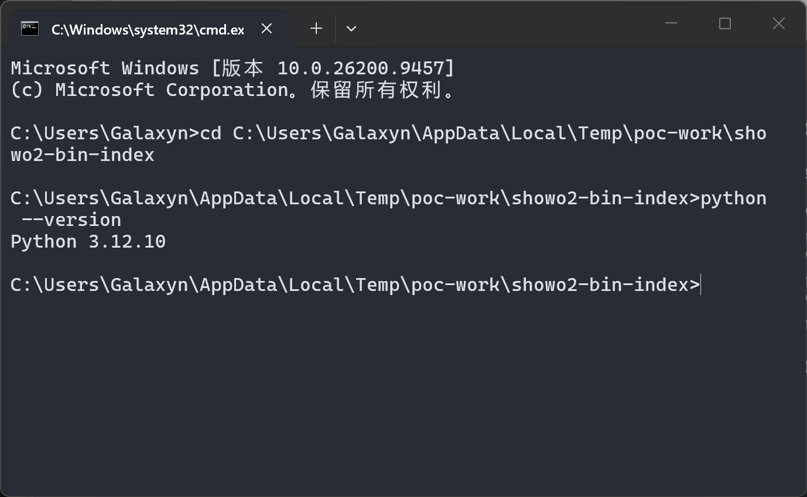

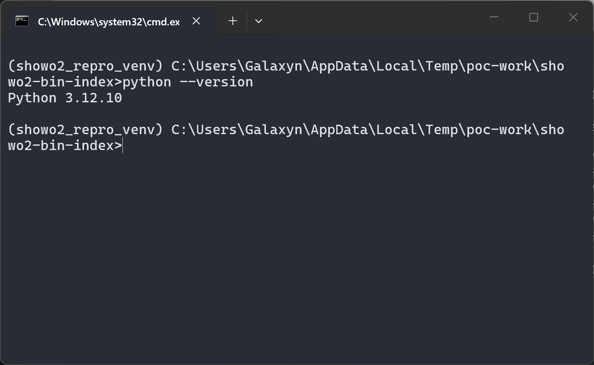

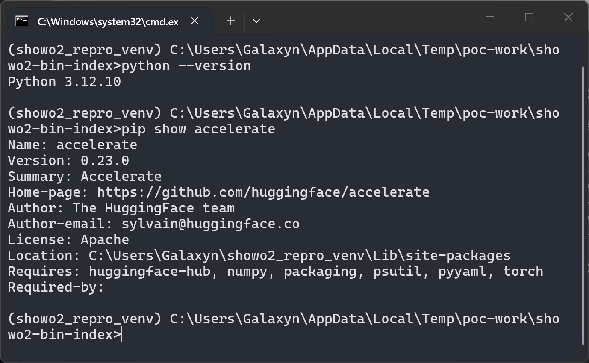

2. Build the three packages (positive, safetensors-suffix control, no-index control) with the attached `make_poc.py`; it also self-tests the poisoned shard (loads via `torch.load`, returns the genuine state dict) and prints the SHA-256 of every file:

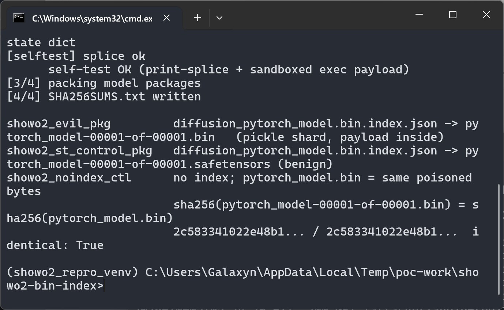

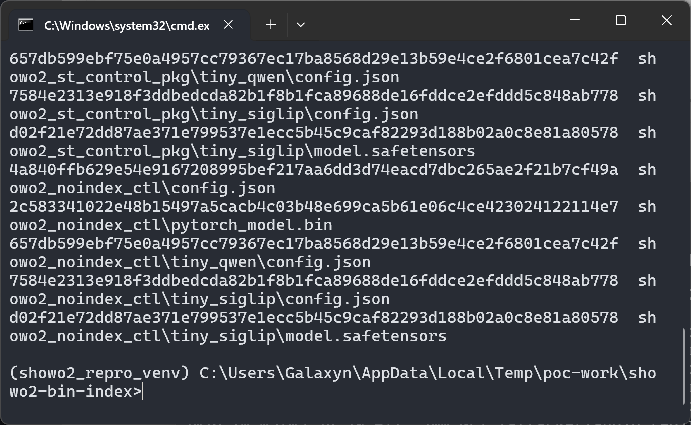

3. Inspect the positive package: the index's `weight_map` selects the pickle-backed `.bin`, and the package contains the inert `evil_module.py`:

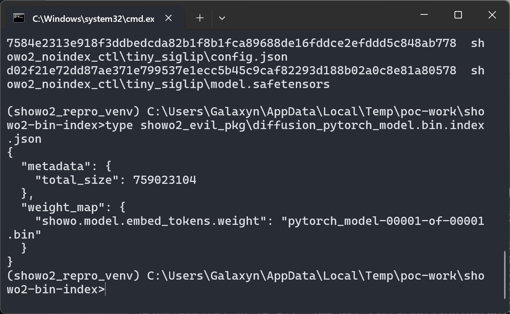

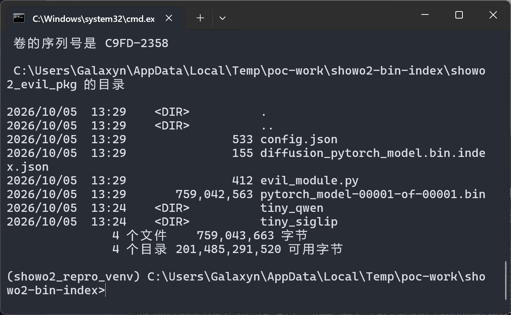

4. Load the package through the documented entry point:

```python
model = Showo2Qwen2_5.from_pretrained("showo2_evil_pkg", use_safetensors=False)
```

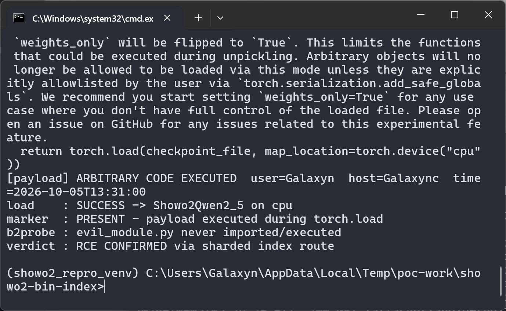

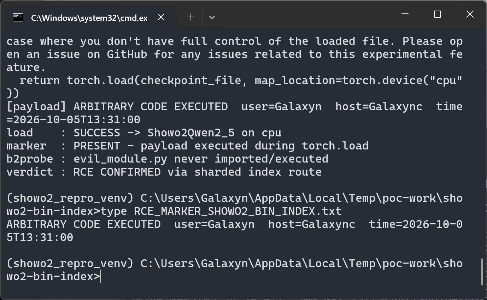

5. Control A — same package shape with the index value renamed to `pytorch_model-00001-of-00001.safetensors` (benign shard): the load completes and nothing executes (safetensors cannot carry the pickle payload):

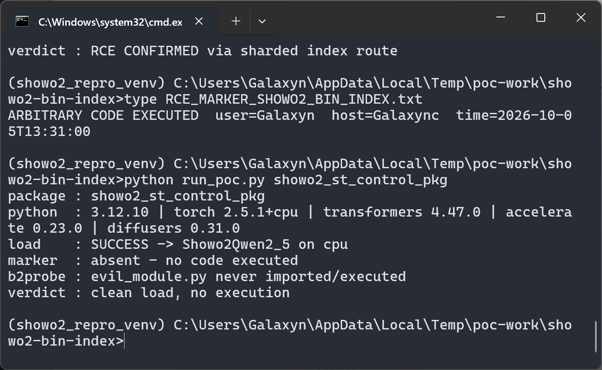

6. Control B — the same poisoned `.bin` bytes (same SHA-256) without the index file (`pytorch_model.bin` direct route): rejected by the guarded diffusers loader with `torch.load(..., weights_only=True)` — the exception chain reports `_pickle.UnpicklingError: Weights only load failed ... Unsupported global: GLOBAL builtins.exec was not an allowed global by default` before the wrapping `OSError`:

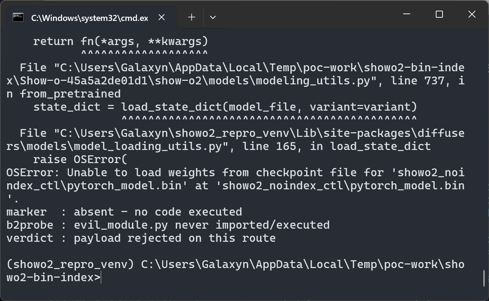

### Expected vs Actual

- Expected: untrusted checkpoints must not execute code; the sharded route should apply the same `weights_only=True` protection as the non-sharded route (or refuse non-safetensors shards unless the user explicitly opts in).
- Actual: the index-driven sharded route loads the pickle-backed `.bin` through accelerate's unguarded `torch.load`, executing attacker code in the victim's process, while the model still loads and works normally. The `evil_module.py` probe inside the package is never imported, confirming the effect comes from the index-selected `.bin`.

### Sanitized PoC input

```text
Payload (executed at torch.load time inside the victim process):
    import datetime, getpass, platform
    line = 'ARBITRARY CODE EXECUTED  user=%s  host=%s  time=%s' % (
        getpass.getuser(), platform.node(), datetime.datetime.now().isoformat(...))
    print('[payload] ' + line)
    open('RCE_MARKER_SHOWO2_BIN_INDEX.txt', 'w').write(line + chr(10))

(The payload is deliberately limited to a marker file; arbitrary code is possible
at the same point. No network activity, no persisted changes beyond the marker.)
```

## Impact

- Confidentiality: High — arbitrary code runs with the victim's privileges; secrets reachable by the process can be exfiltrated.
- Integrity: High — arbitrary files can be modified/created (the PoC writes a marker file).
- Availability: High — the process can be crashed or hijacked.
- Scope: code execution in the loading process (same security context).

## Attack Vector and Severity (CVSS v3.1)

| Metric | Value | Rationale |
|---|---|---|
| Attack Vector | N (Network) | The crafted model package is typically delivered remotely (model hub / checkpoint URL); no special network position needed beyond serving the files |
| Attack Complexity | L (Low) | Standard documented loading path; no competing conditions |
| Privileges Required | N (None) | The attacker only needs to publish the malicious package; the victim supplies all privileges |
| User Interaction | R (Required) | The victim must run a Show-o2 inference/training script that loads the package (the normal use of the product) |
| Scope | U (Unchanged) | Code executes in the victim's own process/user context |
| Confidentiality | H (High) | Full process compromise |
| Integrity | H (High) | Arbitrary file/process manipulation |
| Availability | H (High) | Process crash/hijack possible |

```
Score: 8.8 (High)
Vector: CVSS:3.1/AV:N/AC:L/PR:N/UI:R/S:U/C:H/I:H/A:H
```

> Assumption noted: AV:N treats the model hub / checkpoint URL as the network delivery channel. If a deployment only ever loads models from a fully trusted local store, the effective severity for that deployment is lower (local delivery), but the product's documented usage (loading `showlab/show-o2-*` checkpoints from Hugging Face) matches the network assumption.

## Remediation

1. In `show-o2/models/modeling_utils.py` (accelerate dispatch branch, lines ~770-790): refuse non-safetensors shard files unless the caller explicitly passes `allow_pickle=True`, mirroring the guarded first stage.
2. Or upgrade `accelerate` (>= 0.24.0, where `load_state_dict` gained a conditional `weights_only` branch) **and** ensure the forced `device_map={"": "cpu"}` does not disable the guard; verify against the installed torch version.
3. Restrict `weight_map` values to the canonical shard naming (`pytorch_model-<n>-of-<m>.bin|.safetensors`) and resolve the shard format from the index/metadata rather than the file suffix alone.
4. Interim workaround for users: never load untrusted Show-o2 packages with `use_safetensors=False`; remove or replace non-safetensors files and their index entries before loading.

## Timeline

| Date | Event |
|---|---|
| 2026-01-08 | Latest affected commit `45a5a2de01d1` pushed to `main` (HEAD at the time of writing) |
| 2026-10-05 | Vulnerability confirmed by analysis and local reproduction; report prepared |
| 2026-10-05 | Report sent to the maintainer `[pending]` |
| — | Maintainer acknowledged `[pending]` |
| — | Fix released `[pending]` |

## References

- Source repository: https://github.com/showlab/Show-o
- Pinned commit: https://github.com/showlab/Show-o/tree/45a5a2de01d1ebd10cd5864d29310a76476cdf23
- Vulnerable call site: https://github.com/showlab/Show-o/blob/45a5a2de01d1ebd10cd5864d29310a76476cdf23/show-o2/models/modeling_utils.py#L770-L790
- Documented entry points (`use_safetensors=False`): `show-o2/inference_t2i.py:83`, `show-o2/inference_mmu.py:70`, `show-o2/inference_mixed_modality.py:75`, `show-o2/inference_mmu_vid.py:72`, `show-o2/train_stage_one.py:167`, `show-o2/train_stage_two.py:168`, `show-o2/evaluation/inference_dpg.py:72`
- accelerate 0.23.0 unguarded sink: `src/accelerate/utils/modeling.py` (`load_state_dict` / `load_checkpoint_in_model`), https://github.com/huggingface/accelerate/blob/v0.23.0/src/accelerate/utils/modeling.py
- diffusers 0.31.0 guarded first stage: `src/diffusers/models/model_loading_utils.py` (`load_state_dict`), https://github.com/huggingface/diffusers/blob/v0.31.0/src/diffusers/models/model_loading_utils.py
- CWE: https://cwe.mitre.org/data/definitions/502.html
- Upstream report: `[pending publication]`

## Disclaimer

This report is provided for defensive and coordination purposes. It contains no ready-to-run exploit beyond the minimum reproduction information, and no sensitive infrastructure details. The PoC payload only writes a local marker file to demonstrate execution. Do not disclose it publicly before the maintainer has had a reasonable window to fix the issue.

## Screenshot Checklist

All screenshots are real terminal windows captured on the reporter's machine (Windows 11 x64, Windows Terminal + cmd, 1400x860) on 2026-10-05, driven step-by-step by `poc/real_terminal_shot.ps1` with `poc/shot_scenario.json`. Raw captures live in `screenshots/`; the report references the copies in `images/` (same content).

| File | Content |
|---|---|
| `images/showo-cambrian-bin-fallback-01-env-python.png` | System Python 3.12.10; `cd` into the PoC work directory |
| `images/showo-cambrian-bin-fallback-02-venv-activated.png` | Pinned venv `(showo2_repro_venv)` active, Python 3.12.10 |
| `images/showo-cambrian-bin-fallback-03-env-accelerate.png` | `pip show accelerate` → Version 0.23.0 (the pinned sink version) |
| `images/showo-cambrian-bin-fallback-04-make-poc.png` | `python make_poc.py` builds the three packages; self-test OK; both `.bin` variants identical (`2c583341…114e7`) |
| `images/showo-cambrian-bin-fallback-05-sha256sums.png` | `SHA256SUMS.txt` listing per-file digests |
| `images/showo-cambrian-bin-fallback-06-evil-index.png` | Positive package index: `weight_map` → `pytorch_model-00001-of-00001.bin` |
| `images/showo-cambrian-bin-fallback-07-evil-tree.png` | Positive package tree (index, pickle shard, inert `evil_module.py`, sub-configs) |
| `images/showo-cambrian-bin-fallback-08-evil-rce.png` | Positive run: accelerate's unguarded `torch.load` warning, `[payload] ARBITRARY CODE EXECUTED`, load SUCCESS, marker PRESENT, verdict RCE CONFIRMED |
| `images/showo-cambrian-bin-fallback-09-marker.png` | Marker file content written by the payload (user/host/time) |
| `images/showo-cambrian-bin-fallback-10-st-control.png` | Control A (`.safetensors` suffix): clean load, marker absent |
| `images/showo-cambrian-bin-fallback-11-noindex-reject.png` | Control B (no index, same bytes): rejected via diffusers' guarded `load_state_dict` (show-o2 `modeling_utils.py:737`), marker absent |
