# Petastorm 0.13.1 — Insecure Deserialization (Code Execution) via the `dataset-toolkit.unischema.v1` Parquet Footer

## Summary

Uber Petastorm 0.13.1 (master @ `01ba9cb7da8d8a6937e177aee39e241e10569d29`) is affected by
an insecure deserialization vulnerability in `petastorm/etl/legacy.py`. The
`RestrictedUnpickler` used to load the schema stored in a dataset's Parquet footer filters
untrusted pickle globals by **top-level module name only** and never inspects the attribute
name. Its allowlist contains `builtins` and `__builtin__`, so `builtins.eval`, `builtins.exec`,
`builtins.getattr`+`builtins.__import__` and similar primitives all pass the filter.

A crafted dataset package therefore executes arbitrary code in the process that reads it.
The package is an ordinary, fully readable Parquet dataset — one data file, `_metadata` and
`_common_metadata` — that contains no Python file, plugin or native library. The payload lives
in one byte string under the fixed footer key `dataset-toolkit.unischema.v1`, and it fires the
moment Petastorm loads the schema, i.e. inside `make_reader()` or the shipped
`petastorm.etl.metadata_util` CLI, before any data row is read.

This is an **incomplete fix**: the allowlist was itself introduced as the fix for an earlier
RCE report (commit `1071dbd1`, 2021-07-28, PR #640 / huntr.dev PR #637). The bypass has been
publicly reported upstream as issue #741 on 2022-03-19 and remains open with no maintainer
response and no patch. No CVE and no GitHub Security Advisory has been assigned to it.

## Affected Product

| Field | Value |
|---|---|
| Vendor | Uber Technologies, Inc. |
| Product | Petastorm |
| Affected versions | 0.13.1 and master @ `01ba9cb7da8d8a6937e177aee39e241e10569d29`; `petastorm/etl/legacy.py:22-48` unchanged since `1071dbd1` (2021-07-28) |
| Component | `petastorm/etl/legacy.py` → `safe_modules` / `RestrictedUnpickler` / `restricted_loads`, reached from `petastorm/etl/dataset_metadata.py:379-383` (`get_schema`) |
| Platform | Any; reproduced on Linux x86-64, Python 3.10.12, pyarrow 8.0.0 |
| Vulnerability type | CWE-502: Deserialization of Untrusted Data (leading to CWE-94: Code Injection) |

## Root Cause

**Location:** `petastorm/etl/legacy.py:22-48` (`safe_modules`, `RestrictedUnpickler.find_class`, `restricted_loads`)

The schema of a Petastorm dataset is a pickled `Unischema` object stored in the Parquet footer
under the fixed key `dataset-toolkit.unischema.v1`. `get_schema()` reads that raw footer value
and hands it to `depickle_legacy_package_name_compatible()`, which forwards it to
`restricted_loads()`:

```python
# petastorm/etl/legacy.py:22-31 — the allowlist added by the 2021 "security fix"
safe_modules = {
    "petastorm",
    "collections",
    "numpy",
    "pyspark",
    "decimal",
    "builtins",
    "copy_reg",
    "__builtin__",          # <-- __builtin__.eval / exec / getattr / __import__ are reachable
}

# petastorm/etl/legacy.py:36-43 — only the *module* is validated, never the attribute
def find_class(self, module, name):
    """Only allow safe classes from builtins"""
    package_name = module.split(".")[0]
    if package_name in safe_modules:
        return super().find_class(module, name)   # <-- name is never checked
    else:
        raise pickle.UnpicklingError("global '%s.%s' is forbidden" % (module, name))
```

The value is attacker-controlled: it is a byte string in the dataset directory, which is the
exact threat model the allowlist was written for. Two properties make the filter useless
against a determined payload:

1. **The attribute name is never validated.** The check is `module.split(".")[0] in safe_modules`,
   so any attribute of an allowlisted module is returned. `builtins` is allowlisted, hence
   `builtins.eval` is returned and the pickle `REDUCE` opcode calls it.
2. **The legacy alias `__builtin__` resolves to `builtins` on Python 3.** `__builtin__` was added
   to the allowlist for backwards compatibility with Python-2-era datasets, and
   `pickle.Unpickler.find_class` applies the `_compat_pickle` alias mapping
   (`__builtin__` → `builtins`) whenever `proto < 3`. A protocol-2 stream naming
   `__builtin__.eval` therefore resolves to the real `builtins.eval`. The same payload sent as
   protocol 4 fails with `ModuleNotFoundError: No module named '__builtin__'`, which confirms
   that the legacy alias entry is what opens the protocol-2 path.

Reachability is broad — every schema-consuming entry point funnels through `get_schema()`:

| Entry point | Path |
|---|---|
| `petastorm.make_reader()` | `petastorm/reader.py:158` → `dataset_metadata.py:383` |
| `petastorm.make_batch_reader()` | `petastorm/reader.py:307` |
| `python -m petastorm.etl.metadata_util --schema` | `petastorm/etl/metadata_util.py:56` |
| `petastorm-generate-metadata.py` | `petastorm/etl/petastorm_generate_metadata.py` |
| row-group index read path | `petastorm/etl/rowgroup_indexing.py:157` (same helper, key `dataset-toolkit.rowgroups_index.v1`) |

## Proof of Concept

### Prerequisites

- Petastorm installed from the pinned commit; the reader does not need any special privilege.
- The victim only has to *read* a dataset directory obtained from an untrusted source
  (downloaded model/dataset package, S3/GCS/HDFS location, shared artefact store).
- Nothing inside the dataset directory is executable by itself: no `.py`, no plugin, no native
  library. The malicious value is one metadata field, delivered as data.
- **Reproduction precondition found while building this PoC:** petastorm no longer accepts a
  scheme-less dataset path — `FilesystemResolver` raises `ValueError: ERROR! A scheme-less dataset
  url () is no longer supported. Please prepend "file://" for local filesystem.` Local datasets must
  be addressed as `file:///abs/path` (the helper script does this automatically).
- **Dependency note:** pyarrow 8.0.0 is used because it still provides
  `pyarrow.parquet.ParquetDatasetPiece` and `ParquetDataset.metadata_path`, which petastorm's
  row-group loader needs for the full read path. The code-execution defect itself does not depend on
  the pyarrow version: it fires during `get_schema()`, before any row group is touched.

Environment used for the run below (Python / pyarrow / petastorm versions and the installed
petastorm package path):

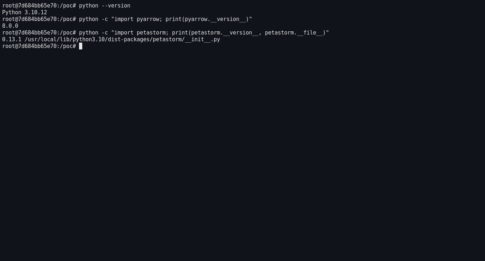

*Real terminal capture: Python 3.10.12, pyarrow 8.0.0 and petastorm 0.13.1 installed from the pinned commit.*

### Steps to Reproduce

1. Build the three dataset packages (`python make_poc.py`): a benign one carrying a real pickled
   `Unischema`, a malicious one whose only difference is that footer value, and a third that
   uses the same reduction with the non-allowlisted global `os.system`.

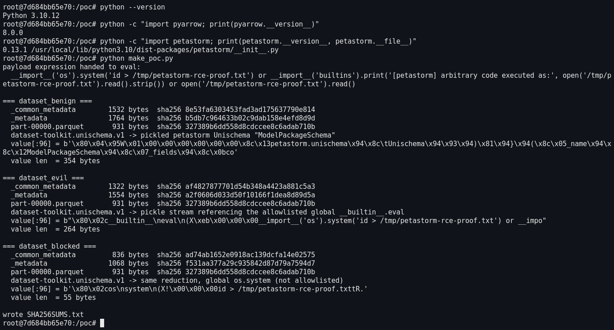

*Real terminal capture. `part-00000.parquet` is byte-identical in all three arms (sha256 `327389b6dd558d8c…`);
only the `dataset-toolkit.unischema.v1` value differs — 354 bytes of pickled `Unischema` for the benign arm,
264 bytes naming `__builtin__.eval` for the malicious arm, 55 bytes naming `os.system` for the boundary control.*

2. Confirm the malicious directory really is just a dataset — three data files, nothing executable.

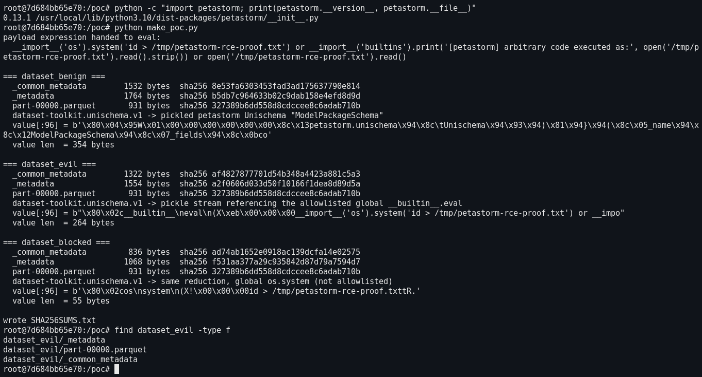

*Real terminal capture: the malicious package holds exactly `part-00000.parquet`, `_metadata` and
`_common_metadata` — no `.py`, no plugin, no native library.*

3. Read the vulnerable code at the installed pinned commit to show the allowlist entry and the
   module-only check.

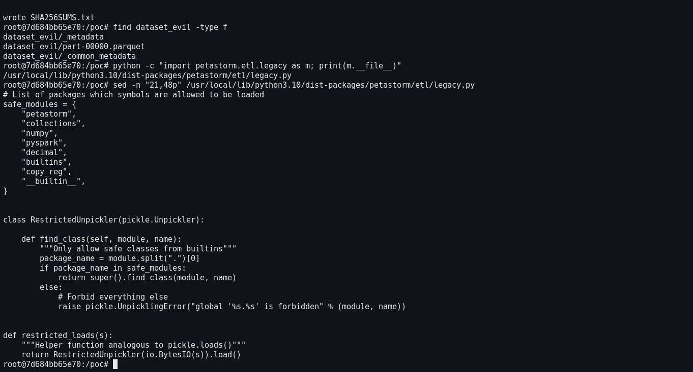

*Real terminal capture of the installed pinned source: `safe_modules` contains `builtins` and `__builtin__`,
and `find_class()` checks only `module.split(".")[0]`.*

4. Negative control — the benign dataset is loaded and its schema printed normally, with no side
   effect, and it reads its rows through the public API.

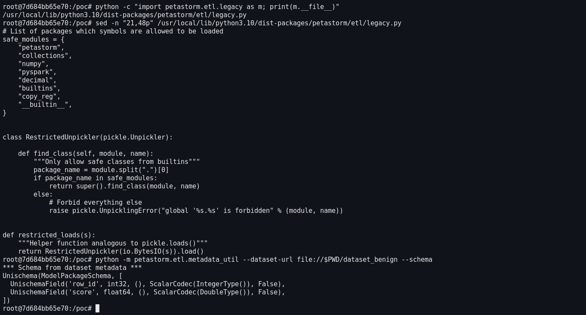

*Real terminal capture: the benign arm loads and prints its `Unischema` normally, with no side effect.*

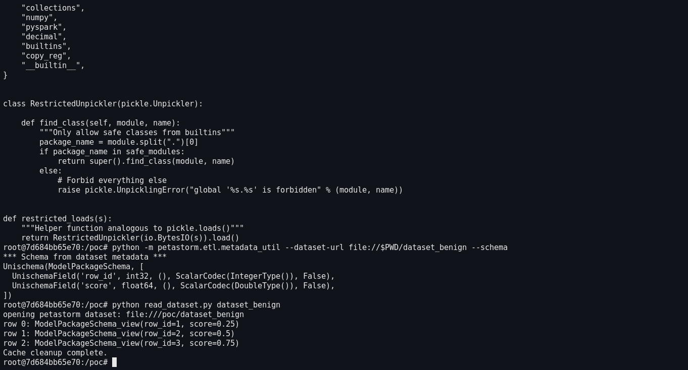

*Real terminal capture: the benign arm really is a complete, readable dataset — `make_reader()` decodes all
three rows.*

5. Confirm the proof file does not exist yet.

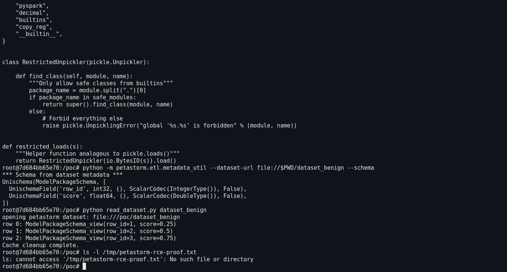

*Real terminal capture: the marker file does not exist before the malicious dataset is read.*

6. Trigger the defect — read the malicious dataset with the shipped metadata utility, which is
   what prints the schema of a dataset:

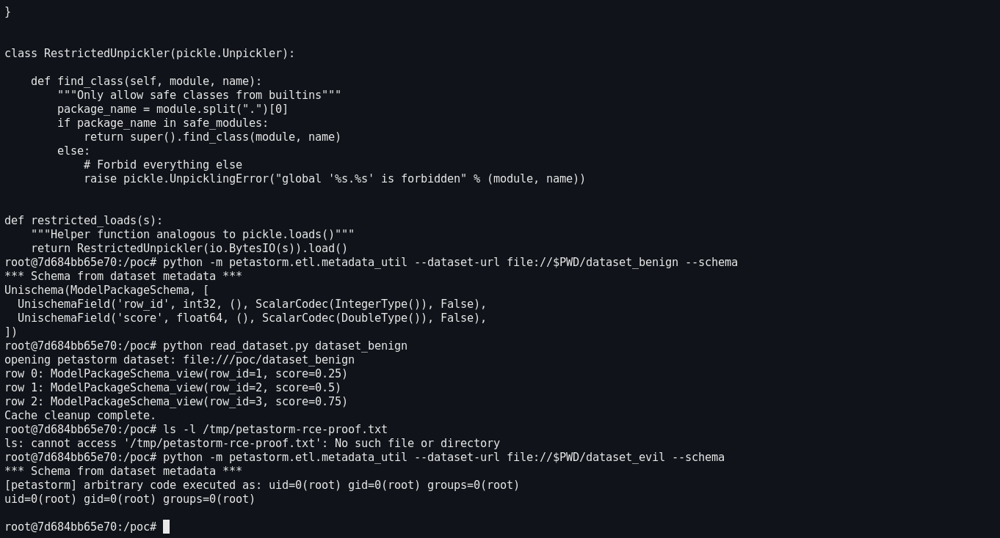

*Real terminal capture: instead of a schema, the shipped metadata utility prints the output of `id` — the
pickled payload ran inside the reading process.*

7. Verify the side effect landed on disk.

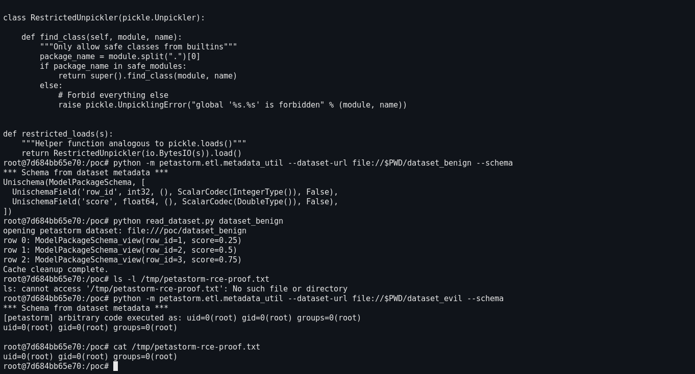

*Real terminal capture: the file did not exist before step 6 and now contains the `id` output written by the
payload during that read.*

8. Trigger the same defect through the public library API — `make_reader()` — which is the path a
   training or evaluation job takes.

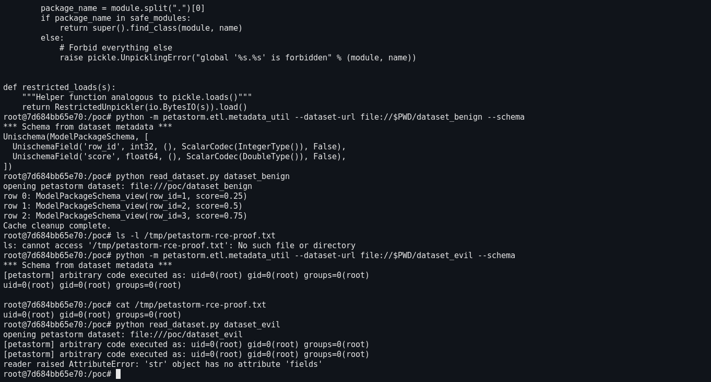

*Real terminal capture: `make_reader()` executes the payload (twice — the schema is loaded once by the
pre-flight check at `reader.py:158` and again by `infer_or_load_unischema`) before any data row is read; the
reader then fails because the attacker value is not a real `Unischema`.*

9. Boundary control — the identical reduction with the non-allowlisted global `os.system` is
   rejected, proving the allowlist is functional and that `__builtin__`/`builtins` is exactly the
   hole.

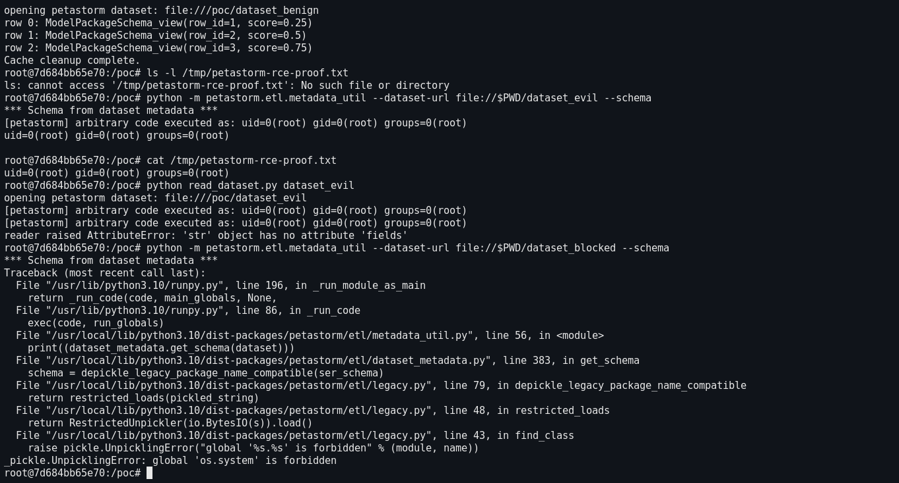

*Real terminal capture: the identical reduction with the non-allowlisted global `os.system` is rejected —
`metadata_util.py:56` → `dataset_metadata.py:383` → `legacy.py:79` → `legacy.py:48` → `legacy.py:43`. The
allowlist works; `__builtin__`/`builtins` is precisely the hole.*

### Expected vs Actual

- Expected: reading a dataset never executes code from the dataset, and an untrusted pickle
  global is rejected unless both the module **and** the attribute are safe.
- Actual: `Builtin.eval` executes inside the reading process. Step 6/8 produced the output of
  `id` and created `/tmp/petastorm-rce-proof.txt`, while the benign and blocked arms behaved
  correctly.

### Sanitized PoC input

The only effective difference between the arms is the bytes stored under the footer key
`dataset-toolkit.unischema.v1`. The malicious arm is a 264-byte protocol-2 pickle stream; the payload
expression below is deliberately limited to `id` plus a marker file (no reverse shell, no
persistence):

```text
80 02                                     PROTO 2
63 5f5f 6275 696c 7469 6e5f 5f 0a        GLOBAL  __builtin__
65 7661 6c 0a                            eval
28                                        MARK
58 eb 00 00 00 <235 bytes>                BINUNICODE  (the eval argument)
74                                        TUPLE
52                                        REDUCE   -> eval(expr)
2e                                        STOP

expr = __import__('os').system('id > /tmp/petastorm-rce-proof.txt') \
       or __import__('builtins').print('[petastorm] arbitrary code executed as:',
                                       open('/tmp/petastorm-rce-proof.txt').read().strip()) \
       or open('/tmp/petastorm-rce-proof.txt').read()
```

The benign arm stores `pickle.dumps(Unischema('ModelPackageSchema', [row_id, score]))` (354 bytes); the
blocked arm is byte-identical in shape to the malicious arm except that the global is `os.system`
(55 bytes).

## Impact

- Confidentiality: **High** — arbitrary code runs in the reading process, with access to every
  file and credential that process can reach (dataset paths, cloud storage tokens, notebooks).
- Integrity: **High** — arbitrary code execution; the process, its outputs and any artefact it
  writes can be modified.
- Availability: **High** — the payload can terminate or hang the reading job at will.
- Scope: code execution as the user running the training/evaluation/pipeline process. Because the
  trigger is a *read* of a dataset that is otherwise completely valid, the malicious package
  passes casual inspection, opens, and returns normal rows in the benign arm.

## Attack Vector and Severity (CVSS v3.1)

| Metric | Value | Rationale |
|---|---|---|
| Attack Vector | Network (N) | The dataset package is downloaded from a remote source (model hub, object store, shared artefact) and read locally; no special network position is needed. |
| Attack Complexity | Low (L) | No race, no mitigation to bypass, no special configuration; the malicious arm is a valid dataset and triggers deterministically on the first schema load. |
| Privileges Required | None (N) | Any user or process that reads the dataset; no credentials or elevated rights needed. |
| User Interaction | Required (R) | The victim must read/consume the dataset (open it with Petastorm). |
| Scope | Unchanged (U) | Code executes within the security context of the reading process. |
| Confidentiality | High (H) | Full read access as the reading process. |
| Integrity | High (H) | Arbitrary code execution in that process. |
| Availability | High (H) | The process can be crashed or hung. |

```
Score: 8.8 (High)
Vector: CVSS:3.1/AV:N/AC:L/PR:N/UI:R/S:U/C:H/I:H/A:H
```

Assumption stated explicitly: the affected artefact is delivered over the network (the usual way
dataset packages are obtained). If the dataset is only ever read from local media the vector
becomes `AV:L` and the score drops to 7.8; the `UI:R` requirement is what keeps this below 9.0.

## Remediation

No fixed release exists; the vulnerability is present at `01ba9cb7da8d` (2026-01-02) and the code
has not changed since `1071dbd1` (2021-07-28).

1. **Fix the filter (required).** Validate the pair, not the module, as the CPython
   documentation example does:

   ```python
   ALLOWED = {('petastorm.unischema', 'Unischema'), ...}   # explicit (module, name) pairs

   def find_class(self, module, name):
       if (module, name) in ALLOWED:
           return super().find_class(module, name)
       raise pickle.UnpicklingError("global '%s.%s' is forbidden" % (module, name))
   ```

   In particular `builtins` / `__builtin__` must never resolve to `eval`, `exec`, `compile`,
   `__import__`, `getattr`, `globals`, `vars`, `open` or `breakpoint`.
2. **Remove the deserialization entirely (preferred, long term).** Issue #8 already tracks
   replacing the pickled schema with a declarative format, which removes the unpickling step and
   the whole vulnerability class.
3. **Consumer-side workaround until a fix ships.** Do not read datasets from untrusted sources
   with Petastorm, or read them inside a sandbox/container with no ambient credentials
   (metadata service, cloud tokens, SSH agent).

## Timeline

| Date | Event |
|---|---|
| 2021-01-21 | Original unrestricted `pickle.loads` RCE reported via huntr.dev (PR #637) |
| 2021-07-28 | Fix merged as `1071dbd1` (PR #640) — introduces the `safe_modules` allowlist analysed here |
| 2022-03-19 | Upstream issue #741 "`RestrictedUnpickler` is Bypassable" opened; no maintainer response (0 comments) |
| 2026-01-02 | Pinned commit `01ba9cb7da8d` — vulnerable code still unchanged |
| 2026-10-05 | Reproduced end-to-end from a dataset package and report prepared |
| [pending] | Report sent to the maintainer |
| [pending] | Maintainer acknowledged |
| [pending] | Fix released |

## References

- Source repository: <https://github.com/uber/petastorm>
- Pinned vulnerable revision: <https://github.com/uber/petastorm/blob/01ba9cb7da8d8a6937e177aee39e241e10569d29/petastorm/etl/legacy.py#L22-L48>
- Commit that introduced the allowlist (the incomplete fix): <https://github.com/uber/petastorm/commit/1071dbd1f0034b84e95af3a48782ab516bd3d07d>
- Prior public report of this bypass: <https://github.com/uber/petastorm/issues/741>
- Original 2021 RCE report (huntr.dev): <https://github.com/uber/petastorm/pull/637>
- Schema-format RFC that would remove the unpickling: <https://github.com/uber/petastorm/issues/8>
- CWE-502: <https://cwe.mitre.org/data/definitions/502.html>
- CWE-94: <https://cwe.mitre.org/data/definitions/94.html>
- Upstream report: [pending publication]
- Vendor advisory: [none] (GitHub Advisory Database has no entry for the pip package `petastorm`)

## Disclaimer

This report is provided for defensive and coordination purposes. It contains no ready-to-run
exploit beyond the minimum reproduction information (the payload calls `id` and writes a marker
file), and no sensitive infrastructure details. The weakness is already public in issue #741 and
unpatched; this report adds a complete, dataset-level reproducer and requests a CVE identifier.
Do not disclose it publicly before the maintainer has had a reasonable window to respond.

## Screenshots

All eleven images below were captured from a **real terminal session**: a real `xterm` running an
interactive shell in the Docker container that holds the PoC, with the commands typed one at a time
and the window's own pixels grabbed by ImageMagick `import`. Nothing was redrawn or re-typed by hand.

Capture environment: Ubuntu 22.04 container, Python 3.10.12, pyarrow 8.0.0, pyspark 3.5.1, petastorm
0.13.1 installed from `01ba9cb7da8d`; terminal `xterm(410)` on a private Xvfb display
(`127.0.0.1:77`, 1600x900x24), captured 2026-10-05. A private virtual display was used because this
machine's physical desktop was occupied by a concurrent automation session driving its own
always-on-top terminal window, so a window opened there could not have been captured without
covering that session's window. The container's own `part-00000.parquet`, `_metadata`,
`_common_metadata` files and their SHA-256 sums are shipped alongside this report under `poc/`.

| File | What it shows |
|---|---|
| `screenshots/01-environment.png` | Python / pyarrow / petastorm versions and the installed petastorm path |
| `screenshots/02-build-datasets.png` | `make_poc.py` output: per-arm file list, sizes, sha256, raw metadata value prefix |
| `screenshots/03-dataset-contents.png` | `find dataset_evil -type f`: only the three data files |
| `screenshots/04-vulnerable-code.png` | Installed `legacy.py:21-48` with the `__builtin__` allowlist entry and the module-only check |
| `screenshots/05-benign-schema.png` | Benign dataset schema printed normally, no side effect |
| `screenshots/06-benign-read.png` | Benign dataset rows read through `make_reader()` |
| `screenshots/07-proof-absent.png` | Proof file absent before the trigger |
| `screenshots/08-evil-trigger.png` | Malicious dataset read: `id` output printed in place of the schema |
| `screenshots/09-proof-file.png` | Proof file contents after the trigger |
| `screenshots/10-make-reader-trigger.png` | Code execution through `make_reader()` before any row is read |
| `screenshots/11-blocked-control.png` | `os.system` variant rejected by the allowlist (`UnpicklingError`) |
