# whisper.cpp 5670d5c0 — Out-of-bounds Read in whisper_model_load (tensor `ttype` / ggml type table)

## Summary

`ggml-org/whisper.cpp` at commit `5670d5c0bbcb148feabef84400a07cfca9aa3b30` is affected by an
out-of-bounds read in the legacy model loader. Each tensor record in a legacy whisper
`ggml-*.bin` model carries a raw `int32` `ttype`. `whisper_model_load()` validates the record's
dimensions, name and element count — all of which an attacker can satisfy — and then uses
`ttype` directly as an index into ggml's global `type_traits[]` table. The only guard on that
index is a plain `assert`, which is compiled out under `NDEBUG` (defined by every release
build). An attacker-supplied model file whose tensor record declares `ttype = 43`
(= `GGML_TYPE_COUNT`, one past the end) triggers a global-buffer-overflow READ confirmed by
AddressSanitizer, reached from `main()` by the product's standard command line. The malicious
and benign artifacts differ in exactly one byte.

## Affected Product

| Field | Value |
|---|---|
| Vendor | ggml-org |
| Product | whisper.cpp (https://github.com/ggml-org/whisper.cpp) |
| Affected versions | git commit `5670d5c0bbcb148feabef84400a07cfca9aa3b30` (the commit verified here; full affected range not enumerated) |
| Component | `whisper_model_load()` in `src/whisper.cpp` (legacy `GGML_FILE_MAGIC` model format); sink in `ggml_type_size()` at `ggml/src/ggml.c` |
| Platform | x86_64 Linux; build flags `-DCMAKE_BUILD_TYPE=RelWithDebInfo -DWHISPER_SANITIZE_ADDRESS=ON -DWHISPER_SANITIZE_UNDEFINED=ON -DGGML_NATIVE=OFF -DGGML_BACKEND_DL=OFF` (no source modification) |
| Vulnerability type | CWE-125: Out-of-bounds Read |

## Root Cause

**Location:** `src/whisper.cpp:1932` (`whisper_model_load`), sink at `ggml/src/ggml.c:1333-1337`
(`ggml_type_size`); table at `ggml/src/ggml.c:632`

`src/whisper.cpp:1886-1888` reads three bare `int32`s per tensor record — `n_dims`, `length`,
`ttype` — via `read_safe`, which handles endianness and short reads but performs no value
validation. The loader then range-checks `n_dims` to 0..4 (`:1894`), requires the tensor name to
exist in `model.tensors` (`:1912`), checks the element count (`:1919`) and per-dimension shape
(`:1926`). A crafted record passes every one of these checks. At `:1932` the field stops being a
declared type tag and becomes an array index:

```c
const size_t bpe = ggml_type_size(ggml_type(ttype));   // src/whisper.cpp:1932 — unchecked index
```

`ggml_type_size` (`ggml/src/ggml.c:1333-1337`) protects the index with nothing but `assert`:

```c
size_t ggml_type_size(enum ggml_type type) {
    assert(type >= 0);
    assert(type < GGML_TYPE_COUNT);        // compiled out when NDEBUG is defined
    return type_traits[type].type_size;    // ggml/src/ggml.c:1336 — the OOB read
}
```

Every release configuration (`Release`, `RelWithDebInfo`) defines `NDEBUG`, so in any shipped
build there is no bound at all on an index taken verbatim from the file. `type_traits`
(`ggml/src/ggml.c:632`) is `2408` bytes = 43 entries × 56 bytes = exactly `GGML_TYPE_COUNT`
entries (`GGML_TYPE_COUNT = 43` at `ggml/include/ggml.h:433`), so `ttype = 43` reads the first
element past the end; the `+24` in the sanitizer report is the byte offset of the `type_size`
member within `struct ggml_type_traits`. The size-consistency check that *would* have rejected
the record sits on the next line (`src/whisper.cpp:1934`) and consumes `bpe`, so it cannot run
before the out-of-bounds read.

The input is attacker-controlled end to end: the model file is the attacker's capability, and
whisper models are routinely downloaded from third parties and passed to `-m`. The record layout
the PoC uses is exactly the layout the project's own writer emits
(`models/convert-pt-to-ggml.py:331-334`).

## Proof of Concept

### Prerequisites

- A build of whisper.cpp at the pinned commit with the project's own sanitizer flags (commands
  below). Release builds without sanitizers reach the same read; the sanitizer build makes it
  precisely attributable.
- The victim runs `whisper-cli` (or any caller of `whisper_init_from_file_with_params`) on an
  attacker-supplied legacy `.bin` model.

### Steps to Reproduce

1. Build at the pinned commit with the project's own switches:

   ```bash
   cmake -B build -G Ninja -DCMAKE_BUILD_TYPE=RelWithDebInfo \
     -DWHISPER_SANITIZE_ADDRESS=ON -DWHISPER_SANITIZE_UNDEFINED=ON \
     -DWHISPER_BUILD_TESTS=OFF -DWHISPER_BUILD_SERVER=OFF \
     -DGGML_NATIVE=OFF -DGGML_BACKEND_DL=OFF
   cmake --build build -j --target whisper-cli
   ```

   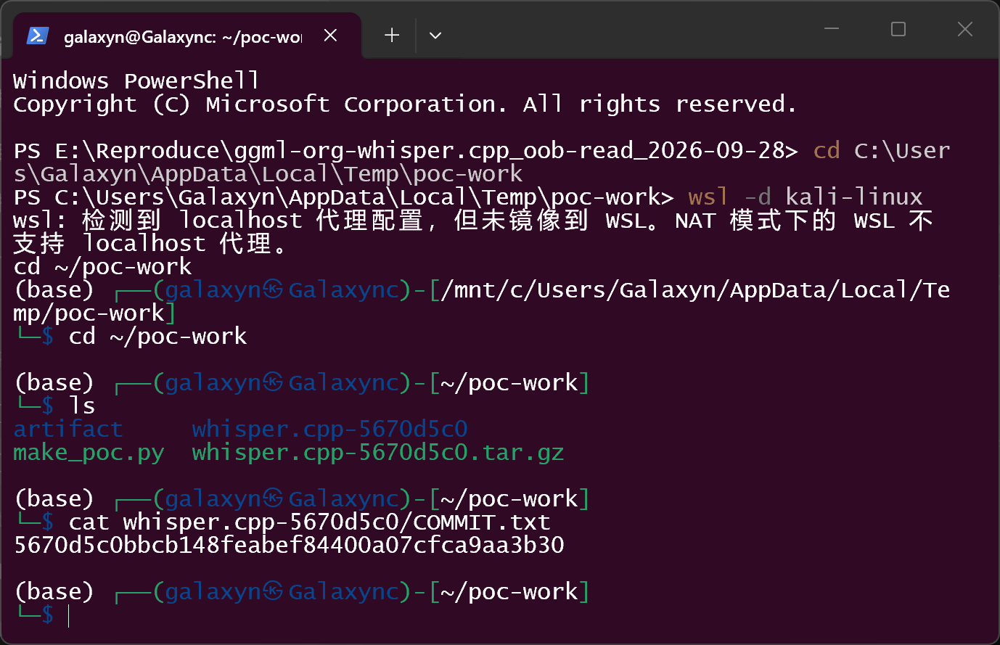
   The verification checkout is pinned to `5670d5c0bbcb148feabef84400a07cfca9aa3b30`.

2. Generate the artifacts from upstream's own test fixture
   `models/for-tests-ggml-tiny.bin` (a valid legacy header + mel filters + vocab, zero tensor
   records) by appending exactly one tensor record in the layout of
   `models/convert-pt-to-ggml.py:331-334` — `int32 n_dims=1; int32 length; int32 ttype;
   int32 ne[1]=384; "encoder.ln_post.bias"; 384 float32 values`:

   ```bash
   python3 make_poc.py whisper.cpp-5670d5c0    # script in poc/, writes ./artifact/
   ```

   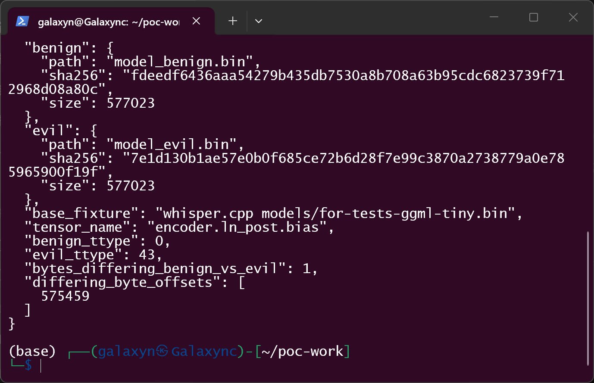
   The generator reports `evil_ttype = 43` (= `GGML_TYPE_COUNT` from `ggml/include/ggml.h:433`)
   and `bytes_differing_benign_vs_evil = 1` at file offset 575459.

3. Verify the three artifacts (`sha256sum`):

   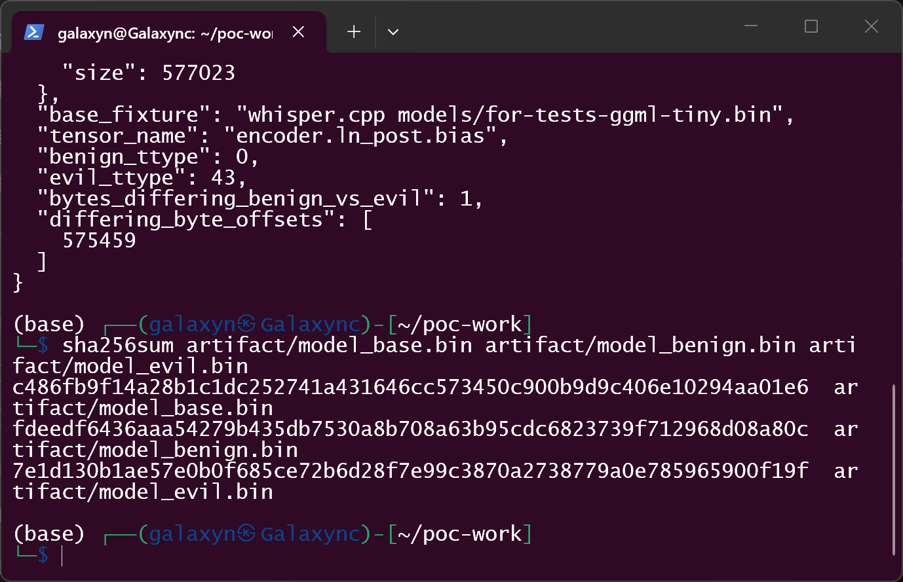

   | file | role | sha256 |
   |---|---|---|
   | `model_base.bin` | control A — upstream fixture untouched | `c486fb9f14a28b1c1dc252741a431646cc573450c900b9d9c406e10294aa01e6` |
   | `model_benign.bin` | control B — same record with `ttype = 0` | `fdeedf6436aaa54279b435db7530a8b708a63b95cdc6823739f712968d08a80c` |
   | `model_evil.bin` | attack artifact — same record with `ttype = 43` | `7e1d130b1ae57e0b0f685ce72b6d28f7e99c3870a2738779a0e785965900f19f` |

   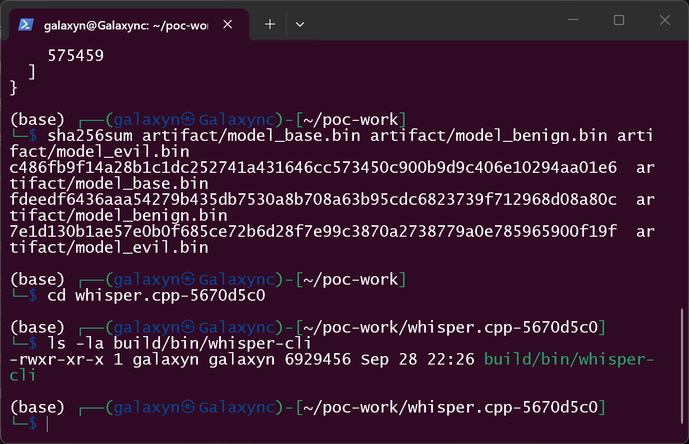

4. Run the canonical command against the attack artifact:

   ```bash
   setarch -R ./build/bin/whisper-cli -m ../artifact/model_evil.bin -f samples/jfk.wav -t 1
   ```

   (`setarch -R` disables ASLR, the standard ASan workaround; it does not affect parsing or
   validation. On this WSL2 kernel the same report is produced without it.)

   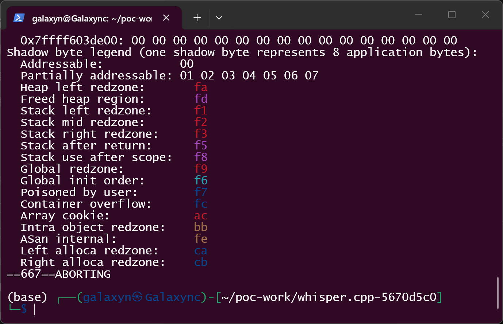
   The run floods the terminal with the sanitizer report and dies with
   `==667==ABORTING`; the prompt returns to the shell.

   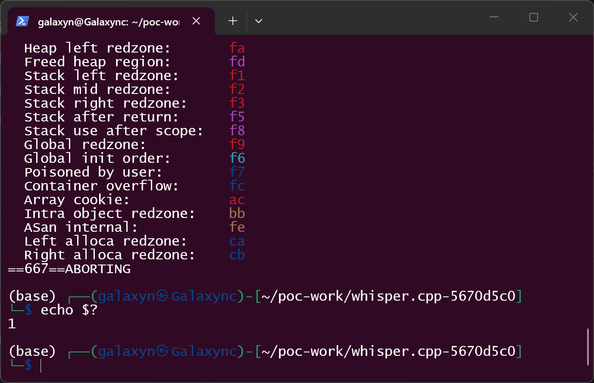
   `echo $?` shows the ASan abort exit code `1` (default `ASAN_OPTIONS`).

5. The sanitizer report (re-run captured to a file and shown back verbatim, because the full
   report is longer than one terminal screen):

   ```bash
   setarch -R ./build/bin/whisper-cli -m ../artifact/model_evil.bin -f samples/jfk.wav -t 1 > /tmp/evil_full.txt 2>&1
   sed -n '/ERROR: AddressSanitizer/,/cli.cpp:1087/p' /tmp/evil_full.txt
   ```

   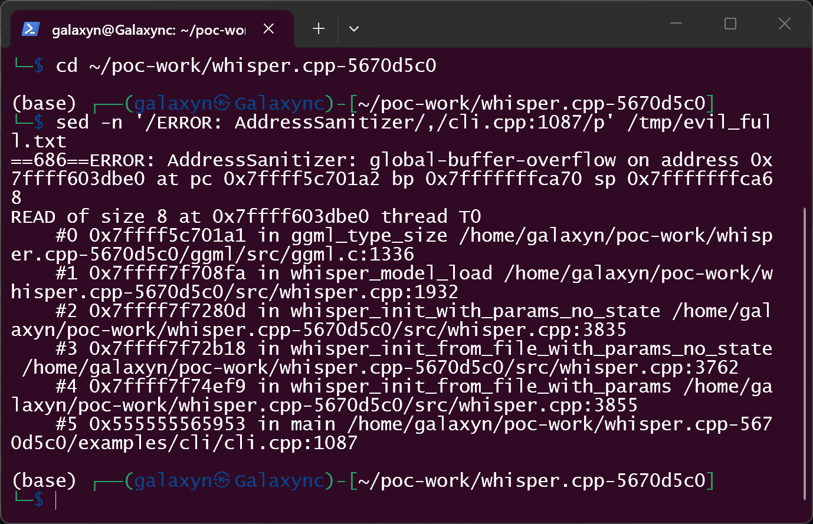
   `ERROR: AddressSanitizer: global-buffer-overflow`, `READ of size 8`, with the stack
   `ggml_type_size ggml/src/ggml.c:1336` → `whisper_model_load src/whisper.cpp:1932` →
   `whisper_init_with_params_no_state :3835` → `whisper_init_from_file_with_params_no_state
   :3762` → `whisper_init_from_file_with_params :3855` → `main examples/cli/cli.cpp:1087`.

   ```bash
   sed -n '/cli.cpp:1087/,/SUMMARY: AddressSanitizer/p' /tmp/evil_full.txt
   ```

   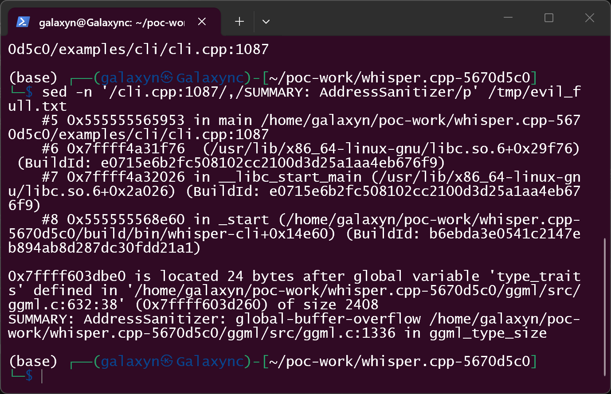
   `0x… is located 24 bytes after global variable 'type_traits' defined in
   'ggml/src/ggml.c:632:38' … of size 2408` and `SUMMARY: AddressSanitizer:
   global-buffer-overflow ggml/src/ggml.c:1336 in ggml_type_size`. UBSan (enabled by the same
   build) independently reports `index 43 out of bounds for type 'ggml_type_traits [43]'` at
   the same line.

6. Negative control A — upstream's untouched fixture runs cleanly:

   ```bash
   setarch -R ./build/bin/whisper-cli -m ../artifact/model_base.bin -f samples/jfk.wav -t 1
   ```

   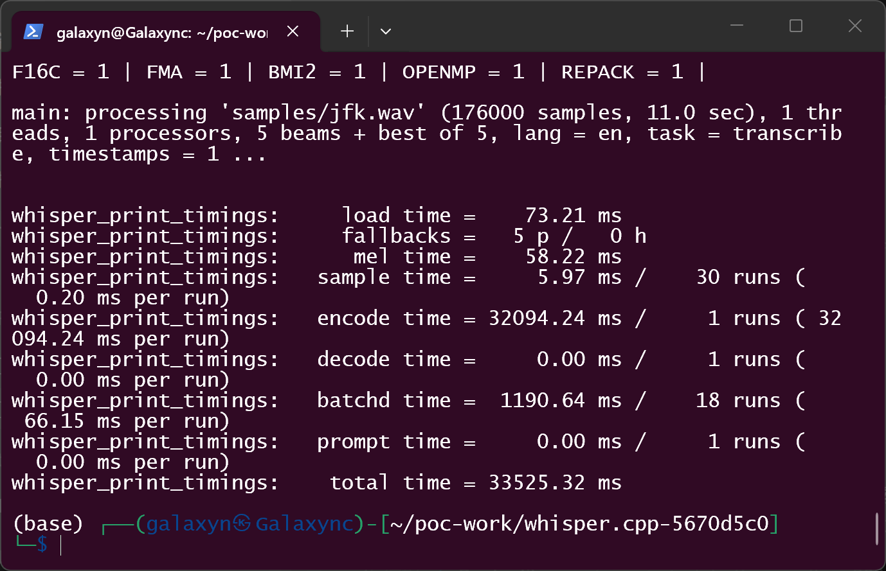

   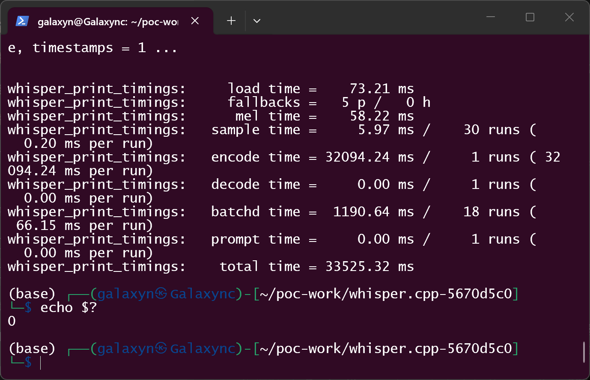
   Exit code `0`, no sanitizer reports. (The tiny fixture contains zero tensor records — an
   empty model — so no meaningful transcription is produced; that is irrelevant to the sink.)

7. Negative control B — the identical record with `ttype = 0`, one byte different:

   ```bash
   ASAN_OPTIONS=detect_leaks=0 setarch -R ./build/bin/whisper-cli -m ../artifact/model_benign.bin -f samples/jfk.wav -t 1
   ```

   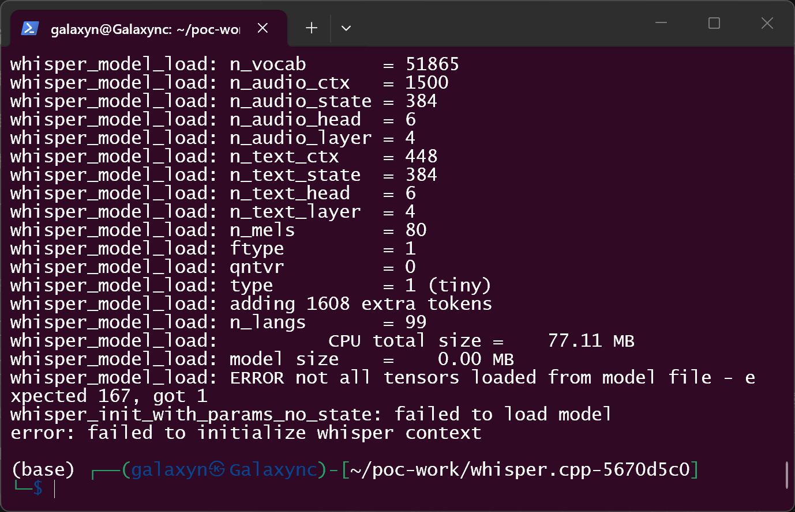
   The loader **accepts and counts** the appended record:
   `whisper_model_load: ERROR not all tensors loaded from model file - expected 167, got 1`,
   then fails after the sink because the other 166 tensors are absent.
   `ASAN_OPTIONS=detect_leaks=0` only suppresses LeakSanitizer reports from that unrelated
   error path.

   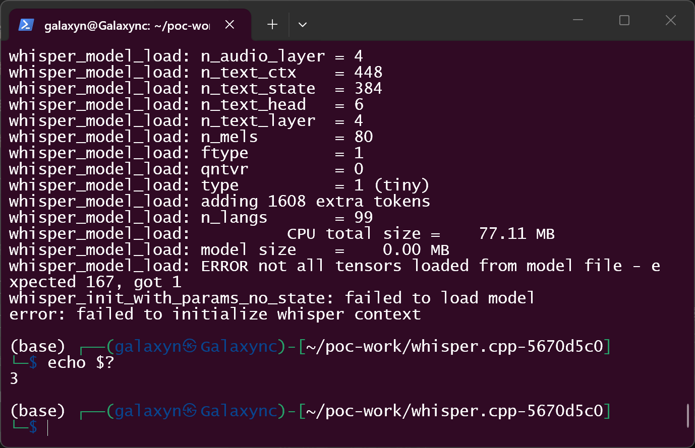
   Exit code `3` (`examples/cli/cli.cpp:1091`, "failed to initialize whisper context"), and no
   out-of-bounds access is reported. This proves the record passes every validation the loader
   performs and that the one-byte `ttype` difference alone selects between accepted-record and
   out-of-bounds-read.

### Expected vs Actual

- Expected: a tensor record whose `ttype` is outside `[0, GGML_TYPE_COUNT)` is rejected with a
  clear error, exactly as out-of-range `n_dims` is rejected twelve lines earlier
  (`src/whisper.cpp:1894`); no out-of-bounds access occurs for any file contents.
- Actual: `ttype` indexes `type_traits[]` unbounded; `ttype = 43` reads 8 bytes from the first
  element past the 2408-byte read-only global (ASan: global-buffer-overflow, READ of size 8,
  24 bytes after `type_traits`).

### Sanitized PoC input

No network, tokens or hosts are involved — the entire PoC is one file. The attack artifact is
upstream's own `models/for-tests-ggml-tiny.bin` (575,451 bytes) plus a 1,572-byte tensor record;
the malicious and benign variants differ in exactly one byte (offset 575459, the `ttype` field:
`0x2B` vs `0x00`). Hashes in step 3. Generator: `poc/make_poc.py`; pinned source:
`poc/whisper.cpp-5670d5c0.tar.gz`.

## Impact

- Confidentiality: **None (as measured)** — the proven read is 24 bytes into adjacent rodata of
  a `static const` global, and the value read back is discarded by the very next size check.
- Integrity: **None** — no write primitive exists on this path.
- Availability: **Low (defect basis) / potentially High (defect basis, unproven)** — the
  measured `ttype = 43` read does not crash a non-sanitizer build. However `ttype` is a full
  unbounded `int32`: `ttype = 0x7FFFFFFF` would address ~120 GB past the table, which is a
  plausible `SIGSEGV`. That variant was **not** run (it yields a raw signal rather than a
  precisely attributable sanitizer report), so no crash is claimed.
- Scope: memory corruption confined to the process (in-process out-of-bounds read); no
  privilege boundary is crossed.

## Attack Vector and Severity (CVSS v3.1)

| Metric | Value | Rationale |
|---|---|---|
| Attack Vector | L | Requires running the CLI (or another `whisper_init_from_file_with_params` caller) on a local model file |
| Attack Complexity | L | One fixed field value (`ttype = GGML_TYPE_COUNT`); no race, no special config |
| Privileges Required | N | No privileges; the user runs the tool normally |
| User Interaction | R | The user must choose to run whisper-cli on the attacker-supplied model file |
| Scope | U | Impact confined to the whisper-cli process |
| Confidentiality | N | Measured read is of adjacent read-only data and is discarded |
| Integrity | N | No write occurs |
| Availability | L | Scored on the measured, deterministic sanitizer abort of the CLI run; a maintainer weighting the unbounded `int32` index rather than the tested value would argue `A:H` (5.5), which is noted as a judgement about the defect rather than the measurement |

```
Score: 3.3 (Low)
Vector: CVSS:3.1/AV:L/AC:L/PR:N/UI:R/S:U/C:N/I:N/A:L
```

## Remediation

Range-check `ttype` in `whisper_model_load` before it is used as an index, mirroring the
existing `n_dims` check (`src/whisper.cpp:1894`):

```c
if (ttype < 0 || ttype >= GGML_TYPE_COUNT) {
    WHISPER_LOG_ERROR("%s: invalid ttype %d for tensor '%s'\n", __func__, ttype, name.c_str());
    return false;
}
const size_t bpe = ggml_type_size(ggml_type(ttype));
```

Independently, the guard inside `ggml_type_size` (`ggml/src/ggml.c:1333-1337`) should not be a
plain `assert`: `GGML_ASSERT` (which stays live in release builds) would turn this class of bug
into a deterministic abort for every caller. The same unguarded pattern appears in the
`--vad-model` loader (`src/whisper.cpp:5140-5188`) — not exercised here, but worth fixing in the
same change. Workaround until patched: only run whisper-cli on models from trusted sources, or
convert models to the GGUF format once the loader accepts it.

## Timeline

| Date | Event |
|---|---|
| 2026-09-20 | Vulnerability reproduced and draft advisory prepared (containerized verification, clang build) |
| 2026-09-28 | Independent re-verification on WSL2 (gcc 15.2 build), real-terminal evidence captured; report prepared |
| [pending] | Report sent to the maintainer |
| [pending] | Maintainer acknowledged |
| [pending] | Fix released |

## References

- Source repository: https://github.com/ggml-org/whisper.cpp
- Pinned commit: https://github.com/ggml-org/whisper.cpp/commit/5670d5c0bbcb148feabef84400a07cfca9aa3b30
- Upstream report: [pending publication]
- CWE: https://cwe.mitre.org/data/definitions/125.html
- Vendor advisory: [none — repository has no security policy on file as of 2026-09-28]

## Disclaimer

This report is provided for defensive and coordination purposes. It contains no ready-to-run
exploit beyond the minimum reproduction information, and no sensitive infrastructure details.
Do not disclose it publicly before the maintainer has had a reasonable window to fix the issue.

## Screenshot Checklist

All screenshots below are genuine captures of a real terminal window (Windows Terminal running
WSL `kali-linux`, commands executed one at a time), taken on 2026-09-28. Collection
environment: Windows 11 host, WSL2 kernel 6.6.87, kali-linux distribution, whisper.cpp built at
the pinned commit with gcc 15.2.0 / cmake 3.31.6 / Ninja and the project's own sanitizer flags
(`RelWithDebInfo`, `WHISPER_SANITIZE_ADDRESS=ON`, `WHISPER_SANITIZE_UNDEFINED=ON`). The
containerized clang-build verification of 2026-09-20 produced byte-identical artifact hashes and
the same sanitizer signature; the screenshots document the WSL2 gcc verification.

| File | Content |
|---|---|
| `screenshots/01-workdir.png` | Work directory: pinned source tree, `make_poc.py`, generated `artifact/` |
| `screenshots/02-commit.png` | `COMMIT.txt` — pinned commit `5670d5c0bbcb148feabef84400a07cfca9aa3b30` |
| `screenshots/03-make-poc.png` | `make_poc.py` output: artifact metadata, `evil_ttype=43`, one differing byte at offset 575459 |
| `screenshots/04-sha256.png` | `sha256sum` of the three model artifacts (hashes match the table in step 3) |
| `screenshots/05-binary.png` | ASan/UBSan-instrumented `build/bin/whisper-cli` |
| `screenshots/06-evil-live.png` | Live run on `model_evil.bin`: sanitizer flood ending in `==667==ABORTING` |
| `screenshots/07-evil-exit.png` | `echo $?` after the live run: exit code 1 (ASan default) |
| `screenshots/08-evil-asan-report.png` | ASan report part 1: `global-buffer-overflow`, `READ of size 8`, stack `ggml_type_size` ← `whisper_model_load:1932` ← … ← `main` |
| `screenshots/13-evil-asan-report2.png` | ASan report part 2: `24 bytes after global variable 'type_traits' … of size 2408` + `SUMMARY` |
| `screenshots/09-base-control.png` | Control A (`model_base.bin`, upstream fixture): clean run, no sanitizer reports |
| `screenshots/10-base-exit.png` | Control A exit code: 0 |
| `screenshots/11-benign-control.png` | Control B (`model_benign.bin`, one-byte twin): loader accepts the record (`expected 167, got 1`), no OOB |
| `screenshots/12-benign-exit.png` | Control B exit code: 3 (failed init after the sink — the other 166 tensors are absent) |

Environment differences vs the 2026-09-20 container verification, stated plainly: compiler
gcc 15.2 here vs clang there (same CMake flags); ASan exit code 1 here (default
`ASAN_OPTIONS`) vs 42 there (`drive.py` sets `ASAN_OPTIONS=exitcode=42`); control B here run
with `ASAN_OPTIONS=detect_leaks=0` to suppress LeakSanitizer output from the unrelated
failed-init error path (without it the process exits 1 after leak reports; the original
environment recorded 3, which this environment reproduces with the same option). Artifact
hashes are identical across both environments.
