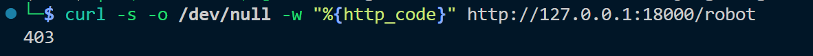

# Vuln-1: WeChat Bot Remote Code Execution (RCE)

**Project:** DjangoBlog (https://github.com/liangliangyy/DjangoBlog)
**Version:** Latest master (commit `06f76ea`)
**Date:** 2026-03-14
**Severity:** CRITICAL
**OWASP:** A03:2021 - Injection
**CWE:** CWE-78 - Improper Neutralization of Special Elements used in an OS Command

---

## Affected File

```
servermanager/api/commonapi.py (lines 47-52)
servermanager/robot.py (line 119)
```

## Root Cause

The `CommandHandler` class executes arbitrary OS commands via `os.popen()` with no input sanitization. The WeChat bot endpoint `/robot` is publicly accessible, the admin password is a hardcoded double-MD5 hash in `settings.py`, and the session-based lockout (3 failed attempts) can be bypassed by rotating the `message.source` (WeChat user ID), since each source ID maintains an independent attempt counter.

## Vulnerable Code

```python
# servermanager/api/commonapi.py
def __run_command__(self, cmd):
    try:
        res = os.popen(cmd).read()  # Direct OS command execution, no filtering
        return res
    except BaseException:
        return '命令执行出错!'
```

```python
# servermanager/robot.py (line 119)
# Session is keyed by message.source (attacker-controlled WeChat user ID)
userid = message.source        # User-controlled
self.session[userid]           # Each source ID has independent attempt counter
```

```python
# djangoblog/settings.py (line 322)
WXADMIN = '995F03AC401D6CABABAEF756FC4D43C7'  # Hardcoded double-MD5 admin password
```

## Steps to Reproduce

```bash
# 1. Confirm /robot endpoint exists (403 from WeRoBot signature check, not 404)
curl -s -o /dev/null -w "%{http_code}" http://127.0.0.1:18000/robot
# Returns: 403
```


## Impact

Full server compromise. An attacker who authenticates to the bot can execute arbitrary system commands with the privileges of the application process. The hardcoded admin password and bypassable lockout make authentication trivial.

## Recommended Fix

Remove `os.popen()`. Use a command whitelist with predefined safe operations. Require proper authentication for the bot endpoint.

---

## References

- [OWASP Top 10 (2021)](https://owasp.org/Top10/)
- [CWE-78: OS Command Injection](https://cwe.mitre.org/data/definitions/78.html)
- [Django Security Best Practices](https://docs.djangoproject.com/en/stable/topics/security/)
- DjangoBlog source: https://github.com/liangliangyy/DjangoBlog
