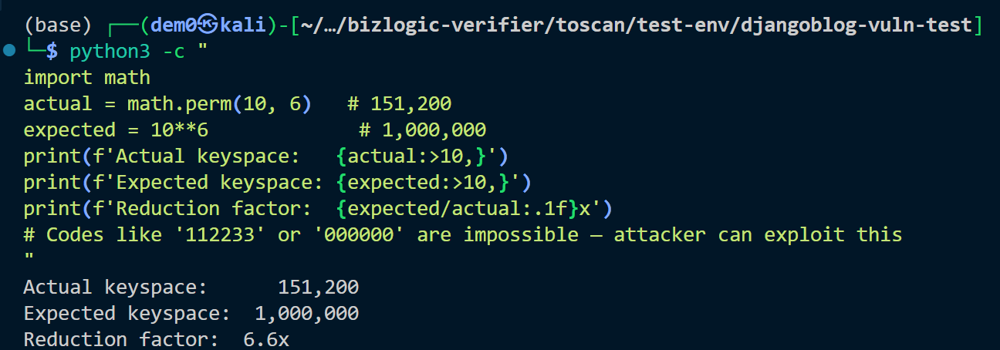

# Vuln-13: Weak Verification Code Generation

**Project:** DjangoBlog (https://github.com/liangliangyy/DjangoBlog)
**Version:** Latest master (commit `06f76ea`)
**Date:** 2026-03-14
**Severity:** LOW
**OWASP:** A02:2021 - Cryptographic Failures
**CWE:** CWE-330 - Use of Insufficiently Random Values

---

## Affected File

```
djangoblog/utils.py (lines 138-140)
```

## Root Cause

Verification codes are generated using `random.sample(string.digits, 6)` — sampling **without replacement** from 10 digits. This produces codes where all 6 digits are unique, reducing the keyspace from 1,000,000 (10^6) to 151,200 (P(10,6) = 10!/4!). Additionally, Python's `random` module is not cryptographically secure.

## Steps to Reproduce

```python
python3 -c "
import math
actual = math.perm(10, 6)   # 151,200
expected = 10**6             # 1,000,000
print(f'Actual keyspace:   {actual:>10,}')
print(f'Expected keyspace: {expected:>10,}')
print(f'Reduction factor:  {expected/actual:.1f}x')
# Codes like '112233' or '000000' are impossible — attacker can exploit this
"
```


## Impact

Combined with the absence of rate limiting (Vuln-8), an attacker needs only ~151,200 attempts to brute-force a verification code — a 6.6x reduction from the expected keyspace.

## Recommended Fix

Use `secrets.choice()` (cryptographically secure) with replacement: `''.join(secrets.choice(string.digits) for _ in range(6))`.

---

## References

- [OWASP Top 10 (2021)](https://owasp.org/Top10/)
- [CWE-330: Use of Insufficiently Random Values](https://cwe.mitre.org/data/definitions/330.html)
- [Django Security Best Practices](https://docs.djangoproject.com/en/stable/topics/security/)
- DjangoBlog source: https://github.com/liangliangyy/DjangoBlog
