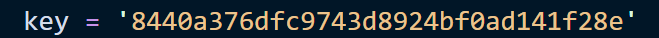

# Vuln-5: Hardcoded Amap API Key

**Project:** DjangoBlog (https://github.com/liangliangyy/DjangoBlog)
**Version:** Latest master (commit `06f76ea`)
**Date:** 2026-03-14
**Severity:** HIGH
**OWASP:** A02:2021 - Cryptographic Failures
**CWE:** CWE-798 - Use of Hard-coded Credentials

---

## Affected File

```
owntracks/views.py (line 81)
```

## Root Cause

The Amap (Gaode Maps) API key is hardcoded directly in the source code:



## Impact

The API key is publicly exposed in the open-source repository. It can be abused to make unauthorized Amap API calls, potentially incurring costs for the key owner and enabling location data queries.

## Recommended Fix

Move the API key to an environment variable. Rotate the exposed key immediately.

---

## References

- [OWASP Top 10 (2021)](https://owasp.org/Top10/)
- [CWE-798: Use of Hard-coded Credentials](https://cwe.mitre.org/data/definitions/798.html)
- [Django Security Best Practices](https://docs.djangoproject.com/en/stable/topics/security/)
- DjangoBlog source: https://github.com/liangliangyy/DjangoBlog
