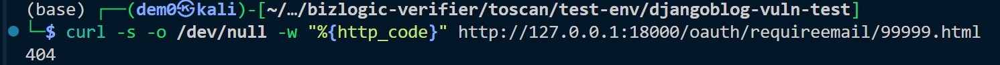

# Vuln-6: OAuth Email Binding IDOR

**Project:** DjangoBlog (https://github.com/liangliangyy/DjangoBlog)
**Version:** Latest master (commit `06f76ea`)
**Date:** 2026-03-14
**Severity:** HIGH
**OWASP:** A01:2021 - Broken Access Control
**CWE:** CWE-639 - Authorization Bypass Through User-Controlled Key

---

## Affected File

```
oauth/views.py (lines 200-260)
```

## Root Cause

`RequireEmailView` accepts the `oauthid` parameter from the client-side form without verifying that it belongs to the currently authenticated user. An attacker can tamper with the hidden `oauthid` field to hijack another user's OAuth identity.

## Vulnerable Code

```python
# oauth/views.py - RequireEmailView.form_valid()
def form_valid(self, form):
    email = form.cleaned_data['email']
    oauthid = form.cleaned_data['oauthid']        # From client form — attacker-controlled
    oauthuser = get_object_or_404(OAuthUser, pk=oauthid)  # No ownership verification
    oauthuser.email = email                        # Overwrites any OAuthUser's email
    oauthuser.save()
```

## Steps to Reproduce

```bash
# 1. Confirm endpoint exists
curl -s -o /dev/null -w "%{http_code}" http://127.0.0.1:18000/oauth/requireemail/99999.html
# Returns: 404 (get_object_or_404 — endpoint exists, but OAuthUser ID 99999 does not)
```


**Attack flow:**

1. Attacker completes OAuth login and is redirected to `RequireEmailView`.
2. Attacker modifies the hidden `oauthid` form field to the target user's OAuthUser ID.
3. Attacker submits their own email address.
4. Attacker clicks the confirmation link sent to their email.
5. The target's OAuthUser is now bound to the attacker's account.

## Impact

Hijacking of other users' OAuth social login identities, leading to account takeover via social authentication.

## Recommended Fix

Verify that the `oauthid` in the form belongs to the current session/user before modifying. Store the OAuth ID server-side in the session.

---

## References

- [OWASP Top 10 (2021)](https://owasp.org/Top10/)
- [CWE-639: Authorization Bypass Through User-Controlled Key](https://cwe.mitre.org/data/definitions/639.html)
- [Django Security Best Practices](https://docs.djangoproject.com/en/stable/topics/security/)
- DjangoBlog source: https://github.com/liangliangyy/DjangoBlog
