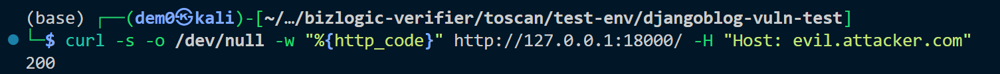

# Vuln-7: ALLOWED_HOSTS Wildcard Configuration

**Project:** DjangoBlog (https://github.com/liangliangyy/DjangoBlog)
**Version:** Latest master (commit `06f76ea`)
**Date:** 2026-03-14
**Severity:** MEDIUM
**OWASP:** A05:2021 - Security Misconfiguration
**CWE:** CWE-16 - Configuration

---

## Affected File

```
djangoblog/settings.py (line 39)
```

## Root Cause

`ALLOWED_HOSTS` includes the wildcard `'*'`, disabling Django's Host header validation.

## Steps to Reproduce

```bash
curl -s -o /dev/null -w "%{http_code}" http://127.0.0.1:18000/ -H "Host: evil.attacker.com"
# Returns: 200 (should be 400 with proper ALLOWED_HOSTS)
```


## Impact

Enables HTTP Host header injection attacks including cache poisoning and password reset link hijacking.

## Recommended Fix

Remove `'*'` and configure explicit allowed hostnames.

---

## References

- [OWASP Top 10 (2021)](https://owasp.org/Top10/)
- [CWE-16: Configuration](https://cwe.mitre.org/data/definitions/16.html)
- [Django Security Best Practices](https://docs.djangoproject.com/en/stable/topics/security/)
- DjangoBlog source: https://github.com/liangliangyy/DjangoBlog
