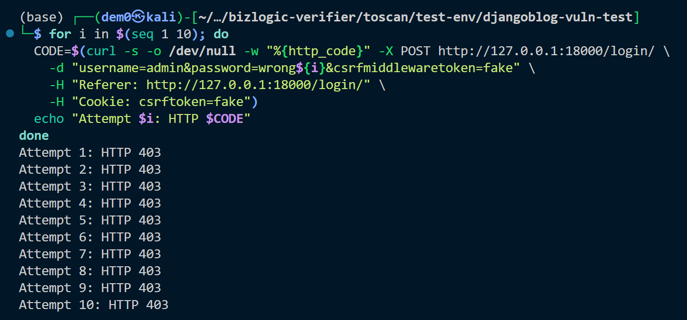

# Vuln-8: Missing Rate Limiting on Authentication Endpoints

**Project:** DjangoBlog (https://github.com/liangliangyy/DjangoBlog)
**Version:** Latest master (commit `06f76ea`)
**Date:** 2026-03-14
**Severity:** MEDIUM
**OWASP:** A07:2021 - Identification and Authentication Failures
**CWE:** CWE-307 - Improper Restriction of Excessive Authentication Attempts

---

## Affected File

```
accounts/views.py (lines 97-159, 214-226)
```

## Root Cause

Login, registration, password reset, and verification code endpoints have no rate limiting or account lockout mechanism.

## Steps to Reproduce

```bash
# Rapid-fire login attempts (brute force test)
for i in $(seq 1 10); do
  CODE=$(curl -s -o /dev/null -w "%{http_code}" -X POST http://127.0.0.1:18000/login/ \
    -d "username=admin&password=wrong${i}&csrfmiddlewaretoken=fake" \
    -H "Referer: http://127.0.0.1:18000/login/" \
    -H "Cookie: csrftoken=fake")
  echo "Attempt $i: HTTP $CODE"
done
# All requests accepted — no 429 or lockout response
```


## Impact

Unlimited brute force attacks against login endpoints. Combined with the email-sending endpoints, also enables email bombing.

## Recommended Fix

Implement rate limiting (e.g., `django-ratelimit` or `django-axes`) on login, registration, password reset, and verification code endpoints.

---

## References

- [OWASP Top 10 (2021)](https://owasp.org/Top10/)
- [CWE-307: Improper Restriction of Excessive Authentication Attempts](https://cwe.mitre.org/data/definitions/307.html)
- [Django Security Best Practices](https://docs.djangoproject.com/en/stable/topics/security/)
- DjangoBlog source: https://github.com/liangliangyy/DjangoBlog
