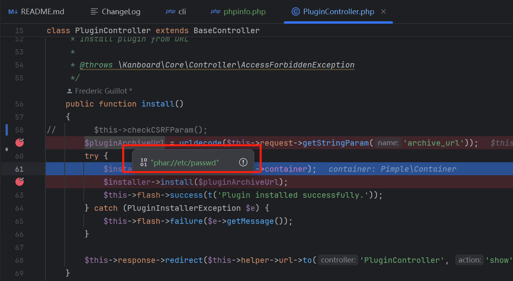

# 0x01 Phar Vulnerability in Kanboard
**official_website**: https://github.com/kanboard/kanboard 
**version**: **v1.2.44**
Kanboard is vulnerable to a Phar vulnerability in the plugin installation feature via deserialization of untrusted input from the `install` method of `PluginController`. This vulnerability allows attackers to inject PHP objects through a PHAR file. The vulnerability exists because the application retrieves the `archive_url` parameter without proper validation, allowing attackers to specify a `phar://` URL that can lead to object deserialization.

The vulnerable code path is as follows:
1. The `install` method in `PluginController` accepts an `archive_url` parameter from HTTP requests
2. This URL is passed to the `Installer->install()` method
3. The installer uses `httpClient->get()` to fetch content from the provided URL
4. No proper validation is performed on the URL scheme, allowing `phar://` URLs
5. When a PHAR URL is processed, PHP automatically deserializes metadata in the PHAR file

An attacker can exploit this vulnerability by crafting a malicious PHAR file, hosting it on an attacker-controlled server, and then sending a request to the `PluginController` with the `archive_url` parameter pointing to the PHAR file via the `phar://` protocol wrapper.


Exploit example:
```
http://example.com/?controller=PluginController&action=install&archive_url=phar://etc/passwd
```

This vulnerability could allow attackers to:
1. Read sensitive system files like `/etc/passwd`
2. Access application configuration files containing credentials
3. Retrieve source code of restricted files
4. Potentially achieve remote code execution through advanced exploitation techniques using PHAR deserialization

This vulnerability can also lead to arbitrary file read issues. See the reference link below:
[https://www.synacktiv.com/publications/php-filter-chains-file-read-from-error-based-oracle](https://www.synacktiv.com/publications/php-filter-chains-file-read-from-error-based-oracle)

Using the tool: https://github.com/synacktiv/php_filter_chains_oracle_exploit
```bash
python3 filters_chain_oracle_exploit.py --target http://example.com/?controller=PluginController&action=install --file '/test' --parameter archive_url
```

## Remediation

To fix this vulnerability, implement proper validation of file paths by:
1. Disallowing PHP wrapper protocols in file paths
2. Implementing a whitelist of allowed file extensions and directories
3. Using secure file reading methods that don't support wrapper protocols
4. Implementing proper input validation before processing file paths

Project maintainers should implement proper URL scheme validation for the `archive_url` parameter and ensure CSRF protections are in place for the plugin installation functionality.

## Reference
0x01 https://www.cve.org/CVERecord?id=CVE-2025-5114  
0x02 https://www.cve.org/CVERecord?id=CVE-2025-2485


