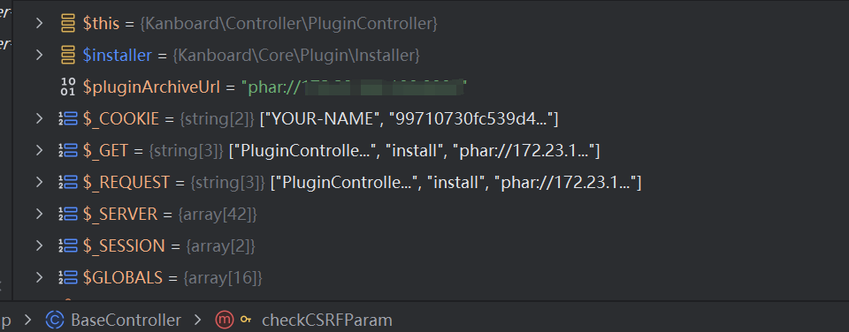

# 0x01 Phar Vulnerability in Kanboard
**office_website**:https://github.com/kanboard/kanboard 
**version**: v1.2.44
Kanboard is vulnerable to Phar Vulnerability  in the plugin installation feature via deserialization of untrusted input from the `install` method of `PluginController`. This makes it possible for attackers to inject a PHP Object through a PHAR file. The vulnerability exists because the application retrieves the `archive_url` parameter without proper validation, allowing attackers to specify a `phar://` URL that can lead to object deserialization.

The vulnerable code path is as follows:
1. The `install` method in `PluginController` accepts an `archive_url` parameter from HTTP requests
2. This URL is passed to the `Installer->install()` method
3. The installer uses `httpClient->get()` to fetch content from the provided URL
4. No proper validation is performed on the URL scheme, allowing `phar://` URLs
5. When a PHAR URL is processed, PHP will automatically deserialize metadata in the PHAR file

An attacker can exploit this vulnerability by crafting a malicious PHAR file and hosting it on an attacker-controlled server, then sending a request to the `PluginController` with the `archive_url` parameter pointing to the PHAR file via the `phar://` protocol wrapper.

Example payload:
```
http://example.com/?controller=PluginController&action=install&archive_url=phar://{phar_file}
```

The vulnerability may allow attackers to execute arbitrary code on the affected server depending on the available PHP Object Injection gadget chains in the application or its dependencies. This vulnerability affects all versions of Kanboard that include the plugin installation feature and can be exploited by users with administrative privileges, or potentially by unauthenticated users if the CSRF protection is bypassed (as indicated by a commented-out CSRF check in the code).

Project maintainers should implement proper URL scheme validation for the `archive_url` parameter and ensure CSRF protections are in place for the plugin installation functionality.



