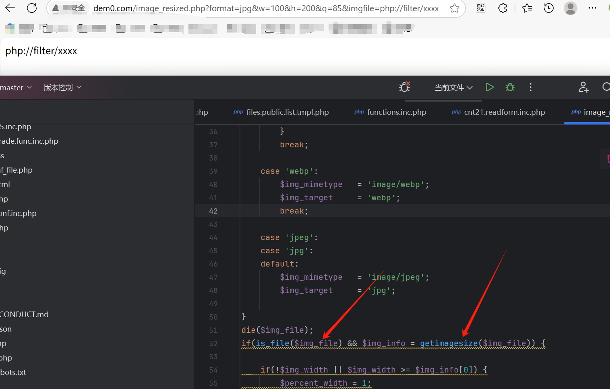

# PHAR Deserialization and File Disclosure Vulnerability in `image_resized.php`

## 0x01 Affected version
vendor: https://github.com/slackero/phpwcms

version: 8.2.0

php version: 7.x

## 0x02 Vulnerability description

The phpwcms Content Management System is vulnerable to PHP Object Injection and Local File Disclosure through the image_resized.php script. The vulnerability exists because user input from the 'imgfile' GET parameter is passed to the PHP getimagesize() function without proper validation. While the script attempts to sanitize the input by removing 'http://' and 'https://' prefixes, it fails to handle other protocols like 'phar://' or PHP filter wrappers, allowing attackers to bypass this protection.

This vulnerability allows an attacker to:
1. Trigger PHP Object Injection through PHAR deserialization, which can lead to code execution
2. Read local files through PHP filter chains using error-based oracle techniques, as described in [PHP filter chains for file read from error-based oracle](https://www.synacktiv.com/publications/php-filter-chains-file-read-from-error-based-oracle)

The vulnerability is particularly dangerous because it's exposed without authentication requirements, making it accessible to unauthenticated attackers.

```text
GET /image_resized.php?format=jpg&w=100&h=200&q=85&imgfile=php://filter/xxxx HTTP/1.1
Host: dem0.com
User-Agent: Mozilla/5.0 (Windows NT 10.0; Win64; x64) AppleWebKit/537.36 (KHTML, like Gecko) Chrome/136.0.0.0 Safari/537.36
Accept: */*
```

Example of vulnerable code:
```php
$img_file = (isset($_GET['imgfile'])) ? trim($_GET['imgfile']) : 'img/leer.gif';
$img_file = str_replace(array('http://', 'https://'), '', $img_file);
// [...]
if(is_file($img_file) && $img_info = getimagesize($img_file)) {
```

## 0x03 Repair suggestions
To prevent the exploitation of this vulnerability, implement the following measures:

1. Use a whitelist approach for allowed file locations instead of blacklisting protocols
2. Implement proper input validation to restrict access to only legitimate image files
3. Consider using a file identifier/token system rather than direct file paths
4. Validate that the file is an actual image file using multiple checks before processing
5. Apply proper sanitization to prevent directory traversal attacks and protocol handlers
6. Consider implementing access controls to restrict the use of this functionality to authenticated users if possible
