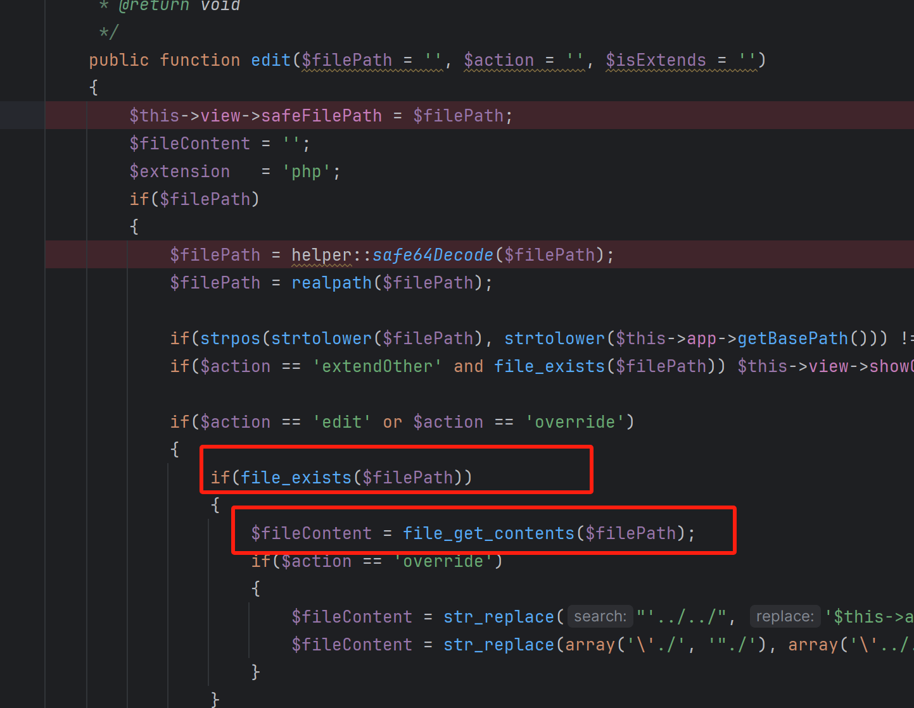

# Phar Bypass Vulnerability in ZenTao Editor Component

## Affected version
vendor: https://github.com/easysoft/zentaopms

version: 21.5_20250307

## desc
ZenTao contains a path traversal vulnerability in the editor component that allows attackers to read arbitrary files on the system via PHP wrapper protocols. The vulnerability exists in the `edit` method of the editor controller where improper validation of file paths allows attackers to bypass security checks using the `phar://` wrapper.

## Vulnerability Details

The affected code in the editor controller attempts to validate file paths by checking if they are within the application's base path:

```php
public function edit(string $filePath = '', string $action = '', string $isExtends = '')
{
    $this->view->safeFilePath = $filePath;
    $fileContent = '';
    $extension   = 'php';
    if($filePath)
    {
        $filePath = helper::safe64Decode($filePath);
        $realPath = realpath($filePath);
        if($realPath) $filePath = $realPath;
        if(strpos(strtolower($filePath), strtolower($this->app->getBasePath())) !== 0) return $this->send(array('result' => 'fail', 'message' => $this->lang->editor->editFileError));
        if($action == 'extendOther' and file_exists($filePath)) $this->view->showContent = file_get_contents($filePath);
```

The vulnerability exists because:

1. The `filePath` parameter is base64-decoded using `helper::safe64Decode()`
2. The security check only verifies if the file path starts with the application's base path
3. PHP wrapper protocols like `phar://` bypass this check since they don't start with the application base path
4. The application then attempts to read file contents using `file_get_contents()` which supports wrapper protocols

## Exploitation

An attacker can exploit this vulnerability by sending a request to the editor controller with a base64-encoded file path that uses the `phar://` wrapper protocol:

```
/index.php?m=editor&f=edit&filePath=cGhhcjovLy9ldGMvcGFzc3dk&action=edit
```

In this example, `cGhhcjovLy9ldGMvcGFzc3dk` is the base64-encoded form of `phar:///etc/passwd`, allowing the attacker to read sensitive system files.

This vulnerability could allow attackers to:
1. Read sensitive system files like `/etc/passwd`
2. Access application configuration files containing credentials
3. Retrieve source code of restricted files
4. Potentially achieve remote code execution through advanced exploitation techniques using PHAR deserialization

## Remediation

To fix this vulnerability, implement proper validation of file paths by:
1. Disallowing PHP wrapper protocols in file paths
2. Implementing a whitelist of allowed file extensions and directories
3. Using secure file reading methods that don't support wrapper protocols
4. Implementing proper input validation before processing file paths

